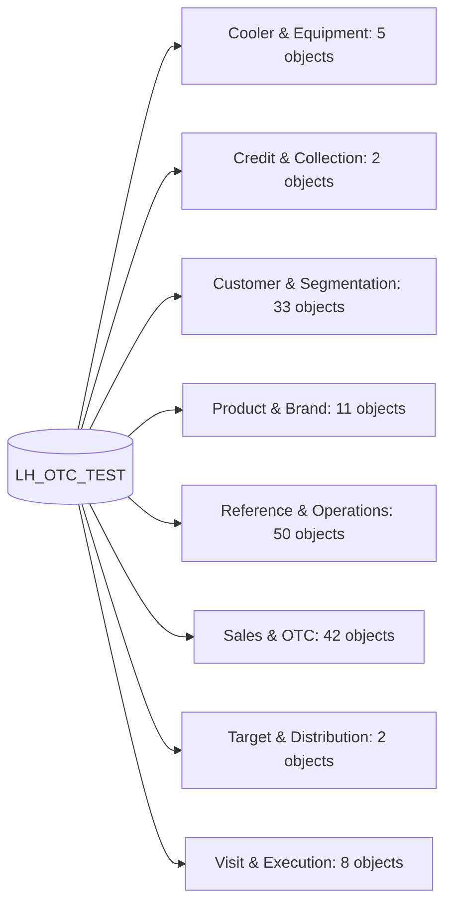

# Fabric Lakehouse Knowledge Graph and Data Catalog

## Scope and Evidence

- Database: `LH_OTC_TEST`
- Source: live `INFORMATION_SCHEMA.TABLES` and `INFORMATION_SCHEMA.COLUMNS` export.
- Inventory: 153 objects, 3028 columns, 1230 shared-key relationship candidates.
- This document inventories accessible metadata only. It does not claim row counts, refresh freshness, business definitions, primary keys, foreign keys, or join cardinality unless separately validated with data queries.
- Relationship edges are inferred from matching normalized `*Key` column names; treat them as join candidates, not enforced database constraints.

## Access and Query Guardrails

- Genie tool is read-only: `SELECT` or `WITH ... SELECT`; data-changing SQL is rejected.
- `SELECT *` is rejected; query only needed fields. Genie caps every page at 20 rows.
- Preferred schemas: `gold` for dimensions/master data and `dv` for business views. `bk_*` views are legacy/backup and should not be the default analytical source.
- Sensitive domains include credit/overdue and customer-identifying fields. Apply least-privilege output and aggregate when possible.

## Domain Map

## Full Object and Field Inventory

### Cooler & Equipment

#### `dv.dv_cooler`

- Type: `VIEW` | Columns: 83 | Handling: `internal`
- Key-shaped columns: `EquipmentKey`, `LanguageKey`, `AuthorizGroupKey`, `EquipCategoryKey`, `ObjectTypeKey`, `WeightUnitKey`, `CurrencyKey`, `VendorKey`, `ManufCountryKey`, `EQSENumberKey`, `ConfigMaterialKey`, `MaterialKey`, `PlantKey`, `StorageLocationKey`, `BatchKey`, `CustomerKey`, `MaintenancePlanKey`, `MeasuringPointKey`, `MasterWarrantyKey`, `DivisionKey`, `TemplateKey`, `MPNMaterialKey`, `ChangeEquipmentKey`, `IUIDTypeKey`, `UIIPlantKey`, `ReportTypeKey`, `ShiftNoteTypeKey`, `CatalogProfileKey`
- Fields: `EquipmentKey` varchar(8000), nullable; `CreatedDate` date, nullable; `CreatedBy` varchar(8000), nullable; `LanguageKey` varchar(8000), nullable; `ChangedDate` date, nullable; `ChangedBy` varchar(8000), nullable; `AuthorizGroupKey` varchar(8000), nullable; `EquipCategoryKey` varchar(8000), nullable; `ObjectTypeKey` varchar(8000), nullable; `ObjectTypeText` varchar(8000), nullable; `DeletedFlag` varchar(8000), nullable; `InventoryNumber` varchar(8000), nullable; `Size` varchar(8000), nullable; `Weight` decimal, nullable; `WeightUnitKey` varchar(8000), nullable; `AcquisitionDate` date, nullable; `AcquisitionValue` decimal, nullable; `CurrencyKey` varchar(8000), nullable; `VendorKey` varchar(8000), nullable; `WarrantyEndDate` date, nullable; `GuaranteeBeginDate` date, nullable; `ReplacementValue` decimal, nullable; `Manufacturer` varchar(8000), nullable; `ManufCountryKey` varchar(8000), nullable; `DrawingNumber` varchar(8000), nullable; `ManufSerialNumber` varchar(8000), nullable; `ModelNumber` varchar(8000), nullable; `ConstructYear` varchar(8000), nullable; `ConstructMonth` varchar(8000), nullable; `TaskListExists` varchar(8000), nullable; `DeliveryDate` date, nullable; `StartupDate` date, nullable; `SerialNumber` varchar(8000), nullable; `ConsecutiveNumber` varchar(8000), nullable; `WarrantyDateSD` date, nullable; `InternalUseDate` date, nullable; `TechnicalNote` varchar(8000), nullable; `InternalUseField` varchar(8000), nullable; `ObjectNumber` varchar(8000), nullable; `EQSENumberKey` varchar(8000), nullable; `ConfigObjectNumber` varchar(8000), nullable; `ReferencedConfig` varchar(8000), nullable; `ConfigMaterialKey` varchar(8000), nullable; `MaterialKey` varchar(8000), nullable; `SerialNumber2` varchar(8000), nullable; `StockType` varchar(8000), nullable; `PlantKey` varchar(8000), nullable; `StorageLocationKey` varchar(8000), nullable; `BatchKey` varchar(8000), nullable; `CustomerKey` varchar(8000), nullable; `MaintenancePlanKey` varchar(8000), nullable; `MeasuringPointKey` varchar(8000), nullable; `RevisionLevel` varchar(8000), nullable; `MasterWarrantyKey` varchar(8000), nullable; `AuthGroupOrigin` varchar(8000), nullable; `EquipmentDataFlag` varchar(8000), nullable; `SerialDataFlag` varchar(8000), nullable; `ConfigSupportedFlag` varchar(8000), nullable; `SalesEquipmentFlag` varchar(8000), nullable; `ProdResourceFlag` varchar(8000), nullable; `OtherDataFlag` varchar(8000), nullable; `ISUDataFlag` varchar(8000), nullable; `EQSIExistsFlag` varchar(8000), nullable; `FleetObjectActiveFlag` varchar(8000), nullable; `StockCheckFlag` varchar(8000), nullable; `DivisionKey` varchar(8000), nullable; `Handle` varchar(8000), nullable; `TemplateKey` varchar(8000), nullable; `MPNMaterialKey` varchar(8000), nullable; `ChangeEquipmentKey` varchar(8000), nullable; `ConfigControlDataFlag` varchar(8000), nullable; `LastGoodsMovementDate` date, nullable; `UII` varchar(8000), nullable; `IUIDTypeKey` varchar(8000), nullable; `UIIPlantKey` varchar(8000), nullable; `AppendDFPSFlag` varchar(8000), nullable; `ReportTypeKey` varchar(8000), nullable; `ShiftNoteTypeKey` varchar(8000), nullable; `LogbookDutyFlag` varchar(8000), nullable; `HideLogbookDisplayFlag` varchar(8000), nullable; `Description` varchar(8000), nullable; `DescriptionUpper` varchar(8000), nullable; `CatalogProfileKey` varchar(8000), nullable

#### `dv.dv_cooler_buying`

- Type: `VIEW` | Columns: 8 | Handling: `internal`
- Key-shaped columns: `EquipmentKey`, `CustomerKey`, `CatalogProfileKey`, `StorageLocationKey`, `BillCustomerKey`
- Fields: `EquipmentKey` varchar(8000), nullable; `CustomerKey` varchar(8000), nullable; `ValidFromDate` date, nullable; `ValidToDate` date, nullable; `CatalogProfileKey` varchar(8000), nullable; `StorageLocationKey` varchar(8000), nullable; `BillCustomerKey` varchar(8000), nullable; `BillingDate` date, nullable

#### `dv.dv_cooler_target`

- Type: `VIEW` | Columns: 9 | Handling: `internal`
- Key-shaped columns: `SubOrgVisitGroupKey`, `SubOrgKey`, `VisitGroupKey`
- Fields: `Year` int, nullable; `Month` int, nullable; `SubOrgVisitGroupKey` varchar(8000), not null; `SubOrgKey` varchar(8000), nullable; `VisitGroupKey` varchar(8000), nullable; `GroupVisit` varchar(16), nullable; `GroupBM` varchar(16), nullable; `GroupABM` varchar(32), nullable; `TargetValue` decimal, nullable

#### `gold.dim_equipment`

- Type: `BASE TABLE` | Columns: 85 | Handling: `internal`
- Key-shaped columns: `EquipmentKey`, `LanguageKey`, `AuthorizGroupKey`, `EquipCategoryKey`, `ObjectTypeKey`, `WeightUnitKey`, `CurrencyKey`, `VendorKey`, `ManufCountryKey`, `EQSENumberKey`, `ConfigMaterialKey`, `MaterialKey`, `PlantKey`, `StorageLocationKey`, `BatchKey`, `CustomerKey`, `MaintenancePlanKey`, `MeasuringPointKey`, `MasterWarrantyKey`, `DivisionKey`, `TemplateKey`, `MPNMaterialKey`, `ChangeEquipmentKey`, `IUIDTypeKey`, `UIIPlantKey`, `ReportTypeKey`, `ShiftNoteTypeKey`
- Fields: `EquipmentKey` varchar(8000), nullable; `CreatedDate` date, nullable; `CreatedBy` varchar(8000), nullable; `LanguageKey` varchar(8000), nullable; `ChangedDate` date, nullable; `ChangedBy` varchar(8000), nullable; `AuthorizGroupKey` varchar(8000), nullable; `EquipCategoryKey` varchar(8000), nullable; `ObjectTypeKey` varchar(8000), nullable; `ObjectTypeText` varchar(8000), nullable; `DeletedFlag` varchar(8000), nullable; `InventoryNumber` varchar(8000), nullable; `Size` varchar(8000), nullable; `Weight` decimal, nullable; `WeightUnitKey` varchar(8000), nullable; `AcquisitionDate` date, nullable; `AcquisitionValue` decimal, nullable; `CurrencyKey` varchar(8000), nullable; `VendorKey` varchar(8000), nullable; `WarrantyEndDate` date, nullable; `GuaranteeBeginDate` date, nullable; `ReplacementValue` decimal, nullable; `Manufacturer` varchar(8000), nullable; `ManufCountryKey` varchar(8000), nullable; `DrawingNumber` varchar(8000), nullable; `ManufSerialNumber` varchar(8000), nullable; `ModelNumber` varchar(8000), nullable; `ConstructYear` varchar(8000), nullable; `ConstructMonth` varchar(8000), nullable; `TaskListExists` varchar(8000), nullable; `DeliveryDate` date, nullable; `StartupDate` date, nullable; `SerialNumber` varchar(8000), nullable; `ConsecutiveNumber` varchar(8000), nullable; `WarrantyDateSD` date, nullable; `InternalUseDate` date, nullable; `TechnicalNote` varchar(8000), nullable; `InternalUseField` varchar(8000), nullable; `ObjectNumber` varchar(8000), nullable; `EQSENumberKey` varchar(8000), nullable; `ConfigObjectNumber` varchar(8000), nullable; `ReferencedConfig` varchar(8000), nullable; `ConfigMaterialKey` varchar(8000), nullable; `MaterialKey` varchar(8000), nullable; `SerialNumber2` varchar(8000), nullable; `StockType` varchar(8000), nullable; `PlantKey` varchar(8000), nullable; `StorageLocationKey` varchar(8000), nullable; `BatchKey` varchar(8000), nullable; `CustomerKey` varchar(8000), nullable; `MaintenancePlanKey` varchar(8000), nullable; `MeasuringPointKey` varchar(8000), nullable; `RevisionLevel` varchar(8000), nullable; `MasterWarrantyKey` varchar(8000), nullable; `AuthGroupOrigin` varchar(8000), nullable; `EquipmentDataFlag` varchar(8000), nullable; `SerialDataFlag` varchar(8000), nullable; `ConfigSupportedFlag` varchar(8000), nullable; `SalesEquipmentFlag` varchar(8000), nullable; `ProdResourceFlag` varchar(8000), nullable; `OtherDataFlag` varchar(8000), nullable; `ISUDataFlag` varchar(8000), nullable; `EQSIExistsFlag` varchar(8000), nullable; `FleetObjectActiveFlag` varchar(8000), nullable; `StockCheckFlag` varchar(8000), nullable; `DivisionKey` varchar(8000), nullable; `Handle` varchar(8000), nullable; `TemplateKey` varchar(8000), nullable; `MPNMaterialKey` varchar(8000), nullable; `ChangeEquipmentKey` varchar(8000), nullable; `ConfigControlDataFlag` varchar(8000), nullable; `LastGoodsMovementDate` date, nullable; `UII` varchar(8000), nullable; `IUIDTypeKey` varchar(8000), nullable; `UIIPlantKey` varchar(8000), nullable; `AppendDFPSFlag` varchar(8000), nullable; `ReportTypeKey` varchar(8000), nullable; `ShiftNoteTypeKey` varchar(8000), nullable; `LogbookDutyFlag` varchar(8000), nullable; `HideLogbookDisplayFlag` varchar(8000), nullable; `Description` varchar(8000), nullable; `DescriptionUpper` varchar(8000), nullable; `Id` varchar(8000), not null; `Timestamp` datetime2, nullable; `LoadDate` datetime2, not null

#### `gold.fact_cooler`

- Type: `BASE TABLE` | Columns: 18 | Handling: `internal`
- Key-shaped columns: `EquipmentKey`, `CatalogProfileKey`, `PlanningPlantKey`, `LocationAccountAssignKey`, `CustomerKey`, `EndCustomerKey`, `OperatorKey`, `MonthYearKey`
- Fields: `Id` varchar(8000), not null; `EquipmentKey` varchar(8000), nullable; `ValidFromDate` date, nullable; `ValidToDate` date, nullable; `CatalogProfileKey` varchar(8000), nullable; `ConsecutiveNumber` varchar(8000), nullable; `NextUsagePeriodNumber` varchar(8000), nullable; `CreatedDate` date, nullable; `ChangedDate` date, nullable; `PlanningPlantKey` varchar(8000), nullable; `TechIdentNumber` varchar(8000), nullable; `LocationAccountAssignKey` varchar(8000), nullable; `CustomerKey` varchar(8000), nullable; `EndCustomerKey` varchar(8000), nullable; `OperatorKey` varchar(8000), nullable; `Timestamp` datetime2, nullable; `LoadDate` datetime2, not null; `MonthYearKey` varchar(2048), not null

### Credit & Collection

#### `dv.dv_credit_use_credit_limit`

- Type: `VIEW` | Columns: 5 | Handling: `restricted`
- Key-shaped columns: `SubOrgKey`, `FlagshipKey`, `CustomerKey`
- Fields: `SubOrgKey` varchar(8000), nullable; `FlagshipKey` varchar(8000), nullable; `CustomerKey` varchar(8000), nullable; `CreditUse` decimal, nullable; `CreditLimit` decimal, nullable

#### `dv.mlv_credit_overdue`

- Type: `BASE TABLE` | Columns: 8 | Handling: `restricted`
- Key-shaped columns: `CustomerKey`, `BillingDocKey`
- Fields: `CustomerKey` varchar(8000), nullable; `BillingDocKey` varchar(8000), nullable; `BaselineDate` date, nullable; `CashDiscDays1` decimal, nullable; `AmountLC` decimal, nullable; `DebitCreditIndicator` varchar(8000), nullable; `DueDate` datetime2, nullable; `SignedAmount` decimal, nullable

### Customer & Segmentation

#### `dv.bk_dv_active_customer_visit`

- Type: `VIEW` | Columns: 14 | Handling: `internal`
- Key-shaped columns: `SubOrgKey`, `SalesGroupKey`, `SubChannelKey`, `CustomerKey`, `VisitGroupKey`, `GroupVisitKey`, `GroupVisitSalesOfficeDescKey`, `SubOrgVisitGroupKey`, `DeliveryPriorKey`
- Fields: `SubOrgKey` varchar(8000), nullable; `SalesGroupKey` varchar(8000), nullable; `SubChannelKey` varchar(8000), nullable; `CustomerKey` varchar(8000), nullable; `VisitGroupKey` varchar(8000), nullable; `GroupVisitKey` varchar(8000), nullable; `GroupBM` varchar(8000), nullable; `GroupVisitSalesOfficeDescKey` varchar(8000), nullable; `GroupABM` varchar(32), nullable; `IsHybrid` int, not null; `IsHybridTS` int, not null; `IsHybridDup` int, not null; `SubOrgVisitGroupKey` varchar(8000), not null; `DeliveryPriorKey` varchar(8000), nullable

#### `dv.bk_dv_customer_visit`

- Type: `VIEW` | Columns: 10 | Handling: `internal`
- Key-shaped columns: `SubOrgKey`, `SubChannelKey`, `CustomerKey`, `VisitGroupKey`, `GroupVisitKey`, `SalesOfficeDescKey`, `GroupVisitSalesOfficeDescKey`
- Fields: `SubOrgKey` nvarchar(4000), nullable; `SubChannelKey` varchar(8000), nullable; `CustomerKey` varchar(8000), nullable; `VisitGroupKey` nvarchar(4000), nullable; `GroupVisitKey` varchar(8000), nullable; `SalesOfficeDescKey` varchar(8000), nullable; `GroupVisitSalesOfficeDescKey` varchar(8000), nullable; `GroupABM` varchar(32), nullable; `GroupBM` varchar(16), nullable; `Zone` varchar(8000), nullable

#### `dv.bk_dv_customer_visit_list`

- Type: `VIEW` | Columns: 10 | Handling: `internal`
- Key-shaped columns: `ExecDateKey`, `SubOrgKey`, `CustomerKey`, `VisitGroupKey`, `GroupVisitKey`, `GroupVisitSalesOfficeDescKey`, `SubOrgVisitGroupKey`
- Fields: `ExecDateKey` date, nullable; `SubOrgKey` varchar(8000), nullable; `CustomerKey` varchar(8000), nullable; `VisitGroupKey` varchar(8000), nullable; `GroupVisitKey` varchar(8000), nullable; `GroupBM` varchar(8000), nullable; `GroupVisitSalesOfficeDescKey` varchar(8000), nullable; `GroupABM` varchar(32), nullable; `Zone` varchar(8000), nullable; `SubOrgVisitGroupKey` varchar(8000), not null

#### `dv.bk_dv_group_customer_visit`

- Type: `VIEW` | Columns: 2 | Handling: `internal`
- Key-shaped columns: `DateInKey`, `CustomerKey`
- Fields: `DateInKey` date, nullable; `CustomerKey` varchar(8000), nullable

#### `dv.dv_closed_outlet`

- Type: `VIEW` | Columns: 11 | Handling: `internal`
- Key-shaped columns: `SubOrgVisitGroupKey`, `CustomerKey`, `VisitGroupKey`, `SubOrgKey`
- Fields: `SubOrgVisitGroupKey` varchar(8000), not null; `Id` varchar(8000), not null; `CreateDate` date, nullable; `CustomerKey` varchar(8000), nullable; `Reason` varchar(8000), nullable; `RessonDes` varchar(8000), nullable; `VisitGroupKey` varchar(8000), nullable; `SalePerson` varchar(8000), nullable; `SaleName` varchar(8000), nullable; `LoadDate` datetime2, not null; `SubOrgKey` varchar(8000), nullable

#### `dv.dv_new_outlet`

- Type: `VIEW` | Columns: 9 | Handling: `internal`
- Key-shaped columns: `SubOrgVisitGroupKey`, `CustomerKey`, `VisitGroupKey`, `SubOrgKey`
- Fields: `SubOrgVisitGroupKey` varchar(8000), not null; `Id` varchar(8000), not null; `CreateDate` date, nullable; `CustomerKey` varchar(8000), nullable; `VisitGroupKey` varchar(8000), nullable; `SalePerson` varchar(8000), nullable; `SaleName` varchar(8000), nullable; `LoadDate` datetime2, not null; `SubOrgKey` varchar(8000), nullable

#### `dv.mlv_active_customer_visit`

- Type: `BASE TABLE` | Columns: 14 | Handling: `internal`
- Key-shaped columns: `SubOrgKey`, `SalesGroupKey`, `SubChannelKey`, `CustomerKey`, `VisitGroupKey`, `GroupVisitKey`, `GroupVisitSalesOfficeDescKey`, `SubOrgVisitGroupKey`, `DeliveryPriorKey`
- Fields: `SubOrgKey` varchar(8000), nullable; `SalesGroupKey` varchar(8000), nullable; `SubChannelKey` varchar(8000), nullable; `CustomerKey` varchar(8000), nullable; `VisitGroupKey` varchar(8000), nullable; `GroupVisitKey` varchar(8000), nullable; `GroupBM` varchar(8000), nullable; `GroupVisitSalesOfficeDescKey` varchar(8000), nullable; `GroupABM` varchar(8000), nullable; `IsHybrid` int, nullable; `IsHybridTS` int, nullable; `IsHybridDup` int, nullable; `SubOrgVisitGroupKey` varchar(8000), nullable; `DeliveryPriorKey` varchar(8000), nullable

#### `dv.mlv_buying_customer`

- Type: `BASE TABLE` | Columns: 14 | Handling: `internal`
- Key-shaped columns: `SalesGroupKey`, `SubOrgKey`, `SOSalesOfficeKey`, `BillCustomerKey`, `VisitGroupKey`, `GroupVisitKey`, `SalesOfficeDescKey`, `GroupVisitSalesOfficeDescKey`, `SubOrgVisitGroupKey`, `DeliveryPriorKey`
- Fields: `BillingDate` date, nullable; `SalesGroupKey` varchar(8000), nullable; `SubOrgKey` varchar(8000), nullable; `SOSalesOfficeKey` varchar(8000), nullable; `BillCustomerKey` varchar(8000), nullable; `VisitGroupKey` varchar(8000), nullable; `GroupVisitKey` varchar(8000), nullable; `SalesOfficeDescKey` varchar(8000), nullable; `GroupVisitSalesOfficeDescKey` varchar(8000), nullable; `IsHybrid` bit, nullable; `IsHybridTS` bit, nullable; `IsHybridDup` bit, nullable; `SubOrgVisitGroupKey` varchar(8000), nullable; `DeliveryPriorKey` varchar(8000), nullable

#### `dv.mlv_customer_rfm`

- Type: `BASE TABLE` | Columns: 78 | Handling: `restricted`
- Key-shaped columns: `BillCustomerKey`, `SalesGroupKey`, `CustomerKey`, `AddressNumberKey`, `MarketAreaKey`, `TradeChannelKey`, `ChannelKey`, `SubChannelKey`, `FlagshipKey`, `DistanceKey`, `BillConditionKey`, `ConditionGroup2Key`, `ConditionGroup3Key`, `BillingLanguageKey`, `DSDReasonKey`, `SuppReasonKey`, `SubOrgKey`, `StoreTypeKey`
- Fields: `BillCustomerKey` varchar(8000), nullable; `SalesGroupKey` varchar(8000), nullable; `cur_last_billing_date` date, nullable; `cur_frequency` bigint, nullable; `cur_monetary` float, nullable; `cur_volume` float, nullable; `cur_recency_days` int, nullable; `py_last_billing_date` date, nullable; `py_frequency` bigint, nullable; `py_monetary` float, nullable; `py_volume` float, nullable; `py_recency_days` int, nullable; `customer_season_status` varchar(8000), nullable; `frequency_yoy_index` float, nullable; `monetary_yoy_index` float, nullable; `volume_yoy_index` float, nullable; `R_tile` int, nullable; `F_tile` int, nullable; `M_tile` int, nullable; `R_score` int, nullable; `F_score` int, nullable; `M_score` int, nullable; `FM_score` int, nullable; `RFM_score` varchar(8000), nullable; `base_rfm_segment` varchar(8000), nullable; `adjusted_rfm_segment` varchar(8000), nullable; `protect_priority` int, nullable; `segment_health` varchar(8000), nullable; `CustomerKey` varchar(8000), nullable; `Country` varchar(8000), nullable; `Name` varchar(8000), nullable; `Name2` varchar(8000), nullable; `PostCode` varchar(8000), nullable; `Region` varchar(8000), nullable; `SearchTerm` varchar(8000), nullable; `OneTime` varchar(8000), nullable; `AddressNumberKey` varchar(8000), nullable; `SearchTermName` varchar(8000), nullable; `SearchTermName2` varchar(8000), nullable; `SearchTermCity` varchar(8000), nullable; `CentralOrder` varchar(8000), nullable; `CreatDate` date, nullable; `AcctGroup` varchar(8000), nullable; `Classific` varchar(8000), nullable; `DelFlag` varchar(8000), nullable; `Name3` varchar(8000), nullable; `Name4` varchar(8000), nullable; `NielsenID` varchar(8000), nullable; `Zone` varchar(8000), nullable; `IndCode1` varchar(8000), nullable; `Attribute1Code` varchar(8000), nullable; `MarketAreaKey` varchar(8000), nullable; `Attribute3Code` varchar(8000), nullable; `BusinessTypeCode` varchar(8000), nullable; `Attribute5Code` varchar(8000), nullable; `TradeChannelKey` varchar(8000), nullable; `ChannelKey` varchar(8000), nullable; `SubChannelKey` varchar(8000), nullable; `FlagshipKey` varchar(8000), nullable; `DistanceKey` varchar(8000), nullable; `NatPerson` varchar(8000), nullable; `BillConditionKey` varchar(8000), nullable; `ConditionGroup2Key` varchar(8000), nullable; `ConditionGroup3Key` varchar(8000), nullable; `BillingLanguageKey` varchar(8000), nullable; `DSDReasonKey` varchar(8000), nullable; `TaxNo3` varchar(8000), nullable; `RoadnetIn` varchar(8000), nullable; `SuppReasonKey` varchar(8000), nullable; `SubOrgKey` varchar(8000), nullable; `StoreTypeKey` varchar(8000), nullable; `Attribute1Desc` varchar(8000), nullable; `Attribute3Desc` varchar(8000), nullable; `Attribute4Desc` varchar(8000), nullable; `Attribute5Desc` varchar(8000), nullable; `Id` varchar(8000), nullable; `Timestamp` datetime2, nullable; `LoadDate` datetime2, nullable

#### `dv.mlv_customer_visit_list`

- Type: `BASE TABLE` | Columns: 9 | Handling: `internal`
- Key-shaped columns: `ExecDateKey`, `SubOrgKey`, `CustomerKey`, `VisitGroupKey`, `GroupVisitKey`, `GroupVisitSalesOfficeDescKey`, `SubOrgVisitGroupKey`
- Fields: `ExecDateKey` date, nullable; `SubOrgKey` varchar(8000), nullable; `CustomerKey` varchar(8000), nullable; `VisitGroupKey` varchar(8000), nullable; `GroupVisitKey` varchar(8000), nullable; `GroupBM` varchar(8000), nullable; `GroupVisitSalesOfficeDescKey` varchar(8000), nullable; `GroupABM` varchar(8000), nullable; `SubOrgVisitGroupKey` varchar(8000), nullable

#### `dv.mlv_distributed_outlets_customer`

- Type: `BASE TABLE` | Columns: 14 | Handling: `internal`
- Key-shaped columns: `SalesGroupKey`, `SubOrgKey`, `SOSalesOfficeKey`, `BillCustomerKey`, `VisitGroupKey`, `GroupVisitKey`, `SalesOfficeDescKey`, `GroupVisitSalesOfficeDescKey`, `SubOrgVisitGroupKey`, `PackSizeKey`
- Fields: `BillingDate` date, nullable; `SalesGroupKey` varchar(8000), nullable; `SubOrgKey` varchar(8000), nullable; `SOSalesOfficeKey` varchar(8000), nullable; `BillCustomerKey` varchar(8000), nullable; `VisitGroupKey` varchar(8000), nullable; `GroupVisitKey` varchar(8000), nullable; `SalesOfficeDescKey` varchar(8000), nullable; `GroupVisitSalesOfficeDescKey` varchar(8000), nullable; `IsHybrid` bit, nullable; `IsHybridTS` bit, nullable; `IsHybridDup` bit, nullable; `SubOrgVisitGroupKey` varchar(8000), nullable; `PackSizeKey` varchar(8000), nullable

#### `dv.mlv_outlet_with_cooler_buying`

- Type: `BASE TABLE` | Columns: 8 | Handling: `internal`
- Key-shaped columns: `EquipmentKey`, `CustomerKey`, `CatalogProfileKey`, `StorageLocationKey`, `BillCustomerKey`
- Fields: `EquipmentKey` varchar(8000), nullable; `CustomerKey` varchar(8000), nullable; `ValidFromDate` date, nullable; `ValidToDate` date, nullable; `CatalogProfileKey` varchar(8000), nullable; `StorageLocationKey` varchar(8000), nullable; `BillCustomerKey` varchar(8000), nullable; `BillingDate` date, nullable

#### `gold.customer_seasonally_adjusted_rfm`

- Type: `BASE TABLE` | Columns: 28 | Handling: `internal`
- Key-shaped columns: `BillCustomerKey`, `SalesGroupKey`
- Fields: `BillCustomerKey` varchar(8000), nullable; `SalesGroupKey` varchar(8000), nullable; `cur_last_billing_date` date, nullable; `cur_frequency` bigint, nullable; `cur_monetary` float, nullable; `cur_volume` float, nullable; `cur_recency_days` int, nullable; `py_last_billing_date` date, nullable; `py_frequency` bigint, nullable; `py_monetary` float, nullable; `py_volume` float, nullable; `py_recency_days` int, nullable; `customer_season_status` varchar(8000), nullable; `frequency_yoy_index` float, nullable; `monetary_yoy_index` float, nullable; `volume_yoy_index` float, nullable; `R_tile` int, nullable; `F_tile` int, nullable; `M_tile` int, nullable; `R_score` int, nullable; `F_score` int, nullable; `M_score` int, nullable; `FM_score` int, nullable; `RFM_score` varchar(8000), nullable; `base_rfm_segment` varchar(8000), nullable; `adjusted_rfm_segment` varchar(8000), nullable; `protect_priority` int, nullable; `segment_health` varchar(8000), nullable

#### `gold.dim_channel`

- Type: `BASE TABLE` | Columns: 3 | Handling: `internal`
- Key-shaped columns: `ChannelKey`
- Fields: `ChannelKey` varchar(8000), nullable; `Descript` varchar(8000), nullable; `LoadDate` datetime2, nullable

#### `gold.dim_customer`

- Type: `BASE TABLE` | Columns: 50 | Handling: `restricted`
- Key-shaped columns: `CustomerKey`, `AddressNumberKey`, `MarketAreaKey`, `TradeChannelKey`, `ChannelKey`, `SubChannelKey`, `FlagshipKey`, `DistanceKey`, `BillConditionKey`, `ConditionGroup2Key`, `ConditionGroup3Key`, `BillingLanguageKey`, `DSDReasonKey`, `SuppReasonKey`, `SubOrgKey`, `StoreTypeKey`
- Fields: `CustomerKey` varchar(8000), nullable; `Country` varchar(8000), nullable; `Name` varchar(8000), nullable; `Name2` varchar(8000), nullable; `PostCode` varchar(8000), nullable; `Region` varchar(8000), nullable; `SearchTerm` varchar(8000), nullable; `OneTime` varchar(8000), nullable; `AddressNumberKey` varchar(8000), nullable; `SearchTermName` varchar(8000), nullable; `SearchTermName2` varchar(8000), nullable; `SearchTermCity` varchar(8000), nullable; `CentralOrder` varchar(8000), nullable; `CreatDate` date, nullable; `AcctGroup` varchar(8000), nullable; `Classific` varchar(8000), nullable; `DelFlag` varchar(8000), nullable; `Name3` varchar(8000), nullable; `Name4` varchar(8000), nullable; `NielsenID` varchar(8000), nullable; `Zone` varchar(8000), nullable; `IndCode1` varchar(8000), nullable; `Attribute1Code` varchar(8000), nullable; `MarketAreaKey` varchar(8000), nullable; `Attribute3Code` varchar(8000), nullable; `BusinessTypeCode` varchar(8000), nullable; `Attribute5Code` varchar(8000), nullable; `TradeChannelKey` varchar(8000), nullable; `ChannelKey` varchar(8000), nullable; `SubChannelKey` varchar(8000), nullable; `FlagshipKey` varchar(8000), nullable; `DistanceKey` varchar(8000), nullable; `NatPerson` varchar(8000), nullable; `BillConditionKey` varchar(8000), nullable; `ConditionGroup2Key` varchar(8000), nullable; `ConditionGroup3Key` varchar(8000), nullable; `BillingLanguageKey` varchar(8000), nullable; `DSDReasonKey` varchar(8000), nullable; `TaxNo3` varchar(8000), nullable; `RoadnetIn` varchar(8000), nullable; `SuppReasonKey` varchar(8000), nullable; `SubOrgKey` varchar(8000), nullable; `StoreTypeKey` varchar(8000), nullable; `Attribute1Desc` varchar(8000), nullable; `Attribute3Desc` varchar(8000), nullable; `Attribute4Desc` varchar(8000), nullable; `Attribute5Desc` varchar(8000), nullable; `Id` varchar(8000), not null; `Timestamp` datetime2, nullable; `LoadDate` datetime2, not null

#### `gold.dim_customer_additional`

- Type: `BASE TABLE` | Columns: 7 | Handling: `internal`
- Key-shaped columns: `CustomerKey`
- Fields: `CustomerKey` varchar(8000), nullable; `METCust` varchar(8000), nullable; `MVIPCust` varchar(8000), nullable; `ImproveOu` varchar(8000), nullable; `Id` varchar(8000), not null; `Timestamp` datetime2, nullable; `LoadDate` datetime2, not null

#### `gold.dim_customer_credit`

- Type: `BASE TABLE` | Columns: 39 | Handling: `restricted`
- Key-shaped columns: `CustomerKey`, `CreditAreaKey`
- Fields: `CustomerKey` varchar(8000), nullable; `CreditAreaKey` varchar(8000), nullable; `CredLimit` decimal, nullable; `CreditAccount` varchar(8000), nullable; `SalesValue` decimal, nullable; `Receivables` decimal, nullable; `SpecialLiabil` decimal, nullable; `Exceeded` date, nullable; `Reset` varchar(8000), nullable; `CreatedBy` varchar(8000), nullable; `CreatDate` date, nullable; `RiskCat` varchar(8000), nullable; `LstIntRv` date, nullable; `Blocked` varchar(8000), nullable; `CredRep` varchar(8000), nullable; `NxtReview` date, nullable; `Info` varchar(8000), nullable; `LstReview` date, nullable; `ChangedOn` date, nullable; `TextChg` date, nullable; `CredGrp` varchar(8000), nullable; `ChangedBy` varchar(8000), nullable; `Reference` date, nullable; `CustGroup` varchar(8000), nullable; `LastPmnt` date, nullable; `Amount` decimal, nullable; `CurrencyLastPayment` varchar(8000), nullable; `PmntIndex` varchar(8000), nullable; `Rating` varchar(8000), nullable; `RecCrLm` decimal, nullable; `CurrencyrRecommendedCreditLimit` varchar(8000), nullable; `Monitoring` date, nullable; `SecRcvbls` decimal, nullable; `TotalOpenSalesOrder` decimal, nullable; `TotalOpenDelivery` decimal, nullable; `TotalOpenBilling` decimal, nullable; `Id` varchar(8000), not null; `Timestamp` datetime2, nullable; `LoadDate` datetime2, not null

#### `gold.dim_customer_geo`

- Type: `BASE TABLE` | Columns: 10 | Handling: `internal`
- Key-shaped columns: `CustomerKey`
- Fields: `CustomerKey` varchar(8000), nullable; `LongitudeDeg` decimal, nullable; `LatitudeDeg` decimal, nullable; `Precision` varchar(8000), nullable; `Chngd` date, nullable; `TimeOfChng` datetime2, nullable; `By` varchar(8000), nullable; `Id` varchar(8000), not null; `Timestamp` datetime2, nullable; `LoadDate` datetime2, not null

#### `gold.dim_customer_group`

- Type: `BASE TABLE` | Columns: 3 | Handling: `internal`
- Key-shaped columns: `CustomerGroupKey`
- Fields: `CustomerGroupKey` varchar(8000), nullable; `Descript` varchar(8000), nullable; `LoadDate` datetime2, nullable

#### `gold.dim_customer_group4`

- Type: `BASE TABLE` | Columns: 3 | Handling: `internal`
- Key-shaped columns: `CustomerGroup4Key`
- Fields: `CustomerGroup4Key` varchar(8000), nullable; `Descript` varchar(8000), nullable; `LoadDate` datetime2, nullable

#### `gold.dim_customer_partner`

- Type: `BASE TABLE` | Columns: 12 | Handling: `internal`
- Key-shaped columns: `CustomerKey`, `SalesOrgKey`, `DistrChannelKey`, `DivisionKey`
- Fields: `CustomerKey` varchar(8000), nullable; `SalesOrgKey` varchar(8000), nullable; `DistrChannelKey` varchar(8000), nullable; `DivisionKey` varchar(8000), nullable; `Function` varchar(8000), nullable; `PartCount` varchar(8000), nullable; `Customer` varchar(8000), nullable; `Vendor` varchar(8000), nullable; `PersNo` varchar(8000), nullable; `Id` varchar(8000), not null; `Timestamp` datetime2, nullable; `LoadDate` datetime2, not null

#### `gold.dim_customer_ref_code`

- Type: `BASE TABLE` | Columns: 4 | Handling: `internal`
- Key-shaped columns: `CustomerRCKey`
- Fields: `CustomerRCKey` varchar(8000), nullable; `Name` varchar(8000), nullable; `Filename` varchar(8000), nullable; `LoadDate` datetime2, nullable

#### `gold.dim_customer_virtual_route`

- Type: `BASE TABLE` | Columns: 4 | Handling: `internal`
- Key-shaped columns: `CustomerKey`, `PlantKey`, `SalesOfficeKey`
- Fields: `CustomerKey` varchar(8000), nullable; `PlantKey` varchar(8000), nullable; `SalesOfficeKey` varchar(8000), nullable; `LoadDate` datetime2, nullable

#### `gold.dim_customer_visit_plan`

- Type: `BASE TABLE` | Columns: 7 | Handling: `internal`
- Key-shaped columns: `CustomerKey`, `VisitGroupKey`, `VisitRuleWeeksKey`, `VisitRuleWeekdayKey`
- Fields: `CustomerKey` varchar(8000), nullable; `VisitGroupKey` varchar(8000), nullable; `VisitRuleWeeksKey` varchar(8000), nullable; `VisitRuleWeekdayKey` varchar(8000), nullable; `Id` varchar(8000), not null; `Timestamp` datetime2, nullable; `LoadDate` datetime2, not null

#### `gold.dim_dist_channel`

- Type: `BASE TABLE` | Columns: 3 | Handling: `internal`
- Key-shaped columns: `DistrChannelKey`
- Fields: `DistrChannelKey` varchar(8000), nullable; `Name` varchar(8000), nullable; `LoadDate` datetime2, nullable

#### `gold.dim_route`

- Type: `BASE TABLE` | Columns: 6 | Handling: `internal`
- Key-shaped columns: `RouteKey`
- Fields: `RouteKey` varchar(8000), nullable; `Distance` decimal, nullable; `UoMDist` varchar(8000), nullable; `RouteID` varchar(8000), nullable; `Name` varchar(8000), nullable; `LoadDate` datetime2, nullable

#### `gold.dim_route_additional`

- Type: `BASE TABLE` | Columns: 3 | Handling: `internal`
- Key-shaped columns: `ShipmentRouteKey`
- Fields: `ShipmentRouteKey` varchar(8000), nullable; `SequenceNumber` varchar(8000), nullable; `LoadDate` datetime2, nullable

#### `gold.dim_sub_channel`

- Type: `BASE TABLE` | Columns: 3 | Handling: `internal`
- Key-shaped columns: `SubChannelKey`
- Fields: `SubChannelKey` varchar(8000), nullable; `Descript` varchar(8000), nullable; `LoadDate` datetime2, nullable

#### `gold.dim_trade_channel`

- Type: `BASE TABLE` | Columns: 3 | Handling: `internal`
- Key-shaped columns: `TradeChannelKey`
- Fields: `TradeChannelKey` varchar(8000), nullable; `Descript` varchar(8000), nullable; `LoadDate` datetime2, nullable

#### `gold.fact_closed_outlet`

- Type: `BASE TABLE` | Columns: 9 | Handling: `internal`
- Key-shaped columns: `CustomerKey`, `VisitGroupKey`
- Fields: `Id` varchar(8000), not null; `CreateDate` date, nullable; `CustomerKey` varchar(8000), nullable; `Reason` varchar(8000), nullable; `RessonDes` varchar(8000), nullable; `VisitGroupKey` varchar(8000), nullable; `SalePerson` varchar(8000), nullable; `SaleName` varchar(8000), nullable; `LoadDate` datetime2, not null

#### `gold.fact_customer_po`

- Type: `BASE TABLE` | Columns: 63 | Handling: `internal`
- Key-shaped columns: `CustomerRCKey`, `MonthYearKey`
- Fields: `Id` varchar(8000), nullable; `CustomerRCKey` varchar(8000), nullable; `PONumber` varchar(8000), nullable; `POYear` varchar(8000), nullable; `SAPItemNumber` varchar(8000), nullable; `SAPMaterialCode` varchar(8000), nullable; `CustomerMatCode` varchar(8000), nullable; `CustomerMatName` varchar(8000), nullable; `QtyInCases` decimal, nullable; `POQty` decimal, nullable; `PieceInCase` decimal, nullable; `PricePerCase` decimal, nullable; `CustomerUnitPrice` decimal, nullable; `DiscountPercentItem` decimal, nullable; `DiscountAmountItem` decimal, nullable; `ItemTotalAmount` decimal, nullable; `GrossAmount` decimal, nullable; `NetAmount` decimal, nullable; `VATAmount` decimal, nullable; `TotalAmount` decimal, nullable; `DiscountPercent` decimal, nullable; `DiscountAmount` decimal, nullable; `SAPSalesUnit` varchar(8000), nullable; `POMeasureUnit` varchar(8000), nullable; `PODate` date, nullable; `DeliveryDate` date, nullable; `ExpiredDate` date, nullable; `PricingDate` date, nullable; `SupplierCode` varchar(8000), nullable; `SupplierName` varchar(8000), nullable; `StoreCode` varchar(8000), nullable; `StoreName` varchar(8000), nullable; `RejectCode` varchar(8000), nullable; `Sloc` varchar(8000), nullable; `WBS` varchar(8000), nullable; `InputFileName` varchar(8000), nullable; `POType` varchar(8000), nullable; `CustDeptCode` varchar(8000), nullable; `CustDeptName` varchar(8000), nullable; `DocUpdateDate` date, nullable; `SupplierInternalCode` varchar(8000), nullable; `BillTo` varchar(8000), nullable; `Term` varchar(8000), nullable; `ContactName` varchar(8000), nullable; `PONote` varchar(8000), nullable; `PONote2` varchar(8000), nullable; `CustomerPOType` varchar(8000), nullable; `HTPCLMatCode` varchar(8000), nullable; `DiscountPerCase` decimal, nullable; `Usage` varchar(8000), nullable; `ErrorMessage` varchar(8000), nullable; `CustomerItemNumber` varchar(8000), nullable; `CustomerPackSize` varchar(8000), nullable; `CustomerOrderUnit` varchar(8000), nullable; `CustomerOrderQty` decimal, nullable; `ItemNote` varchar(8000), nullable; `TotalPiece` decimal, nullable; `CreatedDate` date, nullable; `CreatedTime` varchar(8000), nullable; `CreatedBy` varchar(8000), nullable; `Timestamp` datetime2, nullable; `LoadDate` datetime2, not null; `MonthYearKey` varchar(2048), not null

#### `gold.fact_customer_visit`

- Type: `BASE TABLE` | Columns: 25 | Handling: `internal`
- Key-shaped columns: `VisitGroupKey`, `RouteKey`, `CustomerKey`, `DateInKey`, `DateOutKey`, `VisitListIdKey`, `ExecDateKey`, `GroupVisitKey`, `SalesOfficeDescKey`, `GroupVisitSalesOfficeDescKey`, `MonthYearKey`
- Fields: `Id` varchar(8000), not null; `VisitGroupKey` varchar(8000), nullable; `RouteKey` varchar(8000), nullable; `VisitBook` varchar(8000), nullable; `CustomerKey` varchar(8000), nullable; `TimeIn` datetime2, nullable; `DateInKey` date, nullable; `TimeOut` datetime2, nullable; `DateOutKey` date, nullable; `UsageTime` varchar(8000), nullable; `UserName` varchar(8000), nullable; `VisitReason` varchar(8000), nullable; `LatitudeIn` decimal, nullable; `LongitudeIn` decimal, nullable; `LatitudeOut` decimal, nullable; `LongitudeOut` decimal, nullable; `VisitPlanId` varchar(8000), nullable; `VisitListIdKey` varchar(8000), nullable; `ExecDateKey` date, nullable; `GroupVisitKey` varchar(8000), nullable; `SalesOfficeDescKey` varchar(8000), nullable; `GroupVisitSalesOfficeDescKey` varchar(8000), nullable; `Timestamp` datetime2, nullable; `LoadDate` datetime2, not null; `MonthYearKey` varchar(2048), not null

#### `gold.fact_new_outlet`

- Type: `BASE TABLE` | Columns: 7 | Handling: `internal`
- Key-shaped columns: `CustomerKey`, `VisitGroupKey`
- Fields: `Id` varchar(8000), not null; `CreateDate` date, nullable; `CustomerKey` varchar(8000), nullable; `VisitGroupKey` varchar(8000), nullable; `SalePerson` varchar(8000), nullable; `SaleName` varchar(8000), nullable; `LoadDate` datetime2, not null

### Product & Brand

#### `dbo.material_code`

- Type: `BASE TABLE` | Columns: 15 | Handling: `internal`
- Key-shaped columns: None detected
- Fields: `MaterialCode` varchar(8000), nullable; `Material` varchar(8000), nullable; `MaterialType` varchar(8000), nullable; `Brand` varchar(8000), nullable; `PackageOccasion` varchar(8000), nullable; `PackType` varchar(8000), nullable; `PackageGroup` varchar(8000), nullable; `Flavour` varchar(8000), nullable; `FlavourCategory` varchar(8000), nullable; `PackageGroup_1` varchar(8000), nullable; `Flavour_2` varchar(8000), nullable; `CommissionCategory` varchar(8000), nullable; `BeverageCategory` varchar(8000), nullable; `Category Makro` varchar(8000), nullable; `Group KAM Makro` varchar(8000), nullable

#### `gold.dim_beverage_category`

- Type: `BASE TABLE` | Columns: 3 | Handling: `internal`
- Key-shaped columns: `BevCatKey`
- Fields: `BevCatKey` varchar(8000), nullable; `AlvText` varchar(8000), nullable; `LoadDate` datetime2, nullable

#### `gold.dim_brand`

- Type: `BASE TABLE` | Columns: 3 | Handling: `internal`
- Key-shaped columns: `BrandKey`
- Fields: `BrandKey` varchar(8000), nullable; `AlvText` varchar(8000), nullable; `LoadDate` datetime2, nullable

#### `gold.dim_flavour`

- Type: `BASE TABLE` | Columns: 3 | Handling: `internal`
- Key-shaped columns: `FlavourKey`
- Fields: `FlavourKey` varchar(8000), nullable; `AlvText` varchar(8000), nullable; `LoadDate` datetime2, nullable

#### `gold.dim_flavour_category`

- Type: `BASE TABLE` | Columns: 3 | Handling: `internal`
- Key-shaped columns: `FlavourCatKey`
- Fields: `FlavourCatKey` varchar(8000), nullable; `AlvText` varchar(8000), nullable; `LoadDate` datetime2, nullable

#### `gold.dim_material`

- Type: `BASE TABLE` | Columns: 248 | Handling: `internal`
- Key-shaped columns: `MaterialKey`, `MatlTypeKey`, `MeasUnitKey`, `PVKey`, `PackSizeKey`, `BrandKey`, `FlavourKey`, `FlavourCatKey`, `PrdGrpInKey`, `PackTypeKey`, `PackageGrKey`, `ReturnPacKey`, `BevCatKey`, `CarbIndKey`, `CommCateKey`, `PlanCateKey`
- Fields: `Id` varchar(1020), not null; `MaterialKey` varchar(1020), nullable; `MatDescr` varchar(1020), nullable; `MatDescrUpper` varchar(1020), nullable; `CreatedOn` varchar(1020), nullable; `CreatedBy` varchar(1020), nullable; `LastChg` varchar(1020), nullable; `ChgBy` varchar(1020), nullable; `MaintStat` varchar(1020), nullable; `Status` varchar(1020), nullable; `ClientLvl` varchar(1020), nullable; `MatlTypeKey` varchar(1020), nullable; `Industry` varchar(1020), nullable; `MatlGroup` varchar(1020), nullable; `MatlNo` varchar(1020), nullable; `MeasUnitKey` varchar(1020), nullable; `OrderUnit` varchar(1020), nullable; `EANInd` varchar(1020), nullable; `DocType` varchar(1020), nullable; `DocVers` varchar(1020), nullable; `Format` varchar(1020), nullable; `DocChNo` varchar(1020), nullable; `PageNo` varchar(1020), nullable; `NoSheets` varchar(1020), nullable; `ProdMemo` varchar(1020), nullable; `PageFormat` varchar(1020), nullable; `SizeDim` varchar(1020), nullable; `BasicMatl` varchar(1020), nullable; `IStdDesc` varchar(1020), nullable; `Laboratory` varchar(1020), nullable; `PVKey` varchar(1020), nullable; `Gross` decimal, nullable; `Net` decimal, nullable; `WeightUnit` varchar(1020), nullable; `Volume` decimal, nullable; `VolumeUnit` varchar(1020), nullable; `Container` varchar(1020), nullable; `StorCond` varchar(1020), nullable; `TempCond` varchar(1020), nullable; `LLCode` varchar(1020), nullable; `TransGrp` varchar(1020), nullable; `Haz` varchar(1020), nullable; `Division` varchar(1020), nullable; `Competitor` varchar(1020), nullable; `EANno` varchar(1020), nullable; `Quantity` decimal, nullable; `ProcRule` varchar(1020), nullable; `Source` varchar(1020), nullable; `Season` varchar(1020), nullable; `LabelType` varchar(1020), nullable; `LabelForm` varchar(1020), nullable; `Deact` varchar(1020), nullable; `EANUPC` varchar(1020), nullable; `EANCat` varchar(1020), nullable; `Length` decimal, nullable; `Width` decimal, nullable; `Height` decimal, nullable; `UnitDim` varchar(1020), nullable; `ProdHier` varchar(1020), nullable; `NetChange` varchar(1020), nullable; `CADInd` varchar(1020), nullable; `QMProcmnt` varchar(1020), nullable; `AllowedWt` decimal, nullable; `UnitWeight` varchar(1020), nullable; `AllwdVol` decimal, nullable; `AllwdVolUnit` varchar(1020), nullable; `ExWghtTol` decimal, nullable; `ExVolTol` decimal, nullable; `VarOUn` varchar(1020), nullable; `RevLevel` varchar(1020), nullable; `Configur` varchar(1020), nullable; `Batchmgmt` varchar(1020), nullable; `PkgMtlType` varchar(1020), nullable; `MaxLevel` decimal, nullable; `StackFctr` int, nullable; `MatGrpPM` varchar(1020), nullable; `AuthGrp` varchar(1020), nullable; `ValidFrom` varchar(1020), nullable; `ValidTo` varchar(1020), nullable; `SeasonYr` varchar(1020), nullable; `PriceBand` varchar(1020), nullable; `EmptiesBOM` varchar(1020), nullable; `ExtMatlGrp` varchar(1020), nullable; `ConfMatl` varchar(1020), nullable; `MatlCat` varchar(1020), nullable; `CoProduct` varchar(1020), nullable; `FollowUp` varchar(1020), nullable; `PrRefMatl` varchar(1020), nullable; `MatlStatus` varchar(1020), nullable; `XDChainStatus` varchar(1020), nullable; `ValidFrom2` varchar(1020), nullable; `ValidFrom3` varchar(1020), nullable; `TaxClass` varchar(1020), nullable; `CatProf` varchar(1020), nullable; `RemLife` decimal, nullable; `ShelfLife` decimal, nullable; `StoragePercent` decimal, nullable; `ContUnit` varchar(1020), nullable; `NetCnts` decimal, nullable; `CompPriceUnit` decimal, nullable; `LaMatGrpg` varchar(1020), nullable; `GrossCnts` decimal, nullable; `ConvMeth` varchar(1020), nullable; `IntObjNo` varchar(1020), nullable; `EnvtRlvt` varchar(1020), nullable; `ProdAll` varchar(1020), nullable; `PrProfile` varchar(1020), nullable; `DiK` varchar(1020), nullable; `MPN` varchar(1020), nullable; `Manufact` varchar(1020), nullable; `IntNo` varchar(1020), nullable; `MPP` varchar(1020), nullable; `UsageUoM` varchar(1020), nullable; `RollOut` varchar(1020), nullable; `DGProfile` varchar(1020), nullable; `HighlyVisc` varchar(1020), nullable; `BulkLiquid` varchar(1020), nullable; `SerLevel` varchar(1020), nullable; `Closed` varchar(1020), nullable; `BatchRec` varchar(1020), nullable; `EffValues` varchar(1020), nullable; `CompLvl` varchar(1020), nullable; `PerInd` varchar(1020), nullable; `RoundRule` varchar(1020), nullable; `ProdComp` varchar(1020), nullable; `GenItCatGr` varchar(1020), nullable; `LogVars` varchar(1020), nullable; `Locked` varchar(1020), nullable; `CMRel` varchar(1020), nullable; `AListType` varchar(1020), nullable; `ExpirDate` varchar(1020), nullable; `EANVar` varchar(1020), nullable; `GenMat` varchar(1020), nullable; `RefMatPack` varchar(1020), nullable; `GDSRel` varchar(1020), nullable; `OrigAcc` varchar(1020), nullable; `StHUTyp` varchar(1020), nullable; `Pilferable` varchar(1020), nullable; `WHStCond` varchar(1020), nullable; `WHMatGrp` varchar(1020), nullable; `HandInd` varchar(1020), nullable; `HazSub` varchar(1020), nullable; `HUTyp` varchar(1020), nullable; `VarTW` varchar(1020), nullable; `MaxCap` decimal, nullable; `OvrcapTol` decimal, nullable; `MaxLeng` decimal, nullable; `MaxWidth` decimal, nullable; `MaxHeight` decimal, nullable; `UoM` varchar(1020), nullable; `Origin` varchar(1020), nullable; `MatlFrtGrp` varchar(1020), nullable; `QPer` decimal, nullable; `TimeUnit` varchar(1020), nullable; `QualInsGrp` varchar(1020), nullable; `SNProf` varchar(1020), nullable; `Name` varchar(1020), nullable; `LogUoM` varchar(1020), nullable; `CWRelev` varchar(1020), nullable; `CWProfile` varchar(1020), nullable; `TolGroup` varchar(1020), nullable; `Profile` varchar(1020), nullable; `IP` varchar(1020), nullable; `VarPrAll` varchar(1020), nullable; `Medium` varchar(1020), nullable; `PhysCmdty` varchar(1020), nullable; `Animal` varchar(1020), nullable; `TxCmpActiv` varchar(1020), nullable; `SegStr` varchar(1020), nullable; `SegStrat` varchar(1020), nullable; `SegStatus` varchar(1020), nullable; `Scope` varchar(1020), nullable; `SegRel` varchar(1020), nullable; `ANPCode` varchar(1020), nullable; `FshAttri1` varchar(1020), nullable; `FshAttri2` varchar(1020), nullable; `FshAttri3` varchar(1020), nullable; `SeasonUse` varchar(1020), nullable; `SeasonIM` varchar(1020), nullable; `MatCID` varchar(1020), nullable; `PSMcode` varchar(1020), nullable; `LU` varchar(1020), nullable; `LUGroup` varchar(1020), nullable; `Category` varchar(1020), nullable; `TolTypeID` varchar(1020), nullable; `CountGrp` varchar(1020), nullable; `DSDGroup` varchar(1020), nullable; `Tilting` varchar(1020), nullable; `NoStack` varchar(1020), nullable; `BottLayer` varchar(1020), nullable; `TopLayer` varchar(1020), nullable; `StckFactor` varchar(1020), nullable; `WOPKM` varchar(1020), nullable; `OverhDepth` decimal, nullable; `OverhWidth` decimal, nullable; `MaxStackH` decimal, nullable; `MinStackH` decimal, nullable; `StackTol` decimal, nullable; `MatPKM` varchar(1020), nullable; `UoMVSO` varchar(1020), nullable; `ClosedPKM` varchar(1020), nullable; `PackCode` varchar(1020), nullable; `DGPckgSts` varchar(1020), nullable; `MatlCond` varchar(1020), nullable; `RtCd` varchar(1020), nullable; `ToLogLvl` varchar(1020), nullable; `NIIN` varchar(1020), nullable; `SPC` varchar(1020), nullable; `FFFclass` varchar(1020), nullable; `ChainNo` varchar(1020), nullable; `CreationStatus` varchar(1020), nullable; `IntChar1` varchar(1020), nullable; `IntChar2` varchar(1020), nullable; `IntChar3` varchar(1020), nullable; `Color` varchar(1020), nullable; `Size1` varchar(1020), nullable; `Size2` varchar(1020), nullable; `Value` varchar(1020), nullable; `CareCode` varchar(1020), nullable; `Brand` varchar(1020), nullable; `Component1` varchar(1020), nullable; `PercShare1` varchar(1020), nullable; `Component2` varchar(1020), nullable; `PercShare2` varchar(1020), nullable; `Component3` varchar(1020), nullable; `PercShare3` varchar(1020), nullable; `Component4` varchar(1020), nullable; `PercShare4` varchar(1020), nullable; `Component5` varchar(1020), nullable; `PercShare5` varchar(1020), nullable; `FG` varchar(1020), nullable; `PackSizeKey` varchar(1020), nullable; `BrandKey` varchar(1020), nullable; `FlavourKey` varchar(1020), nullable; `FlavourCatKey` varchar(1020), nullable; `PrdGrpInKey` varchar(1020), nullable; `PackTypeKey` varchar(1020), nullable; `PackageGrKey` varchar(1020), nullable; `ReturnPacKey` varchar(1020), nullable; `BevCatKey` varchar(1020), nullable; `CarbIndKey` varchar(1020), nullable; `ReatDrnk` varchar(1020), nullable; `SalesUnit` varchar(1020), nullable; `PackOccasion` varchar(1020), nullable; `CommCateKey` varchar(8000), nullable; `PlanCateKey` varchar(8000), nullable; `Timestamp` datetime2, nullable; `LoadDate` datetime2, not null

#### `gold.dim_material_type`

- Type: `BASE TABLE` | Columns: 3 | Handling: `internal`
- Key-shaped columns: `MatlTypeKey`
- Fields: `MatlTypeKey` varchar(8000), nullable; `MatTypeDescr` varchar(8000), nullable; `LoadDate` datetime2, nullable

#### `gold.dim_material_unit`

- Type: `BASE TABLE` | Columns: 6 | Handling: `internal`
- Key-shaped columns: `MeasUnitKey`
- Fields: `MeasUnitKey` varchar(8000), nullable; `Commercial` varchar(8000), nullable; `Technical` varchar(8000), nullable; `UnitText` varchar(8000), nullable; `UnitTextLong` varchar(8000), nullable; `LoadDate` datetime2, nullable

#### `gold.dim_pack_size`

- Type: `BASE TABLE` | Columns: 4 | Handling: `internal`
- Key-shaped columns: `PackSizeKey`
- Fields: `PackSizeKey` varchar(8000), nullable; `AlvText` varchar(8000), nullable; `SizeCC` decimal, nullable; `LoadDate` datetime2, nullable

#### `gold.dim_pack_type`

- Type: `BASE TABLE` | Columns: 4 | Handling: `internal`
- Key-shaped columns: `PrdGrpInKey`, `PackTypeKey`
- Fields: `PrdGrpInKey` varchar(8000), nullable; `PackTypeKey` varchar(8000), nullable; `AlvText` varchar(8000), nullable; `LoadDate` datetime2, nullable

#### `gold.dim_package_group`

- Type: `BASE TABLE` | Columns: 5 | Handling: `internal`
- Key-shaped columns: `PrdGrpInKey`, `PackTypeKey`, `PackageGrKey`
- Fields: `PrdGrpInKey` varchar(8000), nullable; `PackTypeKey` varchar(8000), nullable; `PackageGrKey` varchar(8000), nullable; `AlvText` varchar(8000), nullable; `LoadDate` datetime2, nullable

### Reference & Operations

#### `dbo.category_makro_and_group_kam_ma`

- Type: `BASE TABLE` | Columns: 7 | Handling: `internal`
- Key-shaped columns: None detected
- Fields: `Material new` varchar(8000), nullable; `Description` varchar(8000), nullable; `Brand` varchar(8000), nullable; `SKU` varchar(8000), nullable; `Pack size` varchar(8000), nullable; `Category Makro` varchar(8000), nullable; `Group KAM Makro` varchar(8000), nullable

#### `dbo.log_task`

- Type: `BASE TABLE` | Columns: 5 | Handling: `internal`
- Key-shaped columns: None detected
- Fields: `affect_row` bigint, nullable; `duration_time` varchar(8000), nullable; `end_time` datetime2, nullable; `start_time` datetime2, nullable; `task_name` varchar(8000), nullable

#### `dbo.sys_dq_metrics`

- Type: `BASE TABLE` | Columns: 11 | Handling: `internal`
- Key-shaped columns: None detected
- Fields: `Namespace` varchar(8000), nullable; `MLVName` varchar(8000), nullable; `MLVID` varchar(2048), nullable; `RefreshPolicy` varchar(8000), nullable; `RefreshDate` varchar(2048), nullable; `RefreshTimestamp` varchar(8000), nullable; `Message` varchar(8000), nullable; `TotalRowsProcessed` varchar(8000), nullable; `TotalRowsDropped` varchar(8000), nullable; `TotalViolations` varchar(8000), nullable; `ViolationsPerConstraint` varchar(8000), nullable

#### `dbo.usersuborgsaleofficepermission`

- Type: `BASE TABLE` | Columns: 3 | Handling: `internal`
- Key-shaped columns: None detected
- Fields: `Username` varchar(8000), nullable; `SubOrg` varchar(8000), nullable; `SaleOffice` datetime2, nullable

#### `dbo.v_VC_VL`

- Type: `VIEW` | Columns: 38 | Handling: `internal`
- Key-shaped columns: `SIMP_KEY`, `P_SIMP_KEY`
- Fields: `MANDT` varchar(8000), nullable; `VLID` varchar(8000), nullable; `VPID` varchar(8000), nullable; `VPTYP` varchar(8000), nullable; `TRUCK` varchar(8000), nullable; `TRAIL` varchar(8000), nullable; `STIME_SIMP_TM` datetime2, nullable; `STIMEZONE` varchar(8000), nullable; `SPOINT` varchar(8000), nullable; `EPOINT` varchar(8000), nullable; `DRIVER1` varchar(8000), nullable; `DRIVER2` varchar(8000), nullable; `ROUTE` varchar(8000), nullable; `AUTH` varchar(8000), nullable; `EXDAT_SIMP_DT` date, nullable; `EXDAT1_SIMP_DT` date, nullable; `XLOCK` varchar(8000), nullable; `INACTIV` varchar(8000), nullable; `SALES_ORG` varchar(8000), nullable; `DIST_CHANNEL` varchar(8000), nullable; `DIVISION` varchar(8000), nullable; `ERDAT_SIMP_DT` date, nullable; `ERZET_SIMP_TM` datetime2, nullable; `ERNAM` varchar(8000), nullable; `AEDAT_SIMP_DT` date, nullable; `AEZET_SIMP_TM` datetime2, nullable; `AENAM` varchar(8000), nullable; `SIMP_KEY` varchar(8000), not null; `SIMP_CAP_TIMESTAMP` datetime2, nullable; `P_VLID` varchar(8000), nullable; `VLPOS` varchar(8000), nullable; `SEQU` varchar(8000), nullable; `KUNNR` varchar(8000), nullable; `DURA` decimal, nullable; `DTRVD` decimal, nullable; `TRVD` decimal, nullable; `P_SIMP_KEY` varchar(8000), not null; `P_SIMP_CAP_TIMESTAMP` datetime2, nullable

#### `dv.bk_dv_service_noti`

- Type: `VIEW` | Columns: 24 | Handling: `internal`
- Key-shaped columns: `NotificationKey`, `NotificationTypeKey`, `CustomerKey`, `CatalogProfileKey`, `DeliveryItemKey`, `MonthYearKey`
- Fields: `Id` varchar(8000), not null; `NotificationKey` varchar(8000), nullable; `NotificationTypeKey` varchar(8000), nullable; `Description` varchar(8000), nullable; `CreatedDate` date, nullable; `ChangedDate` date, nullable; `NotifTime` datetime2, nullable; `NotifDate` date, nullable; `ReqStartDate` date, nullable; `ReqStartTime` datetime2, nullable; `ReqEndDate` date, nullable; `ReqEndTime` datetime2, nullable; `CustomerKey` varchar(8000), nullable; `ObjectNumber` varchar(8000), nullable; `CompletionDate` date, nullable; `CompletionTime` datetime2, nullable; `CatalogProfileKey` varchar(8000), nullable; `ChangedAt` datetime2, nullable; `CreatedAt` datetime2, nullable; `DeliveryItemKey` varchar(8000), nullable; `SerialNumber` varchar(8000), nullable; `Timestamp` datetime2, nullable; `LoadDate` datetime2, not null; `MonthYearKey` varchar(2048), not null

#### `dv.bk_dv_so_daily`

- Type: `VIEW` | Columns: 6 | Handling: `internal`
- Key-shaped columns: `CustomerKey`, `MaterialKey`
- Fields: `CustomerKey` varchar(8000), nullable; `DeliveryDate` date, nullable; `SaleNetRevenue` decimal, nullable; `SalePCVolume` decimal, nullable; `SaleUCVolume` decimal, nullable; `MaterialKey` varchar(8000), nullable

#### `dv.dv_keep_only_selected_suborg`

- Type: `VIEW` | Columns: 3 | Handling: `internal`
- Key-shaped columns: `SubOrgKey`, `FlagshipKey`
- Fields: `SubOrgKey` varchar(8000), nullable; `FlagshipKey` varchar(8000), nullable; `KeepOnlySelectedSubOrg` int, not null

#### `dv.dv_last_update`

- Type: `VIEW` | Columns: 1 | Handling: `internal`
- Key-shaped columns: None detected
- Fields: `LastUpdateDate` datetime2, nullable

#### `gold.dim_address`

- Type: `BASE TABLE` | Columns: 34 | Handling: `restricted`
- Key-shaped columns: `AddressNumberKey`
- Fields: `Id` varchar(8000), not null; `AddressNumberKey` varchar(8000), nullable; `AddrVers` varchar(8000), nullable; `Name` varchar(8000), nullable; `Name2` varchar(8000), nullable; `Name3` varchar(8000), nullable; `Name4` varchar(8000), nullable; `City` varchar(8000), nullable; `District` varchar(8000), nullable; `PostlCode` varchar(8000), nullable; `Zone` varchar(8000), nullable; `Street` varchar(8000), nullable; `HouseNo` varchar(8000), nullable; `Supplement` varchar(8000), nullable; `Range` varchar(8000), nullable; `Street2` varchar(8000), nullable; `Street3` varchar(8000), nullable; `Street4` varchar(8000), nullable; `Street5` varchar(8000), nullable; `CountryCode` varchar(8000), nullable; `Language` varchar(8000), nullable; `RegionCode` varchar(8000), nullable; `SearchTerm1` varchar(8000), nullable; `SearchTerm2` varchar(8000), nullable; `Telephone` varchar(8000), nullable; `ExtensionTel` varchar(8000), nullable; `Fax` varchar(8000), nullable; `ExtensionFax` varchar(8000), nullable; `MCName` varchar(8000), nullable; `MCCity1` varchar(8000), nullable; `MCStreet` varchar(8000), nullable; `Descript` varchar(8000), nullable; `Timestamp` datetime2, nullable; `LoadDate` datetime2, not null

#### `gold.dim_commission_category`

- Type: `BASE TABLE` | Columns: 3 | Handling: `internal`
- Key-shaped columns: `CommCateKey`
- Fields: `CommCateKey` varchar(8000), nullable; `AlvText` varchar(8000), nullable; `LoadDate` datetime2, nullable

#### `gold.dim_condition_group`

- Type: `BASE TABLE` | Columns: 3 | Handling: `internal`
- Key-shaped columns: `CustomerCondGrpKey`
- Fields: `CustomerCondGrpKey` varchar(8000), nullable; `Descript` varchar(8000), nullable; `LoadDate` datetime2, nullable

#### `gold.dim_date`

- Type: `BASE TABLE` | Columns: 15 | Handling: `internal`
- Key-shaped columns: `DateKey`
- Fields: `Date` datetime2, nullable; `DateKey` bigint, nullable; `DayOfWeekName` varchar(8000), nullable; `DayOfWeekShort` varchar(8000), nullable; `MonthName` varchar(8000), nullable; `MonthShort` varchar(8000), nullable; `MonthYear` varchar(8000), nullable; `MonthYearName` varchar(8000), nullable; `Year` int, nullable; `YearMonth` int, nullable; `Month` int, nullable; `Quarter` int, nullable; `FirstDayOfMonthFlag` bigint, nullable; `LastDayOfMonthFlag` bigint, nullable; `Day` int, nullable

#### `gold.dim_delivery_priority`

- Type: `BASE TABLE` | Columns: 3 | Handling: `internal`
- Key-shaped columns: `DeliveryPriorKey`
- Fields: `DeliveryPriorKey` varchar(8000), nullable; `Descript` varchar(8000), nullable; `LoadDate` datetime2, nullable

#### `gold.dim_distance`

- Type: `BASE TABLE` | Columns: 3 | Handling: `internal`
- Key-shaped columns: `DistanceKey`
- Fields: `DistanceKey` varchar(8000), nullable; `Descript` varchar(8000), nullable; `LoadDate` datetime2, nullable

#### `gold.dim_document_type`

- Type: `BASE TABLE` | Columns: 3 | Handling: `internal`
- Key-shaped columns: `DocumentTypeKey`
- Fields: `DocumentTypeKey` varchar(8000), nullable; `Description` varchar(8000), nullable; `LoadDate` datetime2, nullable

#### `gold.dim_exclusion_date`

- Type: `BASE TABLE` | Columns: 4 | Handling: `internal`
- Key-shaped columns: `ExecDateKey`, `VisitGroupKey`
- Fields: `ExecDateKey` date, nullable; `VisitGroupKey` varchar(8000), nullable; `ExReason` varchar(8000), nullable; `LoadDate` datetime2, nullable

#### `gold.dim_flagship`

- Type: `BASE TABLE` | Columns: 3 | Handling: `internal`
- Key-shaped columns: `FlagshipKey`
- Fields: `FlagshipKey` varchar(8000), nullable; `Descript` varchar(8000), nullable; `LoadDate` datetime2, nullable

#### `gold.dim_fleet`

- Type: `BASE TABLE` | Columns: 56 | Handling: `internal`
- Key-shaped columns: `ObjectNumberKey`, `VehicleTypeKey`, `DimensionUnitKey`, `ConsumptionCalcMethodKey`, `FleetUsageIndicatorKey`, `EngineTypeKey`, `EnginePowerUnitKey`, `EngineCapacityUnitKey`, `PrimaryFuelKey`, `SecondaryFuelKey`, `OilTypeKey`, `WeightUnitKey`, `LoadDimensionUnitKey`, `VolumeUnitKey`, `SpeedUnitKey`, `TrailerLoadUnitKey`, `VariableCapacityUnitKey`, `VSOVehicleTypeKey`
- Fields: `Id` varchar(8000), nullable; `ObjectNumberKey` varchar(8000), nullable; `ObjectGroup` varchar(8000), nullable; `VehicleTypeKey` varchar(8000), nullable; `FleetObjectNumber` varchar(8000), nullable; `VehicleIdentificationNumber` varchar(8000), nullable; `ChassisNumber` varchar(8000), nullable; `LicensePlateNumber` varchar(8000), nullable; `ValidityEndDate` date, nullable; `FleetObjectHeight` decimal, nullable; `FleetObjectWidth` decimal, nullable; `FleetObjectLength` decimal, nullable; `DimensionUnitKey` varchar(8000), nullable; `ConsumptionCalcMethodKey` varchar(8000), nullable; `ReplacementDate` date, nullable; `ReplacementOdometerReading` decimal, nullable; `ReplacementHourMeterReading` decimal, nullable; `NumberOfAxles` int, nullable; `MaxOccupants` int, nullable; `FuelCardNumber` varchar(8000), nullable; `VehicleKeyNumber` varchar(8000), nullable; `FleetUsageIndicatorKey` varchar(8000), nullable; `EngineTypeKey` varchar(8000), nullable; `EnginePower` decimal, nullable; `EnginePowerUnitKey` varchar(8000), nullable; `RevolutionsPerMinute` int, nullable; `NumberOfCylinders` int, nullable; `EngineCapacity` decimal, nullable; `EngineCapacityUnitKey` varchar(8000), nullable; `EngineSerialNumber` varchar(8000), nullable; `PrimaryFuelKey` varchar(8000), nullable; `SecondaryFuelKey` varchar(8000), nullable; `OilTypeKey` varchar(8000), nullable; `GrossWeight` decimal, nullable; `MaxLoadWeight` decimal, nullable; `WeightUnitKey` varchar(8000), nullable; `LoadHeight` decimal, nullable; `LoadWidth` decimal, nullable; `LoadLength` decimal, nullable; `LoadDimensionUnitKey` varchar(8000), nullable; `LoadVolume` decimal, nullable; `VolumeUnitKey` varchar(8000), nullable; `NumberOfCompartments` int, nullable; `MaxSpeed` decimal, nullable; `SpeedUnitKey` varchar(8000), nullable; `ConsumptionToleranceIndicator` varchar(8000), nullable; `ConsumptionMovementIndicator` varchar(8000), nullable; `OwnVehicleIndicator` varchar(8000), nullable; `TrailerLoad` decimal, nullable; `TrailerLoadUnitKey` varchar(8000), nullable; `VariableCapacity` decimal, nullable; `VariableCapacityUnitKey` varchar(8000), nullable; `LoadingUnits` varchar(8000), nullable; `VSOVehicleTypeKey` varchar(8000), nullable; `SIUnitIndicator` varchar(8000), nullable; `LoadDate` datetime2, nullable

#### `gold.dim_item_category`

- Type: `BASE TABLE` | Columns: 3 | Handling: `internal`
- Key-shaped columns: `ItemCategoryKey`
- Fields: `ItemCategoryKey` varchar(8000), nullable; `Descript` varchar(8000), nullable; `LoadDate` datetime2, nullable

#### `gold.dim_market_area`

- Type: `BASE TABLE` | Columns: 3 | Handling: `internal`
- Key-shaped columns: `MarketAreaKey`
- Fields: `MarketAreaKey` varchar(8000), nullable; `Descript` varchar(8000), nullable; `LoadDate` datetime2, nullable

#### `gold.dim_mrp_area`

- Type: `BASE TABLE` | Columns: 7 | Handling: `internal`
- Key-shaped columns: `MRPAreaKey`
- Fields: `MRPAreaKey` varchar(8000), nullable; `MRPAreaType` varchar(8000), nullable; `MRPAreaText` varchar(8000), nullable; `Plant` varchar(8000), nullable; `ReceivingStorageLocation` varchar(8000), nullable; `BusinessType` varchar(8000), nullable; `LoadDate` datetime2, nullable

#### `gold.dim_partner_function`

- Type: `BASE TABLE` | Columns: 3 | Handling: `internal`
- Key-shaped columns: `PartnerFunctionKey`
- Fields: `PartnerFunctionKey` varchar(8000), nullable; `Name` varchar(8000), nullable; `LoadDate` datetime2, nullable

#### `gold.dim_payment_term`

- Type: `BASE TABLE` | Columns: 3 | Handling: `internal`
- Key-shaped columns: `PayTermsKey`
- Fields: `PayTermsKey` varchar(8000), nullable; `Explanatn` varchar(8000), nullable; `LoadDate` datetime2, nullable

#### `gold.dim_payment_type`

- Type: `BASE TABLE` | Columns: 10 | Handling: `internal`
- Key-shaped columns: `Valuekey`
- Fields: `Domain` varchar(8000), nullable; `Ln` varchar(8000), nullable; `Ac` varchar(8000), nullable; `Valuekey` varchar(8000), nullable; `Vers` varchar(8000), nullable; `ShortDescript` varchar(8000), nullable; `Lowerlimit` varchar(8000), nullable; `Upprlimit` varchar(8000), nullable; `FixedVal` varchar(8000), nullable; `LoadDate` datetime2, nullable

#### `gold.dim_personel_position`

- Type: `BASE TABLE` | Columns: 5 | Handling: `internal`
- Key-shaped columns: `SalePersonPositionKey`
- Fields: `SalePersonPositionKey` varchar(8000), nullable; `SalePerson` varchar(8000), nullable; `StartDate` date, nullable; `EndDate` date, nullable; `LoadDate` datetime2, nullable

#### `gold.dim_plant`

- Type: `BASE TABLE` | Columns: 16 | Handling: `restricted`
- Key-shaped columns: `PlantKey`
- Fields: `PlantKey` varchar(8000), nullable; `Name1` varchar(8000), nullable; `ValArea` varchar(8000), nullable; `CustNoPlnt` varchar(8000), nullable; `VendNoPlnt` varchar(8000), nullable; `Name2` varchar(8000), nullable; `Street` varchar(8000), nullable; `PostCode` varchar(8000), nullable; `City` varchar(8000), nullable; `Country` varchar(8000), nullable; `Region` varchar(8000), nullable; `Address` varchar(8000), nullable; `BusPlace` varchar(8000), nullable; `NodeType` varchar(8000), nullable; `LoadDate` datetime2, nullable; `Plngplant` varchar(8000), nullable

#### `gold.dim_public_holiday`

- Type: `BASE TABLE` | Columns: 6 | Handling: `internal`
- Key-shaped columns: `ExecDateKey`
- Fields: `HolidayCalendarId` varchar(8000), nullable; `ExecDateKey` date, nullable; `HolidayId` varchar(8000), nullable; `Id` varchar(8000), not null; `Timestamp` datetime2, nullable; `LoadDate` datetime2, not null

#### `gold.dim_reject_reason`

- Type: `BASE TABLE` | Columns: 3 | Handling: `internal`
- Key-shaped columns: `RejectReasonKey`
- Fields: `RejectReasonKey` varchar(8000), nullable; `Description` varchar(8000), nullable; `LoadDate` datetime2, nullable

#### `gold.dim_shipment_type`

- Type: `BASE TABLE` | Columns: 3 | Handling: `internal`
- Key-shaped columns: `ShipmentTypeKey`
- Fields: `ShipmentTypeKey` varchar(8000), nullable; `Description` varchar(8000), nullable; `LoadDate` datetime2, nullable

#### `gold.dim_shipping_type`

- Type: `BASE TABLE` | Columns: 3 | Handling: `internal`
- Key-shaped columns: `ShippingTypeKey`
- Fields: `ShippingTypeKey` varchar(8000), nullable; `Description` varchar(8000), nullable; `LoadDate` datetime2, nullable

#### `gold.dim_storage_location`

- Type: `BASE TABLE` | Columns: 4 | Handling: `internal`
- Key-shaped columns: `PlantKey`, `StorageLocationKey`
- Fields: `PlantKey` varchar(8000), nullable; `StorageLocationKey` varchar(8000), nullable; `Descript` varchar(8000), nullable; `LoadDate` datetime2, nullable

#### `gold.dim_store_type`

- Type: `BASE TABLE` | Columns: 10 | Handling: `internal`
- Key-shaped columns: `Valuekey`
- Fields: `Domain` varchar(8000), nullable; `Ln` varchar(8000), nullable; `Ac` varchar(8000), nullable; `Valuekey` varchar(8000), nullable; `Vers` varchar(8000), nullable; `ShortDescript` varchar(8000), nullable; `Lowerlimit` varchar(8000), nullable; `Upprlimit` varchar(8000), nullable; `FixedVal` varchar(8000), nullable; `LoadDate` datetime2, nullable

#### `gold.dim_sub_org`

- Type: `BASE TABLE` | Columns: 12 | Handling: `internal`
- Key-shaped columns: `Valuekey`
- Fields: `Domain` varchar(8000), nullable; `Ln` varchar(8000), nullable; `Ac` varchar(8000), nullable; `Valuekey` varchar(8000), nullable; `Vers` varchar(8000), nullable; `ShortDescript` varchar(8000), nullable; `Lowerlimit` varchar(8000), nullable; `Upprlimit` varchar(8000), nullable; `FixedVal` varchar(8000), nullable; `SalesGroupDescript` varchar(8000), nullable; `SubOrgDescript` varchar(8000), nullable; `LoadDate` datetime2, nullable

#### `gold.dim_suppressed_reason`

- Type: `BASE TABLE` | Columns: 10 | Handling: `internal`
- Key-shaped columns: `Valuekey`
- Fields: `Domain` varchar(8000), nullable; `Ln` varchar(8000), nullable; `Ac` varchar(8000), nullable; `Valuekey` varchar(8000), nullable; `Vers` varchar(8000), nullable; `ShortDescript` varchar(8000), nullable; `Lowerlimit` varchar(8000), nullable; `Upprlimit` varchar(8000), nullable; `FixedVal` varchar(8000), nullable; `LoadDate` datetime2, nullable

#### `gold.dim_transport_planing_point`

- Type: `BASE TABLE` | Columns: 3 | Handling: `internal`
- Key-shaped columns: `TransportPlanningPtKey`
- Fields: `TransportPlanningPtKey` varchar(8000), nullable; `Description` varchar(8000), nullable; `LoadDate` datetime2, nullable

#### `gold.dim_unit_of_measure`

- Type: `BASE TABLE` | Columns: 19 | Handling: `internal`
- Key-shaped columns: `MaterialKey`, `MonthYearKey`
- Fields: `Id` varchar(2048), not null; `MaterialKey` varchar(2048), nullable; `AltUnit` varchar(2048), nullable; `Numerator` decimal, nullable; `Denominat` decimal, nullable; `EANno` varchar(2048), nullable; `EANUPC` varchar(2048), nullable; `EANCat` varchar(2048), nullable; `Length` decimal, nullable; `Width` decimal, nullable; `Height` decimal, nullable; `Unit` varchar(2048), nullable; `Volume` decimal, nullable; `VolumeUnit` varchar(2048), nullable; `Gross` decimal, nullable; `WeightUnit` varchar(2048), nullable; `Timestamp` datetime2, nullable; `LoadDate` datetime2, not null; `MonthYearKey` varchar(2048), not null

#### `gold.dim_vehicle_additional`

- Type: `BASE TABLE` | Columns: 8 | Handling: `internal`
- Key-shaped columns: `VehicleKey`
- Fields: `VehicleKey` varchar(8000), nullable; `ServiceAgent` varchar(8000), nullable; `Driver1` varchar(8000), nullable; `Driver2` varchar(8000), nullable; `Trailer` varchar(8000), nullable; `OilConsumption` decimal, nullable; `VehicleType` varchar(8000), nullable; `LoadDate` datetime2, nullable

#### `gold.dim_vendor`

- Type: `BASE TABLE` | Columns: 141 | Handling: `restricted`
- Key-shaped columns: `VendorKey`, `CountryKey`, `RegionKey`, `AddressKey`, `AuthorizationGroupKey`, `IndustryKey`, `InstructionKey`, `AccountGroupKey`, `CustomerKey`, `AlternatePayeeKey`, `TradingPartnerKey`, `FiscalAddressKey`, `BlockFunctionKey`, `ActualQMSystemKey`, `ReferenceAccountGroupKey`, `PlantKey`, `FactoryCalendarKey`, `TaxJurisdictionKey`, `CarrierFreightGroupKey`, `TransportationZoneKey`, `ServAgentProcGroupKey`, `TaxTypeKey`, `TaxNumberTypeKey`, `SocialInsuranceActivityCodeKey`, `ShipmentStatisticsGroupKey`, `BusinessTypeKey`, `IndustryTypeKey`, `TaxOfficeKey`, `CNAEKey`, `LegalNatureKey`, `ICMSTaxpayerKey`, `IndustryMainTypeKey`, `TaxDeclarationTypeKey`, `CompanySizeKey`, `DeclRegimenPISCOFINSKey`, `CurrencyKey`, `AgencyLocationCodeKey`, `PaymentOfficeKey`, `ProcessorGroupKey`, `TransportationChainKey`, `SchedulingProcedureKey`, `MonthYearKey`
- Fields: `Id` varchar(8000), nullable; `VendorKey` varchar(8000), nullable; `CountryKey` varchar(8000), nullable; `Name1` varchar(8000), nullable; `Name2` varchar(8000), nullable; `Name3` varchar(8000), nullable; `Name4` varchar(8000), nullable; `City` varchar(8000), nullable; `District` varchar(8000), nullable; `POBox` varchar(8000), nullable; `POBoxPostalCode` varchar(8000), nullable; `PostalCode` varchar(8000), nullable; `RegionKey` varchar(8000), nullable; `SearchTerm` varchar(8000), nullable; `Street` varchar(8000), nullable; `AddressKey` varchar(8000), nullable; `MatchcodeName1` varchar(8000), nullable; `MatchcodeName2` varchar(8000), nullable; `MatchcodeCity` varchar(8000), nullable; `Title` varchar(8000), nullable; `TrainStation` varchar(8000), nullable; `LocationNumber1` varchar(8000), nullable; `LocationNumber2` varchar(8000), nullable; `AuthorizationGroupKey` varchar(8000), nullable; `IndustryKey` varchar(8000), nullable; `CheckDigit` varchar(8000), nullable; `DataLine` varchar(8000), nullable; `DMEIndicator` varchar(8000), nullable; `InstructionKey` varchar(8000), nullable; `CreatedOn` date, nullable; `CreatedBy` varchar(8000), nullable; `ISRNumber` varchar(8000), nullable; `CorporateGroup` varchar(8000), nullable; `AccountGroupKey` varchar(8000), nullable; `CustomerKey` varchar(8000), nullable; `AlternatePayeeKey` varchar(8000), nullable; `DeletionFlag` varchar(8000), nullable; `PostingBlock` varchar(8000), nullable; `PurchasingBlock` varchar(8000), nullable; `TaxNumber1` varchar(8000), nullable; `TaxNumber2` varchar(8000), nullable; `EqualizationTax` varchar(8000), nullable; `LiableForVAT` varchar(8000), nullable; `Telebox` varchar(8000), nullable; `Telephone1` varchar(8000), nullable; `Telephone2` varchar(8000), nullable; `FaxNumber` varchar(8000), nullable; `Teletex` varchar(8000), nullable; `Telex` varchar(8000), nullable; `OneTimeAccountIndicator` varchar(8000), nullable; `PayeeInDocumentAllowed` varchar(8000), nullable; `TradingPartnerKey` varchar(8000), nullable; `FiscalAddressKey` varchar(8000), nullable; `VATRegistrationNumber` varchar(8000), nullable; `NaturalPerson` varchar(8000), nullable; `BlockFunctionKey` varchar(8000), nullable; `PlaceOfBirth` varchar(8000), nullable; `DateOfBirth` date, nullable; `Sex` varchar(8000), nullable; `CreditInfoNumber` varchar(8000), nullable; `LastExternalReviewDate` date, nullable; `ActualQMSystemKey` varchar(8000), nullable; `ReferenceAccountGroupKey` varchar(8000), nullable; `POBoxCity` varchar(8000), nullable; `PlantKey` varchar(8000), nullable; `VendorSubRangeRelevant` varchar(8000), nullable; `PlantLevelRelevant` varchar(8000), nullable; `FactoryCalendarKey` varchar(8000), nullable; `DataTransferStatus` varchar(8000), nullable; `TaxJurisdictionKey` varchar(8000), nullable; `PaymentBlock` varchar(8000), nullable; `SCAC` varchar(8000), nullable; `CarrierFreightGroupKey` varchar(8000), nullable; `TransportationZoneKey` varchar(8000), nullable; `AltPayeeUsingAccountNumber` varchar(8000), nullable; `ServAgentProcGroupKey` varchar(8000), nullable; `TaxTypeKey` varchar(8000), nullable; `TaxNumberTypeKey` varchar(8000), nullable; `SocialInsuranceRegistered` varchar(8000), nullable; `SocialInsuranceActivityCodeKey` varchar(8000), nullable; `TaxNumber3` varchar(8000), nullable; `TaxNumber4` varchar(8000), nullable; `TaxNumber5` varchar(8000), nullable; `TaxSplit` varchar(8000), nullable; `TaxBasePercent` decimal, nullable; `Profession` varchar(8000), nullable; `ShipmentStatisticsGroupKey` varchar(8000), nullable; `ExternalManufacturerCode` varchar(8000), nullable; `URL` varchar(8000), nullable; `RepresentativeName` varchar(8000), nullable; `BusinessTypeKey` varchar(8000), nullable; `IndustryTypeKey` varchar(8000), nullable; `ChangeAuthStatus` varchar(8000), nullable; `ChangeConfirmDate` date, nullable; `ChangeConfirmTime` varchar(8000), nullable; `DeletionBlock` varchar(8000), nullable; `QMSystemValidityDate` date, nullable; `PODRelevantIndicator` varchar(8000), nullable; `TaxOfficeKey` varchar(8000), nullable; `TaxNumberAtAuthority` varchar(8000), nullable; `CarrierConfirmationExpected` varchar(8000), nullable; `MicroCompanyIndicator` varchar(8000), nullable; `TermsOfLiability` varchar(8000), nullable; `CRCNumber` varchar(8000), nullable; `BusinessPurposeCompleteFlag` varchar(8000), nullable; `RGNumber` varchar(8000), nullable; `IssuedBy` varchar(8000), nullable; `State` varchar(8000), nullable; `RGIssuingDate` date, nullable; `RICNumber` varchar(8000), nullable; `ForeignNationalRegistration` varchar(8000), nullable; `RNEIssuingDate` date, nullable; `CNAEKey` varchar(8000), nullable; `LegalNatureKey` varchar(8000), nullable; `CRTNumber` varchar(8000), nullable; `ICMSTaxpayerKey` varchar(8000), nullable; `IndustryMainTypeKey` varchar(8000), nullable; `TaxDeclarationTypeKey` varchar(8000), nullable; `CompanySizeKey` varchar(8000), nullable; `DeclRegimenPISCOFINSKey` varchar(8000), nullable; `CapitalAmount` decimal, nullable; `CurrencyKey` varchar(8000), nullable; `AgencyLocationCodeKey` varchar(8000), nullable; `PaymentOfficeKey` varchar(8000), nullable; `PPARelevant` varchar(8000), nullable; `ProcessorGroupKey` varchar(8000), nullable; `SubledgerAcctPreprocessingProcedure` varchar(8000), nullable; `PersonName1` varchar(8000), nullable; `PersonName2` varchar(8000), nullable; `PersonName3` varchar(8000), nullable; `PersonFirstName` varchar(8000), nullable; `PersonTitle` varchar(8000), nullable; `HouseNumber` varchar(8000), nullable; `Street2` varchar(8000), nullable; `TransportationChainKey` varchar(8000), nullable; `StagingTimeDays` int, nullable; `SchedulingProcedureKey` varchar(8000), nullable; `CollectiveNumberingRelevant` varchar(8000), nullable; `Timestamp` datetime2, nullable; `LoadDate` datetime2, not null; `MonthYearKey` varchar(2048), not null

#### `gold.dim_week_day`

- Type: `BASE TABLE` | Columns: 10 | Handling: `internal`
- Key-shaped columns: `Valuekey`
- Fields: `Domain` varchar(8000), nullable; `Ln` varchar(8000), nullable; `Ac` varchar(8000), nullable; `Valuekey` varchar(8000), nullable; `Vers` varchar(8000), nullable; `ShortDescript` varchar(8000), nullable; `Lowerlimit` varchar(8000), nullable; `Upprlimit` varchar(8000), nullable; `FixedVal` varchar(8000), nullable; `LoadDate` datetime2, nullable

#### `gold.fact_accounting_doc`

- Type: `BASE TABLE` | Columns: 24 | Handling: `internal`
- Key-shaped columns: `CompanyCodeKey`, `AccountingDocNumberKey`, `FiscalYearKey`, `DocumentTypeKey`, `CurrencyKey`, `ReferenceTransactionKey`, `ReferenceKey`, `MonthYearKey`
- Fields: `Id` varchar(8000), not null; `CompanyCodeKey` varchar(8000), nullable; `AccountingDocNumberKey` varchar(8000), nullable; `FiscalYearKey` varchar(8000), nullable; `DocumentTypeKey` varchar(8000), nullable; `DocumentDate` varchar(8000), nullable; `PostingDate` varchar(8000), nullable; `FiscalPeriod` varchar(8000), nullable; `EnteredOn` date, nullable; `EnteredTime` datetime2, nullable; `ChangedOn` date, nullable; `LastUpdateDate` date, nullable; `TranslationDate` date, nullable; `ReferenceDocNumber` varchar(8000), nullable; `ReversalDocNumber` varchar(8000), nullable; `ReversalFiscalYear` varchar(8000), nullable; `CurrencyKey` varchar(8000), nullable; `ExchangeRate` decimal, nullable; `ReferenceTransactionKey` varchar(8000), nullable; `ReferenceKey` varchar(8000), nullable; `ReversalIndicator` varchar(8000), nullable; `Timestamp` datetime2, nullable; `LoadDate` datetime2, not null; `MonthYearKey` varchar(2048), not null

#### `gold.fact_ar_cleared_item`

- Type: `BASE TABLE` | Columns: 31 | Handling: `restricted`
- Key-shaped columns: `CompanyCodeKey`, `CustomerKey`, `FiscalYearKey`, `AccountingDocNumberKey`, `CurrencyKey`, `DocumentTypeKey`, `TaxCodeKey`, `BillingDocKey`, `MonthYearKey`
- Fields: `Id` varchar(8000), not null; `CompanyCodeKey` varchar(8000), nullable; `CustomerKey` varchar(8000), nullable; `ClearingDate` date, nullable; `ClearingDocNumber` varchar(8000), nullable; `AssignmentNumber` varchar(8000), nullable; `FiscalYearKey` varchar(8000), nullable; `AccountingDocNumberKey` varchar(8000), nullable; `LineItemNumber` varchar(8000), nullable; `PostingDate` date, nullable; `DocumentDate` date, nullable; `EnteredOn` date, nullable; `CurrencyKey` varchar(8000), nullable; `ReferenceDocNumber` varchar(8000), nullable; `DocumentTypeKey` varchar(8000), nullable; `FiscalPeriod` varchar(8000), nullable; `DebitCreditIndicator` varchar(8000), nullable; `TaxCodeKey` varchar(8000), nullable; `AmountLC` decimal, nullable; `AmountDC` decimal, nullable; `TaxAmountLC` decimal, nullable; `TaxAmountDC` decimal, nullable; `BaselineDate` date, nullable; `PaytTerms` varchar(8000), nullable; `CashDiscDays1` decimal, nullable; `CashDiscDays2` decimal, nullable; `NetPayTermsPeriod` decimal, nullable; `BillingDocKey` varchar(8000), nullable; `Timestamp` datetime2, nullable; `LoadDate` datetime2, not null; `MonthYearKey` varchar(2048), not null

#### `gold.fact_ar_open_item`

- Type: `BASE TABLE` | Columns: 31 | Handling: `restricted`
- Key-shaped columns: `CompanyCodeKey`, `CustomerKey`, `FiscalYearKey`, `AccountingDocNumberKey`, `CurrencyKey`, `DocumentTypeKey`, `TaxCodeKey`, `BillingDocKey`, `MonthYearKey`
- Fields: `Id` varchar(8000), not null; `CompanyCodeKey` varchar(8000), nullable; `CustomerKey` varchar(8000), nullable; `AssignmentNumber` varchar(8000), nullable; `FiscalYearKey` varchar(8000), nullable; `AccountingDocNumberKey` varchar(8000), nullable; `LineItemNumber` varchar(8000), nullable; `PostingDate` date, nullable; `DocumentDate` date, nullable; `EnteredOn` date, nullable; `CurrencyKey` varchar(8000), nullable; `ReferenceDocNumber` varchar(8000), nullable; `DocumentTypeKey` varchar(8000), nullable; `FiscalPeriod` varchar(8000), nullable; `DebitCreditIndicator` varchar(8000), nullable; `TaxCodeKey` varchar(8000), nullable; `AmountLC` decimal, nullable; `AmountDC` decimal, nullable; `TaxAmountLC` decimal, nullable; `TaxAmountDC` decimal, nullable; `BaselineDate` date, nullable; `PaytTerms` varchar(8000), nullable; `CashDiscDays1` decimal, nullable; `CashDiscDays2` decimal, nullable; `NetPayTermsPeriod` decimal, nullable; `BillingDocKey` varchar(8000), nullable; `GLCurrency` varchar(8000), nullable; `GLAmount` decimal, nullable; `Timestamp` datetime2, nullable; `LoadDate` datetime2, not null; `MonthYearKey` varchar(2048), not null

#### `gold.fact_delivery`

- Type: `BASE TABLE` | Columns: 49 | Handling: `internal`
- Key-shaped columns: `DeliveryKey`, `DeliveryItemCategoryKey`, `DeliveryTypeKey`, `DeliveryItemKey`, `ReferenceDocumentKey`, `ReferenceItemKey`, `RouteKey`, `ShipToPartyKey`, `SalesOrgKey`, `ShippingPointKey`, `MaterialKey`, `WarehouseNumberKey`, `BatchKey`, `PlantKey`, `StorageLocationKey`, `BillingBlockKey`, `DeliveryBlockKey`, `DeliveryPriorityKey`, `ShippingConditionKey`, `SoldToPartyKey`, `CustomerGroupKey`, `MaterialEnteredKey`, `MaterialGroupKey`, `MonthYearKey`
- Fields: `Id` varchar(8000), nullable; `DeliveryKey` varchar(8000), nullable; `DeliveryItemCategoryKey` varchar(8000), nullable; `DeliveryTypeKey` varchar(8000), nullable; `DeliveryItemKey` varchar(8000), nullable; `ReferenceDocumentKey` varchar(8000), nullable; `ReferenceItemKey` varchar(8000), nullable; `ReferenceDocumentCat` varchar(8000), nullable; `RouteKey` varchar(8000), nullable; `CreatedBy` varchar(8000), nullable; `CreatedDate` date, nullable; `ShipToPartyKey` varchar(8000), nullable; `SalesOrgKey` varchar(8000), nullable; `ShippingPointKey` varchar(8000), nullable; `DeliveryDate` date, nullable; `PlannedGoodsMvmtDate` date, nullable; `MaterialKey` varchar(8000), nullable; `ActualGoodsMovementDate` date, nullable; `DeliveryQuantity` decimal, nullable; `NetWeight` decimal, nullable; `GrossWeight` decimal, nullable; `Volume` decimal, nullable; `BaseUnit` varchar(8000), nullable; `WeightUnit` varchar(8000), nullable; `VolumeUnit` varchar(8000), nullable; `DeliveredQtyStockKeepingUnit` decimal, nullable; `WarehouseNumberKey` varchar(8000), nullable; `ItemDescription` varchar(8000), nullable; `BatchKey` varchar(8000), nullable; `PlantKey` varchar(8000), nullable; `StorageLocationKey` varchar(8000), nullable; `EntryTime` varchar(8000), nullable; `BillingBlockKey` varchar(8000), nullable; `DeliveryBlockKey` varchar(8000), nullable; `SDDocumentCategory` varchar(8000), nullable; `DeliveryPriorityKey` varchar(8000), nullable; `ShippingConditionKey` varchar(8000), nullable; `SoldToPartyKey` varchar(8000), nullable; `CustomerGroupKey` varchar(8000), nullable; `ChangedDate` date, nullable; `MaterialEnteredKey` varchar(8000), nullable; `MaterialGroupKey` varchar(8000), nullable; `SalesUnit` varchar(8000), nullable; `ConversionNumerator` int, nullable; `ConversionDenominator` int, nullable; `HighLevelItemBatch` varchar(8000), nullable; `Timestamp` datetime2, nullable; `LoadDate` datetime2, not null; `MonthYearKey` varchar(2048), not null

#### `gold.fact_demand_forcast`

- Type: `BASE TABLE` | Columns: 14 | Handling: `internal`
- Key-shaped columns: `DeliveryDateKey`, `MRPAreaKey`, `MaterialKey`, `SalesGroupKey`, `CustomerGroup4Key`, `SalesOfficeKey`, `CreatedateKey`, `MonthYearKey`
- Fields: `Id` varchar(8000), not null; `DeliveryDateKey` date, nullable; `MRPAreaKey` varchar(8000), nullable; `MaterialKey` varchar(8000), nullable; `SalesGroupKey` varchar(8000), nullable; `CustomerGroup4Key` varchar(8000), nullable; `SalesOfficeKey` varchar(8000), nullable; `PlanVersion` varchar(8000), nullable; `Quantity` decimal, nullable; `BaseUnit` varchar(8000), nullable; `CreatedateKey` date, nullable; `Timestamp` datetime2, nullable; `LoadDate` datetime2, not null; `MonthYearKey` varchar(2048), not null

#### `gold.fact_service_noti`

- Type: `BASE TABLE` | Columns: 25 | Handling: `internal`
- Key-shaped columns: `NotificationKey`, `NotificationTypeKey`, `CustomerKey`, `OrderNumberKey`, `CatalogProfileKey`, `DeliveryItemKey`, `MonthYearKey`
- Fields: `Id` varchar(8000), not null; `NotificationKey` varchar(8000), nullable; `NotificationTypeKey` varchar(8000), nullable; `Description` varchar(8000), nullable; `CreatedDate` date, nullable; `ChangedDate` date, nullable; `NotifTime` datetime2, nullable; `NotifDate` date, nullable; `ReqStartDate` date, nullable; `ReqStartTime` datetime2, nullable; `ReqEndDate` date, nullable; `ReqEndTime` datetime2, nullable; `CustomerKey` varchar(8000), nullable; `ObjectNumber` varchar(8000), nullable; `OrderNumberKey` varchar(8000), nullable; `CompletionDate` date, nullable; `CompletionTime` datetime2, nullable; `CatalogProfileKey` varchar(8000), nullable; `ChangedAt` datetime2, nullable; `CreatedAt` datetime2, nullable; `DeliveryItemKey` varchar(8000), nullable; `SerialNumber` varchar(8000), nullable; `Timestamp` datetime2, nullable; `LoadDate` datetime2, not null; `MonthYearKey` varchar(2048), not null

#### `gold.fact_shipment`

- Type: `BASE TABLE` | Columns: 73 | Handling: `internal`
- Key-shaped columns: `ShipmentNumberKey`, `DeliveryDocumentKey`, `ShipmentTypeKey`, `TransportPlanningPointKey`, `ShippingTypeKey`, `ShipmentRouteKey`, `ShippingConditionKey`, `ForwardingAgentKey`, `OrderNumberKey`, `WeightUnitKey`, `VolumeUnitKey`, `DistanceUnitKey`, `VehicleKey`, `TrailerKey`, `MonthYearKey`
- Fields: `Id` varchar(8000), nullable; `ShipmentNumberKey` varchar(8000), nullable; `ShipmentItemNumber` varchar(8000), nullable; `DeliveryDocumentKey` varchar(8000), nullable; `DocumentCategory` varchar(8000), nullable; `ShipmentTypeKey` varchar(8000), nullable; `TransportPlanningPointKey` varchar(8000), nullable; `ShippingTypeKey` varchar(8000), nullable; `LegIndicator` varchar(8000), nullable; `ShipmentRouteKey` varchar(8000), nullable; `ContainerID` varchar(8000), nullable; `StatusOfPlanned` varchar(8000), nullable; `PlanEndDate` date, nullable; `SchedulingEndTime` varchar(8000), nullable; `StatusCheckIn` varchar(8000), nullable; `ActualCheckInDate` date, nullable; `ActualCheckInTime` varchar(8000), nullable; `StatusStartLoading` varchar(8000), nullable; `PlanLoadStartTime` varchar(8000), nullable; `CurrLoadStartDate` date, nullable; `StatusEndLoading` varchar(8000), nullable; `StatusCompleteShipment` varchar(8000), nullable; `CurrShipCompleteDate` date, nullable; `TransportProcessTime` varchar(8000), nullable; `StatusStartShipment` varchar(8000), nullable; `CurrShipStartDate` date, nullable; `StatusEndShipment` varchar(8000), nullable; `OverAllTransportStatus` varchar(8000), nullable; `ShipmentCostCalStatus` varchar(8000), nullable; `OverAllShipmentCostCalStatus` varchar(8000), nullable; `ShipmentCostSettlementStatus` varchar(8000), nullable; `TotalShipmentCostSettlementStatus` varchar(8000), nullable; `AdditText1` varchar(8000), nullable; `AdditText2` varchar(8000), nullable; `AllowedTotalWeight` decimal, nullable; `Driver1` varchar(8000), nullable; `Driver2` varchar(8000), nullable; `SequenceNumber` int, nullable; `ShippingConditionKey` varchar(8000), nullable; `ShipmentDescription` varchar(8000), nullable; `ForwardingAgentKey` varchar(8000), nullable; `OrderNumberKey` varchar(8000), nullable; `WeightUnitKey` varchar(8000), nullable; `VolumeUnitKey` varchar(8000), nullable; `Distance` decimal, nullable; `DistanceUnitKey` varchar(8000), nullable; `TravelTime` varchar(8000), nullable; `TotalTravelTime` varchar(8000), nullable; `VehicleKey` varchar(8000), nullable; `TrailerKey` varchar(8000), nullable; `PlanLoadStartDate` date, nullable; `ActLoadStartTime` varchar(8000), nullable; `PlanLoadEndDate` date, nullable; `ActLoadEndDate` date, nullable; `ActLoadEndTime` varchar(8000), nullable; `PlanShipStartDate` date, nullable; `ActTransStartTime` varchar(8000), nullable; `PlanShipmentEndDate` date, nullable; `ActShipmentEndDate` date, nullable; `ActShipmtEndTime` varchar(8000), nullable; `Itinerary` varchar(8000), nullable; `HUForDelivery` varchar(8000), nullable; `HUDIsGen` varchar(8000), nullable; `RouteSequenceNumber` int, nullable; `OilConsumption` decimal, nullable; `CreatedBy` varchar(8000), nullable; `CreatedOn` date, nullable; `EntryTime` varchar(8000), nullable; `ChangedBy` varchar(8000), nullable; `ChangedOn` date, nullable; `Timestamp` datetime2, nullable; `LoadDate` datetime2, not null; `MonthYearKey` varchar(2048), not null

#### `gold.fact_shipment_cost`

- Type: `BASE TABLE` | Columns: 38 | Handling: `internal`
- Key-shaped columns: `ShipmentCostKey`, `ShipmentCostItemKey`, `ShipmentCostTypeKey`, `SeqAccountAssignKey`, `SDDocCategoryKey`, `RefDocumentKey`, `RefDocumentItemKey`, `ItemCategoryShipCostKey`, `CurrencyKey`, `TransportPlanPointKey`, `ShippingTypeKey`, `PlantKey`, `PurchasingOrgKey`, `PurchasingGroupKey`, `PurchasingDocKey`, `PurchasingDocItemKey`, `EntrySheetKey`, `PartnerFunctionKey`, `ServiceAgentKey`, `MonthYearKey`
- Fields: `Id` varchar(8000), nullable; `ShipmentCostKey` varchar(8000), nullable; `ShipmentCostItemKey` varchar(8000), nullable; `DocumentCategory` varchar(8000), nullable; `ShipmentCostTypeKey` varchar(8000), nullable; `CalculationStatus` varchar(8000), nullable; `AccountAssignmentStatus` varchar(8000), nullable; `TransferStatus` varchar(8000), nullable; `SeqAccountAssignKey` varchar(8000), nullable; `NetValue` decimal, nullable; `SDDocCategoryKey` varchar(8000), nullable; `RefDocumentKey` varchar(8000), nullable; `RefDocumentItemKey` varchar(8000), nullable; `ItemCategoryShipCostKey` varchar(8000), nullable; `TaxAmount` decimal, nullable; `CurrencyKey` varchar(8000), nullable; `PricingDate` date, nullable; `SettlementDate` date, nullable; `TransportPlanPointKey` varchar(8000), nullable; `ShippingTypeKey` varchar(8000), nullable; `PlantKey` varchar(8000), nullable; `PurchasingOrgKey` varchar(8000), nullable; `PurchasingGroupKey` varchar(8000), nullable; `PurchasingDocKey` varchar(8000), nullable; `PurchasingDocItemKey` varchar(8000), nullable; `EntrySheetKey` varchar(8000), nullable; `PartnerFunctionKey` varchar(8000), nullable; `ServiceAgentKey` varchar(8000), nullable; `TransferredStatus` varchar(8000), nullable; `EndSettlementDate` date, nullable; `Cancelled` varchar(8000), nullable; `CreatedOn` date, nullable; `CreatedTime` varchar(8000), nullable; `ChangedOn` date, nullable; `ChangedTime` varchar(8000), nullable; `Timestamp` datetime2, nullable; `LoadDate` datetime2, not null; `MonthYearKey` varchar(2048), not null

#### `gold.fact_shipping_partner`

- Type: `BASE TABLE` | Columns: 24 | Handling: `restricted`
- Key-shaped columns: `SalesDocumentKey`, `SalesItemKey`, `PartnerFunctionKey`, `CustomerKey`, `VendorKey`, `AddressKey`, `CountryKey`, `HierarchyTypeKey`, `TransportZoneKey`, `MonthYearKey`
- Fields: `Id` varchar(8000), nullable; `SalesDocumentKey` varchar(8000), nullable; `SalesItemKey` varchar(8000), nullable; `PartnerFunctionKey` varchar(8000), nullable; `CustomerKey` varchar(8000), nullable; `VendorKey` varchar(8000), nullable; `PersonnelNumber` varchar(8000), nullable; `ContactPersonNumber` varchar(8000), nullable; `AddressKey` varchar(8000), nullable; `UnloadingPoint` varchar(8000), nullable; `CountryKey` varchar(8000), nullable; `AddressIndicator` varchar(8000), nullable; `IsOneTimeAccount` varchar(8000), nullable; `HierarchyTypeKey` varchar(8000), nullable; `PriceDetermination` varchar(8000), nullable; `IsRebateRelevant` varchar(8000), nullable; `HierarchyLevel` int, nullable; `PartnerDescription` varchar(8000), nullable; `TransportZoneKey` varchar(8000), nullable; `HierarchyAssignment` varchar(8000), nullable; `CreatedOn` date, nullable; `Timestamp` datetime2, nullable; `LoadDate` datetime2, not null; `MonthYearKey` varchar(2048), not null

#### `gold.fact_tour_distance`

- Type: `BASE TABLE` | Columns: 30 | Handling: `internal`
- Key-shaped columns: `TourKey`, `VisitKey`, `DistanceDocKey`, `DistanceUnitKey`, `TourDocumentKey`, `VehicleKey`, `TrailerKey`, `DriverKey`, `CoDriverKey`, `CarrierKey`, `MonthYearKey`
- Fields: `Id` varchar(8000), nullable; `TourKey` varchar(8000), nullable; `VisitKey` varchar(8000), nullable; `DistanceDocKey` varchar(8000), nullable; `LegType` varchar(8000), nullable; `MileageStart` decimal, nullable; `MileageEnd` decimal, nullable; `DistanceUnitKey` varchar(8000), nullable; `TourDocType` varchar(8000), nullable; `TourDocumentKey` varchar(8000), nullable; `VehicleKey` varchar(8000), nullable; `TrailerKey` varchar(8000), nullable; `DriverKey` varchar(8000), nullable; `CoDriverKey` varchar(8000), nullable; `CarrierKey` varchar(8000), nullable; `CheckOutFlag` varchar(8000), nullable; `CheckInFlag` varchar(8000), nullable; `TourStatus` varchar(8000), nullable; `ControlDataFlag` varchar(8000), nullable; `ExpectedRecordCount` int, nullable; `CurrentRecordCount` int, nullable; `ManualReleaseFlag` varchar(8000), nullable; `DataOrigin` varchar(8000), nullable; `CreatedOn` date, nullable; `CreatedTime` varchar(8000), nullable; `ChangedOn` date, nullable; `ChangedTime` varchar(8000), nullable; `Timestamp` datetime2, nullable; `LoadDate` datetime2, not null; `MonthYearKey` varchar(2048), not null

### Sales & OTC

#### `dv.bk_dv_sale_preformance`

- Type: `VIEW` | Columns: 24 | Handling: `internal`
- Key-shaped columns: `BillCustomerKey`, `BillingDocumentKey`, `BillingItemKey`, `BrandKey`, `CommissionCategoryKey`, `DeliveryPriorityKey`, `FlavourKey`, `SOSalesOfficeKey`, `SalesDocumentKey`, `SalesDocumentItemKey`, `SalesGroupKey`, `SoldToPartyKey`, `MaterialKey`
- Fields: `BaselineDate` date, nullable; `BillCustomerKey` varchar(8000), nullable; `BillingDate` date, nullable; `BillingDocumentKey` varchar(8000), nullable; `BillingItemKey` varchar(8000), nullable; `BrandKey` varchar(8000), nullable; `CashDiscDays1` decimal, nullable; `CommissionCategoryKey` varchar(8000), nullable; `DeliveryPriorityKey` varchar(8000), nullable; `FlavourKey` varchar(8000), nullable; `SOSubOrg` varchar(8000), nullable; `SOSalesOfficeKey` varchar(8000), nullable; `SalesDocumentKey` varchar(8000), nullable; `SalesDocumentItemKey` varchar(8000), nullable; `SalesGroupKey` varchar(8000), nullable; `SoldToPartyKey` varchar(8000), nullable; `SaleNetRevenue` decimal, nullable; `SalePCVolume` decimal, nullable; `SaleUCVolume` decimal, nullable; `BillNetRevenue` decimal, nullable; `BillPCVolume` decimal, nullable; `BillUCVolume` decimal, nullable; `MaterialKey` varchar(8000), nullable; `BillingHeaderNetValue` decimal, nullable

#### `dv.bk_dv_sale_target`

- Type: `VIEW` | Columns: 21 | Handling: `internal`
- Key-shaped columns: `MonthYearKey`
- Fields: `Id` varchar(8000), nullable; `SalesTargetItemId` varchar(8000), nullable; `SalesTargetHeaderId` varchar(8000), nullable; `MaterialNo` varchar(8000), nullable; `PackSizeCode` varchar(8000), nullable; `Year` int, nullable; `MonthNumber` int, not null; `PlanningId` varchar(8000), nullable; `PlanningName` varchar(8000), nullable; `Revenue` real, nullable; `Pc` real, nullable; `Uc` real, nullable; `ContributionPercent` real, nullable; `IsDefault` bit, nullable; `IsActive` bit, nullable; `Version` int, nullable; `ParentId` varchar(1020), nullable; `Timestamp` datetime2, nullable; `LoadDate` datetime2, not null; `MonthYearKey` varchar(2048), not null; `SubOrg` varchar(8000), nullable

#### `dv.bk_dv_sale_target_customer`

- Type: `VIEW` | Columns: 22 | Handling: `internal`
- Key-shaped columns: `SubOrgKey`, `CustomerKey`, `MonthYearKey`
- Fields: `SubOrgKey` varchar(8000), nullable; `CustomerKey` varchar(8000), nullable; `Id` varchar(8000), nullable; `SalesTargetItemId` varchar(8000), nullable; `SalesTargetHeaderId` varchar(8000), nullable; `MaterialNo` varchar(8000), nullable; `PackSizeCode` varchar(8000), nullable; `Year` int, nullable; `MonthNumber` int, nullable; `PlanningId` varchar(8000), nullable; `PlanningName` varchar(8000), nullable; `Revenue` decimal, nullable; `Pc` decimal, nullable; `Uc` decimal, nullable; `ContributionPercent` decimal, nullable; `IsDefault` bit, nullable; `IsActive` bit, nullable; `Version` int, nullable; `ParentId` varchar(1020), nullable; `Timestamp` datetime2, nullable; `LoadDate` datetime2, nullable; `MonthYearKey` varchar(2048), nullable

#### `dv.bk_dv_sale_target_customer_visit`

- Type: `VIEW` | Columns: 13 | Handling: `internal`
- Key-shaped columns: `SubOrgVisitGroupKey`
- Fields: `SubOrgVisitGroupKey` nvarchar(4000), not null; `GroupVisit` nvarchar(2), nullable; `GroupBM` nvarchar(2), nullable; `GroupABM` nvarchar(4), nullable; `Zone` nvarchar(100), nullable; `SubOrg` nvarchar(10), nullable; `AttributeValue` nvarchar(100), nullable; `Year` int, nullable; `MonthNumber` int, nullable; `MaterialNo` nvarchar(100), nullable; `PackSizeCode` nvarchar(100), nullable; `Revenue` float, nullable; `Source` nvarchar(30), nullable

#### `dv.dv_daily_sales`

- Type: `VIEW` | Columns: 6 | Handling: `internal`
- Key-shaped columns: `BillCustomerKey`, `MaterialKey`
- Fields: `BillCustomerKey` varchar(8000), nullable; `BillingDate` date, nullable; `BillNetRevenue` decimal, nullable; `BillPCVolume` decimal, nullable; `BillUCVolume` decimal, nullable; `MaterialKey` varchar(8000), nullable

#### `dv.dv_otc`

- Type: `VIEW` | Columns: 164 | Handling: `restricted`
- Key-shaped columns: `SalesDocumentKey`, `SalesDocumentItemKey`, `SalesDocumentTypeKey`, `OrderReasonKey`, `DeliveryBlockKey`, `BillingBlockKey`, `SalesOrgKey`, `DistributionChannelKey`, `SalesGroupKey`, `SOSalesOfficeKey`, `SoldToPartyKey`, `SOCustomerKey`, `NewCustomerKey`, `CreditAccountKey`, `UsageIndicatorKey`, `MaterialKey`, `ItemCategoryKey`, `RejectionReasonKey`, `BaseUnitKey`, `DocumentCurrencyKey`, `SalesUnitKey`, `ReferenceDocumentKey`, `ReferenceItemKey`, `DeliveryPriorityKey`, `SOPlantKey`, `StorageLocationKey`, `RouteKey`, `ConditionUnitKey`, `PromotionKey`, `SODeliveryKey`, `SODeliveryItemKey`, `ScheduleLineKey`, `CustomerGroupKey`, `PurchaseOrderTypeKey`, `ReasonFromDSDKey`, `PartnerFunctionKey`, `SPCustomerKey`, `AddressKey`, `CustomerVisitKey`, `PaymentTypeKey`, `BillDeliveryKey`, `ARCompanyCodeKey`, `AccountingDocNumberKey`, `ARReferenceTransactionKey`, `ARReferenceKey`, `ARFiscalYearKey`, `BillCustomerKey`, `BillingDocumentKey`, `BillingTypeKey`, `PayerKey`, `CancelledBillingDocKey`, `BusinessPlaceKey`, `BranchCodeKey`, `BillingItemKey`, `HigherLevelItemKey`, `DeliveryKey`, `DeliveryTypeKey`, `ShipToPartyKey`, `DeliveryItemKey`, `DeliveryItemCategoryKey`, `DNStorageLocationKey`, `DNReferenceDocumentKey`, `DNReferenceItemKey`, `WarehouseNumberKey`, `CustomerRCKey`, `BrandKey`, `CommissionCategoryKey`, `FlavourKey`, `MaterialTypeKey`, `PackSizeKey`, `PlantKey`, `SalesOfficeKey`, `MonthYearKey`
- Fields: `Id` varchar(8000), not null; `SalesDocumentKey` varchar(8000), nullable; `SalesDocumentItemKey` varchar(8000), nullable; `SOCreatedDate` date, nullable; `SalesDocumentTypeKey` varchar(8000), nullable; `OrderReasonKey` varchar(8000), nullable; `DeliveryBlockKey` varchar(8000), nullable; `BillingBlockKey` varchar(8000), nullable; `SalesOrgKey` varchar(8000), nullable; `DistributionChannelKey` varchar(8000), nullable; `SalesGroupKey` varchar(8000), nullable; `SOSalesOfficeKey` varchar(8000), nullable; `SoldToPartyKey` varchar(8000), nullable; `SOCustomerKey` varchar(8000), nullable; `NewCustomerKey` varchar(8000), nullable; `SOSubOrg` varchar(8000), nullable; `CreditAccountKey` varchar(8000), nullable; `UsageIndicatorKey` varchar(8000), nullable; `MaterialKey` varchar(8000), nullable; `ItemDescription` varchar(8000), nullable; `ItemCategoryKey` varchar(8000), nullable; `HigherLevelItem` varchar(8000), nullable; `RejectionReasonKey` varchar(8000), nullable; `BaseUnitKey` varchar(8000), nullable; `SONetValue` decimal, nullable; `DocumentCurrencyKey` varchar(8000), nullable; `OrderQuantity` decimal, nullable; `SalesUnitKey` varchar(8000), nullable; `ReferenceDocumentKey` varchar(8000), nullable; `ReferenceItemKey` varchar(8000), nullable; `DeliveryPriorityKey` varchar(8000), nullable; `SOPlantKey` varchar(8000), nullable; `StorageLocationKey` varchar(8000), nullable; `RouteKey` varchar(8000), nullable; `NetPrice` decimal, nullable; `PricingUnit` decimal, nullable; `ConditionUnitKey` varchar(8000), nullable; `ReturnsItemIndicator` varchar(8000), nullable; `Subtotal1` decimal, nullable; `Subtotal2` decimal, nullable; `Subtotal3` decimal, nullable; `Subtotal4` decimal, nullable; `Subtotal5` decimal, nullable; `Subtotal6` decimal, nullable; `EANUPC` varchar(8000), nullable; `ProfitCenter` varchar(8000), nullable; `SOCreditPrice` decimal, nullable; `PromotionKey` varchar(8000), nullable; `TaxAmountInDocCurrency` decimal, nullable; `MRPArea` varchar(8000), nullable; `SODeliveryKey` varchar(8000), nullable; `SODeliveryItemKey` varchar(8000), nullable; `SaleNetRevenue` decimal, nullable; `SalesGrossPrice` decimal, nullable; `SalePCVolume` decimal, nullable; `SaleUCVolume` decimal, nullable; `ScheduleLineKey` varchar(8000), nullable; `SODeliveryDate` date, nullable; `ConfirmedQuantity` decimal, nullable; `CustomerGroupKey` varchar(8000), nullable; `SOPaytTerms` varchar(8000), nullable; `CustomerPONumber` varchar(8000), nullable; `CustomerPODate` date, nullable; `PurchaseOrderTypeKey` varchar(8000), nullable; `ReasonFromDSDKey` varchar(8000), nullable; `PartnerFunctionKey` varchar(8000), nullable; `SPCustomerKey` varchar(8000), nullable; `AddressKey` varchar(8000), nullable; `Name` varchar(8000), nullable; `Name2` varchar(8000), nullable; `CustomerVisitKey` varchar(8000), nullable; `CustomerVisitKeyAttr1` varchar(8000), nullable; `CustomerVisitKeyAttr2` varchar(8000), nullable; `CustomerVisitKeyAttr3` varchar(8000), nullable; `SalePerson` varchar(8000), nullable; `PaymentTypeKey` varchar(8000), nullable; `BillDeliveryKey` varchar(8000), nullable; `ARCompanyCodeKey` varchar(8000), nullable; `AccountingDocNumberKey` varchar(8000), nullable; `AccountingDocNumberDesc` varchar(115), nullable; `PostingDate` date, nullable; `FiscalPeriod` varchar(8000), nullable; `ARReferenceTransactionKey` varchar(8000), nullable; `ARReferenceKey` varchar(8000), nullable; `ClearingDate` date, nullable; `ClearingDocNumber` varchar(8000), nullable; `ARFiscalYearKey` varchar(8000), nullable; `BaselineDate` date, nullable; `CashDiscDays1` decimal, nullable; `PaytTerms` varchar(8000), nullable; `BillCustomerKey` varchar(8000), nullable; `BillingDocumentKey` varchar(8000), nullable; `BillingTypeKey` varchar(8000), nullable; `SDDocumentCategory` varchar(8000), nullable; `BillingDate` date, nullable; `BillCreatedOn` date, nullable; `PayerKey` varchar(8000), nullable; `CancelledBillingDocKey` varchar(8000), nullable; `ReferenceDocNumber` varchar(8000), nullable; `AssignmentNumber` varchar(8000), nullable; `TaxAmount` decimal, nullable; `Cancelled` varchar(8000), nullable; `BusinessPlaceKey` varchar(8000), nullable; `BranchCodeKey` varchar(8000), nullable; `BillingItemKey` varchar(8000), nullable; `HigherLevelItemKey` varchar(8000), nullable; `BilledQty` decimal, nullable; `BilledQtySKU` decimal, nullable; `BillNetValue` decimal, nullable; `BillingHeaderNetValue` decimal, nullable; `ReferenceItemNumber` varchar(8000), nullable; `PrecedingDocCategory` varchar(8000), nullable; `SalesDocNumber` varchar(8000), nullable; `SalesDocItemNumber` varchar(8000), nullable; `BillSubtotal1` decimal, nullable; `BillSubtotal2` decimal, nullable; `BillSubtotal3` decimal, nullable; `BillSubtotal4` decimal, nullable; `BillSubtotal5` decimal, nullable; `BillSubtotal6` decimal, nullable; `FOCVATGroup` varchar(8000), nullable; `FOCExciseTaxGroup` varchar(8000), nullable; `RebateBasis` decimal, nullable; `BillCreditPrice` decimal, nullable; `BillNetRevenue` decimal, nullable; `BillGrossPrice` decimal, nullable; `BillPCVolume` decimal, nullable; `BillUCVolume` decimal, nullable; `DeliveryKey` varchar(8000), nullable; `DNCreatedDate` date, nullable; `DeliveryTypeKey` varchar(8000), nullable; `DeliveryDate` date, nullable; `ShipToPartyKey` varchar(8000), nullable; `ActualGoodsMovementDate` date, nullable; `DeliveryItemKey` varchar(8000), nullable; `DeliveryItemCategoryKey` varchar(8000), nullable; `DNStorageLocationKey` varchar(8000), nullable; `DeliveryQuantity` decimal, nullable; `NetWeight` decimal, nullable; `GrossWeight` decimal, nullable; `WeightUnit` varchar(8000), nullable; `Volume` decimal, nullable; `VolumeUnit` varchar(8000), nullable; `DeliveredQtyStockKeepingUnit` decimal, nullable; `DNReferenceDocumentKey` varchar(8000), nullable; `DNReferenceItemKey` varchar(8000), nullable; `WarehouseNumberKey` varchar(8000), nullable; `PONumber` varchar(8000), nullable; `PODate` date, nullable; `PODeliveryDate` date, nullable; `CustomerRCKey` varchar(8000), nullable; `SAPMaterialCode` varchar(8000), nullable; `QtyInCases` decimal, nullable; `SAPSalesUnit` varchar(8000), nullable; `POQty` decimal, nullable; `POMeasureUnit` varchar(8000), nullable; `BrandKey` varchar(1020), nullable; `CommissionCategoryKey` varchar(8000), nullable; `FlavourKey` varchar(1020), nullable; `MaterialTypeKey` varchar(1020), nullable; `PackSizeKey` varchar(1020), nullable; `PlantKey` varchar(8000), nullable; `SalesOfficeKey` varchar(8000), nullable; `MonthYearKey` varchar(2048), not null

#### `dv.dv_otc_wska`

- Type: `VIEW` | Columns: 20 | Handling: `internal`
- Key-shaped columns: `BillCustomerKey`, `BillingDocumentKey`, `BillingItemKey`, `RejectionReasonKey`, `SOCustomerKey`, `SOSalesOfficeKey`, `SalesDocumentKey`, `SalesDocumentItemKey`, `SalesGroupKey`, `SoldToPartyKey`, `MaterialKey`
- Fields: `BillCustomerKey` varchar(8000), nullable; `BillingDate` date, nullable; `BillingDocumentKey` varchar(8000), nullable; `BillingItemKey` varchar(8000), nullable; `DeliveryDate` date, nullable; `RejectionReasonKey` varchar(8000), nullable; `SOCustomerKey` varchar(8000), nullable; `SOSubOrg` varchar(8000), nullable; `SOSalesOfficeKey` varchar(8000), nullable; `SalesDocumentKey` varchar(8000), nullable; `SalesDocumentItemKey` varchar(8000), nullable; `SalesGroupKey` varchar(8000), nullable; `SoldToPartyKey` varchar(8000), nullable; `SaleNetRevenue` decimal, nullable; `SalePCVolume` decimal, nullable; `SaleUCVolume` decimal, nullable; `BillNetRevenue` decimal, nullable; `BillPCVolume` decimal, nullable; `BillUCVolume` decimal, nullable; `MaterialKey` varchar(8000), nullable

#### `dv.dv_otc_wska_sale_order`

- Type: `VIEW` | Columns: 10 | Handling: `internal`
- Key-shaped columns: `RejectionReasonKey`, `SOCustomerKey`, `SalesGroupKey`, `SoldToPartyKey`, `MaterialKey`
- Fields: `SODeliveryDate` date, nullable; `RejectionReasonKey` varchar(8000), nullable; `SOCustomerKey` varchar(8000), nullable; `SOSubOrg` varchar(8000), nullable; `SalesGroupKey` varchar(8000), nullable; `SoldToPartyKey` varchar(8000), nullable; `SaleNetRevenue` decimal, nullable; `SalePCVolume` decimal, nullable; `SaleUCVolume` decimal, nullable; `MaterialKey` varchar(8000), nullable

#### `dv.dv_sale_person`

- Type: `VIEW` | Columns: 7 | Handling: `internal`
- Key-shaped columns: None detected
- Fields: `SalePerson` varchar(8000), nullable; `Name` varchar(8000), nullable; `Name2` varchar(8000), nullable; `Name3` varchar(8000), nullable; `Name4` varchar(8000), nullable; `SearchTermName` varchar(8000), nullable; `SearchTermName2` varchar(8000), nullable

#### `dv.dv_sale_preformance_executive`

- Type: `VIEW` | Columns: 14 | Handling: `internal`
- Key-shaped columns: `BillCustomerKey`, `BrandKey`, `CommissionCategoryKey`, `FlavourKey`, `SalesGroupKey`
- Fields: `BillCustomerKey` varchar(8000), nullable; `BrandKey` varchar(8000), nullable; `CommissionCategoryKey` varchar(8000), nullable; `FlavourKey` varchar(8000), nullable; `SOSubOrg` varchar(8000), nullable; `SalesGroupKey` varchar(8000), nullable; `TotalSaleNetRevenue` decimal, nullable; `TotalSalePCVolume` decimal, nullable; `TotalSaleUCVolume` decimal, nullable; `TotalBillNetRevenue` decimal, nullable; `TotalBillPCVolume` decimal, nullable; `TotalBillUCVolume` decimal, nullable; `BillingYearNumber` int, nullable; `BillingMonthNumber` int, nullable

#### `dv.dv_sale_preformance_executive_mtd`

- Type: `VIEW` | Columns: 15 | Handling: `internal`
- Key-shaped columns: `BillCustomerKey`, `BrandKey`, `CommissionCategoryKey`, `FlavourKey`, `SalesGroupKey`
- Fields: `BillCustomerKey` varchar(8000), nullable; `BillingDate` date, nullable; `BrandKey` varchar(8000), nullable; `CommissionCategoryKey` varchar(8000), nullable; `FlavourKey` varchar(8000), nullable; `SOSubOrg` varchar(8000), nullable; `SalesGroupKey` varchar(8000), nullable; `SaleNetRevenue` decimal, nullable; `SalePCVolume` decimal, nullable; `SaleUCVolume` decimal, nullable; `BillNetRevenue` decimal, nullable; `BillPCVolume` decimal, nullable; `BillUCVolume` decimal, nullable; `BillingYearNumber` int, nullable; `BillingMonthNumber` int, nullable

#### `dv.dv_sale_preformance_executive_py_mtd`

- Type: `VIEW` | Columns: 15 | Handling: `internal`
- Key-shaped columns: `BillCustomerKey`, `BrandKey`, `CommissionCategoryKey`, `FlavourKey`, `SalesGroupKey`
- Fields: `BillCustomerKey` varchar(8000), nullable; `BillingDate` date, nullable; `BrandKey` varchar(8000), nullable; `CommissionCategoryKey` varchar(8000), nullable; `FlavourKey` varchar(8000), nullable; `SOSubOrg` varchar(8000), nullable; `SalesGroupKey` varchar(8000), nullable; `SaleNetRevenue` decimal, nullable; `SalePCVolume` decimal, nullable; `SaleUCVolume` decimal, nullable; `BillNetRevenue` decimal, nullable; `BillPCVolume` decimal, nullable; `BillUCVolume` decimal, nullable; `BillingYearNumber` int, nullable; `BillingMonthNumber` int, nullable

#### `dv.dv_sale_preformance_service_level`

- Type: `VIEW` | Columns: 7 | Handling: `internal`
- Key-shaped columns: `SalesGroupKey`, `SOCustomerKey`, `SalesDocumentKey`, `BillingDocumentKey`
- Fields: `SOCreatedDate` date, nullable; `SalesGroupKey` varchar(8000), nullable; `SOCustomerKey` varchar(8000), nullable; `SalesDocumentKey` varchar(8000), nullable; `BillingDocumentKey` varchar(8000), nullable; `SalePCVolume` decimal, nullable; `BillPCVolume` decimal, nullable

#### `dv.dv_sale_preformance_service_level_billing`

- Type: `VIEW` | Columns: 2 | Handling: `internal`
- Key-shaped columns: `SalesDocumentKey`
- Fields: `SalesDocumentKey` varchar(8000), nullable; `BillPCVolume` decimal, nullable

#### `dv.dv_sale_target_customer_visit_bk`

- Type: `VIEW` | Columns: 13 | Handling: `internal`
- Key-shaped columns: `SubOrgVisitGroupKey`
- Fields: `SubOrgVisitGroupKey` nvarchar(4000), nullable; `GroupVisit` nvarchar(2), nullable; `GroupBM` nvarchar(2), nullable; `GroupABM` nvarchar(4), nullable; `Zone` nvarchar(100), nullable; `SubOrg` nvarchar(10), nullable; `AttributeValue` nvarchar(100), nullable; `Year` int, nullable; `MonthNumber` int, nullable; `MaterialNo` nvarchar(100), nullable; `PackSizeCode` nvarchar(100), nullable; `Revenue` decimal, nullable; `Source` nvarchar(30), nullable

#### `dv.mlv_customer_visit_sales_order`

- Type: `BASE TABLE` | Columns: 13 | Handling: `internal`
- Key-shaped columns: `SalesGroupKey`, `SubOrgKey`, `SOSalesOfficeKey`, `SOCustomerKey`, `VisitGroupKey`, `GroupVisitKey`, `SalesOfficeDescKey`, `GroupVisitSalesOfficeDescKey`, `SubOrgVisitGroupKey`
- Fields: `SOCreatedDate` date, nullable; `SalesGroupKey` varchar(8000), nullable; `SubOrgKey` varchar(8000), nullable; `SOSalesOfficeKey` varchar(8000), nullable; `SOCustomerKey` varchar(8000), nullable; `VisitGroupKey` varchar(8000), nullable; `GroupVisitKey` varchar(8000), nullable; `SalesOfficeDescKey` varchar(8000), nullable; `GroupVisitSalesOfficeDescKey` varchar(8000), nullable; `SubOrgVisitGroupKey` varchar(8000), nullable; `VisitCount` bigint, nullable; `IsVisit` bit, nullable; `IsNotVisit` bit, nullable

#### `dv.mlv_sale_preformance_aggregate`

- Type: `BASE TABLE` | Columns: 18 | Handling: `internal`
- Key-shaped columns: `SalesGroupKey`, `SubOrgKey`, `SOSalesOfficeKey`, `BillCustomerKey`, `BrandKey`, `CommissionCategoryKey`, `DeliveryPriorityKey`, `PackSizeKey`, `VisitGroupKey`, `SubOrgVisitGroupKey`
- Fields: `BillingDate` date, nullable; `SalesGroupKey` varchar(8000), nullable; `SubOrgKey` varchar(8000), nullable; `SOSalesOfficeKey` varchar(8000), nullable; `BillCustomerKey` varchar(8000), nullable; `BrandKey` varchar(8000), nullable; `CommissionCategoryKey` varchar(8000), nullable; `DeliveryPriorityKey` varchar(8000), nullable; `PackSizeKey` varchar(8000), nullable; `VisitGroupKey` varchar(8000), nullable; `GroupVisit` varchar(8000), nullable; `GroupBM` varchar(8000), nullable; `GroupABM` varchar(8000), nullable; `Zone` varchar(8000), nullable; `SubOrgVisitGroupKey` varchar(8000), nullable; `SumBillNetRevenue` decimal, nullable; `SumBillPCVolume` decimal, nullable; `SumBillUCVolume` decimal, nullable

#### `dv.mlv_sale_preformance_aggregate_visit`

- Type: `BASE TABLE` | Columns: 22 | Handling: `internal`
- Key-shaped columns: `SalesGroupKey`, `SubOrgKey`, `SOSalesOfficeKey`, `BillCustomerKey`, `BrandKey`, `CommissionCategoryKey`, `DeliveryPriorityKey`, `PackSizeKey`, `VisitGroupKey`, `GroupVisitKey`, `SubOrgVisitGroupKey`
- Fields: `BillingDate` date, nullable; `SalesGroupKey` varchar(8000), nullable; `SubOrgKey` varchar(8000), nullable; `SOSalesOfficeKey` varchar(8000), nullable; `BillCustomerKey` varchar(8000), nullable; `BrandKey` varchar(8000), nullable; `CommissionCategoryKey` varchar(8000), nullable; `DeliveryPriorityKey` varchar(8000), nullable; `PackSizeKey` varchar(8000), nullable; `PartnerFnZF` varchar(8000), nullable; `PartnerFnYY` varchar(8000), nullable; `VisitGroupKey` varchar(8000), nullable; `GroupVisitKey` varchar(8000), nullable; `GroupBM` varchar(8000), nullable; `GroupABM` varchar(8000), nullable; `IsHybrid` bit, nullable; `IsHybridTS` bit, nullable; `IsHybridDup` bit, nullable; `SubOrgVisitGroupKey` varchar(8000), nullable; `SumBillNetRevenue` decimal, nullable; `SumBillPCVolume` decimal, nullable; `SumBillUCVolume` decimal, nullable

#### `dv.mlv_sale_preformance_aggregate_visit_test`

- Type: `BASE TABLE` | Columns: 19 | Handling: `internal`
- Key-shaped columns: `SalesGroupKey`, `SubOrgKey`, `SOSalesOfficeKey`, `BillCustomerKey`, `BrandKey`, `CommissionCategoryKey`, `DeliveryPriorityKey`, `PackSizeKey`, `PartnerVisitGroupKey`, `VisitGroupKey`, `GroupVisitKey`, `SubOrgVisitGroupKey`
- Fields: `BillingDate` date, nullable; `SalesGroupKey` varchar(8000), nullable; `SubOrgKey` varchar(8000), nullable; `SOSalesOfficeKey` varchar(8000), nullable; `BillCustomerKey` varchar(8000), nullable; `BrandKey` varchar(8000), nullable; `CommissionCategoryKey` varchar(8000), nullable; `DeliveryPriorityKey` varchar(8000), nullable; `PackSizeKey` varchar(8000), nullable; `PartnerVisitGroupKey` varchar(8000), nullable; `VisitGroupKey` varchar(8000), nullable; `GroupVisitKey` varchar(8000), nullable; `GroupBM` varchar(8000), nullable; `GroupABM` varchar(8000), nullable; `Zone` varchar(8000), nullable; `SubOrgVisitGroupKey` varchar(8000), nullable; `SumBillNetRevenue` decimal, nullable; `SumBillPCVolume` decimal, nullable; `SumBillUCVolume` decimal, nullable

#### `dv.mlv_sale_target`

- Type: `BASE TABLE` | Columns: 9 | Handling: `internal`
- Key-shaped columns: `MonthYearKey`
- Fields: `MaterialNo` varchar(8000), nullable; `PackSizeCode` varchar(8000), nullable; `Year` int, nullable; `MonthNumber` int, nullable; `Revenue` decimal, nullable; `Pc` decimal, nullable; `Uc` decimal, nullable; `MonthYearKey` varchar(8000), nullable; `SubOrg` varchar(8000), nullable

#### `dv.mlv_sale_target_customer`

- Type: `BASE TABLE` | Columns: 10 | Handling: `internal`
- Key-shaped columns: `SubOrgKey`, `CustomerKey`, `MonthYearKey`
- Fields: `SubOrgKey` varchar(8000), nullable; `CustomerKey` varchar(8000), nullable; `MaterialNo` varchar(8000), nullable; `PackSizeCode` varchar(8000), nullable; `Year` int, nullable; `MonthNumber` int, nullable; `Revenue` decimal, nullable; `Pc` decimal, nullable; `Uc` decimal, nullable; `MonthYearKey` varchar(8000), nullable

#### `dv.mlv_sale_target_customer_visit`

- Type: `BASE TABLE` | Columns: 12 | Handling: `internal`
- Key-shaped columns: `SubOrgVisitGroupKey`
- Fields: `SubOrgVisitGroupKey` varchar(8000), nullable; `GroupVisit` varchar(8000), nullable; `GroupBM` varchar(8000), nullable; `GroupABM` varchar(8000), nullable; `SubOrg` varchar(8000), nullable; `AttributeValue` varchar(8000), nullable; `Year` int, nullable; `MonthNumber` int, nullable; `MaterialNo` varchar(8000), nullable; `PackSizeCode` varchar(8000), nullable; `Revenue` float, nullable; `Source` varchar(8000), nullable

#### `dv.mlv_sale_target_customer_visit_2`

- Type: `BASE TABLE` | Columns: 13 | Handling: `internal`
- Key-shaped columns: `SubOrgVisitGroupKey`
- Fields: `SubOrgVisitGroupKey` varchar(8000), nullable; `GroupVisit` varchar(8000), nullable; `GroupBM` varchar(8000), nullable; `GroupABM` varchar(8000), nullable; `Zone` varchar(8000), nullable; `SubOrg` varchar(8000), nullable; `AttributeValue` varchar(8000), nullable; `Year` int, nullable; `MonthNumber` int, nullable; `MaterialNo` varchar(8000), nullable; `PackSizeCode` varchar(8000), nullable; `Revenue` float, nullable; `Source` varchar(8000), nullable

#### `dv.mlv_sale_target_customer_visit_test`

- Type: `BASE TABLE` | Columns: 13 | Handling: `internal`
- Key-shaped columns: `SubOrgVisitGroupKey`
- Fields: `SubOrgVisitGroupKey` varchar(8000), nullable; `GroupVisit` varchar(8000), nullable; `GroupBM` varchar(8000), nullable; `GroupABM` varchar(8000), nullable; `Zone` varchar(8000), nullable; `SubOrg` varchar(8000), nullable; `AttributeValue` varchar(8000), nullable; `Year` int, nullable; `MonthNumber` int, nullable; `MaterialNo` varchar(8000), nullable; `PackSizeCode` varchar(8000), nullable; `Revenue` float, nullable; `Source` varchar(8000), nullable

#### `gold.dim_billing_type`

- Type: `BASE TABLE` | Columns: 3 | Handling: `internal`
- Key-shaped columns: `BillingTypeKey`
- Fields: `BillingTypeKey` varchar(8000), nullable; `Descript` varchar(8000), nullable; `LoadDate` datetime2, nullable

#### `gold.dim_customer_order_block`

- Type: `BASE TABLE` | Columns: 3 | Handling: `internal`
- Key-shaped columns: `OrderBlockKey`
- Fields: `OrderBlockKey` varchar(8000), nullable; `Descript` varchar(8000), nullable; `LoadDate` datetime2, nullable

#### `gold.dim_order_reason`

- Type: `BASE TABLE` | Columns: 3 | Handling: `internal`
- Key-shaped columns: `OrderReasonKey`
- Fields: `OrderReasonKey` varchar(8000), nullable; `Description` varchar(8000), nullable; `LoadDate` datetime2, nullable

#### `gold.dim_release_order_usage`

- Type: `BASE TABLE` | Columns: 3 | Handling: `internal`
- Key-shaped columns: `ReleaseOrderUsageKey`
- Fields: `ReleaseOrderUsageKey` varchar(8000), nullable; `Description` varchar(8000), nullable; `LoadDate` datetime2, nullable

#### `gold.dim_sale_area`

- Type: `BASE TABLE` | Columns: 26 | Handling: `restricted`
- Key-shaped columns: `CustomerKey`, `SalesOrgKey`, `DistrChannelKey`, `DivisionKey`, `OrderBlockKey`, `CustomerGroupKey`, `DeliveryPriorKey`, `PayTermsKey`, `PlantKey`, `SalesGroupKey`, `SalesOfficeKey`, `CustomerGroup4Key`, `CreditAreaKey`
- Fields: `CustomerKey` varchar(8000), nullable; `SalesOrgKey` varchar(8000), nullable; `DistrChannelKey` varchar(8000), nullable; `DivisionKey` varchar(8000), nullable; `CreatedOn` date, nullable; `DeletId` varchar(8000), nullable; `OrderBlockKey` varchar(8000), nullable; `CustomerGroupKey` varchar(8000), nullable; `District` varchar(8000), nullable; `DeliveryPriorKey` varchar(8000), nullable; `ShpgCond` varchar(8000), nullable; `AccAsmtGrC` varchar(8000), nullable; `PayTermsKey` varchar(8000), nullable; `PlantKey` varchar(8000), nullable; `SalesGroupKey` varchar(8000), nullable; `SalesOfficeKey` varchar(8000), nullable; `FocVat` varchar(8000), nullable; `FocExcise` varchar(8000), nullable; `CustomerGroup3` varchar(8000), nullable; `CustomerGroup4Key` varchar(8000), nullable; `CustomerGroup5` varchar(8000), nullable; `Rebate` varchar(8000), nullable; `CreditAreaKey` varchar(8000), nullable; `Id` varchar(8000), not null; `Timestamp` datetime2, nullable; `LoadDate` datetime2, not null

#### `gold.dim_sale_division`

- Type: `BASE TABLE` | Columns: 3 | Handling: `internal`
- Key-shaped columns: `SaleDivisionKey`
- Fields: `SaleDivisionKey` varchar(8000), nullable; `Name` varchar(8000), nullable; `LoadDate` datetime2, nullable

#### `gold.dim_sale_group`

- Type: `BASE TABLE` | Columns: 3 | Handling: `internal`
- Key-shaped columns: `SalesGroupKey`
- Fields: `SalesGroupKey` varchar(8000), nullable; `Descript` varchar(8000), nullable; `LoadDate` datetime2, nullable

#### `gold.dim_sale_office`

- Type: `BASE TABLE` | Columns: 3 | Handling: `internal`
- Key-shaped columns: `SalesOfficeKey`
- Fields: `SalesOfficeKey` varchar(8000), nullable; `Descript` varchar(8000), nullable; `LoadDate` datetime2, nullable

#### `gold.dim_sale_organization`

- Type: `BASE TABLE` | Columns: 3 | Handling: `internal`
- Key-shaped columns: `SaleOrganizationKey`
- Fields: `SaleOrganizationKey` varchar(8000), nullable; `Name` varchar(8000), nullable; `LoadDate` datetime2, nullable

#### `gold.dim_sales_target_category`

- Type: `BASE TABLE` | Columns: 3 | Handling: `internal`
- Key-shaped columns: `PlanCateKey`
- Fields: `PlanCateKey` varchar(8000), nullable; `AlvText` varchar(8000), nullable; `LoadDate` datetime2, nullable

#### `gold.fact_billing`

- Type: `BASE TABLE` | Columns: 97 | Handling: `restricted`
- Key-shaped columns: `BillingDocumentKey`, `BillingTypeKey`, `DocCurrencyKey`, `SalesOrgKey`, `DistrChannelKey`, `CustomerGroupKey`, `SalesDistrictKey`, `PriceListTypeKey`, `PaytTermsKey`, `AcctAssmtGrpCustKey`, `CompanyCodeKey`, `PayerKey`, `CustomerKey`, `CancelledBillingDocKey`, `CredControlAreaKey`, `CreditAccountKey`, `BusinessPlaceKey`, `BranchCodeKey`, `BillingItemKey`, `HigherLevelItemKey`, `MaterialKey`, `ItemCategoryKey`, `PlantKey`, `SalesGroupKey`, `SalesOfficeKey`, `ProfitCenterKey`, `DocumentCategoryKey`, `OrderReasonKey`, `PaymentTypeKey`, `DeliveryKey`, `MonthYearKey`
- Fields: `Id` varchar(8000), not null; `BillingDocumentKey` varchar(8000), nullable; `BillingTypeKey` varchar(8000), nullable; `SDDocumentCategory` varchar(8000), nullable; `DocCurrencyKey` varchar(8000), nullable; `SalesOrgKey` varchar(8000), nullable; `DistrChannelKey` varchar(8000), nullable; `BillingDate` date, nullable; `CustomerGroupKey` varchar(8000), nullable; `SalesDistrictKey` varchar(8000), nullable; `PriceListTypeKey` varchar(8000), nullable; `PostingStatus` varchar(8000), nullable; `PaytTermsKey` varchar(8000), nullable; `AcctAssmtGrpCustKey` varchar(8000), nullable; `CompanyCodeKey` varchar(8000), nullable; `EntryTime` datetime2, nullable; `CreatedOn` date, nullable; `PayerKey` varchar(8000), nullable; `CustomerKey` varchar(8000), nullable; `ChangedOn` date, nullable; `CancelledBillingDocKey` varchar(8000), nullable; `CredControlAreaKey` varchar(8000), nullable; `CreditAccountKey` varchar(8000), nullable; `ReferenceDocNumber` varchar(8000), nullable; `AssignmentNumber` varchar(8000), nullable; `TaxAmount` decimal, nullable; `Cancelled` varchar(8000), nullable; `BusinessPlaceKey` varchar(8000), nullable; `BranchCodeKey` varchar(8000), nullable; `BillingHeaderNetValue` decimal, nullable; `BillingItemKey` varchar(8000), nullable; `HigherLevelItemKey` varchar(8000), nullable; `BilledQty` decimal, nullable; `SalesUnit` varchar(8000), nullable; `Numerator` decimal, nullable; `Denominator` decimal, nullable; `BaseUnit` varchar(8000), nullable; `BilledQtySKU` decimal, nullable; `PricingDate` date, nullable; `ExchangeRate` decimal, nullable; `NetValue` decimal, nullable; `ItemReferenceDocNumber` varchar(8000), nullable; `ReferenceItemNumber` varchar(8000), nullable; `PrecedingDocCategory` varchar(8000), nullable; `SalesDocNumber` varchar(8000), nullable; `SalesDocItemNumber` varchar(8000), nullable; `MaterialKey` varchar(8000), nullable; `MaterialDescription` varchar(8000), nullable; `ItemCategoryKey` varchar(8000), nullable; `PlantKey` varchar(8000), nullable; `AcctAssignmentGrpMat` varchar(8000), nullable; `SalesGroupKey` varchar(8000), nullable; `SalesOfficeKey` varchar(8000), nullable; `ReturnsFlag` varchar(8000), nullable; `ItemCreatedOn` date, nullable; `CreatedTime` datetime2, nullable; `Subtotal1` decimal, nullable; `Subtotal2` decimal, nullable; `Subtotal3` decimal, nullable; `Subtotal4` decimal, nullable; `Subtotal5` decimal, nullable; `Subtotal6` decimal, nullable; `EANUPC` varchar(8000), nullable; `ProfitCenterKey` varchar(8000), nullable; `FOCVATGroup` varchar(8000), nullable; `FOCExciseTaxGroup` varchar(8000), nullable; `CustomerGroup3` varchar(8000), nullable; `CustomerGroup4` varchar(8000), nullable; `CustomerGroup5` varchar(8000), nullable; `RebateBasis` decimal, nullable; `ProfitabilitySegment` varchar(8000), nullable; `CreditPrice` decimal, nullable; `UsageIndicator` varchar(8000), nullable; `DocumentCategoryKey` varchar(8000), nullable; `ItemTaxAmount` decimal, nullable; `OrderReasonKey` varchar(8000), nullable; `BillingConditionGroup` varchar(8000), nullable; `ConditionGroup2` varchar(8000), nullable; `ConditionGroup3` varchar(8000), nullable; `BillingLanguage` varchar(8000), nullable; `ReasonFromDSD` varchar(8000), nullable; `UsageIndicator2` varchar(8000), nullable; `DMan` varchar(8000), nullable; `PaymentTypeKey` varchar(8000), nullable; `UpdateDate` date, nullable; `UpdateTime` datetime2, nullable; `Explanation` varchar(8000), nullable; `DeliveryKey` varchar(8000), nullable; `BankQRPayment` varchar(8000), nullable; `BillNetRevenue` decimal, nullable; `BillGrossPrice` decimal, nullable; `QuantityBaseUnit` decimal, nullable; `BillPCVolume` decimal, nullable; `BillUCVolume` decimal, nullable; `Timestamp` datetime2, nullable; `LoadDate` datetime2, not null; `MonthYearKey` varchar(2048), not null

#### `gold.fact_sale_document_partner`

- Type: `BASE TABLE` | Columns: 22 | Handling: `restricted`
- Key-shaped columns: `SalePersonPositionKey`, `SalesDocumentKey`, `SalesDocumentItemKey`, `PartnerFunctionKey`, `CustomerKey`, `VendorKey`, `PersonnelNumberKey`, `ContactPersonNumberKey`, `AddressKey`, `MonthYearKey`
- Fields: `Id` varchar(8000), nullable; `SalePersonPositionKey` varchar(8000), nullable; `SalePerson` varchar(8000), nullable; `StartDate` date, nullable; `EndDate` date, nullable; `SalesDocumentKey` varchar(8000), nullable; `SalesDocumentItemKey` varchar(8000), nullable; `PartnerFunctionKey` varchar(8000), nullable; `CustomerKey` varchar(8000), nullable; `CustomerPartnerYYAttr1` varchar(8000), nullable; `CustomerPartnerYYAttr2` varchar(8000), nullable; `CustomerPartnerYYAttr3` varchar(8000), nullable; `VendorKey` varchar(8000), nullable; `PersonnelNumberKey` varchar(8000), nullable; `ContactPersonNumberKey` varchar(8000), nullable; `AddressKey` varchar(8000), nullable; `OneTimeAccountIndicator` varchar(8000), nullable; `IsCurrent` bit, nullable; `CreatedOn` date, nullable; `Timestamp` datetime2, nullable; `LoadDate` datetime2, not null; `MonthYearKey` varchar(2048), not null

#### `gold.fact_sale_order`

- Type: `BASE TABLE` | Columns: 146 | Handling: `restricted`
- Key-shaped columns: `SalesDocumentKey`, `SalesDocumentItemKey`, `ScheduleLineKey`, `SoldToPartyKey`, `OrderTypeKey`, `CreatedDateKey`, `SalesDocumentTypeKey`, `DistributionChannelKey`, `SalesOfficeKey`, `SalesGroupKey`, `CustomerSubOrgKey`, `CustomerKey`, `FlagshipKey`, `CustomerGroupKey`, `OrderReasonKey`, `PaymentTermKey`, `ItemCategoryKey`, `RejectionReasonKey`, `PlantKey`, `RouteKey`, `MaterialKey`, `BaseUnitKey`, `WeightUnitKey`, `SalesUnitKey`, `DeliveryBlockKey`, `BillingBlockKey`, `DocumentCurrencyKey`, `SalesOrgKey`, `DivisionKey`, `ShippingConditionKey`, `PurchaseOrderTypeKey`, `FOCVATKey`, `FOCExciseTaxKey`, `CustomerGroup3Key`, `CustomerGroup4Key`, `CustomerGroup5Key`, `CreditControlAreaKey`, `CreditAccountKey`, `RiskCategoryKey`, `UsageIndicatorKey`, `ReferenceDocumentKey`, `BilledCompanyCodeKey`, `OrderKey`, `WBSDMEKey`, `DistChannelKey`, `MaterialGroupKey`, `VolumeUnitKey`, `ReferenceItemKey`, `DeliveryPriorityKey`, `StorageLocationKey`, `ConditionUnitKey`, `AcctAssmtGrpMatKey`, `PromotionKey`, `DeliveryKey`, `DeliveryItemKey`, `SalesDistrictKey`, `PriceListTypeKey`, `BillConditionKey`, `CustomerConditionGroup2Key`, `CustomerConditionGroup3Key`, `BillingLanguageKey`, `ReasonFromDSDKey`, `PartnerFunctionKey`, `AddressKey`, `CustomerVisitKey`, `MonthYearKey`
- Fields: `Id` varchar(8000), nullable; `SalesDocumentKey` varchar(8000), nullable; `SalesDocumentItemKey` varchar(8000), nullable; `ScheduleLineKey` varchar(8000), nullable; `SoldToPartyKey` varchar(8000), nullable; `OrderTypeKey` varchar(8000), nullable; `CreatedDateKey` date, nullable; `SalesDocumentTypeKey` varchar(8000), nullable; `DistributionChannelKey` varchar(8000), nullable; `SalesOfficeKey` varchar(8000), nullable; `SalesGroupKey` varchar(8000), nullable; `CustomerSubOrgKey` varchar(8000), nullable; `CustomerKey` varchar(8000), nullable; `FlagshipKey` varchar(8000), nullable; `CustomerGroupKey` varchar(8000), nullable; `OrderReasonKey` varchar(8000), nullable; `PaymentTermKey` varchar(8000), nullable; `ItemCategoryKey` varchar(8000), nullable; `RejectionReasonKey` varchar(8000), nullable; `PlantKey` varchar(8000), nullable; `RouteKey` varchar(8000), nullable; `SaleDivisionName` varchar(8000), nullable; `RejectReasonDesc` varchar(8000), nullable; `DocumentTypeDesc` varchar(8000), nullable; `ItemCategoryDesc` varchar(8000), nullable; `OrderReasonDesc` varchar(8000), nullable; `SaleOrganizationName` varchar(8000), nullable; `ReleaseOrderUsageDesc` varchar(8000), nullable; `DistChannelName` varchar(8000), nullable; `CustomerPONumber` varchar(8000), nullable; `MaterialKey` varchar(8000), nullable; `OrderQuantity` decimal, nullable; `BaseUnitKey` varchar(8000), nullable; `WeightUnitKey` varchar(8000), nullable; `GrossWeight` decimal, nullable; `NetWeight` decimal, nullable; `SalesUnitKey` varchar(8000), nullable; `HeaderNetValue` decimal, nullable; `NetValue` decimal, nullable; `Incoterm` varchar(8000), nullable; `BillingDate` date, nullable; `PaymentTerm` varchar(8000), nullable; `CreatedDate` date, nullable; `CreatedTime` varchar(8000), nullable; `CreatedBy` varchar(8000), nullable; `QuotationValidFromDate` date, nullable; `QuotationValidToDate` date, nullable; `DocumentDate` date, nullable; `DocumentCategory` varchar(8000), nullable; `DeliveryBlockKey` varchar(8000), nullable; `BillingBlockKey` varchar(8000), nullable; `DocumentCurrencyKey` varchar(8000), nullable; `SalesOrgKey` varchar(8000), nullable; `DivisionKey` varchar(8000), nullable; `RequestedDeliveryDate` date, nullable; `ShippingConditionKey` varchar(8000), nullable; `PurchaseOrderTypeKey` varchar(8000), nullable; `CustomerPODate` date, nullable; `PurchaseOrderSupplement` varchar(8000), nullable; `YourReference` varchar(8000), nullable; `ChangedOn` date, nullable; `FOCVATKey` varchar(8000), nullable; `FOCExciseTaxKey` varchar(8000), nullable; `CustomerGroup3Key` varchar(8000), nullable; `CustomerGroup4Key` varchar(8000), nullable; `CustomerGroup5Key` varchar(8000), nullable; `CreditControlAreaKey` varchar(8000), nullable; `CreditAccountKey` varchar(8000), nullable; `RiskCategoryKey` varchar(8000), nullable; `CreditReleaseDate` date, nullable; `ReleasedCreditValue` decimal, nullable; `UsageIndicatorKey` varchar(8000), nullable; `ReferenceDocumentKey` varchar(8000), nullable; `BilledCompanyCodeKey` varchar(8000), nullable; `AltTaxClass1` varchar(8000), nullable; `ReferenceDocumentNumber` varchar(8000), nullable; `AssignmentNumber` varchar(8000), nullable; `PrecedingDocumentCategory` varchar(8000), nullable; `OrderKey` varchar(8000), nullable; `InternalID` varchar(8000), nullable; `WBSDMEKey` varchar(8000), nullable; `DistChannelKey` varchar(8000), nullable; `MaterialGroupKey` varchar(8000), nullable; `ItemDescription` varchar(8000), nullable; `HigherLevelItem` varchar(8000), nullable; `RequiredDeliveryQty` decimal, nullable; `CumConfirmedQtySalesUnit` decimal, nullable; `CumConfirmedQtyBaseUnit` decimal, nullable; `SalesQtyToSKUFactorNumerator` decimal, nullable; `SalesQtyToSKUFactorDenominator` decimal, nullable; `Volume` decimal, nullable; `VolumeUnitKey` varchar(8000), nullable; `ReferenceItemKey` varchar(8000), nullable; `DeliveryPriorityKey` varchar(8000), nullable; `StorageLocationKey` varchar(8000), nullable; `NetPrice` decimal, nullable; `PricingUnit` decimal, nullable; `ConditionUnitKey` varchar(8000), nullable; `ReturnsItemIndicator` varchar(8000), nullable; `AcctAssmtGrpMatKey` varchar(8000), nullable; `Subtotal1` decimal, nullable; `Subtotal2` decimal, nullable; `Subtotal3` decimal, nullable; `Subtotal4` decimal, nullable; `Subtotal5` decimal, nullable; `Subtotal6` decimal, nullable; `EANUPC` varchar(8000), nullable; `ProfitCenter` varchar(8000), nullable; `CreditPrice` decimal, nullable; `PromotionKey` varchar(8000), nullable; `TaxAmountInDocCurrency` decimal, nullable; `MRPArea` varchar(8000), nullable; `DeliveryKey` varchar(8000), nullable; `DeliveryItemKey` varchar(8000), nullable; `CustomerMaterialNumber` varchar(8000), nullable; `RejectIndicator` varchar(8000), nullable; `DeliveryDate` date, nullable; `ConfirmedQuantity` decimal, nullable; `SalesDistrictKey` varchar(8000), nullable; `PriceListTypeKey` varchar(8000), nullable; `PaytTerms` varchar(8000), nullable; `BillConditionKey` varchar(8000), nullable; `CustomerConditionGroup2Key` varchar(8000), nullable; `CustomerConditionGroup3Key` varchar(8000), nullable; `BillingLanguageKey` varchar(8000), nullable; `ReasonFromDSDKey` varchar(8000), nullable; `QuantityBaseUnit` decimal, nullable; `SaleNetRevenue` decimal, nullable; `SalesGrossPrice` decimal, nullable; `SalePCVolume` decimal, nullable; `SaleUCVolume` decimal, nullable; `PartnerFunctionKey` varchar(8000), nullable; `PartnerFnYY` varchar(8000), nullable; `PartnerFnZF` varchar(8000), nullable; `AddressKey` varchar(8000), nullable; `CustomerVisitKey` varchar(8000), nullable; `CustomerVisitKeyAttr1` varchar(8000), nullable; `CustomerVisitKeyAttr2` varchar(8000), nullable; `CustomerVisitKeyAttr3` varchar(8000), nullable; `SalePerson` varchar(8000), nullable; `REBillToParty` varchar(8000), nullable; `RGPayer` varchar(8000), nullable; `WEShipToParty` varchar(8000), nullable; `Timestamp` datetime2, nullable; `LoadDate` datetime2, not null; `MonthYearKey` varchar(2048), not null

#### `gold.fact_sale_target`

- Type: `BASE TABLE` | Columns: 20 | Handling: `internal`
- Key-shaped columns: `MonthYearKey`
- Fields: `Id` varchar(8000), nullable; `SalesTargetItemId` varchar(8000), nullable; `SalesTargetHeaderId` varchar(8000), nullable; `MaterialNo` varchar(8000), nullable; `PackSizeCode` varchar(8000), nullable; `Year` int, nullable; `MonthNumber` int, not null; `PlanningId` varchar(8000), nullable; `PlanningName` varchar(8000), nullable; `Revenue` decimal, nullable; `Pc` decimal, nullable; `Uc` decimal, nullable; `ContributionPercent` decimal, nullable; `IsDefault` bit, nullable; `IsActive` bit, nullable; `Version` int, nullable; `ParentId` varchar(1020), nullable; `Timestamp` datetime2, nullable; `LoadDate` datetime2, not null; `MonthYearKey` varchar(2048), not null

#### `gold.fact_sale_target_attributes`

- Type: `BASE TABLE` | Columns: 7 | Handling: `internal`
- Key-shaped columns: `AttributeKey`, `YearKey`
- Fields: `Id` varchar(8000), nullable; `SalesTargetItemId` varchar(8000), nullable; `AttributeKey` varchar(8000), nullable; `AttributeValue` varchar(8000), nullable; `AttributeSequence` int, nullable; `LoadDate` datetime2, not null; `YearKey` varchar(2048), not null

#### `gold.fact_sale_target_telesales`

- Type: `BASE TABLE` | Columns: 11 | Handling: `internal`
- Key-shaped columns: None detected
- Fields: `Id` varchar(8000), not null; `Year` int, nullable; `Month` int, nullable; `VisitGroup` varchar(8000), nullable; `GroupVisit` varchar(8000), nullable; `GroupBM` varchar(8000), nullable; `GroupABM` varchar(8000), nullable; `Revenue` float, nullable; `Pc` int, nullable; `Uc` int, nullable; `LoadDate` datetime2, not null

#### `gold.incremental_otc`

- Type: `BASE TABLE` | Columns: 3 | Handling: `internal`
- Key-shaped columns: `SalesDocumentKey`, `SalesDocumentItemKey`
- Fields: `SalesDocumentKey` varchar(8000), nullable; `SalesDocumentItemKey` varchar(8000), nullable; `LoadDate` datetime2, nullable

#### `gold.otc_summary_append`

- Type: `BASE TABLE` | Columns: 213 | Handling: `restricted`
- Key-shaped columns: `SalesDocumentKey`, `SalesDocumentItemKey`, `SalesDocumentTypeKey`, `OrderReasonKey`, `DeliveryBlockKey`, `BillingBlockKey`, `SalesOrgKey`, `DistributionChannelKey`, `SalesGroupKey`, `SOSalesOfficeKey`, `SoldToPartyKey`, `SOCustomerKey`, `NewSOCustomerKey`, `NewBillCustomerKey`, `CreditAccountKey`, `UsageIndicatorKey`, `MaterialKey`, `ItemCategoryKey`, `RejectionReasonKey`, `BaseUnitKey`, `DocumentCurrencyKey`, `SalesUnitKey`, `ReferenceDocumentKey`, `ReferenceItemKey`, `DeliveryPriorityKey`, `SOPlantKey`, `StorageLocationKey`, `RouteKey`, `ConditionUnitKey`, `PromotionKey`, `SODeliveryKey`, `SODeliveryItemKey`, `ScheduleLineKey`, `CustomerGroupKey`, `PurchaseOrderTypeKey`, `ReasonFromDSDKey`, `PartnerFunctionKey`, `AddressKey`, `CustomerVisitKey`, `PaymentTypeKey`, `BillDeliveryKey`, `ARCompanyCodeKey`, `AccountingDocNumberKey`, `ARReferenceTransactionKey`, `ARReferenceKey`, `ARFiscalYearKey`, `BillCustomerKey`, `BillingDocumentKey`, `BillingTypeKey`, `PayerKey`, `CancelledBillingDocKey`, `BusinessPlaceKey`, `BranchCodeKey`, `BillingItemKey`, `HigherLevelItemKey`, `DeliveryKey`, `DeliveryTypeKey`, `ShipToPartyKey`, `DeliveryItemKey`, `DeliveryItemCategoryKey`, `DNStorageLocationKey`, `DNReferenceDocumentKey`, `DNReferenceItemKey`, `WarehouseNumberKey`, `CustomerRCKey`, `BrandKey`, `CommissionCategoryKey`, `FlavourKey`, `MaterialTypeKey`, `PackSizeKey`, `PlantKey`, `SalesOfficeKey`, `MonthYearKey`
- Fields: `Id` varchar(8000), nullable; `SalesDocumentKey` varchar(8000), nullable; `SalesDocumentItemKey` varchar(8000), nullable; `SOCreatedDate` date, nullable; `SalesDocumentTypeKey` varchar(8000), nullable; `OrderReasonKey` varchar(8000), nullable; `DeliveryBlockKey` varchar(8000), nullable; `BillingBlockKey` varchar(8000), nullable; `SalesOrgKey` varchar(8000), nullable; `DistributionChannelKey` varchar(8000), nullable; `SalesGroupKey` varchar(8000), nullable; `SOSalesOfficeKey` varchar(8000), nullable; `SoldToPartyKey` varchar(8000), nullable; `SOCustomerKey` varchar(8000), nullable; `NewSOCustomerKey` varchar(8000), nullable; `NewBillCustomerKey` varchar(8000), nullable; `SOSubOrg` varchar(8000), nullable; `CreditAccountKey` varchar(8000), nullable; `UsageIndicatorKey` varchar(8000), nullable; `MaterialKey` varchar(8000), nullable; `ItemDescription` varchar(8000), nullable; `ItemCategoryKey` varchar(8000), nullable; `HigherLevelItem` varchar(8000), nullable; `RejectionReasonKey` varchar(8000), nullable; `RejectIndicator` varchar(8000), nullable; `BaseUnitKey` varchar(8000), nullable; `SOHeaderNetValue` decimal, nullable; `SONetValue` decimal, nullable; `DocumentCurrencyKey` varchar(8000), nullable; `OrderQuantity` decimal, nullable; `SalesUnitKey` varchar(8000), nullable; `ReferenceDocumentKey` varchar(8000), nullable; `ReferenceItemKey` varchar(8000), nullable; `DeliveryPriorityKey` varchar(8000), nullable; `SOPlantKey` varchar(8000), nullable; `StorageLocationKey` varchar(8000), nullable; `RouteKey` varchar(8000), nullable; `SaleNetPrice` decimal, nullable; `PricingUnit` decimal, nullable; `ConditionUnitKey` varchar(8000), nullable; `ReturnsItemIndicator` varchar(8000), nullable; `Subtotal1` decimal, nullable; `Subtotal2` decimal, nullable; `Subtotal3` decimal, nullable; `Subtotal4` decimal, nullable; `Subtotal5` decimal, nullable; `Subtotal6` decimal, nullable; `SaleBasePrice` decimal, nullable; `SaleDiscount` decimal, nullable; `SaleExiseTax` decimal, nullable; `SaleVAT` decimal, nullable; `EANUPC` varchar(8000), nullable; `ProfitCenter` varchar(8000), nullable; `SOCreditPrice` decimal, nullable; `PromotionKey` varchar(8000), nullable; `TaxAmountInDocCurrency` decimal, nullable; `MRPArea` varchar(8000), nullable; `SODeliveryKey` varchar(8000), nullable; `SODeliveryItemKey` varchar(8000), nullable; `SaleNetRevenue` decimal, nullable; `SalesGrossPrice` decimal, nullable; `SalePCVolume` decimal, nullable; `SaleUCVolume` decimal, nullable; `SaleFOCPCVolume` decimal, nullable; `SaleFOCUCVolume` decimal, nullable; `SaleSampPCVolume` decimal, nullable; `SaleSampUCVolume` decimal, nullable; `ScheduleLineKey` varchar(8000), nullable; `SODeliveryDate` date, nullable; `ConfirmedQuantity` decimal, nullable; `CustomerGroupKey` varchar(8000), nullable; `SOPaytTerms` varchar(8000), nullable; `CustomerPONumber` varchar(8000), nullable; `CustomerPODate` date, nullable; `PurchaseOrderTypeKey` varchar(8000), nullable; `ReasonFromDSDKey` varchar(8000), nullable; `PartnerFunctionKey` varchar(8000), nullable; `PartnerFnYY` varchar(8000), nullable; `PartnerFnZF` varchar(8000), nullable; `BillToParty` varchar(8000), nullable; `AddressKey` varchar(8000), nullable; `Name` varchar(8000), nullable; `Name2` varchar(8000), nullable; `CustomerVisitKey` varchar(8000), nullable; `CustomerVisitKeyAttr1` varchar(8000), nullable; `CustomerVisitKeyAttr2` varchar(8000), nullable; `CustomerVisitKeyAttr3` varchar(8000), nullable; `SalePerson` varchar(8000), nullable; `PaymentTypeKey` varchar(8000), nullable; `BillDeliveryKey` varchar(8000), nullable; `ARCompanyCodeKey` varchar(8000), nullable; `AccountingDocNumberKey` varchar(8000), nullable; `PostingDate` varchar(8000), nullable; `FiscalPeriod` varchar(8000), nullable; `ARReferenceTransactionKey` varchar(8000), nullable; `ARReferenceKey` varchar(8000), nullable; `ClearingDate` date, nullable; `ClearingDocNumber` varchar(8000), nullable; `ARFiscalYearKey` varchar(8000), nullable; `BaselineDate` date, nullable; `CashDiscDays1` decimal, nullable; `PaytTerms` varchar(8000), nullable; `BillCustomerKey` varchar(8000), nullable; `BillingDocumentKey` varchar(8000), nullable; `BillingTypeKey` varchar(8000), nullable; `SDDocumentCategory` varchar(8000), nullable; `BillingDate` date, nullable; `BillCreatedOn` date, nullable; `PayerKey` varchar(8000), nullable; `CancelledBillingDocKey` varchar(8000), nullable; `ReferenceDocNumber` varchar(8000), nullable; `AssignmentNumber` varchar(8000), nullable; `TaxAmount` decimal, nullable; `Cancelled` varchar(8000), nullable; `BusinessPlaceKey` varchar(8000), nullable; `BranchCodeKey` varchar(8000), nullable; `BillingItemKey` varchar(8000), nullable; `HigherLevelItemKey` varchar(8000), nullable; `BilledQty` decimal, nullable; `BilledQtySKU` decimal, nullable; `BillNetValue` decimal, nullable; `BillingHeaderNetValue` decimal, nullable; `ReferenceItemNumber` varchar(8000), nullable; `PrecedingDocCategory` varchar(8000), nullable; `SalesDocNumber` varchar(8000), nullable; `SalesDocItemNumber` varchar(8000), nullable; `BillSubtotal1` decimal, nullable; `BillSubtotal2` decimal, nullable; `BillSubtotal3` decimal, nullable; `BillSubtotal4` decimal, nullable; `BillSubtotal5` decimal, nullable; `BillSubtotal6` decimal, nullable; `BillBasePrice` decimal, nullable; `BillDiscount` decimal, nullable; `BillExiseTax` decimal, nullable; `BillVAT` decimal, nullable; `FOCVATGroup` varchar(8000), nullable; `FOCExciseTaxGroup` varchar(8000), nullable; `RebateBasis` decimal, nullable; `BillCreditPrice` decimal, nullable; `BillNetRevenue` decimal, nullable; `BillGrossPrice` decimal, nullable; `BillPCVolume` decimal, nullable; `BillUCVolume` decimal, nullable; `BillFOCPCVolume` decimal, nullable; `BillFOCUCVolume` decimal, nullable; `BillSampPCVolume` decimal, nullable; `BillSampUCVolume` decimal, nullable; `DeliveryKey` varchar(8000), nullable; `DNCreatedDate` date, nullable; `DeliveryTypeKey` varchar(8000), nullable; `DeliveryDate` date, nullable; `ShipToPartyKey` varchar(8000), nullable; `ActualGoodsMovementDate` date, nullable; `DeliveryItemKey` varchar(8000), nullable; `DeliveryItemCategoryKey` varchar(8000), nullable; `DNStorageLocationKey` varchar(8000), nullable; `DeliveryQuantity` decimal, nullable; `NetWeight` decimal, nullable; `GrossWeight` decimal, nullable; `WeightUnit` varchar(8000), nullable; `Volume` decimal, nullable; `VolumeUnit` varchar(8000), nullable; `DeliveredQtyStockKeepingUnit` decimal, nullable; `DNReferenceDocumentKey` varchar(8000), nullable; `DNReferenceItemKey` varchar(8000), nullable; `WarehouseNumberKey` varchar(8000), nullable; `PONumber` varchar(8000), nullable; `PODate` date, nullable; `PODeliveryDate` date, nullable; `CustomerRCKey` varchar(8000), nullable; `SAPMaterialCode` varchar(8000), nullable; `QtyInCases` decimal, nullable; `SAPSalesUnit` varchar(8000), nullable; `POQty` decimal, nullable; `POMeasureUnit` varchar(8000), nullable; `BrandKey` varchar(8000), nullable; `CommissionCategoryKey` varchar(8000), nullable; `FlavourKey` varchar(8000), nullable; `MaterialTypeKey` varchar(8000), nullable; `PackSizeKey` varchar(8000), nullable; `PlantKey` varchar(8000), nullable; `SalesOfficeKey` varchar(8000), nullable; `Week` int, nullable; `Month` int, nullable; `Year` int, nullable; `LongitudeDeg` decimal, nullable; `LatitudeDeg` decimal, nullable; `CustomerGroupDesc` varchar(8000), nullable; `DeliveryPriorityDesc` varchar(8000), nullable; `CustomerOrderBlockDesc` varchar(8000), nullable; `SaleGroupDesc` varchar(8000), nullable; `CustAttribute1Desc` varchar(8000), nullable; `CustAttribute3Desc` varchar(8000), nullable; `CustAttribute4Desc` varchar(8000), nullable; `CustAttribute5Desc` varchar(8000), nullable; `TradeChannelDesc` varchar(8000), nullable; `ChannelDesc` varchar(8000), nullable; `SubChannelDesc` varchar(8000), nullable; `FlagshipDesc` varchar(8000), nullable; `SaleOfficeDesc` varchar(8000), nullable; `CustomerGroup4Desc` varchar(8000), nullable; `BeverageCategoryDesc` varchar(8000), nullable; `BrandDesc` varchar(8000), nullable; `FlavourDesc` varchar(8000), nullable; `FlavourCategoryDesc` varchar(8000), nullable; `PackageGroupDesc` varchar(8000), nullable; `PackSizeDesc` varchar(8000), nullable; `PackTypeDesc` varchar(8000), nullable; `CommissionCategoryDesc` varchar(8000), nullable; `SalesTargetCategoryDesc` varchar(8000), nullable; `LoadDate` datetime2, not null; `MonthYearKey` varchar(2048), not null

### Target & Distribution

#### `dbo.met_target`

- Type: `BASE TABLE` | Columns: 5 | Handling: `internal`
- Key-shaped columns: None detected
- Fields: `Year` bigint, nullable; `Topic` varchar(8000), nullable; `Quarter` varchar(8000), nullable; `SubOrganization` varchar(8000), nullable; `TargetPercent` float, nullable

#### `dv.dv_distribution_target`

- Type: `VIEW` | Columns: 9 | Handling: `internal`
- Key-shaped columns: `SubOrgVisitGroupKey`, `SubOrgKey`, `VisitGroupKey`
- Fields: `Year` int, nullable; `Month` int, nullable; `SubOrgVisitGroupKey` varchar(8000), not null; `SubOrgKey` varchar(8000), nullable; `VisitGroupKey` varchar(8000), nullable; `GroupVisit` varchar(16), nullable; `GroupBM` varchar(16), nullable; `GroupABM` varchar(32), nullable; `TargetValue` decimal, nullable

### Visit & Execution

#### `dv.bk_dv_visit_list`

- Type: `VIEW` | Columns: 22 | Handling: `internal`
- Key-shaped columns: `VisitListIdKey`, `RouteKey`, `VisitGroupKey`, `ExecDateKey`, `CustomerKey`, `GroupVisitKey`, `SalesOfficeDescKey`, `GroupVisitSalesOfficeDescKey`
- Fields: `Id` varchar(8000), not null; `VisitListIdKey` varchar(8000), nullable; `VisitLisItemNo` varchar(8000), nullable; `VisitPlanId` varchar(8000), nullable; `VisitPlanType` varchar(8000), nullable; `RouteKey` varchar(8000), nullable; `VisitGroupKey` varchar(8000), nullable; `ExecDateKey` date, nullable; `OrigEDate` date, nullable; `Lock` varchar(8000), nullable; `Inactive` varchar(8000), nullable; `CreatedDate` date, nullable; `CreatedTime` datetime2, nullable; `ChangedDate` date, nullable; `ChangedTime` datetime2, nullable; `Sequence` varchar(8000), nullable; `CustomerKey` varchar(8000), nullable; `GroupVisitKey` varchar(8000), nullable; `SalesOfficeDescKey` varchar(8000), nullable; `GroupVisitSalesOfficeDescKey` varchar(8000), nullable; `Timestamp` datetime2, nullable; `LoadDate` datetime2, not null

#### `dv.dv_service_noti_visit`

- Type: `VIEW` | Columns: 31 | Handling: `internal`
- Key-shaped columns: `NotificationKey`, `NotificationTypeKey`, `CustomerKey`, `CatalogProfileKey`, `DeliveryItemKey`, `ObjectTypeKey`, `SubOrgKey`, `VisitGroupKey`, `GroupVisitKey`, `SubOrgVisitGroupKey`
- Fields: `NotificationKey` varchar(8000), nullable; `NotificationTypeKey` varchar(8000), nullable; `Description` varchar(8000), nullable; `CreatedDate` date, nullable; `ChangedDate` date, nullable; `NotifTime` datetime2, nullable; `NotifDate` date, nullable; `ReqStartDate` date, nullable; `ReqStartTime` datetime2, nullable; `ReqEndDate` date, nullable; `ReqEndTime` datetime2, nullable; `CustomerKey` varchar(8000), nullable; `ObjectNumber` varchar(8000), nullable; `CompletionDate` date, nullable; `CompletionTime` datetime2, nullable; `CatalogProfileKey` varchar(8000), nullable; `ChangedAt` datetime2, nullable; `CreatedAt` datetime2, nullable; `DeliveryItemKey` varchar(8000), nullable; `SerialNumber` varchar(8000), nullable; `ObjectTypeKey` varchar(8000), nullable; `ObjectTypeText` varchar(8000), nullable; `SubOrgKey` varchar(8000), nullable; `VisitGroupKey` varchar(8000), nullable; `GroupVisitKey` varchar(8000), nullable; `GroupBM` varchar(8000), nullable; `GroupABM` varchar(32), nullable; `IsHybrid` int, not null; `IsHybridTS` int, not null; `IsHybridDup` int, not null; `SubOrgVisitGroupKey` varchar(8000), not null

#### `dv.dv_visit_group_target`

- Type: `VIEW` | Columns: 8 | Handling: `internal`
- Key-shaped columns: `SubOrgVisitGroupKey`, `SubOrgKey`, `VisitGroupKey`
- Fields: `SubOrgVisitGroupKey` varchar(8000), nullable; `SubOrgKey` varchar(8000), nullable; `VisitGroupKey` varchar(8000), nullable; `GroupVisit` varchar(8000), nullable; `GroupABM` varchar(8000), nullable; `GroupBM` varchar(8000), nullable; `Zone` varchar(8000), nullable; `DataSource` varchar(6), not null

#### `dv.dv_visit_group_target_bk`

- Type: `VIEW` | Columns: 8 | Handling: `internal`
- Key-shaped columns: `SubOrgVisitGroupKey`, `SubOrgKey`, `VisitGroupKey`
- Fields: `SubOrgVisitGroupKey` nvarchar(4000), nullable; `SubOrgKey` nvarchar(4000), nullable; `VisitGroupKey` nvarchar(4000), nullable; `GroupVisit` nvarchar(4000), nullable; `GroupABM` nvarchar(4000), nullable; `GroupBM` nvarchar(4000), nullable; `Zone` nvarchar(4000), nullable; `DataSource` varchar(6), not null

#### `dv.dv_visit_so`

- Type: `VIEW` | Columns: 11 | Handling: `internal`
- Key-shaped columns: `SubOrgKey`, `SOSalesOfficeKey`, `SPCustomerKey`, `SOCustomerKey`, `GroupVisitKey`, `SalesOfficeDescKey`, `GroupVisitSalesOfficeDescKey`
- Fields: `SubOrgKey` varchar(8000), nullable; `SOSalesOfficeKey` varchar(8000), nullable; `SOCreatedDate` date, nullable; `SPCustomerKey` varchar(8000), nullable; `SOCustomerKey` varchar(8000), nullable; `GroupVisitKey` varchar(16), nullable; `SalesOfficeDescKey` varchar(16), nullable; `GroupVisitSalesOfficeDescKey` varchar(32), nullable; `VisitCount` int, nullable; `HasVisit` int, not null; `NoVisit` int, not null

#### `dv.mlv_visit_group_target`

- Type: `BASE TABLE` | Columns: 6 | Handling: `internal`
- Key-shaped columns: `SubOrgVisitGroupKey`, `SubOrgKey`, `VisitGroupKey`
- Fields: `SubOrgVisitGroupKey` varchar(8000), nullable; `SubOrgKey` varchar(8000), nullable; `VisitGroupKey` varchar(8000), nullable; `GroupVisit` varchar(8000), nullable; `GroupBM` varchar(8000), nullable; `GroupABM` varchar(8000), nullable

#### `gold.dim_visit_group`

- Type: `BASE TABLE` | Columns: 8 | Handling: `internal`
- Key-shaped columns: `VisitGroupKey`, `GroupVisitKey`, `SalesOfficeDescKey`, `GroupVisitSalesOfficeDescKey`
- Fields: `VisitGroupKey` varchar(8000), nullable; `VisitGroupName` varchar(8000), nullable; `GroupVisitKey` varchar(8000), nullable; `SalesOfficeDescKey` varchar(8000), nullable; `GroupVisitSalesOfficeDescKey` varchar(8000), nullable; `Id` varchar(8000), not null; `Timestamp` datetime2, nullable; `LoadDate` datetime2, not null

#### `gold.dim_visit_list`

- Type: `BASE TABLE` | Columns: 22 | Handling: `internal`
- Key-shaped columns: `VisitListIdKey`, `RouteKey`, `VisitGroupKey`, `ExecDateKey`, `CustomerKey`, `GroupVisitKey`, `SalesOfficeDescKey`, `GroupVisitSalesOfficeDescKey`
- Fields: `Id` varchar(8000), not null; `VisitListIdKey` varchar(8000), nullable; `VisitLisItemNo` varchar(8000), nullable; `VisitPlanId` varchar(8000), nullable; `VisitPlanType` varchar(8000), nullable; `RouteKey` varchar(8000), nullable; `VisitGroupKey` varchar(8000), nullable; `ExecDateKey` date, nullable; `OrigEDate` date, nullable; `Lock` varchar(8000), nullable; `Inactive` varchar(8000), nullable; `CreatedDate` date, nullable; `CreatedTime` datetime2, nullable; `ChangedDate` date, nullable; `ChangedTime` datetime2, nullable; `Sequence` varchar(8000), nullable; `CustomerKey` varchar(8000), nullable; `GroupVisitKey` varchar(8000), nullable; `SalesOfficeDescKey` varchar(8000), nullable; `GroupVisitSalesOfficeDescKey` varchar(8000), nullable; `Timestamp` datetime2, nullable; `LoadDate` datetime2, not null

## Relationship Candidate Rules

- **high**: same `*Key` column name appears in both objects.
- **candidate**: normalized key names match but casing/underscore form differs.
- Validate candidate joins with grain, uniqueness, null rate and row-count checks before any metric aggregation.

## Relationship Edge Inventory

- `dv.dv_closed_outlet` <-> `dv.dv_cooler_target` via `SubOrgKey=SubOrgKey, SubOrgVisitGroupKey=SubOrgVisitGroupKey, VisitGroupKey=VisitGroupKey` (`high` shared-key candidate)
- `dv.dv_closed_outlet` <-> `dv.dv_credit_use_credit_limit` via `SubOrgKey=SubOrgKey` (`high` shared-key candidate)
- `dv.dv_closed_outlet` <-> `dv.dv_distribution_target` via `SubOrgKey=SubOrgKey, SubOrgVisitGroupKey=SubOrgVisitGroupKey, VisitGroupKey=VisitGroupKey` (`high` shared-key candidate)
- `dv.dv_closed_outlet` <-> `dv.dv_keep_only_selected_suborg` via `SubOrgKey=SubOrgKey` (`high` shared-key candidate)
- `dv.dv_closed_outlet` <-> `dv.dv_new_outlet` via `SubOrgKey=SubOrgKey, SubOrgVisitGroupKey=SubOrgVisitGroupKey, VisitGroupKey=VisitGroupKey` (`high` shared-key candidate)
- `dv.dv_closed_outlet` <-> `dv.dv_sale_target_customer_visit_bk` via `SubOrgVisitGroupKey=SubOrgVisitGroupKey` (`high` shared-key candidate)
- `dv.dv_closed_outlet` <-> `dv.dv_service_noti_visit` via `SubOrgKey=SubOrgKey, SubOrgVisitGroupKey=SubOrgVisitGroupKey, VisitGroupKey=VisitGroupKey` (`high` shared-key candidate)
- `dv.dv_closed_outlet` <-> `dv.dv_visit_group_target` via `SubOrgKey=SubOrgKey, SubOrgVisitGroupKey=SubOrgVisitGroupKey, VisitGroupKey=VisitGroupKey` (`high` shared-key candidate)
- `dv.dv_closed_outlet` <-> `dv.dv_visit_group_target_bk` via `SubOrgKey=SubOrgKey, SubOrgVisitGroupKey=SubOrgVisitGroupKey, VisitGroupKey=VisitGroupKey` (`high` shared-key candidate)
- `dv.dv_closed_outlet` <-> `dv.dv_visit_so` via `SubOrgKey=SubOrgKey` (`high` shared-key candidate)
- `dv.dv_closed_outlet` <-> `dv.mlv_active_customer_visit` via `SubOrgKey=SubOrgKey, SubOrgVisitGroupKey=SubOrgVisitGroupKey, VisitGroupKey=VisitGroupKey` (`high` shared-key candidate)
- `dv.dv_closed_outlet` <-> `dv.mlv_buying_customer` via `SubOrgKey=SubOrgKey, SubOrgVisitGroupKey=SubOrgVisitGroupKey, VisitGroupKey=VisitGroupKey` (`high` shared-key candidate)
- `dv.dv_closed_outlet` <-> `dv.mlv_customer_rfm` via `SubOrgKey=SubOrgKey` (`high` shared-key candidate)
- `dv.dv_closed_outlet` <-> `dv.mlv_customer_visit_list` via `SubOrgKey=SubOrgKey, SubOrgVisitGroupKey=SubOrgVisitGroupKey, VisitGroupKey=VisitGroupKey` (`high` shared-key candidate)
- `dv.dv_closed_outlet` <-> `dv.mlv_customer_visit_sales_order` via `SubOrgKey=SubOrgKey, SubOrgVisitGroupKey=SubOrgVisitGroupKey, VisitGroupKey=VisitGroupKey` (`high` shared-key candidate)
- `dv.dv_closed_outlet` <-> `dv.mlv_distributed_outlets_customer` via `SubOrgKey=SubOrgKey, SubOrgVisitGroupKey=SubOrgVisitGroupKey, VisitGroupKey=VisitGroupKey` (`high` shared-key candidate)
- `dv.dv_closed_outlet` <-> `dv.mlv_sale_preformance_aggregate` via `SubOrgKey=SubOrgKey, SubOrgVisitGroupKey=SubOrgVisitGroupKey, VisitGroupKey=VisitGroupKey` (`high` shared-key candidate)
- `dv.dv_closed_outlet` <-> `dv.mlv_sale_preformance_aggregate_visit` via `SubOrgKey=SubOrgKey, SubOrgVisitGroupKey=SubOrgVisitGroupKey, VisitGroupKey=VisitGroupKey` (`high` shared-key candidate)
- `dv.dv_closed_outlet` <-> `dv.mlv_sale_preformance_aggregate_visit_test` via `SubOrgKey=SubOrgKey, SubOrgVisitGroupKey=SubOrgVisitGroupKey, VisitGroupKey=VisitGroupKey` (`high` shared-key candidate)
- `dv.dv_closed_outlet` <-> `dv.mlv_sale_target_customer` via `SubOrgKey=SubOrgKey` (`high` shared-key candidate)
- `dv.dv_closed_outlet` <-> `dv.mlv_sale_target_customer_visit` via `SubOrgVisitGroupKey=SubOrgVisitGroupKey` (`high` shared-key candidate)
- `dv.dv_closed_outlet` <-> `dv.mlv_sale_target_customer_visit_2` via `SubOrgVisitGroupKey=SubOrgVisitGroupKey` (`high` shared-key candidate)
- `dv.dv_closed_outlet` <-> `dv.mlv_sale_target_customer_visit_test` via `SubOrgVisitGroupKey=SubOrgVisitGroupKey` (`high` shared-key candidate)
- `dv.dv_closed_outlet` <-> `dv.mlv_visit_group_target` via `SubOrgKey=SubOrgKey, SubOrgVisitGroupKey=SubOrgVisitGroupKey, VisitGroupKey=VisitGroupKey` (`high` shared-key candidate)
- `dv.dv_closed_outlet` <-> `gold.dim_customer` via `SubOrgKey=SubOrgKey` (`high` shared-key candidate)
- `dv.dv_closed_outlet` <-> `gold.dim_customer_visit_plan` via `VisitGroupKey=VisitGroupKey` (`high` shared-key candidate)
- `dv.dv_closed_outlet` <-> `gold.dim_exclusion_date` via `VisitGroupKey=VisitGroupKey` (`high` shared-key candidate)
- `dv.dv_closed_outlet` <-> `gold.dim_visit_group` via `VisitGroupKey=VisitGroupKey` (`high` shared-key candidate)
- `dv.dv_closed_outlet` <-> `gold.dim_visit_list` via `VisitGroupKey=VisitGroupKey` (`high` shared-key candidate)
- `dv.dv_closed_outlet` <-> `gold.fact_closed_outlet` via `VisitGroupKey=VisitGroupKey` (`high` shared-key candidate)
- `dv.dv_closed_outlet` <-> `gold.fact_customer_visit` via `VisitGroupKey=VisitGroupKey` (`high` shared-key candidate)
- `dv.dv_closed_outlet` <-> `gold.fact_new_outlet` via `VisitGroupKey=VisitGroupKey` (`high` shared-key candidate)
- `dv.dv_cooler` <-> `dv.dv_cooler_buying` via `CatalogProfileKey=CatalogProfileKey, EquipmentKey=EquipmentKey, StorageLocationKey=StorageLocationKey` (`high` shared-key candidate)
- `dv.dv_cooler` <-> `dv.dv_daily_sales` via `MaterialKey=MaterialKey` (`high` shared-key candidate)
- `dv.dv_cooler` <-> `dv.dv_otc` via `MaterialKey=MaterialKey, PlantKey=PlantKey, StorageLocationKey=StorageLocationKey` (`high` shared-key candidate)
- `dv.dv_cooler` <-> `dv.dv_otc_wska` via `MaterialKey=MaterialKey` (`high` shared-key candidate)
- `dv.dv_cooler` <-> `dv.dv_otc_wska_sale_order` via `MaterialKey=MaterialKey` (`high` shared-key candidate)
- `dv.dv_cooler` <-> `dv.dv_service_noti_visit` via `CatalogProfileKey=CatalogProfileKey, ObjectTypeKey=ObjectTypeKey` (`high` shared-key candidate)
- `dv.dv_cooler` <-> `dv.mlv_outlet_with_cooler_buying` via `CatalogProfileKey=CatalogProfileKey, EquipmentKey=EquipmentKey, StorageLocationKey=StorageLocationKey` (`high` shared-key candidate)
- `dv.dv_cooler` <-> `gold.dim_customer_partner` via `DivisionKey=DivisionKey` (`high` shared-key candidate)
- `dv.dv_cooler` <-> `gold.dim_customer_virtual_route` via `PlantKey=PlantKey` (`high` shared-key candidate)
- `dv.dv_cooler` <-> `gold.dim_equipment` via `AuthorizGroupKey=AuthorizGroupKey, BatchKey=BatchKey, ChangeEquipmentKey=ChangeEquipmentKey, ConfigMaterialKey=ConfigMaterialKey, CurrencyKey=CurrencyKey, DivisionKey=DivisionKey, EQSENumberKey=EQSENumberKey, EquipCategoryKey=EquipCategoryKey, EquipmentKey=EquipmentKey, IUIDTypeKey=IUIDTypeKey, LanguageKey=LanguageKey, MaintenancePlanKey=MaintenancePlanKey, ManufCountryKey=ManufCountryKey, MasterWarrantyKey=MasterWarrantyKey, MaterialKey=MaterialKey, MeasuringPointKey=MeasuringPointKey, MPNMaterialKey=MPNMaterialKey, ObjectTypeKey=ObjectTypeKey, PlantKey=PlantKey, ReportTypeKey=ReportTypeKey, ShiftNoteTypeKey=ShiftNoteTypeKey, StorageLocationKey=StorageLocationKey, TemplateKey=TemplateKey, UIIPlantKey=UIIPlantKey, VendorKey=VendorKey, WeightUnitKey=WeightUnitKey` (`high` shared-key candidate)
- `dv.dv_cooler` <-> `gold.dim_fleet` via `WeightUnitKey=WeightUnitKey` (`high` shared-key candidate)
- `dv.dv_cooler` <-> `gold.dim_material` via `MaterialKey=MaterialKey` (`high` shared-key candidate)
- `dv.dv_cooler` <-> `gold.dim_plant` via `PlantKey=PlantKey` (`high` shared-key candidate)
- `dv.dv_cooler` <-> `gold.dim_sale_area` via `DivisionKey=DivisionKey, PlantKey=PlantKey` (`high` shared-key candidate)
- `dv.dv_cooler` <-> `gold.dim_storage_location` via `PlantKey=PlantKey, StorageLocationKey=StorageLocationKey` (`high` shared-key candidate)
- `dv.dv_cooler` <-> `gold.dim_unit_of_measure` via `MaterialKey=MaterialKey` (`high` shared-key candidate)
- `dv.dv_cooler` <-> `gold.dim_vendor` via `CurrencyKey=CurrencyKey, PlantKey=PlantKey, VendorKey=VendorKey` (`high` shared-key candidate)
- `dv.dv_cooler` <-> `gold.fact_accounting_doc` via `CurrencyKey=CurrencyKey` (`high` shared-key candidate)
- `dv.dv_cooler` <-> `gold.fact_ar_cleared_item` via `CurrencyKey=CurrencyKey` (`high` shared-key candidate)
- `dv.dv_cooler` <-> `gold.fact_ar_open_item` via `CurrencyKey=CurrencyKey` (`high` shared-key candidate)
- `dv.dv_cooler` <-> `gold.fact_billing` via `MaterialKey=MaterialKey, PlantKey=PlantKey` (`high` shared-key candidate)
- `dv.dv_cooler` <-> `gold.fact_cooler` via `CatalogProfileKey=CatalogProfileKey, EquipmentKey=EquipmentKey` (`high` shared-key candidate)
- `dv.dv_cooler` <-> `gold.fact_delivery` via `BatchKey=BatchKey, MaterialKey=MaterialKey, PlantKey=PlantKey, StorageLocationKey=StorageLocationKey` (`high` shared-key candidate)
- `dv.dv_cooler` <-> `gold.fact_demand_forcast` via `MaterialKey=MaterialKey` (`high` shared-key candidate)
- `dv.dv_cooler` <-> `gold.fact_sale_document_partner` via `VendorKey=VendorKey` (`high` shared-key candidate)
- `dv.dv_cooler` <-> `gold.fact_sale_order` via `DivisionKey=DivisionKey, MaterialKey=MaterialKey, PlantKey=PlantKey, StorageLocationKey=StorageLocationKey, WeightUnitKey=WeightUnitKey` (`high` shared-key candidate)
- `dv.dv_cooler` <-> `gold.fact_service_noti` via `CatalogProfileKey=CatalogProfileKey` (`high` shared-key candidate)
- `dv.dv_cooler` <-> `gold.fact_shipment` via `WeightUnitKey=WeightUnitKey` (`high` shared-key candidate)
- `dv.dv_cooler` <-> `gold.fact_shipment_cost` via `CurrencyKey=CurrencyKey, PlantKey=PlantKey` (`high` shared-key candidate)
- `dv.dv_cooler` <-> `gold.fact_shipping_partner` via `VendorKey=VendorKey` (`high` shared-key candidate)
- `dv.dv_cooler` <-> `gold.otc_summary_append` via `MaterialKey=MaterialKey, PlantKey=PlantKey, StorageLocationKey=StorageLocationKey` (`high` shared-key candidate)
- `dv.dv_cooler_buying` <-> `dv.dv_daily_sales` via `BillCustomerKey=BillCustomerKey` (`high` shared-key candidate)
- `dv.dv_cooler_buying` <-> `dv.dv_otc` via `BillCustomerKey=BillCustomerKey, StorageLocationKey=StorageLocationKey` (`high` shared-key candidate)
- `dv.dv_cooler_buying` <-> `dv.dv_otc_wska` via `BillCustomerKey=BillCustomerKey` (`high` shared-key candidate)
- `dv.dv_cooler_buying` <-> `dv.dv_sale_preformance_executive` via `BillCustomerKey=BillCustomerKey` (`high` shared-key candidate)
- `dv.dv_cooler_buying` <-> `dv.dv_sale_preformance_executive_mtd` via `BillCustomerKey=BillCustomerKey` (`high` shared-key candidate)
- `dv.dv_cooler_buying` <-> `dv.dv_sale_preformance_executive_py_mtd` via `BillCustomerKey=BillCustomerKey` (`high` shared-key candidate)
- `dv.dv_cooler_buying` <-> `dv.dv_service_noti_visit` via `CatalogProfileKey=CatalogProfileKey` (`high` shared-key candidate)
- `dv.dv_cooler_buying` <-> `dv.mlv_buying_customer` via `BillCustomerKey=BillCustomerKey` (`high` shared-key candidate)
- `dv.dv_cooler_buying` <-> `dv.mlv_customer_rfm` via `BillCustomerKey=BillCustomerKey` (`high` shared-key candidate)
- `dv.dv_cooler_buying` <-> `dv.mlv_distributed_outlets_customer` via `BillCustomerKey=BillCustomerKey` (`high` shared-key candidate)
- `dv.dv_cooler_buying` <-> `dv.mlv_outlet_with_cooler_buying` via `BillCustomerKey=BillCustomerKey, CatalogProfileKey=CatalogProfileKey, EquipmentKey=EquipmentKey, StorageLocationKey=StorageLocationKey` (`high` shared-key candidate)
- `dv.dv_cooler_buying` <-> `dv.mlv_sale_preformance_aggregate` via `BillCustomerKey=BillCustomerKey` (`high` shared-key candidate)
- `dv.dv_cooler_buying` <-> `dv.mlv_sale_preformance_aggregate_visit` via `BillCustomerKey=BillCustomerKey` (`high` shared-key candidate)
- `dv.dv_cooler_buying` <-> `dv.mlv_sale_preformance_aggregate_visit_test` via `BillCustomerKey=BillCustomerKey` (`high` shared-key candidate)
- `dv.dv_cooler_buying` <-> `gold.customer_seasonally_adjusted_rfm` via `BillCustomerKey=BillCustomerKey` (`high` shared-key candidate)
- `dv.dv_cooler_buying` <-> `gold.dim_equipment` via `EquipmentKey=EquipmentKey, StorageLocationKey=StorageLocationKey` (`high` shared-key candidate)
- `dv.dv_cooler_buying` <-> `gold.dim_storage_location` via `StorageLocationKey=StorageLocationKey` (`high` shared-key candidate)
- `dv.dv_cooler_buying` <-> `gold.fact_cooler` via `CatalogProfileKey=CatalogProfileKey, EquipmentKey=EquipmentKey` (`high` shared-key candidate)
- `dv.dv_cooler_buying` <-> `gold.fact_delivery` via `StorageLocationKey=StorageLocationKey` (`high` shared-key candidate)
- `dv.dv_cooler_buying` <-> `gold.fact_sale_order` via `StorageLocationKey=StorageLocationKey` (`high` shared-key candidate)
- `dv.dv_cooler_buying` <-> `gold.fact_service_noti` via `CatalogProfileKey=CatalogProfileKey` (`high` shared-key candidate)
- `dv.dv_cooler_buying` <-> `gold.otc_summary_append` via `BillCustomerKey=BillCustomerKey, StorageLocationKey=StorageLocationKey` (`high` shared-key candidate)
- `dv.dv_cooler_target` <-> `dv.dv_credit_use_credit_limit` via `SubOrgKey=SubOrgKey` (`high` shared-key candidate)
- `dv.dv_cooler_target` <-> `dv.dv_distribution_target` via `SubOrgKey=SubOrgKey, SubOrgVisitGroupKey=SubOrgVisitGroupKey, VisitGroupKey=VisitGroupKey` (`high` shared-key candidate)
- `dv.dv_cooler_target` <-> `dv.dv_keep_only_selected_suborg` via `SubOrgKey=SubOrgKey` (`high` shared-key candidate)
- `dv.dv_cooler_target` <-> `dv.dv_new_outlet` via `SubOrgKey=SubOrgKey, SubOrgVisitGroupKey=SubOrgVisitGroupKey, VisitGroupKey=VisitGroupKey` (`high` shared-key candidate)
- `dv.dv_cooler_target` <-> `dv.dv_sale_target_customer_visit_bk` via `SubOrgVisitGroupKey=SubOrgVisitGroupKey` (`high` shared-key candidate)
- `dv.dv_cooler_target` <-> `dv.dv_service_noti_visit` via `SubOrgKey=SubOrgKey, SubOrgVisitGroupKey=SubOrgVisitGroupKey, VisitGroupKey=VisitGroupKey` (`high` shared-key candidate)
- `dv.dv_cooler_target` <-> `dv.dv_visit_group_target` via `SubOrgKey=SubOrgKey, SubOrgVisitGroupKey=SubOrgVisitGroupKey, VisitGroupKey=VisitGroupKey` (`high` shared-key candidate)
- `dv.dv_cooler_target` <-> `dv.dv_visit_group_target_bk` via `SubOrgKey=SubOrgKey, SubOrgVisitGroupKey=SubOrgVisitGroupKey, VisitGroupKey=VisitGroupKey` (`high` shared-key candidate)
- `dv.dv_cooler_target` <-> `dv.dv_visit_so` via `SubOrgKey=SubOrgKey` (`high` shared-key candidate)
- `dv.dv_cooler_target` <-> `dv.mlv_active_customer_visit` via `SubOrgKey=SubOrgKey, SubOrgVisitGroupKey=SubOrgVisitGroupKey, VisitGroupKey=VisitGroupKey` (`high` shared-key candidate)
- `dv.dv_cooler_target` <-> `dv.mlv_buying_customer` via `SubOrgKey=SubOrgKey, SubOrgVisitGroupKey=SubOrgVisitGroupKey, VisitGroupKey=VisitGroupKey` (`high` shared-key candidate)
- `dv.dv_cooler_target` <-> `dv.mlv_customer_rfm` via `SubOrgKey=SubOrgKey` (`high` shared-key candidate)
- `dv.dv_cooler_target` <-> `dv.mlv_customer_visit_list` via `SubOrgKey=SubOrgKey, SubOrgVisitGroupKey=SubOrgVisitGroupKey, VisitGroupKey=VisitGroupKey` (`high` shared-key candidate)
- `dv.dv_cooler_target` <-> `dv.mlv_customer_visit_sales_order` via `SubOrgKey=SubOrgKey, SubOrgVisitGroupKey=SubOrgVisitGroupKey, VisitGroupKey=VisitGroupKey` (`high` shared-key candidate)
- `dv.dv_cooler_target` <-> `dv.mlv_distributed_outlets_customer` via `SubOrgKey=SubOrgKey, SubOrgVisitGroupKey=SubOrgVisitGroupKey, VisitGroupKey=VisitGroupKey` (`high` shared-key candidate)
- `dv.dv_cooler_target` <-> `dv.mlv_sale_preformance_aggregate` via `SubOrgKey=SubOrgKey, SubOrgVisitGroupKey=SubOrgVisitGroupKey, VisitGroupKey=VisitGroupKey` (`high` shared-key candidate)
- `dv.dv_cooler_target` <-> `dv.mlv_sale_preformance_aggregate_visit` via `SubOrgKey=SubOrgKey, SubOrgVisitGroupKey=SubOrgVisitGroupKey, VisitGroupKey=VisitGroupKey` (`high` shared-key candidate)
- `dv.dv_cooler_target` <-> `dv.mlv_sale_preformance_aggregate_visit_test` via `SubOrgKey=SubOrgKey, SubOrgVisitGroupKey=SubOrgVisitGroupKey, VisitGroupKey=VisitGroupKey` (`high` shared-key candidate)
- `dv.dv_cooler_target` <-> `dv.mlv_sale_target_customer` via `SubOrgKey=SubOrgKey` (`high` shared-key candidate)
- `dv.dv_cooler_target` <-> `dv.mlv_sale_target_customer_visit` via `SubOrgVisitGroupKey=SubOrgVisitGroupKey` (`high` shared-key candidate)
- `dv.dv_cooler_target` <-> `dv.mlv_sale_target_customer_visit_2` via `SubOrgVisitGroupKey=SubOrgVisitGroupKey` (`high` shared-key candidate)
- `dv.dv_cooler_target` <-> `dv.mlv_sale_target_customer_visit_test` via `SubOrgVisitGroupKey=SubOrgVisitGroupKey` (`high` shared-key candidate)
- `dv.dv_cooler_target` <-> `dv.mlv_visit_group_target` via `SubOrgKey=SubOrgKey, SubOrgVisitGroupKey=SubOrgVisitGroupKey, VisitGroupKey=VisitGroupKey` (`high` shared-key candidate)
- `dv.dv_cooler_target` <-> `gold.dim_customer` via `SubOrgKey=SubOrgKey` (`high` shared-key candidate)
- `dv.dv_cooler_target` <-> `gold.dim_customer_visit_plan` via `VisitGroupKey=VisitGroupKey` (`high` shared-key candidate)
- `dv.dv_cooler_target` <-> `gold.dim_exclusion_date` via `VisitGroupKey=VisitGroupKey` (`high` shared-key candidate)
- `dv.dv_cooler_target` <-> `gold.dim_visit_group` via `VisitGroupKey=VisitGroupKey` (`high` shared-key candidate)
- `dv.dv_cooler_target` <-> `gold.dim_visit_list` via `VisitGroupKey=VisitGroupKey` (`high` shared-key candidate)
- `dv.dv_cooler_target` <-> `gold.fact_closed_outlet` via `VisitGroupKey=VisitGroupKey` (`high` shared-key candidate)
- `dv.dv_cooler_target` <-> `gold.fact_customer_visit` via `VisitGroupKey=VisitGroupKey` (`high` shared-key candidate)
- `dv.dv_cooler_target` <-> `gold.fact_new_outlet` via `VisitGroupKey=VisitGroupKey` (`high` shared-key candidate)
- `dv.dv_credit_use_credit_limit` <-> `dv.dv_distribution_target` via `SubOrgKey=SubOrgKey` (`high` shared-key candidate)
- `dv.dv_credit_use_credit_limit` <-> `dv.dv_keep_only_selected_suborg` via `FlagshipKey=FlagshipKey, SubOrgKey=SubOrgKey` (`high` shared-key candidate)
- `dv.dv_credit_use_credit_limit` <-> `dv.dv_new_outlet` via `SubOrgKey=SubOrgKey` (`high` shared-key candidate)
- `dv.dv_credit_use_credit_limit` <-> `dv.dv_service_noti_visit` via `SubOrgKey=SubOrgKey` (`high` shared-key candidate)
- `dv.dv_credit_use_credit_limit` <-> `dv.dv_visit_group_target` via `SubOrgKey=SubOrgKey` (`high` shared-key candidate)
- `dv.dv_credit_use_credit_limit` <-> `dv.dv_visit_group_target_bk` via `SubOrgKey=SubOrgKey` (`high` shared-key candidate)
- `dv.dv_credit_use_credit_limit` <-> `dv.dv_visit_so` via `SubOrgKey=SubOrgKey` (`high` shared-key candidate)
- `dv.dv_credit_use_credit_limit` <-> `dv.mlv_active_customer_visit` via `SubOrgKey=SubOrgKey` (`high` shared-key candidate)
- `dv.dv_credit_use_credit_limit` <-> `dv.mlv_buying_customer` via `SubOrgKey=SubOrgKey` (`high` shared-key candidate)
- `dv.dv_credit_use_credit_limit` <-> `dv.mlv_customer_rfm` via `FlagshipKey=FlagshipKey, SubOrgKey=SubOrgKey` (`high` shared-key candidate)
- `dv.dv_credit_use_credit_limit` <-> `dv.mlv_customer_visit_list` via `SubOrgKey=SubOrgKey` (`high` shared-key candidate)
- `dv.dv_credit_use_credit_limit` <-> `dv.mlv_customer_visit_sales_order` via `SubOrgKey=SubOrgKey` (`high` shared-key candidate)
- `dv.dv_credit_use_credit_limit` <-> `dv.mlv_distributed_outlets_customer` via `SubOrgKey=SubOrgKey` (`high` shared-key candidate)
- `dv.dv_credit_use_credit_limit` <-> `dv.mlv_sale_preformance_aggregate` via `SubOrgKey=SubOrgKey` (`high` shared-key candidate)
- `dv.dv_credit_use_credit_limit` <-> `dv.mlv_sale_preformance_aggregate_visit` via `SubOrgKey=SubOrgKey` (`high` shared-key candidate)
- `dv.dv_credit_use_credit_limit` <-> `dv.mlv_sale_preformance_aggregate_visit_test` via `SubOrgKey=SubOrgKey` (`high` shared-key candidate)
- `dv.dv_credit_use_credit_limit` <-> `dv.mlv_sale_target_customer` via `SubOrgKey=SubOrgKey` (`high` shared-key candidate)
- `dv.dv_credit_use_credit_limit` <-> `dv.mlv_visit_group_target` via `SubOrgKey=SubOrgKey` (`high` shared-key candidate)
- `dv.dv_credit_use_credit_limit` <-> `gold.dim_customer` via `FlagshipKey=FlagshipKey, SubOrgKey=SubOrgKey` (`high` shared-key candidate)
- `dv.dv_credit_use_credit_limit` <-> `gold.dim_flagship` via `FlagshipKey=FlagshipKey` (`high` shared-key candidate)
- `dv.dv_credit_use_credit_limit` <-> `gold.fact_sale_order` via `FlagshipKey=FlagshipKey` (`high` shared-key candidate)
- `dv.dv_daily_sales` <-> `dv.dv_otc` via `BillCustomerKey=BillCustomerKey, MaterialKey=MaterialKey` (`high` shared-key candidate)
- `dv.dv_daily_sales` <-> `dv.dv_otc_wska` via `BillCustomerKey=BillCustomerKey, MaterialKey=MaterialKey` (`high` shared-key candidate)
- `dv.dv_daily_sales` <-> `dv.dv_otc_wska_sale_order` via `MaterialKey=MaterialKey` (`high` shared-key candidate)
- `dv.dv_daily_sales` <-> `dv.dv_sale_preformance_executive` via `BillCustomerKey=BillCustomerKey` (`high` shared-key candidate)
- `dv.dv_daily_sales` <-> `dv.dv_sale_preformance_executive_mtd` via `BillCustomerKey=BillCustomerKey` (`high` shared-key candidate)
- `dv.dv_daily_sales` <-> `dv.dv_sale_preformance_executive_py_mtd` via `BillCustomerKey=BillCustomerKey` (`high` shared-key candidate)
- `dv.dv_daily_sales` <-> `dv.mlv_buying_customer` via `BillCustomerKey=BillCustomerKey` (`high` shared-key candidate)
- `dv.dv_daily_sales` <-> `dv.mlv_customer_rfm` via `BillCustomerKey=BillCustomerKey` (`high` shared-key candidate)
- `dv.dv_daily_sales` <-> `dv.mlv_distributed_outlets_customer` via `BillCustomerKey=BillCustomerKey` (`high` shared-key candidate)
- `dv.dv_daily_sales` <-> `dv.mlv_outlet_with_cooler_buying` via `BillCustomerKey=BillCustomerKey` (`high` shared-key candidate)
- `dv.dv_daily_sales` <-> `dv.mlv_sale_preformance_aggregate` via `BillCustomerKey=BillCustomerKey` (`high` shared-key candidate)
- `dv.dv_daily_sales` <-> `dv.mlv_sale_preformance_aggregate_visit` via `BillCustomerKey=BillCustomerKey` (`high` shared-key candidate)
- `dv.dv_daily_sales` <-> `dv.mlv_sale_preformance_aggregate_visit_test` via `BillCustomerKey=BillCustomerKey` (`high` shared-key candidate)
- `dv.dv_daily_sales` <-> `gold.customer_seasonally_adjusted_rfm` via `BillCustomerKey=BillCustomerKey` (`high` shared-key candidate)
- `dv.dv_daily_sales` <-> `gold.dim_equipment` via `MaterialKey=MaterialKey` (`high` shared-key candidate)
- `dv.dv_daily_sales` <-> `gold.dim_material` via `MaterialKey=MaterialKey` (`high` shared-key candidate)
- `dv.dv_daily_sales` <-> `gold.dim_unit_of_measure` via `MaterialKey=MaterialKey` (`high` shared-key candidate)
- `dv.dv_daily_sales` <-> `gold.fact_billing` via `MaterialKey=MaterialKey` (`high` shared-key candidate)
- `dv.dv_daily_sales` <-> `gold.fact_delivery` via `MaterialKey=MaterialKey` (`high` shared-key candidate)
- `dv.dv_daily_sales` <-> `gold.fact_demand_forcast` via `MaterialKey=MaterialKey` (`high` shared-key candidate)
- `dv.dv_daily_sales` <-> `gold.fact_sale_order` via `MaterialKey=MaterialKey` (`high` shared-key candidate)
- `dv.dv_daily_sales` <-> `gold.otc_summary_append` via `BillCustomerKey=BillCustomerKey, MaterialKey=MaterialKey` (`high` shared-key candidate)
- `dv.dv_distribution_target` <-> `dv.dv_keep_only_selected_suborg` via `SubOrgKey=SubOrgKey` (`high` shared-key candidate)
- `dv.dv_distribution_target` <-> `dv.dv_new_outlet` via `SubOrgKey=SubOrgKey, SubOrgVisitGroupKey=SubOrgVisitGroupKey, VisitGroupKey=VisitGroupKey` (`high` shared-key candidate)
- `dv.dv_distribution_target` <-> `dv.dv_sale_target_customer_visit_bk` via `SubOrgVisitGroupKey=SubOrgVisitGroupKey` (`high` shared-key candidate)
- `dv.dv_distribution_target` <-> `dv.dv_service_noti_visit` via `SubOrgKey=SubOrgKey, SubOrgVisitGroupKey=SubOrgVisitGroupKey, VisitGroupKey=VisitGroupKey` (`high` shared-key candidate)
- `dv.dv_distribution_target` <-> `dv.dv_visit_group_target` via `SubOrgKey=SubOrgKey, SubOrgVisitGroupKey=SubOrgVisitGroupKey, VisitGroupKey=VisitGroupKey` (`high` shared-key candidate)
- `dv.dv_distribution_target` <-> `dv.dv_visit_group_target_bk` via `SubOrgKey=SubOrgKey, SubOrgVisitGroupKey=SubOrgVisitGroupKey, VisitGroupKey=VisitGroupKey` (`high` shared-key candidate)
- `dv.dv_distribution_target` <-> `dv.dv_visit_so` via `SubOrgKey=SubOrgKey` (`high` shared-key candidate)
- `dv.dv_distribution_target` <-> `dv.mlv_active_customer_visit` via `SubOrgKey=SubOrgKey, SubOrgVisitGroupKey=SubOrgVisitGroupKey, VisitGroupKey=VisitGroupKey` (`high` shared-key candidate)
- `dv.dv_distribution_target` <-> `dv.mlv_buying_customer` via `SubOrgKey=SubOrgKey, SubOrgVisitGroupKey=SubOrgVisitGroupKey, VisitGroupKey=VisitGroupKey` (`high` shared-key candidate)
- `dv.dv_distribution_target` <-> `dv.mlv_customer_rfm` via `SubOrgKey=SubOrgKey` (`high` shared-key candidate)
- `dv.dv_distribution_target` <-> `dv.mlv_customer_visit_list` via `SubOrgKey=SubOrgKey, SubOrgVisitGroupKey=SubOrgVisitGroupKey, VisitGroupKey=VisitGroupKey` (`high` shared-key candidate)
- `dv.dv_distribution_target` <-> `dv.mlv_customer_visit_sales_order` via `SubOrgKey=SubOrgKey, SubOrgVisitGroupKey=SubOrgVisitGroupKey, VisitGroupKey=VisitGroupKey` (`high` shared-key candidate)
- `dv.dv_distribution_target` <-> `dv.mlv_distributed_outlets_customer` via `SubOrgKey=SubOrgKey, SubOrgVisitGroupKey=SubOrgVisitGroupKey, VisitGroupKey=VisitGroupKey` (`high` shared-key candidate)
- `dv.dv_distribution_target` <-> `dv.mlv_sale_preformance_aggregate` via `SubOrgKey=SubOrgKey, SubOrgVisitGroupKey=SubOrgVisitGroupKey, VisitGroupKey=VisitGroupKey` (`high` shared-key candidate)
- `dv.dv_distribution_target` <-> `dv.mlv_sale_preformance_aggregate_visit` via `SubOrgKey=SubOrgKey, SubOrgVisitGroupKey=SubOrgVisitGroupKey, VisitGroupKey=VisitGroupKey` (`high` shared-key candidate)
- `dv.dv_distribution_target` <-> `dv.mlv_sale_preformance_aggregate_visit_test` via `SubOrgKey=SubOrgKey, SubOrgVisitGroupKey=SubOrgVisitGroupKey, VisitGroupKey=VisitGroupKey` (`high` shared-key candidate)
- `dv.dv_distribution_target` <-> `dv.mlv_sale_target_customer` via `SubOrgKey=SubOrgKey` (`high` shared-key candidate)
- `dv.dv_distribution_target` <-> `dv.mlv_sale_target_customer_visit` via `SubOrgVisitGroupKey=SubOrgVisitGroupKey` (`high` shared-key candidate)
- `dv.dv_distribution_target` <-> `dv.mlv_sale_target_customer_visit_2` via `SubOrgVisitGroupKey=SubOrgVisitGroupKey` (`high` shared-key candidate)
- `dv.dv_distribution_target` <-> `dv.mlv_sale_target_customer_visit_test` via `SubOrgVisitGroupKey=SubOrgVisitGroupKey` (`high` shared-key candidate)
- `dv.dv_distribution_target` <-> `dv.mlv_visit_group_target` via `SubOrgKey=SubOrgKey, SubOrgVisitGroupKey=SubOrgVisitGroupKey, VisitGroupKey=VisitGroupKey` (`high` shared-key candidate)
- `dv.dv_distribution_target` <-> `gold.dim_customer` via `SubOrgKey=SubOrgKey` (`high` shared-key candidate)
- `dv.dv_distribution_target` <-> `gold.dim_customer_visit_plan` via `VisitGroupKey=VisitGroupKey` (`high` shared-key candidate)
- `dv.dv_distribution_target` <-> `gold.dim_exclusion_date` via `VisitGroupKey=VisitGroupKey` (`high` shared-key candidate)
- `dv.dv_distribution_target` <-> `gold.dim_visit_group` via `VisitGroupKey=VisitGroupKey` (`high` shared-key candidate)
- `dv.dv_distribution_target` <-> `gold.dim_visit_list` via `VisitGroupKey=VisitGroupKey` (`high` shared-key candidate)
- `dv.dv_distribution_target` <-> `gold.fact_closed_outlet` via `VisitGroupKey=VisitGroupKey` (`high` shared-key candidate)
- `dv.dv_distribution_target` <-> `gold.fact_customer_visit` via `VisitGroupKey=VisitGroupKey` (`high` shared-key candidate)
- `dv.dv_distribution_target` <-> `gold.fact_new_outlet` via `VisitGroupKey=VisitGroupKey` (`high` shared-key candidate)
- `dv.dv_keep_only_selected_suborg` <-> `dv.dv_new_outlet` via `SubOrgKey=SubOrgKey` (`high` shared-key candidate)
- `dv.dv_keep_only_selected_suborg` <-> `dv.dv_service_noti_visit` via `SubOrgKey=SubOrgKey` (`high` shared-key candidate)
- `dv.dv_keep_only_selected_suborg` <-> `dv.dv_visit_group_target` via `SubOrgKey=SubOrgKey` (`high` shared-key candidate)
- `dv.dv_keep_only_selected_suborg` <-> `dv.dv_visit_group_target_bk` via `SubOrgKey=SubOrgKey` (`high` shared-key candidate)
- `dv.dv_keep_only_selected_suborg` <-> `dv.dv_visit_so` via `SubOrgKey=SubOrgKey` (`high` shared-key candidate)
- `dv.dv_keep_only_selected_suborg` <-> `dv.mlv_active_customer_visit` via `SubOrgKey=SubOrgKey` (`high` shared-key candidate)
- `dv.dv_keep_only_selected_suborg` <-> `dv.mlv_buying_customer` via `SubOrgKey=SubOrgKey` (`high` shared-key candidate)
- `dv.dv_keep_only_selected_suborg` <-> `dv.mlv_customer_rfm` via `FlagshipKey=FlagshipKey, SubOrgKey=SubOrgKey` (`high` shared-key candidate)
- `dv.dv_keep_only_selected_suborg` <-> `dv.mlv_customer_visit_list` via `SubOrgKey=SubOrgKey` (`high` shared-key candidate)
- `dv.dv_keep_only_selected_suborg` <-> `dv.mlv_customer_visit_sales_order` via `SubOrgKey=SubOrgKey` (`high` shared-key candidate)
- `dv.dv_keep_only_selected_suborg` <-> `dv.mlv_distributed_outlets_customer` via `SubOrgKey=SubOrgKey` (`high` shared-key candidate)
- `dv.dv_keep_only_selected_suborg` <-> `dv.mlv_sale_preformance_aggregate` via `SubOrgKey=SubOrgKey` (`high` shared-key candidate)
- `dv.dv_keep_only_selected_suborg` <-> `dv.mlv_sale_preformance_aggregate_visit` via `SubOrgKey=SubOrgKey` (`high` shared-key candidate)
- `dv.dv_keep_only_selected_suborg` <-> `dv.mlv_sale_preformance_aggregate_visit_test` via `SubOrgKey=SubOrgKey` (`high` shared-key candidate)
- `dv.dv_keep_only_selected_suborg` <-> `dv.mlv_sale_target_customer` via `SubOrgKey=SubOrgKey` (`high` shared-key candidate)
- `dv.dv_keep_only_selected_suborg` <-> `dv.mlv_visit_group_target` via `SubOrgKey=SubOrgKey` (`high` shared-key candidate)
- `dv.dv_keep_only_selected_suborg` <-> `gold.dim_customer` via `FlagshipKey=FlagshipKey, SubOrgKey=SubOrgKey` (`high` shared-key candidate)
- `dv.dv_keep_only_selected_suborg` <-> `gold.dim_flagship` via `FlagshipKey=FlagshipKey` (`high` shared-key candidate)
- `dv.dv_keep_only_selected_suborg` <-> `gold.fact_sale_order` via `FlagshipKey=FlagshipKey` (`high` shared-key candidate)
- `dv.dv_new_outlet` <-> `dv.dv_sale_target_customer_visit_bk` via `SubOrgVisitGroupKey=SubOrgVisitGroupKey` (`high` shared-key candidate)
- `dv.dv_new_outlet` <-> `dv.dv_service_noti_visit` via `SubOrgKey=SubOrgKey, SubOrgVisitGroupKey=SubOrgVisitGroupKey, VisitGroupKey=VisitGroupKey` (`high` shared-key candidate)
- `dv.dv_new_outlet` <-> `dv.dv_visit_group_target` via `SubOrgKey=SubOrgKey, SubOrgVisitGroupKey=SubOrgVisitGroupKey, VisitGroupKey=VisitGroupKey` (`high` shared-key candidate)
- `dv.dv_new_outlet` <-> `dv.dv_visit_group_target_bk` via `SubOrgKey=SubOrgKey, SubOrgVisitGroupKey=SubOrgVisitGroupKey, VisitGroupKey=VisitGroupKey` (`high` shared-key candidate)
- `dv.dv_new_outlet` <-> `dv.dv_visit_so` via `SubOrgKey=SubOrgKey` (`high` shared-key candidate)
- `dv.dv_new_outlet` <-> `dv.mlv_active_customer_visit` via `SubOrgKey=SubOrgKey, SubOrgVisitGroupKey=SubOrgVisitGroupKey, VisitGroupKey=VisitGroupKey` (`high` shared-key candidate)
- `dv.dv_new_outlet` <-> `dv.mlv_buying_customer` via `SubOrgKey=SubOrgKey, SubOrgVisitGroupKey=SubOrgVisitGroupKey, VisitGroupKey=VisitGroupKey` (`high` shared-key candidate)
- `dv.dv_new_outlet` <-> `dv.mlv_customer_rfm` via `SubOrgKey=SubOrgKey` (`high` shared-key candidate)
- `dv.dv_new_outlet` <-> `dv.mlv_customer_visit_list` via `SubOrgKey=SubOrgKey, SubOrgVisitGroupKey=SubOrgVisitGroupKey, VisitGroupKey=VisitGroupKey` (`high` shared-key candidate)
- `dv.dv_new_outlet` <-> `dv.mlv_customer_visit_sales_order` via `SubOrgKey=SubOrgKey, SubOrgVisitGroupKey=SubOrgVisitGroupKey, VisitGroupKey=VisitGroupKey` (`high` shared-key candidate)
- `dv.dv_new_outlet` <-> `dv.mlv_distributed_outlets_customer` via `SubOrgKey=SubOrgKey, SubOrgVisitGroupKey=SubOrgVisitGroupKey, VisitGroupKey=VisitGroupKey` (`high` shared-key candidate)
- `dv.dv_new_outlet` <-> `dv.mlv_sale_preformance_aggregate` via `SubOrgKey=SubOrgKey, SubOrgVisitGroupKey=SubOrgVisitGroupKey, VisitGroupKey=VisitGroupKey` (`high` shared-key candidate)
- `dv.dv_new_outlet` <-> `dv.mlv_sale_preformance_aggregate_visit` via `SubOrgKey=SubOrgKey, SubOrgVisitGroupKey=SubOrgVisitGroupKey, VisitGroupKey=VisitGroupKey` (`high` shared-key candidate)
- `dv.dv_new_outlet` <-> `dv.mlv_sale_preformance_aggregate_visit_test` via `SubOrgKey=SubOrgKey, SubOrgVisitGroupKey=SubOrgVisitGroupKey, VisitGroupKey=VisitGroupKey` (`high` shared-key candidate)
- `dv.dv_new_outlet` <-> `dv.mlv_sale_target_customer` via `SubOrgKey=SubOrgKey` (`high` shared-key candidate)
- `dv.dv_new_outlet` <-> `dv.mlv_sale_target_customer_visit` via `SubOrgVisitGroupKey=SubOrgVisitGroupKey` (`high` shared-key candidate)
- `dv.dv_new_outlet` <-> `dv.mlv_sale_target_customer_visit_2` via `SubOrgVisitGroupKey=SubOrgVisitGroupKey` (`high` shared-key candidate)
- `dv.dv_new_outlet` <-> `dv.mlv_sale_target_customer_visit_test` via `SubOrgVisitGroupKey=SubOrgVisitGroupKey` (`high` shared-key candidate)
- `dv.dv_new_outlet` <-> `dv.mlv_visit_group_target` via `SubOrgKey=SubOrgKey, SubOrgVisitGroupKey=SubOrgVisitGroupKey, VisitGroupKey=VisitGroupKey` (`high` shared-key candidate)
- `dv.dv_new_outlet` <-> `gold.dim_customer` via `SubOrgKey=SubOrgKey` (`high` shared-key candidate)
- `dv.dv_new_outlet` <-> `gold.dim_customer_visit_plan` via `VisitGroupKey=VisitGroupKey` (`high` shared-key candidate)
- `dv.dv_new_outlet` <-> `gold.dim_exclusion_date` via `VisitGroupKey=VisitGroupKey` (`high` shared-key candidate)
- `dv.dv_new_outlet` <-> `gold.dim_visit_group` via `VisitGroupKey=VisitGroupKey` (`high` shared-key candidate)
- `dv.dv_new_outlet` <-> `gold.dim_visit_list` via `VisitGroupKey=VisitGroupKey` (`high` shared-key candidate)
- `dv.dv_new_outlet` <-> `gold.fact_closed_outlet` via `VisitGroupKey=VisitGroupKey` (`high` shared-key candidate)
- `dv.dv_new_outlet` <-> `gold.fact_customer_visit` via `VisitGroupKey=VisitGroupKey` (`high` shared-key candidate)
- `dv.dv_new_outlet` <-> `gold.fact_new_outlet` via `VisitGroupKey=VisitGroupKey` (`high` shared-key candidate)
- `dv.dv_otc` <-> `dv.dv_otc_wska` via `BillCustomerKey=BillCustomerKey, BillingDocumentKey=BillingDocumentKey, BillingItemKey=BillingItemKey, MaterialKey=MaterialKey, RejectionReasonKey=RejectionReasonKey, SalesDocumentItemKey=SalesDocumentItemKey, SalesDocumentKey=SalesDocumentKey, SalesGroupKey=SalesGroupKey, SOCustomerKey=SOCustomerKey, SoldToPartyKey=SoldToPartyKey, SOSalesOfficeKey=SOSalesOfficeKey` (`high` shared-key candidate)
- `dv.dv_otc` <-> `dv.dv_otc_wska_sale_order` via `MaterialKey=MaterialKey, RejectionReasonKey=RejectionReasonKey, SalesGroupKey=SalesGroupKey, SOCustomerKey=SOCustomerKey, SoldToPartyKey=SoldToPartyKey` (`high` shared-key candidate)
- `dv.dv_otc` <-> `dv.dv_sale_preformance_executive` via `BillCustomerKey=BillCustomerKey, BrandKey=BrandKey, CommissionCategoryKey=CommissionCategoryKey, FlavourKey=FlavourKey, SalesGroupKey=SalesGroupKey` (`high` shared-key candidate)
- `dv.dv_otc` <-> `dv.dv_sale_preformance_executive_mtd` via `BillCustomerKey=BillCustomerKey, BrandKey=BrandKey, CommissionCategoryKey=CommissionCategoryKey, FlavourKey=FlavourKey, SalesGroupKey=SalesGroupKey` (`high` shared-key candidate)
- `dv.dv_otc` <-> `dv.dv_sale_preformance_executive_py_mtd` via `BillCustomerKey=BillCustomerKey, BrandKey=BrandKey, CommissionCategoryKey=CommissionCategoryKey, FlavourKey=FlavourKey, SalesGroupKey=SalesGroupKey` (`high` shared-key candidate)
- `dv.dv_otc` <-> `dv.dv_sale_preformance_service_level` via `BillingDocumentKey=BillingDocumentKey, SalesDocumentKey=SalesDocumentKey, SalesGroupKey=SalesGroupKey, SOCustomerKey=SOCustomerKey` (`high` shared-key candidate)
- `dv.dv_otc` <-> `dv.dv_sale_preformance_service_level_billing` via `SalesDocumentKey=SalesDocumentKey` (`high` shared-key candidate)
- `dv.dv_otc` <-> `dv.dv_service_noti_visit` via `DeliveryItemKey=DeliveryItemKey` (`high` shared-key candidate)
- `dv.dv_otc` <-> `dv.dv_visit_so` via `SOCustomerKey=SOCustomerKey, SOSalesOfficeKey=SOSalesOfficeKey, SPCustomerKey=SPCustomerKey` (`high` shared-key candidate)
- `dv.dv_otc` <-> `dv.mlv_active_customer_visit` via `SalesGroupKey=SalesGroupKey` (`high` shared-key candidate)
- `dv.dv_otc` <-> `dv.mlv_buying_customer` via `BillCustomerKey=BillCustomerKey, SalesGroupKey=SalesGroupKey, SOSalesOfficeKey=SOSalesOfficeKey` (`high` shared-key candidate)
- `dv.dv_otc` <-> `dv.mlv_customer_rfm` via `BillCustomerKey=BillCustomerKey, SalesGroupKey=SalesGroupKey` (`high` shared-key candidate)
- `dv.dv_otc` <-> `dv.mlv_customer_visit_sales_order` via `SalesGroupKey=SalesGroupKey, SOCustomerKey=SOCustomerKey, SOSalesOfficeKey=SOSalesOfficeKey` (`high` shared-key candidate)
- `dv.dv_otc` <-> `dv.mlv_distributed_outlets_customer` via `BillCustomerKey=BillCustomerKey, PackSizeKey=PackSizeKey, SalesGroupKey=SalesGroupKey, SOSalesOfficeKey=SOSalesOfficeKey` (`high` shared-key candidate)
- `dv.dv_otc` <-> `dv.mlv_outlet_with_cooler_buying` via `BillCustomerKey=BillCustomerKey, StorageLocationKey=StorageLocationKey` (`high` shared-key candidate)
- `dv.dv_otc` <-> `dv.mlv_sale_preformance_aggregate` via `BillCustomerKey=BillCustomerKey, BrandKey=BrandKey, CommissionCategoryKey=CommissionCategoryKey, DeliveryPriorityKey=DeliveryPriorityKey, PackSizeKey=PackSizeKey, SalesGroupKey=SalesGroupKey, SOSalesOfficeKey=SOSalesOfficeKey` (`high` shared-key candidate)
- `dv.dv_otc` <-> `dv.mlv_sale_preformance_aggregate_visit` via `BillCustomerKey=BillCustomerKey, BrandKey=BrandKey, CommissionCategoryKey=CommissionCategoryKey, DeliveryPriorityKey=DeliveryPriorityKey, PackSizeKey=PackSizeKey, SalesGroupKey=SalesGroupKey, SOSalesOfficeKey=SOSalesOfficeKey` (`high` shared-key candidate)
- `dv.dv_otc` <-> `dv.mlv_sale_preformance_aggregate_visit_test` via `BillCustomerKey=BillCustomerKey, BrandKey=BrandKey, CommissionCategoryKey=CommissionCategoryKey, DeliveryPriorityKey=DeliveryPriorityKey, PackSizeKey=PackSizeKey, SalesGroupKey=SalesGroupKey, SOSalesOfficeKey=SOSalesOfficeKey` (`high` shared-key candidate)
- `dv.dv_otc` <-> `dv.mlv_sale_target` via `MonthYearKey=MonthYearKey` (`high` shared-key candidate)
- `dv.dv_otc` <-> `dv.mlv_sale_target_customer` via `MonthYearKey=MonthYearKey` (`high` shared-key candidate)
- `dv.dv_otc` <-> `gold.customer_seasonally_adjusted_rfm` via `BillCustomerKey=BillCustomerKey, SalesGroupKey=SalesGroupKey` (`high` shared-key candidate)
- `dv.dv_otc` <-> `gold.dim_billing_type` via `BillingTypeKey=BillingTypeKey` (`high` shared-key candidate)
- `dv.dv_otc` <-> `gold.dim_brand` via `BrandKey=BrandKey` (`high` shared-key candidate)
- `dv.dv_otc` <-> `gold.dim_customer_group` via `CustomerGroupKey=CustomerGroupKey` (`high` shared-key candidate)
- `dv.dv_otc` <-> `gold.dim_customer_partner` via `SalesOrgKey=SalesOrgKey` (`high` shared-key candidate)
- `dv.dv_otc` <-> `gold.dim_customer_ref_code` via `CustomerRCKey=CustomerRCKey` (`high` shared-key candidate)
- `dv.dv_otc` <-> `gold.dim_customer_virtual_route` via `PlantKey=PlantKey, SalesOfficeKey=SalesOfficeKey` (`high` shared-key candidate)
- `dv.dv_otc` <-> `gold.dim_equipment` via `MaterialKey=MaterialKey, PlantKey=PlantKey, StorageLocationKey=StorageLocationKey` (`high` shared-key candidate)
- `dv.dv_otc` <-> `gold.dim_flavour` via `FlavourKey=FlavourKey` (`high` shared-key candidate)
- `dv.dv_otc` <-> `gold.dim_item_category` via `ItemCategoryKey=ItemCategoryKey` (`high` shared-key candidate)
- `dv.dv_otc` <-> `gold.dim_material` via `BrandKey=BrandKey, FlavourKey=FlavourKey, MaterialKey=MaterialKey, PackSizeKey=PackSizeKey` (`high` shared-key candidate)
- `dv.dv_otc` <-> `gold.dim_order_reason` via `OrderReasonKey=OrderReasonKey` (`high` shared-key candidate)
- `dv.dv_otc` <-> `gold.dim_pack_size` via `PackSizeKey=PackSizeKey` (`high` shared-key candidate)
- `dv.dv_otc` <-> `gold.dim_partner_function` via `PartnerFunctionKey=PartnerFunctionKey` (`high` shared-key candidate)
- `dv.dv_otc` <-> `gold.dim_plant` via `PlantKey=PlantKey` (`high` shared-key candidate)
- `dv.dv_otc` <-> `gold.dim_route` via `RouteKey=RouteKey` (`high` shared-key candidate)
- `dv.dv_otc` <-> `gold.dim_sale_area` via `CustomerGroupKey=CustomerGroupKey, PlantKey=PlantKey, SalesGroupKey=SalesGroupKey, SalesOfficeKey=SalesOfficeKey, SalesOrgKey=SalesOrgKey` (`high` shared-key candidate)
- `dv.dv_otc` <-> `gold.dim_sale_group` via `SalesGroupKey=SalesGroupKey` (`high` shared-key candidate)
- `dv.dv_otc` <-> `gold.dim_sale_office` via `SalesOfficeKey=SalesOfficeKey` (`high` shared-key candidate)
- `dv.dv_otc` <-> `gold.dim_storage_location` via `PlantKey=PlantKey, StorageLocationKey=StorageLocationKey` (`high` shared-key candidate)
- `dv.dv_otc` <-> `gold.dim_unit_of_measure` via `MaterialKey=MaterialKey, MonthYearKey=MonthYearKey` (`high` shared-key candidate)
- `dv.dv_otc` <-> `gold.dim_vendor` via `AddressKey=AddressKey, MonthYearKey=MonthYearKey, PlantKey=PlantKey` (`high` shared-key candidate)
- `dv.dv_otc` <-> `gold.dim_visit_list` via `RouteKey=RouteKey` (`high` shared-key candidate)
- `dv.dv_otc` <-> `gold.fact_accounting_doc` via `AccountingDocNumberKey=AccountingDocNumberKey, MonthYearKey=MonthYearKey` (`high` shared-key candidate)
- `dv.dv_otc` <-> `gold.fact_ar_cleared_item` via `AccountingDocNumberKey=AccountingDocNumberKey, MonthYearKey=MonthYearKey` (`high` shared-key candidate)
- `dv.dv_otc` <-> `gold.fact_ar_open_item` via `AccountingDocNumberKey=AccountingDocNumberKey, MonthYearKey=MonthYearKey` (`high` shared-key candidate)
- `dv.dv_otc` <-> `gold.fact_billing` via `BillingDocumentKey=BillingDocumentKey, BillingItemKey=BillingItemKey, BillingTypeKey=BillingTypeKey, BranchCodeKey=BranchCodeKey, BusinessPlaceKey=BusinessPlaceKey, CancelledBillingDocKey=CancelledBillingDocKey, CreditAccountKey=CreditAccountKey, CustomerGroupKey=CustomerGroupKey, DeliveryKey=DeliveryKey, HigherLevelItemKey=HigherLevelItemKey, ItemCategoryKey=ItemCategoryKey, MaterialKey=MaterialKey, MonthYearKey=MonthYearKey, OrderReasonKey=OrderReasonKey, PayerKey=PayerKey, PaymentTypeKey=PaymentTypeKey, PlantKey=PlantKey, SalesGroupKey=SalesGroupKey, SalesOfficeKey=SalesOfficeKey, SalesOrgKey=SalesOrgKey` (`high` shared-key candidate)
- `dv.dv_otc` <-> `gold.fact_cooler` via `MonthYearKey=MonthYearKey` (`high` shared-key candidate)
- `dv.dv_otc` <-> `gold.fact_customer_po` via `CustomerRCKey=CustomerRCKey, MonthYearKey=MonthYearKey` (`high` shared-key candidate)
- `dv.dv_otc` <-> `gold.fact_customer_visit` via `MonthYearKey=MonthYearKey, RouteKey=RouteKey` (`high` shared-key candidate)
- `dv.dv_otc` <-> `gold.fact_delivery` via `BillingBlockKey=BillingBlockKey, CustomerGroupKey=CustomerGroupKey, DeliveryBlockKey=DeliveryBlockKey, DeliveryItemCategoryKey=DeliveryItemCategoryKey, DeliveryItemKey=DeliveryItemKey, DeliveryKey=DeliveryKey, DeliveryPriorityKey=DeliveryPriorityKey, DeliveryTypeKey=DeliveryTypeKey, MaterialKey=MaterialKey, MonthYearKey=MonthYearKey, PlantKey=PlantKey, ReferenceDocumentKey=ReferenceDocumentKey, ReferenceItemKey=ReferenceItemKey, RouteKey=RouteKey, SalesOrgKey=SalesOrgKey, ShipToPartyKey=ShipToPartyKey, SoldToPartyKey=SoldToPartyKey, StorageLocationKey=StorageLocationKey, WarehouseNumberKey=WarehouseNumberKey` (`high` shared-key candidate)
- `dv.dv_otc` <-> `gold.fact_demand_forcast` via `MaterialKey=MaterialKey, MonthYearKey=MonthYearKey, SalesGroupKey=SalesGroupKey, SalesOfficeKey=SalesOfficeKey` (`high` shared-key candidate)
- `dv.dv_otc` <-> `gold.fact_sale_document_partner` via `AddressKey=AddressKey, MonthYearKey=MonthYearKey, PartnerFunctionKey=PartnerFunctionKey, SalesDocumentItemKey=SalesDocumentItemKey, SalesDocumentKey=SalesDocumentKey` (`high` shared-key candidate)
- `dv.dv_otc` <-> `gold.fact_sale_order` via `AddressKey=AddressKey, BaseUnitKey=BaseUnitKey, BillingBlockKey=BillingBlockKey, ConditionUnitKey=ConditionUnitKey, CreditAccountKey=CreditAccountKey, CustomerGroupKey=CustomerGroupKey, CustomerVisitKey=CustomerVisitKey, DeliveryBlockKey=DeliveryBlockKey, DeliveryItemKey=DeliveryItemKey, DeliveryKey=DeliveryKey, DeliveryPriorityKey=DeliveryPriorityKey, DistributionChannelKey=DistributionChannelKey, DocumentCurrencyKey=DocumentCurrencyKey, ItemCategoryKey=ItemCategoryKey, MaterialKey=MaterialKey, MonthYearKey=MonthYearKey, OrderReasonKey=OrderReasonKey, PartnerFunctionKey=PartnerFunctionKey, PlantKey=PlantKey, PromotionKey=PromotionKey, PurchaseOrderTypeKey=PurchaseOrderTypeKey, ReasonFromDSDKey=ReasonFromDSDKey, ReferenceDocumentKey=ReferenceDocumentKey, ReferenceItemKey=ReferenceItemKey, RejectionReasonKey=RejectionReasonKey, RouteKey=RouteKey, SalesDocumentItemKey=SalesDocumentItemKey, SalesDocumentKey=SalesDocumentKey, SalesDocumentTypeKey=SalesDocumentTypeKey, SalesGroupKey=SalesGroupKey, SalesOfficeKey=SalesOfficeKey, SalesOrgKey=SalesOrgKey, SalesUnitKey=SalesUnitKey, ScheduleLineKey=ScheduleLineKey, SoldToPartyKey=SoldToPartyKey, StorageLocationKey=StorageLocationKey, UsageIndicatorKey=UsageIndicatorKey` (`high` shared-key candidate)
- `dv.dv_otc` <-> `gold.fact_sale_target` via `MonthYearKey=MonthYearKey` (`high` shared-key candidate)
- `dv.dv_otc` <-> `gold.fact_service_noti` via `DeliveryItemKey=DeliveryItemKey, MonthYearKey=MonthYearKey` (`high` shared-key candidate)
- `dv.dv_otc` <-> `gold.fact_shipment` via `MonthYearKey=MonthYearKey` (`high` shared-key candidate)
- `dv.dv_otc` <-> `gold.fact_shipment_cost` via `MonthYearKey=MonthYearKey, PartnerFunctionKey=PartnerFunctionKey, PlantKey=PlantKey` (`high` shared-key candidate)
- `dv.dv_otc` <-> `gold.fact_shipping_partner` via `AddressKey=AddressKey, MonthYearKey=MonthYearKey, PartnerFunctionKey=PartnerFunctionKey, SalesDocumentKey=SalesDocumentKey` (`high` shared-key candidate)
- `dv.dv_otc` <-> `gold.fact_tour_distance` via `MonthYearKey=MonthYearKey` (`high` shared-key candidate)
- `dv.dv_otc` <-> `gold.incremental_otc` via `SalesDocumentItemKey=SalesDocumentItemKey, SalesDocumentKey=SalesDocumentKey` (`high` shared-key candidate)
- `dv.dv_otc` <-> `gold.otc_summary_append` via `AccountingDocNumberKey=AccountingDocNumberKey, AddressKey=AddressKey, ARCompanyCodeKey=ARCompanyCodeKey, ARFiscalYearKey=ARFiscalYearKey, ARReferenceKey=ARReferenceKey, ARReferenceTransactionKey=ARReferenceTransactionKey, BaseUnitKey=BaseUnitKey, BillCustomerKey=BillCustomerKey, BillDeliveryKey=BillDeliveryKey, BillingBlockKey=BillingBlockKey, BillingDocumentKey=BillingDocumentKey, BillingItemKey=BillingItemKey, BillingTypeKey=BillingTypeKey, BranchCodeKey=BranchCodeKey, BrandKey=BrandKey, BusinessPlaceKey=BusinessPlaceKey, CancelledBillingDocKey=CancelledBillingDocKey, CommissionCategoryKey=CommissionCategoryKey, ConditionUnitKey=ConditionUnitKey, CreditAccountKey=CreditAccountKey, CustomerGroupKey=CustomerGroupKey, CustomerRCKey=CustomerRCKey, CustomerVisitKey=CustomerVisitKey, DeliveryBlockKey=DeliveryBlockKey, DeliveryItemCategoryKey=DeliveryItemCategoryKey, DeliveryItemKey=DeliveryItemKey, DeliveryKey=DeliveryKey, DeliveryPriorityKey=DeliveryPriorityKey, DeliveryTypeKey=DeliveryTypeKey, DistributionChannelKey=DistributionChannelKey, DNReferenceDocumentKey=DNReferenceDocumentKey, DNReferenceItemKey=DNReferenceItemKey, DNStorageLocationKey=DNStorageLocationKey, DocumentCurrencyKey=DocumentCurrencyKey, FlavourKey=FlavourKey, HigherLevelItemKey=HigherLevelItemKey, ItemCategoryKey=ItemCategoryKey, MaterialKey=MaterialKey, MaterialTypeKey=MaterialTypeKey, MonthYearKey=MonthYearKey, OrderReasonKey=OrderReasonKey, PackSizeKey=PackSizeKey, PartnerFunctionKey=PartnerFunctionKey, PayerKey=PayerKey, PaymentTypeKey=PaymentTypeKey, PlantKey=PlantKey, PromotionKey=PromotionKey, PurchaseOrderTypeKey=PurchaseOrderTypeKey, ReasonFromDSDKey=ReasonFromDSDKey, ReferenceDocumentKey=ReferenceDocumentKey, ReferenceItemKey=ReferenceItemKey, RejectionReasonKey=RejectionReasonKey, RouteKey=RouteKey, SalesDocumentItemKey=SalesDocumentItemKey, SalesDocumentKey=SalesDocumentKey, SalesDocumentTypeKey=SalesDocumentTypeKey, SalesGroupKey=SalesGroupKey, SalesOfficeKey=SalesOfficeKey, SalesOrgKey=SalesOrgKey, SalesUnitKey=SalesUnitKey, ScheduleLineKey=ScheduleLineKey, ShipToPartyKey=ShipToPartyKey, SOCustomerKey=SOCustomerKey, SODeliveryItemKey=SODeliveryItemKey, SODeliveryKey=SODeliveryKey, SoldToPartyKey=SoldToPartyKey, SOPlantKey=SOPlantKey, SOSalesOfficeKey=SOSalesOfficeKey, StorageLocationKey=StorageLocationKey, UsageIndicatorKey=UsageIndicatorKey, WarehouseNumberKey=WarehouseNumberKey` (`high` shared-key candidate)
- `dv.dv_otc_wska` <-> `dv.dv_otc_wska_sale_order` via `MaterialKey=MaterialKey, RejectionReasonKey=RejectionReasonKey, SalesGroupKey=SalesGroupKey, SOCustomerKey=SOCustomerKey, SoldToPartyKey=SoldToPartyKey` (`high` shared-key candidate)
- `dv.dv_otc_wska` <-> `dv.dv_sale_preformance_executive` via `BillCustomerKey=BillCustomerKey, SalesGroupKey=SalesGroupKey` (`high` shared-key candidate)
- `dv.dv_otc_wska` <-> `dv.dv_sale_preformance_executive_mtd` via `BillCustomerKey=BillCustomerKey, SalesGroupKey=SalesGroupKey` (`high` shared-key candidate)
- `dv.dv_otc_wska` <-> `dv.dv_sale_preformance_executive_py_mtd` via `BillCustomerKey=BillCustomerKey, SalesGroupKey=SalesGroupKey` (`high` shared-key candidate)
- `dv.dv_otc_wska` <-> `dv.dv_sale_preformance_service_level` via `BillingDocumentKey=BillingDocumentKey, SalesDocumentKey=SalesDocumentKey, SalesGroupKey=SalesGroupKey, SOCustomerKey=SOCustomerKey` (`high` shared-key candidate)
- `dv.dv_otc_wska` <-> `dv.dv_sale_preformance_service_level_billing` via `SalesDocumentKey=SalesDocumentKey` (`high` shared-key candidate)
- `dv.dv_otc_wska` <-> `dv.dv_visit_so` via `SOCustomerKey=SOCustomerKey, SOSalesOfficeKey=SOSalesOfficeKey` (`high` shared-key candidate)
- `dv.dv_otc_wska` <-> `dv.mlv_active_customer_visit` via `SalesGroupKey=SalesGroupKey` (`high` shared-key candidate)
- `dv.dv_otc_wska` <-> `dv.mlv_buying_customer` via `BillCustomerKey=BillCustomerKey, SalesGroupKey=SalesGroupKey, SOSalesOfficeKey=SOSalesOfficeKey` (`high` shared-key candidate)
- `dv.dv_otc_wska` <-> `dv.mlv_customer_rfm` via `BillCustomerKey=BillCustomerKey, SalesGroupKey=SalesGroupKey` (`high` shared-key candidate)
- `dv.dv_otc_wska` <-> `dv.mlv_customer_visit_sales_order` via `SalesGroupKey=SalesGroupKey, SOCustomerKey=SOCustomerKey, SOSalesOfficeKey=SOSalesOfficeKey` (`high` shared-key candidate)
- `dv.dv_otc_wska` <-> `dv.mlv_distributed_outlets_customer` via `BillCustomerKey=BillCustomerKey, SalesGroupKey=SalesGroupKey, SOSalesOfficeKey=SOSalesOfficeKey` (`high` shared-key candidate)
- `dv.dv_otc_wska` <-> `dv.mlv_outlet_with_cooler_buying` via `BillCustomerKey=BillCustomerKey` (`high` shared-key candidate)
- `dv.dv_otc_wska` <-> `dv.mlv_sale_preformance_aggregate` via `BillCustomerKey=BillCustomerKey, SalesGroupKey=SalesGroupKey, SOSalesOfficeKey=SOSalesOfficeKey` (`high` shared-key candidate)
- `dv.dv_otc_wska` <-> `dv.mlv_sale_preformance_aggregate_visit` via `BillCustomerKey=BillCustomerKey, SalesGroupKey=SalesGroupKey, SOSalesOfficeKey=SOSalesOfficeKey` (`high` shared-key candidate)
- `dv.dv_otc_wska` <-> `dv.mlv_sale_preformance_aggregate_visit_test` via `BillCustomerKey=BillCustomerKey, SalesGroupKey=SalesGroupKey, SOSalesOfficeKey=SOSalesOfficeKey` (`high` shared-key candidate)
- `dv.dv_otc_wska` <-> `gold.customer_seasonally_adjusted_rfm` via `BillCustomerKey=BillCustomerKey, SalesGroupKey=SalesGroupKey` (`high` shared-key candidate)
- `dv.dv_otc_wska` <-> `gold.dim_equipment` via `MaterialKey=MaterialKey` (`high` shared-key candidate)
- `dv.dv_otc_wska` <-> `gold.dim_material` via `MaterialKey=MaterialKey` (`high` shared-key candidate)
- `dv.dv_otc_wska` <-> `gold.dim_sale_area` via `SalesGroupKey=SalesGroupKey` (`high` shared-key candidate)
- `dv.dv_otc_wska` <-> `gold.dim_sale_group` via `SalesGroupKey=SalesGroupKey` (`high` shared-key candidate)
- `dv.dv_otc_wska` <-> `gold.dim_unit_of_measure` via `MaterialKey=MaterialKey` (`high` shared-key candidate)
- `dv.dv_otc_wska` <-> `gold.fact_billing` via `BillingDocumentKey=BillingDocumentKey, BillingItemKey=BillingItemKey, MaterialKey=MaterialKey, SalesGroupKey=SalesGroupKey` (`high` shared-key candidate)
- `dv.dv_otc_wska` <-> `gold.fact_delivery` via `MaterialKey=MaterialKey, SoldToPartyKey=SoldToPartyKey` (`high` shared-key candidate)
- `dv.dv_otc_wska` <-> `gold.fact_demand_forcast` via `MaterialKey=MaterialKey, SalesGroupKey=SalesGroupKey` (`high` shared-key candidate)
- `dv.dv_otc_wska` <-> `gold.fact_sale_document_partner` via `SalesDocumentItemKey=SalesDocumentItemKey, SalesDocumentKey=SalesDocumentKey` (`high` shared-key candidate)
- `dv.dv_otc_wska` <-> `gold.fact_sale_order` via `MaterialKey=MaterialKey, RejectionReasonKey=RejectionReasonKey, SalesDocumentItemKey=SalesDocumentItemKey, SalesDocumentKey=SalesDocumentKey, SalesGroupKey=SalesGroupKey, SoldToPartyKey=SoldToPartyKey` (`high` shared-key candidate)
- `dv.dv_otc_wska` <-> `gold.fact_shipping_partner` via `SalesDocumentKey=SalesDocumentKey` (`high` shared-key candidate)
- `dv.dv_otc_wska` <-> `gold.incremental_otc` via `SalesDocumentItemKey=SalesDocumentItemKey, SalesDocumentKey=SalesDocumentKey` (`high` shared-key candidate)
- `dv.dv_otc_wska` <-> `gold.otc_summary_append` via `BillCustomerKey=BillCustomerKey, BillingDocumentKey=BillingDocumentKey, BillingItemKey=BillingItemKey, MaterialKey=MaterialKey, RejectionReasonKey=RejectionReasonKey, SalesDocumentItemKey=SalesDocumentItemKey, SalesDocumentKey=SalesDocumentKey, SalesGroupKey=SalesGroupKey, SOCustomerKey=SOCustomerKey, SoldToPartyKey=SoldToPartyKey, SOSalesOfficeKey=SOSalesOfficeKey` (`high` shared-key candidate)
- `dv.dv_otc_wska_sale_order` <-> `dv.dv_sale_preformance_executive` via `SalesGroupKey=SalesGroupKey` (`high` shared-key candidate)
- `dv.dv_otc_wska_sale_order` <-> `dv.dv_sale_preformance_executive_mtd` via `SalesGroupKey=SalesGroupKey` (`high` shared-key candidate)
- `dv.dv_otc_wska_sale_order` <-> `dv.dv_sale_preformance_executive_py_mtd` via `SalesGroupKey=SalesGroupKey` (`high` shared-key candidate)
- `dv.dv_otc_wska_sale_order` <-> `dv.dv_sale_preformance_service_level` via `SalesGroupKey=SalesGroupKey, SOCustomerKey=SOCustomerKey` (`high` shared-key candidate)
- `dv.dv_otc_wska_sale_order` <-> `dv.dv_visit_so` via `SOCustomerKey=SOCustomerKey` (`high` shared-key candidate)
- `dv.dv_otc_wska_sale_order` <-> `dv.mlv_active_customer_visit` via `SalesGroupKey=SalesGroupKey` (`high` shared-key candidate)
- `dv.dv_otc_wska_sale_order` <-> `dv.mlv_buying_customer` via `SalesGroupKey=SalesGroupKey` (`high` shared-key candidate)
- `dv.dv_otc_wska_sale_order` <-> `dv.mlv_customer_rfm` via `SalesGroupKey=SalesGroupKey` (`high` shared-key candidate)
- `dv.dv_otc_wska_sale_order` <-> `dv.mlv_customer_visit_sales_order` via `SalesGroupKey=SalesGroupKey, SOCustomerKey=SOCustomerKey` (`high` shared-key candidate)
- `dv.dv_otc_wska_sale_order` <-> `dv.mlv_distributed_outlets_customer` via `SalesGroupKey=SalesGroupKey` (`high` shared-key candidate)
- `dv.dv_otc_wska_sale_order` <-> `dv.mlv_sale_preformance_aggregate` via `SalesGroupKey=SalesGroupKey` (`high` shared-key candidate)
- `dv.dv_otc_wska_sale_order` <-> `dv.mlv_sale_preformance_aggregate_visit` via `SalesGroupKey=SalesGroupKey` (`high` shared-key candidate)
- `dv.dv_otc_wska_sale_order` <-> `dv.mlv_sale_preformance_aggregate_visit_test` via `SalesGroupKey=SalesGroupKey` (`high` shared-key candidate)
- `dv.dv_otc_wska_sale_order` <-> `gold.customer_seasonally_adjusted_rfm` via `SalesGroupKey=SalesGroupKey` (`high` shared-key candidate)
- `dv.dv_otc_wska_sale_order` <-> `gold.dim_equipment` via `MaterialKey=MaterialKey` (`high` shared-key candidate)
- `dv.dv_otc_wska_sale_order` <-> `gold.dim_material` via `MaterialKey=MaterialKey` (`high` shared-key candidate)
- `dv.dv_otc_wska_sale_order` <-> `gold.dim_sale_area` via `SalesGroupKey=SalesGroupKey` (`high` shared-key candidate)
- `dv.dv_otc_wska_sale_order` <-> `gold.dim_sale_group` via `SalesGroupKey=SalesGroupKey` (`high` shared-key candidate)
- `dv.dv_otc_wska_sale_order` <-> `gold.dim_unit_of_measure` via `MaterialKey=MaterialKey` (`high` shared-key candidate)
- `dv.dv_otc_wska_sale_order` <-> `gold.fact_billing` via `MaterialKey=MaterialKey, SalesGroupKey=SalesGroupKey` (`high` shared-key candidate)
- `dv.dv_otc_wska_sale_order` <-> `gold.fact_delivery` via `MaterialKey=MaterialKey, SoldToPartyKey=SoldToPartyKey` (`high` shared-key candidate)
- `dv.dv_otc_wska_sale_order` <-> `gold.fact_demand_forcast` via `MaterialKey=MaterialKey, SalesGroupKey=SalesGroupKey` (`high` shared-key candidate)
- `dv.dv_otc_wska_sale_order` <-> `gold.fact_sale_order` via `MaterialKey=MaterialKey, RejectionReasonKey=RejectionReasonKey, SalesGroupKey=SalesGroupKey, SoldToPartyKey=SoldToPartyKey` (`high` shared-key candidate)
- `dv.dv_otc_wska_sale_order` <-> `gold.otc_summary_append` via `MaterialKey=MaterialKey, RejectionReasonKey=RejectionReasonKey, SalesGroupKey=SalesGroupKey, SOCustomerKey=SOCustomerKey, SoldToPartyKey=SoldToPartyKey` (`high` shared-key candidate)
- `dv.dv_sale_preformance_executive` <-> `dv.dv_sale_preformance_executive_mtd` via `BillCustomerKey=BillCustomerKey, BrandKey=BrandKey, CommissionCategoryKey=CommissionCategoryKey, FlavourKey=FlavourKey, SalesGroupKey=SalesGroupKey` (`high` shared-key candidate)
- `dv.dv_sale_preformance_executive` <-> `dv.dv_sale_preformance_executive_py_mtd` via `BillCustomerKey=BillCustomerKey, BrandKey=BrandKey, CommissionCategoryKey=CommissionCategoryKey, FlavourKey=FlavourKey, SalesGroupKey=SalesGroupKey` (`high` shared-key candidate)
- `dv.dv_sale_preformance_executive` <-> `dv.dv_sale_preformance_service_level` via `SalesGroupKey=SalesGroupKey` (`high` shared-key candidate)
- `dv.dv_sale_preformance_executive` <-> `dv.mlv_active_customer_visit` via `SalesGroupKey=SalesGroupKey` (`high` shared-key candidate)
- `dv.dv_sale_preformance_executive` <-> `dv.mlv_buying_customer` via `BillCustomerKey=BillCustomerKey, SalesGroupKey=SalesGroupKey` (`high` shared-key candidate)
- `dv.dv_sale_preformance_executive` <-> `dv.mlv_customer_rfm` via `BillCustomerKey=BillCustomerKey, SalesGroupKey=SalesGroupKey` (`high` shared-key candidate)
- `dv.dv_sale_preformance_executive` <-> `dv.mlv_customer_visit_sales_order` via `SalesGroupKey=SalesGroupKey` (`high` shared-key candidate)
- `dv.dv_sale_preformance_executive` <-> `dv.mlv_distributed_outlets_customer` via `BillCustomerKey=BillCustomerKey, SalesGroupKey=SalesGroupKey` (`high` shared-key candidate)
- `dv.dv_sale_preformance_executive` <-> `dv.mlv_outlet_with_cooler_buying` via `BillCustomerKey=BillCustomerKey` (`high` shared-key candidate)
- `dv.dv_sale_preformance_executive` <-> `dv.mlv_sale_preformance_aggregate` via `BillCustomerKey=BillCustomerKey, BrandKey=BrandKey, CommissionCategoryKey=CommissionCategoryKey, SalesGroupKey=SalesGroupKey` (`high` shared-key candidate)
- `dv.dv_sale_preformance_executive` <-> `dv.mlv_sale_preformance_aggregate_visit` via `BillCustomerKey=BillCustomerKey, BrandKey=BrandKey, CommissionCategoryKey=CommissionCategoryKey, SalesGroupKey=SalesGroupKey` (`high` shared-key candidate)
- `dv.dv_sale_preformance_executive` <-> `dv.mlv_sale_preformance_aggregate_visit_test` via `BillCustomerKey=BillCustomerKey, BrandKey=BrandKey, CommissionCategoryKey=CommissionCategoryKey, SalesGroupKey=SalesGroupKey` (`high` shared-key candidate)
- `dv.dv_sale_preformance_executive` <-> `gold.customer_seasonally_adjusted_rfm` via `BillCustomerKey=BillCustomerKey, SalesGroupKey=SalesGroupKey` (`high` shared-key candidate)
- `dv.dv_sale_preformance_executive` <-> `gold.dim_brand` via `BrandKey=BrandKey` (`high` shared-key candidate)
- `dv.dv_sale_preformance_executive` <-> `gold.dim_flavour` via `FlavourKey=FlavourKey` (`high` shared-key candidate)
- `dv.dv_sale_preformance_executive` <-> `gold.dim_material` via `BrandKey=BrandKey, FlavourKey=FlavourKey` (`high` shared-key candidate)
- `dv.dv_sale_preformance_executive` <-> `gold.dim_sale_area` via `SalesGroupKey=SalesGroupKey` (`high` shared-key candidate)
- `dv.dv_sale_preformance_executive` <-> `gold.dim_sale_group` via `SalesGroupKey=SalesGroupKey` (`high` shared-key candidate)
- `dv.dv_sale_preformance_executive` <-> `gold.fact_billing` via `SalesGroupKey=SalesGroupKey` (`high` shared-key candidate)
- `dv.dv_sale_preformance_executive` <-> `gold.fact_demand_forcast` via `SalesGroupKey=SalesGroupKey` (`high` shared-key candidate)
- `dv.dv_sale_preformance_executive` <-> `gold.fact_sale_order` via `SalesGroupKey=SalesGroupKey` (`high` shared-key candidate)
- `dv.dv_sale_preformance_executive` <-> `gold.otc_summary_append` via `BillCustomerKey=BillCustomerKey, BrandKey=BrandKey, CommissionCategoryKey=CommissionCategoryKey, FlavourKey=FlavourKey, SalesGroupKey=SalesGroupKey` (`high` shared-key candidate)
- `dv.dv_sale_preformance_executive_mtd` <-> `dv.dv_sale_preformance_executive_py_mtd` via `BillCustomerKey=BillCustomerKey, BrandKey=BrandKey, CommissionCategoryKey=CommissionCategoryKey, FlavourKey=FlavourKey, SalesGroupKey=SalesGroupKey` (`high` shared-key candidate)
- `dv.dv_sale_preformance_executive_mtd` <-> `dv.dv_sale_preformance_service_level` via `SalesGroupKey=SalesGroupKey` (`high` shared-key candidate)
- `dv.dv_sale_preformance_executive_mtd` <-> `dv.mlv_active_customer_visit` via `SalesGroupKey=SalesGroupKey` (`high` shared-key candidate)
- `dv.dv_sale_preformance_executive_mtd` <-> `dv.mlv_buying_customer` via `BillCustomerKey=BillCustomerKey, SalesGroupKey=SalesGroupKey` (`high` shared-key candidate)
- `dv.dv_sale_preformance_executive_mtd` <-> `dv.mlv_customer_rfm` via `BillCustomerKey=BillCustomerKey, SalesGroupKey=SalesGroupKey` (`high` shared-key candidate)
- `dv.dv_sale_preformance_executive_mtd` <-> `dv.mlv_customer_visit_sales_order` via `SalesGroupKey=SalesGroupKey` (`high` shared-key candidate)
- `dv.dv_sale_preformance_executive_mtd` <-> `dv.mlv_distributed_outlets_customer` via `BillCustomerKey=BillCustomerKey, SalesGroupKey=SalesGroupKey` (`high` shared-key candidate)
- `dv.dv_sale_preformance_executive_mtd` <-> `dv.mlv_outlet_with_cooler_buying` via `BillCustomerKey=BillCustomerKey` (`high` shared-key candidate)
- `dv.dv_sale_preformance_executive_mtd` <-> `dv.mlv_sale_preformance_aggregate` via `BillCustomerKey=BillCustomerKey, BrandKey=BrandKey, CommissionCategoryKey=CommissionCategoryKey, SalesGroupKey=SalesGroupKey` (`high` shared-key candidate)
- `dv.dv_sale_preformance_executive_mtd` <-> `dv.mlv_sale_preformance_aggregate_visit` via `BillCustomerKey=BillCustomerKey, BrandKey=BrandKey, CommissionCategoryKey=CommissionCategoryKey, SalesGroupKey=SalesGroupKey` (`high` shared-key candidate)
- `dv.dv_sale_preformance_executive_mtd` <-> `dv.mlv_sale_preformance_aggregate_visit_test` via `BillCustomerKey=BillCustomerKey, BrandKey=BrandKey, CommissionCategoryKey=CommissionCategoryKey, SalesGroupKey=SalesGroupKey` (`high` shared-key candidate)
- `dv.dv_sale_preformance_executive_mtd` <-> `gold.customer_seasonally_adjusted_rfm` via `BillCustomerKey=BillCustomerKey, SalesGroupKey=SalesGroupKey` (`high` shared-key candidate)
- `dv.dv_sale_preformance_executive_mtd` <-> `gold.dim_brand` via `BrandKey=BrandKey` (`high` shared-key candidate)
- `dv.dv_sale_preformance_executive_mtd` <-> `gold.dim_flavour` via `FlavourKey=FlavourKey` (`high` shared-key candidate)
- `dv.dv_sale_preformance_executive_mtd` <-> `gold.dim_material` via `BrandKey=BrandKey, FlavourKey=FlavourKey` (`high` shared-key candidate)
- `dv.dv_sale_preformance_executive_mtd` <-> `gold.dim_sale_area` via `SalesGroupKey=SalesGroupKey` (`high` shared-key candidate)
- `dv.dv_sale_preformance_executive_mtd` <-> `gold.dim_sale_group` via `SalesGroupKey=SalesGroupKey` (`high` shared-key candidate)
- `dv.dv_sale_preformance_executive_mtd` <-> `gold.fact_billing` via `SalesGroupKey=SalesGroupKey` (`high` shared-key candidate)
- `dv.dv_sale_preformance_executive_mtd` <-> `gold.fact_demand_forcast` via `SalesGroupKey=SalesGroupKey` (`high` shared-key candidate)
- `dv.dv_sale_preformance_executive_mtd` <-> `gold.fact_sale_order` via `SalesGroupKey=SalesGroupKey` (`high` shared-key candidate)
- `dv.dv_sale_preformance_executive_mtd` <-> `gold.otc_summary_append` via `BillCustomerKey=BillCustomerKey, BrandKey=BrandKey, CommissionCategoryKey=CommissionCategoryKey, FlavourKey=FlavourKey, SalesGroupKey=SalesGroupKey` (`high` shared-key candidate)
- `dv.dv_sale_preformance_executive_py_mtd` <-> `dv.dv_sale_preformance_service_level` via `SalesGroupKey=SalesGroupKey` (`high` shared-key candidate)
- `dv.dv_sale_preformance_executive_py_mtd` <-> `dv.mlv_active_customer_visit` via `SalesGroupKey=SalesGroupKey` (`high` shared-key candidate)
- `dv.dv_sale_preformance_executive_py_mtd` <-> `dv.mlv_buying_customer` via `BillCustomerKey=BillCustomerKey, SalesGroupKey=SalesGroupKey` (`high` shared-key candidate)
- `dv.dv_sale_preformance_executive_py_mtd` <-> `dv.mlv_customer_rfm` via `BillCustomerKey=BillCustomerKey, SalesGroupKey=SalesGroupKey` (`high` shared-key candidate)
- `dv.dv_sale_preformance_executive_py_mtd` <-> `dv.mlv_customer_visit_sales_order` via `SalesGroupKey=SalesGroupKey` (`high` shared-key candidate)
- `dv.dv_sale_preformance_executive_py_mtd` <-> `dv.mlv_distributed_outlets_customer` via `BillCustomerKey=BillCustomerKey, SalesGroupKey=SalesGroupKey` (`high` shared-key candidate)
- `dv.dv_sale_preformance_executive_py_mtd` <-> `dv.mlv_outlet_with_cooler_buying` via `BillCustomerKey=BillCustomerKey` (`high` shared-key candidate)
- `dv.dv_sale_preformance_executive_py_mtd` <-> `dv.mlv_sale_preformance_aggregate` via `BillCustomerKey=BillCustomerKey, BrandKey=BrandKey, CommissionCategoryKey=CommissionCategoryKey, SalesGroupKey=SalesGroupKey` (`high` shared-key candidate)
- `dv.dv_sale_preformance_executive_py_mtd` <-> `dv.mlv_sale_preformance_aggregate_visit` via `BillCustomerKey=BillCustomerKey, BrandKey=BrandKey, CommissionCategoryKey=CommissionCategoryKey, SalesGroupKey=SalesGroupKey` (`high` shared-key candidate)
- `dv.dv_sale_preformance_executive_py_mtd` <-> `dv.mlv_sale_preformance_aggregate_visit_test` via `BillCustomerKey=BillCustomerKey, BrandKey=BrandKey, CommissionCategoryKey=CommissionCategoryKey, SalesGroupKey=SalesGroupKey` (`high` shared-key candidate)
- `dv.dv_sale_preformance_executive_py_mtd` <-> `gold.customer_seasonally_adjusted_rfm` via `BillCustomerKey=BillCustomerKey, SalesGroupKey=SalesGroupKey` (`high` shared-key candidate)
- `dv.dv_sale_preformance_executive_py_mtd` <-> `gold.dim_brand` via `BrandKey=BrandKey` (`high` shared-key candidate)
- `dv.dv_sale_preformance_executive_py_mtd` <-> `gold.dim_flavour` via `FlavourKey=FlavourKey` (`high` shared-key candidate)
- `dv.dv_sale_preformance_executive_py_mtd` <-> `gold.dim_material` via `BrandKey=BrandKey, FlavourKey=FlavourKey` (`high` shared-key candidate)
- `dv.dv_sale_preformance_executive_py_mtd` <-> `gold.dim_sale_area` via `SalesGroupKey=SalesGroupKey` (`high` shared-key candidate)
- `dv.dv_sale_preformance_executive_py_mtd` <-> `gold.dim_sale_group` via `SalesGroupKey=SalesGroupKey` (`high` shared-key candidate)
- `dv.dv_sale_preformance_executive_py_mtd` <-> `gold.fact_billing` via `SalesGroupKey=SalesGroupKey` (`high` shared-key candidate)
- `dv.dv_sale_preformance_executive_py_mtd` <-> `gold.fact_demand_forcast` via `SalesGroupKey=SalesGroupKey` (`high` shared-key candidate)
- `dv.dv_sale_preformance_executive_py_mtd` <-> `gold.fact_sale_order` via `SalesGroupKey=SalesGroupKey` (`high` shared-key candidate)
- `dv.dv_sale_preformance_executive_py_mtd` <-> `gold.otc_summary_append` via `BillCustomerKey=BillCustomerKey, BrandKey=BrandKey, CommissionCategoryKey=CommissionCategoryKey, FlavourKey=FlavourKey, SalesGroupKey=SalesGroupKey` (`high` shared-key candidate)
- `dv.dv_sale_preformance_service_level` <-> `dv.dv_sale_preformance_service_level_billing` via `SalesDocumentKey=SalesDocumentKey` (`high` shared-key candidate)
- `dv.dv_sale_preformance_service_level` <-> `dv.dv_visit_so` via `SOCustomerKey=SOCustomerKey` (`high` shared-key candidate)
- `dv.dv_sale_preformance_service_level` <-> `dv.mlv_active_customer_visit` via `SalesGroupKey=SalesGroupKey` (`high` shared-key candidate)
- `dv.dv_sale_preformance_service_level` <-> `dv.mlv_buying_customer` via `SalesGroupKey=SalesGroupKey` (`high` shared-key candidate)
- `dv.dv_sale_preformance_service_level` <-> `dv.mlv_customer_rfm` via `SalesGroupKey=SalesGroupKey` (`high` shared-key candidate)
- `dv.dv_sale_preformance_service_level` <-> `dv.mlv_customer_visit_sales_order` via `SalesGroupKey=SalesGroupKey, SOCustomerKey=SOCustomerKey` (`high` shared-key candidate)
- `dv.dv_sale_preformance_service_level` <-> `dv.mlv_distributed_outlets_customer` via `SalesGroupKey=SalesGroupKey` (`high` shared-key candidate)
- `dv.dv_sale_preformance_service_level` <-> `dv.mlv_sale_preformance_aggregate` via `SalesGroupKey=SalesGroupKey` (`high` shared-key candidate)
- `dv.dv_sale_preformance_service_level` <-> `dv.mlv_sale_preformance_aggregate_visit` via `SalesGroupKey=SalesGroupKey` (`high` shared-key candidate)
- `dv.dv_sale_preformance_service_level` <-> `dv.mlv_sale_preformance_aggregate_visit_test` via `SalesGroupKey=SalesGroupKey` (`high` shared-key candidate)
- `dv.dv_sale_preformance_service_level` <-> `gold.customer_seasonally_adjusted_rfm` via `SalesGroupKey=SalesGroupKey` (`high` shared-key candidate)
- `dv.dv_sale_preformance_service_level` <-> `gold.dim_sale_area` via `SalesGroupKey=SalesGroupKey` (`high` shared-key candidate)
- `dv.dv_sale_preformance_service_level` <-> `gold.dim_sale_group` via `SalesGroupKey=SalesGroupKey` (`high` shared-key candidate)
- `dv.dv_sale_preformance_service_level` <-> `gold.fact_billing` via `BillingDocumentKey=BillingDocumentKey, SalesGroupKey=SalesGroupKey` (`high` shared-key candidate)
- `dv.dv_sale_preformance_service_level` <-> `gold.fact_demand_forcast` via `SalesGroupKey=SalesGroupKey` (`high` shared-key candidate)
- `dv.dv_sale_preformance_service_level` <-> `gold.fact_sale_document_partner` via `SalesDocumentKey=SalesDocumentKey` (`high` shared-key candidate)
- `dv.dv_sale_preformance_service_level` <-> `gold.fact_sale_order` via `SalesDocumentKey=SalesDocumentKey, SalesGroupKey=SalesGroupKey` (`high` shared-key candidate)
- `dv.dv_sale_preformance_service_level` <-> `gold.fact_shipping_partner` via `SalesDocumentKey=SalesDocumentKey` (`high` shared-key candidate)
- `dv.dv_sale_preformance_service_level` <-> `gold.incremental_otc` via `SalesDocumentKey=SalesDocumentKey` (`high` shared-key candidate)
- `dv.dv_sale_preformance_service_level` <-> `gold.otc_summary_append` via `BillingDocumentKey=BillingDocumentKey, SalesDocumentKey=SalesDocumentKey, SalesGroupKey=SalesGroupKey, SOCustomerKey=SOCustomerKey` (`high` shared-key candidate)
- `dv.dv_sale_preformance_service_level_billing` <-> `gold.fact_sale_document_partner` via `SalesDocumentKey=SalesDocumentKey` (`high` shared-key candidate)
- `dv.dv_sale_preformance_service_level_billing` <-> `gold.fact_sale_order` via `SalesDocumentKey=SalesDocumentKey` (`high` shared-key candidate)
- `dv.dv_sale_preformance_service_level_billing` <-> `gold.fact_shipping_partner` via `SalesDocumentKey=SalesDocumentKey` (`high` shared-key candidate)
- `dv.dv_sale_preformance_service_level_billing` <-> `gold.incremental_otc` via `SalesDocumentKey=SalesDocumentKey` (`high` shared-key candidate)
- `dv.dv_sale_preformance_service_level_billing` <-> `gold.otc_summary_append` via `SalesDocumentKey=SalesDocumentKey` (`high` shared-key candidate)
- `dv.dv_sale_target_customer_visit_bk` <-> `dv.dv_service_noti_visit` via `SubOrgVisitGroupKey=SubOrgVisitGroupKey` (`high` shared-key candidate)
- `dv.dv_sale_target_customer_visit_bk` <-> `dv.dv_visit_group_target` via `SubOrgVisitGroupKey=SubOrgVisitGroupKey` (`high` shared-key candidate)
- `dv.dv_sale_target_customer_visit_bk` <-> `dv.dv_visit_group_target_bk` via `SubOrgVisitGroupKey=SubOrgVisitGroupKey` (`high` shared-key candidate)
- `dv.dv_sale_target_customer_visit_bk` <-> `dv.mlv_active_customer_visit` via `SubOrgVisitGroupKey=SubOrgVisitGroupKey` (`high` shared-key candidate)
- `dv.dv_sale_target_customer_visit_bk` <-> `dv.mlv_buying_customer` via `SubOrgVisitGroupKey=SubOrgVisitGroupKey` (`high` shared-key candidate)
- `dv.dv_sale_target_customer_visit_bk` <-> `dv.mlv_customer_visit_list` via `SubOrgVisitGroupKey=SubOrgVisitGroupKey` (`high` shared-key candidate)
- `dv.dv_sale_target_customer_visit_bk` <-> `dv.mlv_customer_visit_sales_order` via `SubOrgVisitGroupKey=SubOrgVisitGroupKey` (`high` shared-key candidate)
- `dv.dv_sale_target_customer_visit_bk` <-> `dv.mlv_distributed_outlets_customer` via `SubOrgVisitGroupKey=SubOrgVisitGroupKey` (`high` shared-key candidate)
- `dv.dv_sale_target_customer_visit_bk` <-> `dv.mlv_sale_preformance_aggregate` via `SubOrgVisitGroupKey=SubOrgVisitGroupKey` (`high` shared-key candidate)
- `dv.dv_sale_target_customer_visit_bk` <-> `dv.mlv_sale_preformance_aggregate_visit` via `SubOrgVisitGroupKey=SubOrgVisitGroupKey` (`high` shared-key candidate)
- `dv.dv_sale_target_customer_visit_bk` <-> `dv.mlv_sale_preformance_aggregate_visit_test` via `SubOrgVisitGroupKey=SubOrgVisitGroupKey` (`high` shared-key candidate)
- `dv.dv_sale_target_customer_visit_bk` <-> `dv.mlv_sale_target_customer_visit` via `SubOrgVisitGroupKey=SubOrgVisitGroupKey` (`high` shared-key candidate)
- `dv.dv_sale_target_customer_visit_bk` <-> `dv.mlv_sale_target_customer_visit_2` via `SubOrgVisitGroupKey=SubOrgVisitGroupKey` (`high` shared-key candidate)
- `dv.dv_sale_target_customer_visit_bk` <-> `dv.mlv_sale_target_customer_visit_test` via `SubOrgVisitGroupKey=SubOrgVisitGroupKey` (`high` shared-key candidate)
- `dv.dv_sale_target_customer_visit_bk` <-> `dv.mlv_visit_group_target` via `SubOrgVisitGroupKey=SubOrgVisitGroupKey` (`high` shared-key candidate)
- `dv.dv_service_noti_visit` <-> `dv.dv_visit_group_target` via `SubOrgKey=SubOrgKey, SubOrgVisitGroupKey=SubOrgVisitGroupKey, VisitGroupKey=VisitGroupKey` (`high` shared-key candidate)
- `dv.dv_service_noti_visit` <-> `dv.dv_visit_group_target_bk` via `SubOrgKey=SubOrgKey, SubOrgVisitGroupKey=SubOrgVisitGroupKey, VisitGroupKey=VisitGroupKey` (`high` shared-key candidate)
- `dv.dv_service_noti_visit` <-> `dv.dv_visit_so` via `GroupVisitKey=GroupVisitKey, SubOrgKey=SubOrgKey` (`high` shared-key candidate)
- `dv.dv_service_noti_visit` <-> `dv.mlv_active_customer_visit` via `GroupVisitKey=GroupVisitKey, SubOrgKey=SubOrgKey, SubOrgVisitGroupKey=SubOrgVisitGroupKey, VisitGroupKey=VisitGroupKey` (`high` shared-key candidate)
- `dv.dv_service_noti_visit` <-> `dv.mlv_buying_customer` via `GroupVisitKey=GroupVisitKey, SubOrgKey=SubOrgKey, SubOrgVisitGroupKey=SubOrgVisitGroupKey, VisitGroupKey=VisitGroupKey` (`high` shared-key candidate)
- `dv.dv_service_noti_visit` <-> `dv.mlv_customer_rfm` via `SubOrgKey=SubOrgKey` (`high` shared-key candidate)
- `dv.dv_service_noti_visit` <-> `dv.mlv_customer_visit_list` via `GroupVisitKey=GroupVisitKey, SubOrgKey=SubOrgKey, SubOrgVisitGroupKey=SubOrgVisitGroupKey, VisitGroupKey=VisitGroupKey` (`high` shared-key candidate)
- `dv.dv_service_noti_visit` <-> `dv.mlv_customer_visit_sales_order` via `GroupVisitKey=GroupVisitKey, SubOrgKey=SubOrgKey, SubOrgVisitGroupKey=SubOrgVisitGroupKey, VisitGroupKey=VisitGroupKey` (`high` shared-key candidate)
- `dv.dv_service_noti_visit` <-> `dv.mlv_distributed_outlets_customer` via `GroupVisitKey=GroupVisitKey, SubOrgKey=SubOrgKey, SubOrgVisitGroupKey=SubOrgVisitGroupKey, VisitGroupKey=VisitGroupKey` (`high` shared-key candidate)
- `dv.dv_service_noti_visit` <-> `dv.mlv_outlet_with_cooler_buying` via `CatalogProfileKey=CatalogProfileKey` (`high` shared-key candidate)
- `dv.dv_service_noti_visit` <-> `dv.mlv_sale_preformance_aggregate` via `SubOrgKey=SubOrgKey, SubOrgVisitGroupKey=SubOrgVisitGroupKey, VisitGroupKey=VisitGroupKey` (`high` shared-key candidate)
- `dv.dv_service_noti_visit` <-> `dv.mlv_sale_preformance_aggregate_visit` via `GroupVisitKey=GroupVisitKey, SubOrgKey=SubOrgKey, SubOrgVisitGroupKey=SubOrgVisitGroupKey, VisitGroupKey=VisitGroupKey` (`high` shared-key candidate)
- `dv.dv_service_noti_visit` <-> `dv.mlv_sale_preformance_aggregate_visit_test` via `GroupVisitKey=GroupVisitKey, SubOrgKey=SubOrgKey, SubOrgVisitGroupKey=SubOrgVisitGroupKey, VisitGroupKey=VisitGroupKey` (`high` shared-key candidate)
- `dv.dv_service_noti_visit` <-> `dv.mlv_sale_target_customer` via `SubOrgKey=SubOrgKey` (`high` shared-key candidate)
- `dv.dv_service_noti_visit` <-> `dv.mlv_sale_target_customer_visit` via `SubOrgVisitGroupKey=SubOrgVisitGroupKey` (`high` shared-key candidate)
- `dv.dv_service_noti_visit` <-> `dv.mlv_sale_target_customer_visit_2` via `SubOrgVisitGroupKey=SubOrgVisitGroupKey` (`high` shared-key candidate)
- `dv.dv_service_noti_visit` <-> `dv.mlv_sale_target_customer_visit_test` via `SubOrgVisitGroupKey=SubOrgVisitGroupKey` (`high` shared-key candidate)
- `dv.dv_service_noti_visit` <-> `dv.mlv_visit_group_target` via `SubOrgKey=SubOrgKey, SubOrgVisitGroupKey=SubOrgVisitGroupKey, VisitGroupKey=VisitGroupKey` (`high` shared-key candidate)
- `dv.dv_service_noti_visit` <-> `gold.dim_customer` via `SubOrgKey=SubOrgKey` (`high` shared-key candidate)
- `dv.dv_service_noti_visit` <-> `gold.dim_customer_visit_plan` via `VisitGroupKey=VisitGroupKey` (`high` shared-key candidate)
- `dv.dv_service_noti_visit` <-> `gold.dim_equipment` via `ObjectTypeKey=ObjectTypeKey` (`high` shared-key candidate)
- `dv.dv_service_noti_visit` <-> `gold.dim_exclusion_date` via `VisitGroupKey=VisitGroupKey` (`high` shared-key candidate)
- `dv.dv_service_noti_visit` <-> `gold.dim_visit_group` via `GroupVisitKey=GroupVisitKey, VisitGroupKey=VisitGroupKey` (`high` shared-key candidate)
- `dv.dv_service_noti_visit` <-> `gold.dim_visit_list` via `GroupVisitKey=GroupVisitKey, VisitGroupKey=VisitGroupKey` (`high` shared-key candidate)
- `dv.dv_service_noti_visit` <-> `gold.fact_closed_outlet` via `VisitGroupKey=VisitGroupKey` (`high` shared-key candidate)
- `dv.dv_service_noti_visit` <-> `gold.fact_cooler` via `CatalogProfileKey=CatalogProfileKey` (`high` shared-key candidate)
- `dv.dv_service_noti_visit` <-> `gold.fact_customer_visit` via `GroupVisitKey=GroupVisitKey, VisitGroupKey=VisitGroupKey` (`high` shared-key candidate)
- `dv.dv_service_noti_visit` <-> `gold.fact_delivery` via `DeliveryItemKey=DeliveryItemKey` (`high` shared-key candidate)
- `dv.dv_service_noti_visit` <-> `gold.fact_new_outlet` via `VisitGroupKey=VisitGroupKey` (`high` shared-key candidate)
- `dv.dv_service_noti_visit` <-> `gold.fact_sale_order` via `DeliveryItemKey=DeliveryItemKey` (`high` shared-key candidate)
- `dv.dv_service_noti_visit` <-> `gold.fact_service_noti` via `CatalogProfileKey=CatalogProfileKey, DeliveryItemKey=DeliveryItemKey, NotificationKey=NotificationKey, NotificationTypeKey=NotificationTypeKey` (`high` shared-key candidate)
- `dv.dv_service_noti_visit` <-> `gold.otc_summary_append` via `DeliveryItemKey=DeliveryItemKey` (`high` shared-key candidate)
- `dv.dv_visit_group_target` <-> `dv.dv_visit_group_target_bk` via `SubOrgKey=SubOrgKey, SubOrgVisitGroupKey=SubOrgVisitGroupKey, VisitGroupKey=VisitGroupKey` (`high` shared-key candidate)
- `dv.dv_visit_group_target` <-> `dv.dv_visit_so` via `SubOrgKey=SubOrgKey` (`high` shared-key candidate)
- `dv.dv_visit_group_target` <-> `dv.mlv_active_customer_visit` via `SubOrgKey=SubOrgKey, SubOrgVisitGroupKey=SubOrgVisitGroupKey, VisitGroupKey=VisitGroupKey` (`high` shared-key candidate)
- `dv.dv_visit_group_target` <-> `dv.mlv_buying_customer` via `SubOrgKey=SubOrgKey, SubOrgVisitGroupKey=SubOrgVisitGroupKey, VisitGroupKey=VisitGroupKey` (`high` shared-key candidate)
- `dv.dv_visit_group_target` <-> `dv.mlv_customer_rfm` via `SubOrgKey=SubOrgKey` (`high` shared-key candidate)
- `dv.dv_visit_group_target` <-> `dv.mlv_customer_visit_list` via `SubOrgKey=SubOrgKey, SubOrgVisitGroupKey=SubOrgVisitGroupKey, VisitGroupKey=VisitGroupKey` (`high` shared-key candidate)
- `dv.dv_visit_group_target` <-> `dv.mlv_customer_visit_sales_order` via `SubOrgKey=SubOrgKey, SubOrgVisitGroupKey=SubOrgVisitGroupKey, VisitGroupKey=VisitGroupKey` (`high` shared-key candidate)
- `dv.dv_visit_group_target` <-> `dv.mlv_distributed_outlets_customer` via `SubOrgKey=SubOrgKey, SubOrgVisitGroupKey=SubOrgVisitGroupKey, VisitGroupKey=VisitGroupKey` (`high` shared-key candidate)
- `dv.dv_visit_group_target` <-> `dv.mlv_sale_preformance_aggregate` via `SubOrgKey=SubOrgKey, SubOrgVisitGroupKey=SubOrgVisitGroupKey, VisitGroupKey=VisitGroupKey` (`high` shared-key candidate)
- `dv.dv_visit_group_target` <-> `dv.mlv_sale_preformance_aggregate_visit` via `SubOrgKey=SubOrgKey, SubOrgVisitGroupKey=SubOrgVisitGroupKey, VisitGroupKey=VisitGroupKey` (`high` shared-key candidate)
- `dv.dv_visit_group_target` <-> `dv.mlv_sale_preformance_aggregate_visit_test` via `SubOrgKey=SubOrgKey, SubOrgVisitGroupKey=SubOrgVisitGroupKey, VisitGroupKey=VisitGroupKey` (`high` shared-key candidate)
- `dv.dv_visit_group_target` <-> `dv.mlv_sale_target_customer` via `SubOrgKey=SubOrgKey` (`high` shared-key candidate)
- `dv.dv_visit_group_target` <-> `dv.mlv_sale_target_customer_visit` via `SubOrgVisitGroupKey=SubOrgVisitGroupKey` (`high` shared-key candidate)
- `dv.dv_visit_group_target` <-> `dv.mlv_sale_target_customer_visit_2` via `SubOrgVisitGroupKey=SubOrgVisitGroupKey` (`high` shared-key candidate)
- `dv.dv_visit_group_target` <-> `dv.mlv_sale_target_customer_visit_test` via `SubOrgVisitGroupKey=SubOrgVisitGroupKey` (`high` shared-key candidate)
- `dv.dv_visit_group_target` <-> `dv.mlv_visit_group_target` via `SubOrgKey=SubOrgKey, SubOrgVisitGroupKey=SubOrgVisitGroupKey, VisitGroupKey=VisitGroupKey` (`high` shared-key candidate)
- `dv.dv_visit_group_target` <-> `gold.dim_customer` via `SubOrgKey=SubOrgKey` (`high` shared-key candidate)
- `dv.dv_visit_group_target` <-> `gold.dim_customer_visit_plan` via `VisitGroupKey=VisitGroupKey` (`high` shared-key candidate)
- `dv.dv_visit_group_target` <-> `gold.dim_exclusion_date` via `VisitGroupKey=VisitGroupKey` (`high` shared-key candidate)
- `dv.dv_visit_group_target` <-> `gold.dim_visit_group` via `VisitGroupKey=VisitGroupKey` (`high` shared-key candidate)
- `dv.dv_visit_group_target` <-> `gold.dim_visit_list` via `VisitGroupKey=VisitGroupKey` (`high` shared-key candidate)
- `dv.dv_visit_group_target` <-> `gold.fact_closed_outlet` via `VisitGroupKey=VisitGroupKey` (`high` shared-key candidate)
- `dv.dv_visit_group_target` <-> `gold.fact_customer_visit` via `VisitGroupKey=VisitGroupKey` (`high` shared-key candidate)
- `dv.dv_visit_group_target` <-> `gold.fact_new_outlet` via `VisitGroupKey=VisitGroupKey` (`high` shared-key candidate)
- `dv.dv_visit_group_target_bk` <-> `dv.dv_visit_so` via `SubOrgKey=SubOrgKey` (`high` shared-key candidate)
- `dv.dv_visit_group_target_bk` <-> `dv.mlv_active_customer_visit` via `SubOrgKey=SubOrgKey, SubOrgVisitGroupKey=SubOrgVisitGroupKey, VisitGroupKey=VisitGroupKey` (`high` shared-key candidate)
- `dv.dv_visit_group_target_bk` <-> `dv.mlv_buying_customer` via `SubOrgKey=SubOrgKey, SubOrgVisitGroupKey=SubOrgVisitGroupKey, VisitGroupKey=VisitGroupKey` (`high` shared-key candidate)
- `dv.dv_visit_group_target_bk` <-> `dv.mlv_customer_rfm` via `SubOrgKey=SubOrgKey` (`high` shared-key candidate)
- `dv.dv_visit_group_target_bk` <-> `dv.mlv_customer_visit_list` via `SubOrgKey=SubOrgKey, SubOrgVisitGroupKey=SubOrgVisitGroupKey, VisitGroupKey=VisitGroupKey` (`high` shared-key candidate)
- `dv.dv_visit_group_target_bk` <-> `dv.mlv_customer_visit_sales_order` via `SubOrgKey=SubOrgKey, SubOrgVisitGroupKey=SubOrgVisitGroupKey, VisitGroupKey=VisitGroupKey` (`high` shared-key candidate)
- `dv.dv_visit_group_target_bk` <-> `dv.mlv_distributed_outlets_customer` via `SubOrgKey=SubOrgKey, SubOrgVisitGroupKey=SubOrgVisitGroupKey, VisitGroupKey=VisitGroupKey` (`high` shared-key candidate)
- `dv.dv_visit_group_target_bk` <-> `dv.mlv_sale_preformance_aggregate` via `SubOrgKey=SubOrgKey, SubOrgVisitGroupKey=SubOrgVisitGroupKey, VisitGroupKey=VisitGroupKey` (`high` shared-key candidate)
- `dv.dv_visit_group_target_bk` <-> `dv.mlv_sale_preformance_aggregate_visit` via `SubOrgKey=SubOrgKey, SubOrgVisitGroupKey=SubOrgVisitGroupKey, VisitGroupKey=VisitGroupKey` (`high` shared-key candidate)
- `dv.dv_visit_group_target_bk` <-> `dv.mlv_sale_preformance_aggregate_visit_test` via `SubOrgKey=SubOrgKey, SubOrgVisitGroupKey=SubOrgVisitGroupKey, VisitGroupKey=VisitGroupKey` (`high` shared-key candidate)
- `dv.dv_visit_group_target_bk` <-> `dv.mlv_sale_target_customer` via `SubOrgKey=SubOrgKey` (`high` shared-key candidate)
- `dv.dv_visit_group_target_bk` <-> `dv.mlv_sale_target_customer_visit` via `SubOrgVisitGroupKey=SubOrgVisitGroupKey` (`high` shared-key candidate)
- `dv.dv_visit_group_target_bk` <-> `dv.mlv_sale_target_customer_visit_2` via `SubOrgVisitGroupKey=SubOrgVisitGroupKey` (`high` shared-key candidate)
- `dv.dv_visit_group_target_bk` <-> `dv.mlv_sale_target_customer_visit_test` via `SubOrgVisitGroupKey=SubOrgVisitGroupKey` (`high` shared-key candidate)
- `dv.dv_visit_group_target_bk` <-> `dv.mlv_visit_group_target` via `SubOrgKey=SubOrgKey, SubOrgVisitGroupKey=SubOrgVisitGroupKey, VisitGroupKey=VisitGroupKey` (`high` shared-key candidate)
- `dv.dv_visit_group_target_bk` <-> `gold.dim_customer` via `SubOrgKey=SubOrgKey` (`high` shared-key candidate)
- `dv.dv_visit_group_target_bk` <-> `gold.dim_customer_visit_plan` via `VisitGroupKey=VisitGroupKey` (`high` shared-key candidate)
- `dv.dv_visit_group_target_bk` <-> `gold.dim_exclusion_date` via `VisitGroupKey=VisitGroupKey` (`high` shared-key candidate)
- `dv.dv_visit_group_target_bk` <-> `gold.dim_visit_group` via `VisitGroupKey=VisitGroupKey` (`high` shared-key candidate)
- `dv.dv_visit_group_target_bk` <-> `gold.dim_visit_list` via `VisitGroupKey=VisitGroupKey` (`high` shared-key candidate)
- `dv.dv_visit_group_target_bk` <-> `gold.fact_closed_outlet` via `VisitGroupKey=VisitGroupKey` (`high` shared-key candidate)
- `dv.dv_visit_group_target_bk` <-> `gold.fact_customer_visit` via `VisitGroupKey=VisitGroupKey` (`high` shared-key candidate)
- `dv.dv_visit_group_target_bk` <-> `gold.fact_new_outlet` via `VisitGroupKey=VisitGroupKey` (`high` shared-key candidate)
- `dv.dv_visit_so` <-> `dv.mlv_active_customer_visit` via `GroupVisitKey=GroupVisitKey, GroupVisitSalesOfficeDescKey=GroupVisitSalesOfficeDescKey, SubOrgKey=SubOrgKey` (`high` shared-key candidate)
- `dv.dv_visit_so` <-> `dv.mlv_buying_customer` via `GroupVisitKey=GroupVisitKey, GroupVisitSalesOfficeDescKey=GroupVisitSalesOfficeDescKey, SalesOfficeDescKey=SalesOfficeDescKey, SOSalesOfficeKey=SOSalesOfficeKey, SubOrgKey=SubOrgKey` (`high` shared-key candidate)
- `dv.dv_visit_so` <-> `dv.mlv_customer_rfm` via `SubOrgKey=SubOrgKey` (`high` shared-key candidate)
- `dv.dv_visit_so` <-> `dv.mlv_customer_visit_list` via `GroupVisitKey=GroupVisitKey, GroupVisitSalesOfficeDescKey=GroupVisitSalesOfficeDescKey, SubOrgKey=SubOrgKey` (`high` shared-key candidate)
- `dv.dv_visit_so` <-> `dv.mlv_customer_visit_sales_order` via `GroupVisitKey=GroupVisitKey, GroupVisitSalesOfficeDescKey=GroupVisitSalesOfficeDescKey, SalesOfficeDescKey=SalesOfficeDescKey, SOCustomerKey=SOCustomerKey, SOSalesOfficeKey=SOSalesOfficeKey, SubOrgKey=SubOrgKey` (`high` shared-key candidate)
- `dv.dv_visit_so` <-> `dv.mlv_distributed_outlets_customer` via `GroupVisitKey=GroupVisitKey, GroupVisitSalesOfficeDescKey=GroupVisitSalesOfficeDescKey, SalesOfficeDescKey=SalesOfficeDescKey, SOSalesOfficeKey=SOSalesOfficeKey, SubOrgKey=SubOrgKey` (`high` shared-key candidate)
- `dv.dv_visit_so` <-> `dv.mlv_sale_preformance_aggregate` via `SOSalesOfficeKey=SOSalesOfficeKey, SubOrgKey=SubOrgKey` (`high` shared-key candidate)
- `dv.dv_visit_so` <-> `dv.mlv_sale_preformance_aggregate_visit` via `GroupVisitKey=GroupVisitKey, SOSalesOfficeKey=SOSalesOfficeKey, SubOrgKey=SubOrgKey` (`high` shared-key candidate)
- `dv.dv_visit_so` <-> `dv.mlv_sale_preformance_aggregate_visit_test` via `GroupVisitKey=GroupVisitKey, SOSalesOfficeKey=SOSalesOfficeKey, SubOrgKey=SubOrgKey` (`high` shared-key candidate)
- `dv.dv_visit_so` <-> `dv.mlv_sale_target_customer` via `SubOrgKey=SubOrgKey` (`high` shared-key candidate)
- `dv.dv_visit_so` <-> `dv.mlv_visit_group_target` via `SubOrgKey=SubOrgKey` (`high` shared-key candidate)
- `dv.dv_visit_so` <-> `gold.dim_customer` via `SubOrgKey=SubOrgKey` (`high` shared-key candidate)
- `dv.dv_visit_so` <-> `gold.dim_visit_group` via `GroupVisitKey=GroupVisitKey, GroupVisitSalesOfficeDescKey=GroupVisitSalesOfficeDescKey, SalesOfficeDescKey=SalesOfficeDescKey` (`high` shared-key candidate)
- `dv.dv_visit_so` <-> `gold.dim_visit_list` via `GroupVisitKey=GroupVisitKey, GroupVisitSalesOfficeDescKey=GroupVisitSalesOfficeDescKey, SalesOfficeDescKey=SalesOfficeDescKey` (`high` shared-key candidate)
- `dv.dv_visit_so` <-> `gold.fact_customer_visit` via `GroupVisitKey=GroupVisitKey, GroupVisitSalesOfficeDescKey=GroupVisitSalesOfficeDescKey, SalesOfficeDescKey=SalesOfficeDescKey` (`high` shared-key candidate)
- `dv.dv_visit_so` <-> `gold.otc_summary_append` via `SOCustomerKey=SOCustomerKey, SOSalesOfficeKey=SOSalesOfficeKey` (`high` shared-key candidate)
- `dv.mlv_active_customer_visit` <-> `dv.mlv_buying_customer` via `DeliveryPriorKey=DeliveryPriorKey, GroupVisitKey=GroupVisitKey, GroupVisitSalesOfficeDescKey=GroupVisitSalesOfficeDescKey, SalesGroupKey=SalesGroupKey, SubOrgKey=SubOrgKey, SubOrgVisitGroupKey=SubOrgVisitGroupKey, VisitGroupKey=VisitGroupKey` (`high` shared-key candidate)
- `dv.mlv_active_customer_visit` <-> `dv.mlv_customer_rfm` via `SalesGroupKey=SalesGroupKey, SubChannelKey=SubChannelKey, SubOrgKey=SubOrgKey` (`high` shared-key candidate)
- `dv.mlv_active_customer_visit` <-> `dv.mlv_customer_visit_list` via `GroupVisitKey=GroupVisitKey, GroupVisitSalesOfficeDescKey=GroupVisitSalesOfficeDescKey, SubOrgKey=SubOrgKey, SubOrgVisitGroupKey=SubOrgVisitGroupKey, VisitGroupKey=VisitGroupKey` (`high` shared-key candidate)
- `dv.mlv_active_customer_visit` <-> `dv.mlv_customer_visit_sales_order` via `GroupVisitKey=GroupVisitKey, GroupVisitSalesOfficeDescKey=GroupVisitSalesOfficeDescKey, SalesGroupKey=SalesGroupKey, SubOrgKey=SubOrgKey, SubOrgVisitGroupKey=SubOrgVisitGroupKey, VisitGroupKey=VisitGroupKey` (`high` shared-key candidate)
- `dv.mlv_active_customer_visit` <-> `dv.mlv_distributed_outlets_customer` via `GroupVisitKey=GroupVisitKey, GroupVisitSalesOfficeDescKey=GroupVisitSalesOfficeDescKey, SalesGroupKey=SalesGroupKey, SubOrgKey=SubOrgKey, SubOrgVisitGroupKey=SubOrgVisitGroupKey, VisitGroupKey=VisitGroupKey` (`high` shared-key candidate)
- `dv.mlv_active_customer_visit` <-> `dv.mlv_sale_preformance_aggregate` via `SalesGroupKey=SalesGroupKey, SubOrgKey=SubOrgKey, SubOrgVisitGroupKey=SubOrgVisitGroupKey, VisitGroupKey=VisitGroupKey` (`high` shared-key candidate)
- `dv.mlv_active_customer_visit` <-> `dv.mlv_sale_preformance_aggregate_visit` via `GroupVisitKey=GroupVisitKey, SalesGroupKey=SalesGroupKey, SubOrgKey=SubOrgKey, SubOrgVisitGroupKey=SubOrgVisitGroupKey, VisitGroupKey=VisitGroupKey` (`high` shared-key candidate)
- `dv.mlv_active_customer_visit` <-> `dv.mlv_sale_preformance_aggregate_visit_test` via `GroupVisitKey=GroupVisitKey, SalesGroupKey=SalesGroupKey, SubOrgKey=SubOrgKey, SubOrgVisitGroupKey=SubOrgVisitGroupKey, VisitGroupKey=VisitGroupKey` (`high` shared-key candidate)
- `dv.mlv_active_customer_visit` <-> `dv.mlv_sale_target_customer` via `SubOrgKey=SubOrgKey` (`high` shared-key candidate)
- `dv.mlv_active_customer_visit` <-> `dv.mlv_sale_target_customer_visit` via `SubOrgVisitGroupKey=SubOrgVisitGroupKey` (`high` shared-key candidate)
- `dv.mlv_active_customer_visit` <-> `dv.mlv_sale_target_customer_visit_2` via `SubOrgVisitGroupKey=SubOrgVisitGroupKey` (`high` shared-key candidate)
- `dv.mlv_active_customer_visit` <-> `dv.mlv_sale_target_customer_visit_test` via `SubOrgVisitGroupKey=SubOrgVisitGroupKey` (`high` shared-key candidate)
- `dv.mlv_active_customer_visit` <-> `dv.mlv_visit_group_target` via `SubOrgKey=SubOrgKey, SubOrgVisitGroupKey=SubOrgVisitGroupKey, VisitGroupKey=VisitGroupKey` (`high` shared-key candidate)
- `dv.mlv_active_customer_visit` <-> `gold.customer_seasonally_adjusted_rfm` via `SalesGroupKey=SalesGroupKey` (`high` shared-key candidate)
- `dv.mlv_active_customer_visit` <-> `gold.dim_customer` via `SubChannelKey=SubChannelKey, SubOrgKey=SubOrgKey` (`high` shared-key candidate)
- `dv.mlv_active_customer_visit` <-> `gold.dim_customer_visit_plan` via `VisitGroupKey=VisitGroupKey` (`high` shared-key candidate)
- `dv.mlv_active_customer_visit` <-> `gold.dim_delivery_priority` via `DeliveryPriorKey=DeliveryPriorKey` (`high` shared-key candidate)
- `dv.mlv_active_customer_visit` <-> `gold.dim_exclusion_date` via `VisitGroupKey=VisitGroupKey` (`high` shared-key candidate)
- `dv.mlv_active_customer_visit` <-> `gold.dim_sale_area` via `DeliveryPriorKey=DeliveryPriorKey, SalesGroupKey=SalesGroupKey` (`high` shared-key candidate)
- `dv.mlv_active_customer_visit` <-> `gold.dim_sale_group` via `SalesGroupKey=SalesGroupKey` (`high` shared-key candidate)
- `dv.mlv_active_customer_visit` <-> `gold.dim_sub_channel` via `SubChannelKey=SubChannelKey` (`high` shared-key candidate)
- `dv.mlv_active_customer_visit` <-> `gold.dim_visit_group` via `GroupVisitKey=GroupVisitKey, GroupVisitSalesOfficeDescKey=GroupVisitSalesOfficeDescKey, VisitGroupKey=VisitGroupKey` (`high` shared-key candidate)
- `dv.mlv_active_customer_visit` <-> `gold.dim_visit_list` via `GroupVisitKey=GroupVisitKey, GroupVisitSalesOfficeDescKey=GroupVisitSalesOfficeDescKey, VisitGroupKey=VisitGroupKey` (`high` shared-key candidate)
- `dv.mlv_active_customer_visit` <-> `gold.fact_billing` via `SalesGroupKey=SalesGroupKey` (`high` shared-key candidate)
- `dv.mlv_active_customer_visit` <-> `gold.fact_closed_outlet` via `VisitGroupKey=VisitGroupKey` (`high` shared-key candidate)
- `dv.mlv_active_customer_visit` <-> `gold.fact_customer_visit` via `GroupVisitKey=GroupVisitKey, GroupVisitSalesOfficeDescKey=GroupVisitSalesOfficeDescKey, VisitGroupKey=VisitGroupKey` (`high` shared-key candidate)
- `dv.mlv_active_customer_visit` <-> `gold.fact_demand_forcast` via `SalesGroupKey=SalesGroupKey` (`high` shared-key candidate)
- `dv.mlv_active_customer_visit` <-> `gold.fact_new_outlet` via `VisitGroupKey=VisitGroupKey` (`high` shared-key candidate)
- `dv.mlv_active_customer_visit` <-> `gold.fact_sale_order` via `SalesGroupKey=SalesGroupKey` (`high` shared-key candidate)
- `dv.mlv_active_customer_visit` <-> `gold.otc_summary_append` via `SalesGroupKey=SalesGroupKey` (`high` shared-key candidate)
- `dv.mlv_buying_customer` <-> `dv.mlv_customer_rfm` via `BillCustomerKey=BillCustomerKey, SalesGroupKey=SalesGroupKey, SubOrgKey=SubOrgKey` (`high` shared-key candidate)
- `dv.mlv_buying_customer` <-> `dv.mlv_customer_visit_list` via `GroupVisitKey=GroupVisitKey, GroupVisitSalesOfficeDescKey=GroupVisitSalesOfficeDescKey, SubOrgKey=SubOrgKey, SubOrgVisitGroupKey=SubOrgVisitGroupKey, VisitGroupKey=VisitGroupKey` (`high` shared-key candidate)
- `dv.mlv_buying_customer` <-> `dv.mlv_customer_visit_sales_order` via `GroupVisitKey=GroupVisitKey, GroupVisitSalesOfficeDescKey=GroupVisitSalesOfficeDescKey, SalesGroupKey=SalesGroupKey, SalesOfficeDescKey=SalesOfficeDescKey, SOSalesOfficeKey=SOSalesOfficeKey, SubOrgKey=SubOrgKey, SubOrgVisitGroupKey=SubOrgVisitGroupKey, VisitGroupKey=VisitGroupKey` (`high` shared-key candidate)
- `dv.mlv_buying_customer` <-> `dv.mlv_distributed_outlets_customer` via `BillCustomerKey=BillCustomerKey, GroupVisitKey=GroupVisitKey, GroupVisitSalesOfficeDescKey=GroupVisitSalesOfficeDescKey, SalesGroupKey=SalesGroupKey, SalesOfficeDescKey=SalesOfficeDescKey, SOSalesOfficeKey=SOSalesOfficeKey, SubOrgKey=SubOrgKey, SubOrgVisitGroupKey=SubOrgVisitGroupKey, VisitGroupKey=VisitGroupKey` (`high` shared-key candidate)
- `dv.mlv_buying_customer` <-> `dv.mlv_outlet_with_cooler_buying` via `BillCustomerKey=BillCustomerKey` (`high` shared-key candidate)
- `dv.mlv_buying_customer` <-> `dv.mlv_sale_preformance_aggregate` via `BillCustomerKey=BillCustomerKey, SalesGroupKey=SalesGroupKey, SOSalesOfficeKey=SOSalesOfficeKey, SubOrgKey=SubOrgKey, SubOrgVisitGroupKey=SubOrgVisitGroupKey, VisitGroupKey=VisitGroupKey` (`high` shared-key candidate)
- `dv.mlv_buying_customer` <-> `dv.mlv_sale_preformance_aggregate_visit` via `BillCustomerKey=BillCustomerKey, GroupVisitKey=GroupVisitKey, SalesGroupKey=SalesGroupKey, SOSalesOfficeKey=SOSalesOfficeKey, SubOrgKey=SubOrgKey, SubOrgVisitGroupKey=SubOrgVisitGroupKey, VisitGroupKey=VisitGroupKey` (`high` shared-key candidate)
- `dv.mlv_buying_customer` <-> `dv.mlv_sale_preformance_aggregate_visit_test` via `BillCustomerKey=BillCustomerKey, GroupVisitKey=GroupVisitKey, SalesGroupKey=SalesGroupKey, SOSalesOfficeKey=SOSalesOfficeKey, SubOrgKey=SubOrgKey, SubOrgVisitGroupKey=SubOrgVisitGroupKey, VisitGroupKey=VisitGroupKey` (`high` shared-key candidate)
- `dv.mlv_buying_customer` <-> `dv.mlv_sale_target_customer` via `SubOrgKey=SubOrgKey` (`high` shared-key candidate)
- `dv.mlv_buying_customer` <-> `dv.mlv_sale_target_customer_visit` via `SubOrgVisitGroupKey=SubOrgVisitGroupKey` (`high` shared-key candidate)
- `dv.mlv_buying_customer` <-> `dv.mlv_sale_target_customer_visit_2` via `SubOrgVisitGroupKey=SubOrgVisitGroupKey` (`high` shared-key candidate)
- `dv.mlv_buying_customer` <-> `dv.mlv_sale_target_customer_visit_test` via `SubOrgVisitGroupKey=SubOrgVisitGroupKey` (`high` shared-key candidate)
- `dv.mlv_buying_customer` <-> `dv.mlv_visit_group_target` via `SubOrgKey=SubOrgKey, SubOrgVisitGroupKey=SubOrgVisitGroupKey, VisitGroupKey=VisitGroupKey` (`high` shared-key candidate)
- `dv.mlv_buying_customer` <-> `gold.customer_seasonally_adjusted_rfm` via `BillCustomerKey=BillCustomerKey, SalesGroupKey=SalesGroupKey` (`high` shared-key candidate)
- `dv.mlv_buying_customer` <-> `gold.dim_customer` via `SubOrgKey=SubOrgKey` (`high` shared-key candidate)
- `dv.mlv_buying_customer` <-> `gold.dim_customer_visit_plan` via `VisitGroupKey=VisitGroupKey` (`high` shared-key candidate)
- `dv.mlv_buying_customer` <-> `gold.dim_delivery_priority` via `DeliveryPriorKey=DeliveryPriorKey` (`high` shared-key candidate)
- `dv.mlv_buying_customer` <-> `gold.dim_exclusion_date` via `VisitGroupKey=VisitGroupKey` (`high` shared-key candidate)
- `dv.mlv_buying_customer` <-> `gold.dim_sale_area` via `DeliveryPriorKey=DeliveryPriorKey, SalesGroupKey=SalesGroupKey` (`high` shared-key candidate)
- `dv.mlv_buying_customer` <-> `gold.dim_sale_group` via `SalesGroupKey=SalesGroupKey` (`high` shared-key candidate)
- `dv.mlv_buying_customer` <-> `gold.dim_visit_group` via `GroupVisitKey=GroupVisitKey, GroupVisitSalesOfficeDescKey=GroupVisitSalesOfficeDescKey, SalesOfficeDescKey=SalesOfficeDescKey, VisitGroupKey=VisitGroupKey` (`high` shared-key candidate)
- `dv.mlv_buying_customer` <-> `gold.dim_visit_list` via `GroupVisitKey=GroupVisitKey, GroupVisitSalesOfficeDescKey=GroupVisitSalesOfficeDescKey, SalesOfficeDescKey=SalesOfficeDescKey, VisitGroupKey=VisitGroupKey` (`high` shared-key candidate)
- `dv.mlv_buying_customer` <-> `gold.fact_billing` via `SalesGroupKey=SalesGroupKey` (`high` shared-key candidate)
- `dv.mlv_buying_customer` <-> `gold.fact_closed_outlet` via `VisitGroupKey=VisitGroupKey` (`high` shared-key candidate)
- `dv.mlv_buying_customer` <-> `gold.fact_customer_visit` via `GroupVisitKey=GroupVisitKey, GroupVisitSalesOfficeDescKey=GroupVisitSalesOfficeDescKey, SalesOfficeDescKey=SalesOfficeDescKey, VisitGroupKey=VisitGroupKey` (`high` shared-key candidate)
- `dv.mlv_buying_customer` <-> `gold.fact_demand_forcast` via `SalesGroupKey=SalesGroupKey` (`high` shared-key candidate)
- `dv.mlv_buying_customer` <-> `gold.fact_new_outlet` via `VisitGroupKey=VisitGroupKey` (`high` shared-key candidate)
- `dv.mlv_buying_customer` <-> `gold.fact_sale_order` via `SalesGroupKey=SalesGroupKey` (`high` shared-key candidate)
- `dv.mlv_buying_customer` <-> `gold.otc_summary_append` via `BillCustomerKey=BillCustomerKey, SalesGroupKey=SalesGroupKey, SOSalesOfficeKey=SOSalesOfficeKey` (`high` shared-key candidate)
- `dv.mlv_credit_overdue` <-> `gold.fact_ar_cleared_item` via `BillingDocKey=BillingDocKey` (`high` shared-key candidate)
- `dv.mlv_credit_overdue` <-> `gold.fact_ar_open_item` via `BillingDocKey=BillingDocKey` (`high` shared-key candidate)
- `dv.mlv_customer_rfm` <-> `dv.mlv_customer_visit_list` via `SubOrgKey=SubOrgKey` (`high` shared-key candidate)
- `dv.mlv_customer_rfm` <-> `dv.mlv_customer_visit_sales_order` via `SalesGroupKey=SalesGroupKey, SubOrgKey=SubOrgKey` (`high` shared-key candidate)
- `dv.mlv_customer_rfm` <-> `dv.mlv_distributed_outlets_customer` via `BillCustomerKey=BillCustomerKey, SalesGroupKey=SalesGroupKey, SubOrgKey=SubOrgKey` (`high` shared-key candidate)
- `dv.mlv_customer_rfm` <-> `dv.mlv_outlet_with_cooler_buying` via `BillCustomerKey=BillCustomerKey` (`high` shared-key candidate)
- `dv.mlv_customer_rfm` <-> `dv.mlv_sale_preformance_aggregate` via `BillCustomerKey=BillCustomerKey, SalesGroupKey=SalesGroupKey, SubOrgKey=SubOrgKey` (`high` shared-key candidate)
- `dv.mlv_customer_rfm` <-> `dv.mlv_sale_preformance_aggregate_visit` via `BillCustomerKey=BillCustomerKey, SalesGroupKey=SalesGroupKey, SubOrgKey=SubOrgKey` (`high` shared-key candidate)
- `dv.mlv_customer_rfm` <-> `dv.mlv_sale_preformance_aggregate_visit_test` via `BillCustomerKey=BillCustomerKey, SalesGroupKey=SalesGroupKey, SubOrgKey=SubOrgKey` (`high` shared-key candidate)
- `dv.mlv_customer_rfm` <-> `dv.mlv_sale_target_customer` via `SubOrgKey=SubOrgKey` (`high` shared-key candidate)
- `dv.mlv_customer_rfm` <-> `dv.mlv_visit_group_target` via `SubOrgKey=SubOrgKey` (`high` shared-key candidate)
- `dv.mlv_customer_rfm` <-> `gold.customer_seasonally_adjusted_rfm` via `BillCustomerKey=BillCustomerKey, SalesGroupKey=SalesGroupKey` (`high` shared-key candidate)
- `dv.mlv_customer_rfm` <-> `gold.dim_address` via `AddressNumberKey=AddressNumberKey` (`high` shared-key candidate)
- `dv.mlv_customer_rfm` <-> `gold.dim_channel` via `ChannelKey=ChannelKey` (`high` shared-key candidate)
- `dv.mlv_customer_rfm` <-> `gold.dim_customer` via `AddressNumberKey=AddressNumberKey, BillConditionKey=BillConditionKey, BillingLanguageKey=BillingLanguageKey, ChannelKey=ChannelKey, ConditionGroup2Key=ConditionGroup2Key, ConditionGroup3Key=ConditionGroup3Key, DistanceKey=DistanceKey, DSDReasonKey=DSDReasonKey, FlagshipKey=FlagshipKey, MarketAreaKey=MarketAreaKey, StoreTypeKey=StoreTypeKey, SubChannelKey=SubChannelKey, SubOrgKey=SubOrgKey, SuppReasonKey=SuppReasonKey, TradeChannelKey=TradeChannelKey` (`high` shared-key candidate)
- `dv.mlv_customer_rfm` <-> `gold.dim_distance` via `DistanceKey=DistanceKey` (`high` shared-key candidate)
- `dv.mlv_customer_rfm` <-> `gold.dim_flagship` via `FlagshipKey=FlagshipKey` (`high` shared-key candidate)
- `dv.mlv_customer_rfm` <-> `gold.dim_market_area` via `MarketAreaKey=MarketAreaKey` (`high` shared-key candidate)
- `dv.mlv_customer_rfm` <-> `gold.dim_sale_area` via `SalesGroupKey=SalesGroupKey` (`high` shared-key candidate)
- `dv.mlv_customer_rfm` <-> `gold.dim_sale_group` via `SalesGroupKey=SalesGroupKey` (`high` shared-key candidate)
- `dv.mlv_customer_rfm` <-> `gold.dim_sub_channel` via `SubChannelKey=SubChannelKey` (`high` shared-key candidate)
- `dv.mlv_customer_rfm` <-> `gold.dim_trade_channel` via `TradeChannelKey=TradeChannelKey` (`high` shared-key candidate)
- `dv.mlv_customer_rfm` <-> `gold.fact_billing` via `SalesGroupKey=SalesGroupKey` (`high` shared-key candidate)
- `dv.mlv_customer_rfm` <-> `gold.fact_demand_forcast` via `SalesGroupKey=SalesGroupKey` (`high` shared-key candidate)
- `dv.mlv_customer_rfm` <-> `gold.fact_sale_order` via `BillConditionKey=BillConditionKey, BillingLanguageKey=BillingLanguageKey, FlagshipKey=FlagshipKey, SalesGroupKey=SalesGroupKey` (`high` shared-key candidate)
- `dv.mlv_customer_rfm` <-> `gold.otc_summary_append` via `BillCustomerKey=BillCustomerKey, SalesGroupKey=SalesGroupKey` (`high` shared-key candidate)
- `dv.mlv_customer_visit_list` <-> `dv.mlv_customer_visit_sales_order` via `GroupVisitKey=GroupVisitKey, GroupVisitSalesOfficeDescKey=GroupVisitSalesOfficeDescKey, SubOrgKey=SubOrgKey, SubOrgVisitGroupKey=SubOrgVisitGroupKey, VisitGroupKey=VisitGroupKey` (`high` shared-key candidate)
- `dv.mlv_customer_visit_list` <-> `dv.mlv_distributed_outlets_customer` via `GroupVisitKey=GroupVisitKey, GroupVisitSalesOfficeDescKey=GroupVisitSalesOfficeDescKey, SubOrgKey=SubOrgKey, SubOrgVisitGroupKey=SubOrgVisitGroupKey, VisitGroupKey=VisitGroupKey` (`high` shared-key candidate)
- `dv.mlv_customer_visit_list` <-> `dv.mlv_sale_preformance_aggregate` via `SubOrgKey=SubOrgKey, SubOrgVisitGroupKey=SubOrgVisitGroupKey, VisitGroupKey=VisitGroupKey` (`high` shared-key candidate)
- `dv.mlv_customer_visit_list` <-> `dv.mlv_sale_preformance_aggregate_visit` via `GroupVisitKey=GroupVisitKey, SubOrgKey=SubOrgKey, SubOrgVisitGroupKey=SubOrgVisitGroupKey, VisitGroupKey=VisitGroupKey` (`high` shared-key candidate)
- `dv.mlv_customer_visit_list` <-> `dv.mlv_sale_preformance_aggregate_visit_test` via `GroupVisitKey=GroupVisitKey, SubOrgKey=SubOrgKey, SubOrgVisitGroupKey=SubOrgVisitGroupKey, VisitGroupKey=VisitGroupKey` (`high` shared-key candidate)
- `dv.mlv_customer_visit_list` <-> `dv.mlv_sale_target_customer` via `SubOrgKey=SubOrgKey` (`high` shared-key candidate)
- `dv.mlv_customer_visit_list` <-> `dv.mlv_sale_target_customer_visit` via `SubOrgVisitGroupKey=SubOrgVisitGroupKey` (`high` shared-key candidate)
- `dv.mlv_customer_visit_list` <-> `dv.mlv_sale_target_customer_visit_2` via `SubOrgVisitGroupKey=SubOrgVisitGroupKey` (`high` shared-key candidate)
- `dv.mlv_customer_visit_list` <-> `dv.mlv_sale_target_customer_visit_test` via `SubOrgVisitGroupKey=SubOrgVisitGroupKey` (`high` shared-key candidate)
- `dv.mlv_customer_visit_list` <-> `dv.mlv_visit_group_target` via `SubOrgKey=SubOrgKey, SubOrgVisitGroupKey=SubOrgVisitGroupKey, VisitGroupKey=VisitGroupKey` (`high` shared-key candidate)
- `dv.mlv_customer_visit_list` <-> `gold.dim_customer` via `SubOrgKey=SubOrgKey` (`high` shared-key candidate)
- `dv.mlv_customer_visit_list` <-> `gold.dim_customer_visit_plan` via `VisitGroupKey=VisitGroupKey` (`high` shared-key candidate)
- `dv.mlv_customer_visit_list` <-> `gold.dim_exclusion_date` via `ExecDateKey=ExecDateKey, VisitGroupKey=VisitGroupKey` (`high` shared-key candidate)
- `dv.mlv_customer_visit_list` <-> `gold.dim_public_holiday` via `ExecDateKey=ExecDateKey` (`high` shared-key candidate)
- `dv.mlv_customer_visit_list` <-> `gold.dim_visit_group` via `GroupVisitKey=GroupVisitKey, GroupVisitSalesOfficeDescKey=GroupVisitSalesOfficeDescKey, VisitGroupKey=VisitGroupKey` (`high` shared-key candidate)
- `dv.mlv_customer_visit_list` <-> `gold.dim_visit_list` via `ExecDateKey=ExecDateKey, GroupVisitKey=GroupVisitKey, GroupVisitSalesOfficeDescKey=GroupVisitSalesOfficeDescKey, VisitGroupKey=VisitGroupKey` (`high` shared-key candidate)
- `dv.mlv_customer_visit_list` <-> `gold.fact_closed_outlet` via `VisitGroupKey=VisitGroupKey` (`high` shared-key candidate)
- `dv.mlv_customer_visit_list` <-> `gold.fact_customer_visit` via `ExecDateKey=ExecDateKey, GroupVisitKey=GroupVisitKey, GroupVisitSalesOfficeDescKey=GroupVisitSalesOfficeDescKey, VisitGroupKey=VisitGroupKey` (`high` shared-key candidate)
- `dv.mlv_customer_visit_list` <-> `gold.fact_new_outlet` via `VisitGroupKey=VisitGroupKey` (`high` shared-key candidate)
- `dv.mlv_customer_visit_sales_order` <-> `dv.mlv_distributed_outlets_customer` via `GroupVisitKey=GroupVisitKey, GroupVisitSalesOfficeDescKey=GroupVisitSalesOfficeDescKey, SalesGroupKey=SalesGroupKey, SalesOfficeDescKey=SalesOfficeDescKey, SOSalesOfficeKey=SOSalesOfficeKey, SubOrgKey=SubOrgKey, SubOrgVisitGroupKey=SubOrgVisitGroupKey, VisitGroupKey=VisitGroupKey` (`high` shared-key candidate)
- `dv.mlv_customer_visit_sales_order` <-> `dv.mlv_sale_preformance_aggregate` via `SalesGroupKey=SalesGroupKey, SOSalesOfficeKey=SOSalesOfficeKey, SubOrgKey=SubOrgKey, SubOrgVisitGroupKey=SubOrgVisitGroupKey, VisitGroupKey=VisitGroupKey` (`high` shared-key candidate)
- `dv.mlv_customer_visit_sales_order` <-> `dv.mlv_sale_preformance_aggregate_visit` via `GroupVisitKey=GroupVisitKey, SalesGroupKey=SalesGroupKey, SOSalesOfficeKey=SOSalesOfficeKey, SubOrgKey=SubOrgKey, SubOrgVisitGroupKey=SubOrgVisitGroupKey, VisitGroupKey=VisitGroupKey` (`high` shared-key candidate)
- `dv.mlv_customer_visit_sales_order` <-> `dv.mlv_sale_preformance_aggregate_visit_test` via `GroupVisitKey=GroupVisitKey, SalesGroupKey=SalesGroupKey, SOSalesOfficeKey=SOSalesOfficeKey, SubOrgKey=SubOrgKey, SubOrgVisitGroupKey=SubOrgVisitGroupKey, VisitGroupKey=VisitGroupKey` (`high` shared-key candidate)
- `dv.mlv_customer_visit_sales_order` <-> `dv.mlv_sale_target_customer` via `SubOrgKey=SubOrgKey` (`high` shared-key candidate)
- `dv.mlv_customer_visit_sales_order` <-> `dv.mlv_sale_target_customer_visit` via `SubOrgVisitGroupKey=SubOrgVisitGroupKey` (`high` shared-key candidate)
- `dv.mlv_customer_visit_sales_order` <-> `dv.mlv_sale_target_customer_visit_2` via `SubOrgVisitGroupKey=SubOrgVisitGroupKey` (`high` shared-key candidate)
- `dv.mlv_customer_visit_sales_order` <-> `dv.mlv_sale_target_customer_visit_test` via `SubOrgVisitGroupKey=SubOrgVisitGroupKey` (`high` shared-key candidate)
- `dv.mlv_customer_visit_sales_order` <-> `dv.mlv_visit_group_target` via `SubOrgKey=SubOrgKey, SubOrgVisitGroupKey=SubOrgVisitGroupKey, VisitGroupKey=VisitGroupKey` (`high` shared-key candidate)
- `dv.mlv_customer_visit_sales_order` <-> `gold.customer_seasonally_adjusted_rfm` via `SalesGroupKey=SalesGroupKey` (`high` shared-key candidate)
- `dv.mlv_customer_visit_sales_order` <-> `gold.dim_customer` via `SubOrgKey=SubOrgKey` (`high` shared-key candidate)
- `dv.mlv_customer_visit_sales_order` <-> `gold.dim_customer_visit_plan` via `VisitGroupKey=VisitGroupKey` (`high` shared-key candidate)
- `dv.mlv_customer_visit_sales_order` <-> `gold.dim_exclusion_date` via `VisitGroupKey=VisitGroupKey` (`high` shared-key candidate)
- `dv.mlv_customer_visit_sales_order` <-> `gold.dim_sale_area` via `SalesGroupKey=SalesGroupKey` (`high` shared-key candidate)
- `dv.mlv_customer_visit_sales_order` <-> `gold.dim_sale_group` via `SalesGroupKey=SalesGroupKey` (`high` shared-key candidate)
- `dv.mlv_customer_visit_sales_order` <-> `gold.dim_visit_group` via `GroupVisitKey=GroupVisitKey, GroupVisitSalesOfficeDescKey=GroupVisitSalesOfficeDescKey, SalesOfficeDescKey=SalesOfficeDescKey, VisitGroupKey=VisitGroupKey` (`high` shared-key candidate)
- `dv.mlv_customer_visit_sales_order` <-> `gold.dim_visit_list` via `GroupVisitKey=GroupVisitKey, GroupVisitSalesOfficeDescKey=GroupVisitSalesOfficeDescKey, SalesOfficeDescKey=SalesOfficeDescKey, VisitGroupKey=VisitGroupKey` (`high` shared-key candidate)
- `dv.mlv_customer_visit_sales_order` <-> `gold.fact_billing` via `SalesGroupKey=SalesGroupKey` (`high` shared-key candidate)
- `dv.mlv_customer_visit_sales_order` <-> `gold.fact_closed_outlet` via `VisitGroupKey=VisitGroupKey` (`high` shared-key candidate)
- `dv.mlv_customer_visit_sales_order` <-> `gold.fact_customer_visit` via `GroupVisitKey=GroupVisitKey, GroupVisitSalesOfficeDescKey=GroupVisitSalesOfficeDescKey, SalesOfficeDescKey=SalesOfficeDescKey, VisitGroupKey=VisitGroupKey` (`high` shared-key candidate)
- `dv.mlv_customer_visit_sales_order` <-> `gold.fact_demand_forcast` via `SalesGroupKey=SalesGroupKey` (`high` shared-key candidate)
- `dv.mlv_customer_visit_sales_order` <-> `gold.fact_new_outlet` via `VisitGroupKey=VisitGroupKey` (`high` shared-key candidate)
- `dv.mlv_customer_visit_sales_order` <-> `gold.fact_sale_order` via `SalesGroupKey=SalesGroupKey` (`high` shared-key candidate)
- `dv.mlv_customer_visit_sales_order` <-> `gold.otc_summary_append` via `SalesGroupKey=SalesGroupKey, SOCustomerKey=SOCustomerKey, SOSalesOfficeKey=SOSalesOfficeKey` (`high` shared-key candidate)
- `dv.mlv_distributed_outlets_customer` <-> `dv.mlv_outlet_with_cooler_buying` via `BillCustomerKey=BillCustomerKey` (`high` shared-key candidate)
- `dv.mlv_distributed_outlets_customer` <-> `dv.mlv_sale_preformance_aggregate` via `BillCustomerKey=BillCustomerKey, PackSizeKey=PackSizeKey, SalesGroupKey=SalesGroupKey, SOSalesOfficeKey=SOSalesOfficeKey, SubOrgKey=SubOrgKey, SubOrgVisitGroupKey=SubOrgVisitGroupKey, VisitGroupKey=VisitGroupKey` (`high` shared-key candidate)
- `dv.mlv_distributed_outlets_customer` <-> `dv.mlv_sale_preformance_aggregate_visit` via `BillCustomerKey=BillCustomerKey, GroupVisitKey=GroupVisitKey, PackSizeKey=PackSizeKey, SalesGroupKey=SalesGroupKey, SOSalesOfficeKey=SOSalesOfficeKey, SubOrgKey=SubOrgKey, SubOrgVisitGroupKey=SubOrgVisitGroupKey, VisitGroupKey=VisitGroupKey` (`high` shared-key candidate)
- `dv.mlv_distributed_outlets_customer` <-> `dv.mlv_sale_preformance_aggregate_visit_test` via `BillCustomerKey=BillCustomerKey, GroupVisitKey=GroupVisitKey, PackSizeKey=PackSizeKey, SalesGroupKey=SalesGroupKey, SOSalesOfficeKey=SOSalesOfficeKey, SubOrgKey=SubOrgKey, SubOrgVisitGroupKey=SubOrgVisitGroupKey, VisitGroupKey=VisitGroupKey` (`high` shared-key candidate)
- `dv.mlv_distributed_outlets_customer` <-> `dv.mlv_sale_target_customer` via `SubOrgKey=SubOrgKey` (`high` shared-key candidate)
- `dv.mlv_distributed_outlets_customer` <-> `dv.mlv_sale_target_customer_visit` via `SubOrgVisitGroupKey=SubOrgVisitGroupKey` (`high` shared-key candidate)
- `dv.mlv_distributed_outlets_customer` <-> `dv.mlv_sale_target_customer_visit_2` via `SubOrgVisitGroupKey=SubOrgVisitGroupKey` (`high` shared-key candidate)
- `dv.mlv_distributed_outlets_customer` <-> `dv.mlv_sale_target_customer_visit_test` via `SubOrgVisitGroupKey=SubOrgVisitGroupKey` (`high` shared-key candidate)
- `dv.mlv_distributed_outlets_customer` <-> `dv.mlv_visit_group_target` via `SubOrgKey=SubOrgKey, SubOrgVisitGroupKey=SubOrgVisitGroupKey, VisitGroupKey=VisitGroupKey` (`high` shared-key candidate)
- `dv.mlv_distributed_outlets_customer` <-> `gold.customer_seasonally_adjusted_rfm` via `BillCustomerKey=BillCustomerKey, SalesGroupKey=SalesGroupKey` (`high` shared-key candidate)
- `dv.mlv_distributed_outlets_customer` <-> `gold.dim_customer` via `SubOrgKey=SubOrgKey` (`high` shared-key candidate)
- `dv.mlv_distributed_outlets_customer` <-> `gold.dim_customer_visit_plan` via `VisitGroupKey=VisitGroupKey` (`high` shared-key candidate)
- `dv.mlv_distributed_outlets_customer` <-> `gold.dim_exclusion_date` via `VisitGroupKey=VisitGroupKey` (`high` shared-key candidate)
- `dv.mlv_distributed_outlets_customer` <-> `gold.dim_material` via `PackSizeKey=PackSizeKey` (`high` shared-key candidate)
- `dv.mlv_distributed_outlets_customer` <-> `gold.dim_pack_size` via `PackSizeKey=PackSizeKey` (`high` shared-key candidate)
- `dv.mlv_distributed_outlets_customer` <-> `gold.dim_sale_area` via `SalesGroupKey=SalesGroupKey` (`high` shared-key candidate)
- `dv.mlv_distributed_outlets_customer` <-> `gold.dim_sale_group` via `SalesGroupKey=SalesGroupKey` (`high` shared-key candidate)
- `dv.mlv_distributed_outlets_customer` <-> `gold.dim_visit_group` via `GroupVisitKey=GroupVisitKey, GroupVisitSalesOfficeDescKey=GroupVisitSalesOfficeDescKey, SalesOfficeDescKey=SalesOfficeDescKey, VisitGroupKey=VisitGroupKey` (`high` shared-key candidate)
- `dv.mlv_distributed_outlets_customer` <-> `gold.dim_visit_list` via `GroupVisitKey=GroupVisitKey, GroupVisitSalesOfficeDescKey=GroupVisitSalesOfficeDescKey, SalesOfficeDescKey=SalesOfficeDescKey, VisitGroupKey=VisitGroupKey` (`high` shared-key candidate)
- `dv.mlv_distributed_outlets_customer` <-> `gold.fact_billing` via `SalesGroupKey=SalesGroupKey` (`high` shared-key candidate)
- `dv.mlv_distributed_outlets_customer` <-> `gold.fact_closed_outlet` via `VisitGroupKey=VisitGroupKey` (`high` shared-key candidate)
- `dv.mlv_distributed_outlets_customer` <-> `gold.fact_customer_visit` via `GroupVisitKey=GroupVisitKey, GroupVisitSalesOfficeDescKey=GroupVisitSalesOfficeDescKey, SalesOfficeDescKey=SalesOfficeDescKey, VisitGroupKey=VisitGroupKey` (`high` shared-key candidate)
- `dv.mlv_distributed_outlets_customer` <-> `gold.fact_demand_forcast` via `SalesGroupKey=SalesGroupKey` (`high` shared-key candidate)
- `dv.mlv_distributed_outlets_customer` <-> `gold.fact_new_outlet` via `VisitGroupKey=VisitGroupKey` (`high` shared-key candidate)
- `dv.mlv_distributed_outlets_customer` <-> `gold.fact_sale_order` via `SalesGroupKey=SalesGroupKey` (`high` shared-key candidate)
- `dv.mlv_distributed_outlets_customer` <-> `gold.otc_summary_append` via `BillCustomerKey=BillCustomerKey, PackSizeKey=PackSizeKey, SalesGroupKey=SalesGroupKey, SOSalesOfficeKey=SOSalesOfficeKey` (`high` shared-key candidate)
- `dv.mlv_outlet_with_cooler_buying` <-> `dv.mlv_sale_preformance_aggregate` via `BillCustomerKey=BillCustomerKey` (`high` shared-key candidate)
- `dv.mlv_outlet_with_cooler_buying` <-> `dv.mlv_sale_preformance_aggregate_visit` via `BillCustomerKey=BillCustomerKey` (`high` shared-key candidate)
- `dv.mlv_outlet_with_cooler_buying` <-> `dv.mlv_sale_preformance_aggregate_visit_test` via `BillCustomerKey=BillCustomerKey` (`high` shared-key candidate)
- `dv.mlv_outlet_with_cooler_buying` <-> `gold.customer_seasonally_adjusted_rfm` via `BillCustomerKey=BillCustomerKey` (`high` shared-key candidate)
- `dv.mlv_outlet_with_cooler_buying` <-> `gold.dim_equipment` via `EquipmentKey=EquipmentKey, StorageLocationKey=StorageLocationKey` (`high` shared-key candidate)
- `dv.mlv_outlet_with_cooler_buying` <-> `gold.dim_storage_location` via `StorageLocationKey=StorageLocationKey` (`high` shared-key candidate)
- `dv.mlv_outlet_with_cooler_buying` <-> `gold.fact_cooler` via `CatalogProfileKey=CatalogProfileKey, EquipmentKey=EquipmentKey` (`high` shared-key candidate)
- `dv.mlv_outlet_with_cooler_buying` <-> `gold.fact_delivery` via `StorageLocationKey=StorageLocationKey` (`high` shared-key candidate)
- `dv.mlv_outlet_with_cooler_buying` <-> `gold.fact_sale_order` via `StorageLocationKey=StorageLocationKey` (`high` shared-key candidate)
- `dv.mlv_outlet_with_cooler_buying` <-> `gold.fact_service_noti` via `CatalogProfileKey=CatalogProfileKey` (`high` shared-key candidate)
- `dv.mlv_outlet_with_cooler_buying` <-> `gold.otc_summary_append` via `BillCustomerKey=BillCustomerKey, StorageLocationKey=StorageLocationKey` (`high` shared-key candidate)
- `dv.mlv_sale_preformance_aggregate` <-> `dv.mlv_sale_preformance_aggregate_visit` via `BillCustomerKey=BillCustomerKey, BrandKey=BrandKey, CommissionCategoryKey=CommissionCategoryKey, DeliveryPriorityKey=DeliveryPriorityKey, PackSizeKey=PackSizeKey, SalesGroupKey=SalesGroupKey, SOSalesOfficeKey=SOSalesOfficeKey, SubOrgKey=SubOrgKey, SubOrgVisitGroupKey=SubOrgVisitGroupKey, VisitGroupKey=VisitGroupKey` (`high` shared-key candidate)
- `dv.mlv_sale_preformance_aggregate` <-> `dv.mlv_sale_preformance_aggregate_visit_test` via `BillCustomerKey=BillCustomerKey, BrandKey=BrandKey, CommissionCategoryKey=CommissionCategoryKey, DeliveryPriorityKey=DeliveryPriorityKey, PackSizeKey=PackSizeKey, SalesGroupKey=SalesGroupKey, SOSalesOfficeKey=SOSalesOfficeKey, SubOrgKey=SubOrgKey, SubOrgVisitGroupKey=SubOrgVisitGroupKey, VisitGroupKey=VisitGroupKey` (`high` shared-key candidate)
- `dv.mlv_sale_preformance_aggregate` <-> `dv.mlv_sale_target_customer` via `SubOrgKey=SubOrgKey` (`high` shared-key candidate)
- `dv.mlv_sale_preformance_aggregate` <-> `dv.mlv_sale_target_customer_visit` via `SubOrgVisitGroupKey=SubOrgVisitGroupKey` (`high` shared-key candidate)
- `dv.mlv_sale_preformance_aggregate` <-> `dv.mlv_sale_target_customer_visit_2` via `SubOrgVisitGroupKey=SubOrgVisitGroupKey` (`high` shared-key candidate)
- `dv.mlv_sale_preformance_aggregate` <-> `dv.mlv_sale_target_customer_visit_test` via `SubOrgVisitGroupKey=SubOrgVisitGroupKey` (`high` shared-key candidate)
- `dv.mlv_sale_preformance_aggregate` <-> `dv.mlv_visit_group_target` via `SubOrgKey=SubOrgKey, SubOrgVisitGroupKey=SubOrgVisitGroupKey, VisitGroupKey=VisitGroupKey` (`high` shared-key candidate)
- `dv.mlv_sale_preformance_aggregate` <-> `gold.customer_seasonally_adjusted_rfm` via `BillCustomerKey=BillCustomerKey, SalesGroupKey=SalesGroupKey` (`high` shared-key candidate)
- `dv.mlv_sale_preformance_aggregate` <-> `gold.dim_brand` via `BrandKey=BrandKey` (`high` shared-key candidate)
- `dv.mlv_sale_preformance_aggregate` <-> `gold.dim_customer` via `SubOrgKey=SubOrgKey` (`high` shared-key candidate)
- `dv.mlv_sale_preformance_aggregate` <-> `gold.dim_customer_visit_plan` via `VisitGroupKey=VisitGroupKey` (`high` shared-key candidate)
- `dv.mlv_sale_preformance_aggregate` <-> `gold.dim_exclusion_date` via `VisitGroupKey=VisitGroupKey` (`high` shared-key candidate)
- `dv.mlv_sale_preformance_aggregate` <-> `gold.dim_material` via `BrandKey=BrandKey, PackSizeKey=PackSizeKey` (`high` shared-key candidate)
- `dv.mlv_sale_preformance_aggregate` <-> `gold.dim_pack_size` via `PackSizeKey=PackSizeKey` (`high` shared-key candidate)
- `dv.mlv_sale_preformance_aggregate` <-> `gold.dim_sale_area` via `SalesGroupKey=SalesGroupKey` (`high` shared-key candidate)
- `dv.mlv_sale_preformance_aggregate` <-> `gold.dim_sale_group` via `SalesGroupKey=SalesGroupKey` (`high` shared-key candidate)
- `dv.mlv_sale_preformance_aggregate` <-> `gold.dim_visit_group` via `VisitGroupKey=VisitGroupKey` (`high` shared-key candidate)
- `dv.mlv_sale_preformance_aggregate` <-> `gold.dim_visit_list` via `VisitGroupKey=VisitGroupKey` (`high` shared-key candidate)
- `dv.mlv_sale_preformance_aggregate` <-> `gold.fact_billing` via `SalesGroupKey=SalesGroupKey` (`high` shared-key candidate)
- `dv.mlv_sale_preformance_aggregate` <-> `gold.fact_closed_outlet` via `VisitGroupKey=VisitGroupKey` (`high` shared-key candidate)
- `dv.mlv_sale_preformance_aggregate` <-> `gold.fact_customer_visit` via `VisitGroupKey=VisitGroupKey` (`high` shared-key candidate)
- `dv.mlv_sale_preformance_aggregate` <-> `gold.fact_delivery` via `DeliveryPriorityKey=DeliveryPriorityKey` (`high` shared-key candidate)
- `dv.mlv_sale_preformance_aggregate` <-> `gold.fact_demand_forcast` via `SalesGroupKey=SalesGroupKey` (`high` shared-key candidate)
- `dv.mlv_sale_preformance_aggregate` <-> `gold.fact_new_outlet` via `VisitGroupKey=VisitGroupKey` (`high` shared-key candidate)
- `dv.mlv_sale_preformance_aggregate` <-> `gold.fact_sale_order` via `DeliveryPriorityKey=DeliveryPriorityKey, SalesGroupKey=SalesGroupKey` (`high` shared-key candidate)
- `dv.mlv_sale_preformance_aggregate` <-> `gold.otc_summary_append` via `BillCustomerKey=BillCustomerKey, BrandKey=BrandKey, CommissionCategoryKey=CommissionCategoryKey, DeliveryPriorityKey=DeliveryPriorityKey, PackSizeKey=PackSizeKey, SalesGroupKey=SalesGroupKey, SOSalesOfficeKey=SOSalesOfficeKey` (`high` shared-key candidate)
- `dv.mlv_sale_preformance_aggregate_visit` <-> `dv.mlv_sale_preformance_aggregate_visit_test` via `BillCustomerKey=BillCustomerKey, BrandKey=BrandKey, CommissionCategoryKey=CommissionCategoryKey, DeliveryPriorityKey=DeliveryPriorityKey, GroupVisitKey=GroupVisitKey, PackSizeKey=PackSizeKey, SalesGroupKey=SalesGroupKey, SOSalesOfficeKey=SOSalesOfficeKey, SubOrgKey=SubOrgKey, SubOrgVisitGroupKey=SubOrgVisitGroupKey, VisitGroupKey=VisitGroupKey` (`high` shared-key candidate)
- `dv.mlv_sale_preformance_aggregate_visit` <-> `dv.mlv_sale_target_customer` via `SubOrgKey=SubOrgKey` (`high` shared-key candidate)
- `dv.mlv_sale_preformance_aggregate_visit` <-> `dv.mlv_sale_target_customer_visit` via `SubOrgVisitGroupKey=SubOrgVisitGroupKey` (`high` shared-key candidate)
- `dv.mlv_sale_preformance_aggregate_visit` <-> `dv.mlv_sale_target_customer_visit_2` via `SubOrgVisitGroupKey=SubOrgVisitGroupKey` (`high` shared-key candidate)
- `dv.mlv_sale_preformance_aggregate_visit` <-> `dv.mlv_sale_target_customer_visit_test` via `SubOrgVisitGroupKey=SubOrgVisitGroupKey` (`high` shared-key candidate)
- `dv.mlv_sale_preformance_aggregate_visit` <-> `dv.mlv_visit_group_target` via `SubOrgKey=SubOrgKey, SubOrgVisitGroupKey=SubOrgVisitGroupKey, VisitGroupKey=VisitGroupKey` (`high` shared-key candidate)
- `dv.mlv_sale_preformance_aggregate_visit` <-> `gold.customer_seasonally_adjusted_rfm` via `BillCustomerKey=BillCustomerKey, SalesGroupKey=SalesGroupKey` (`high` shared-key candidate)
- `dv.mlv_sale_preformance_aggregate_visit` <-> `gold.dim_brand` via `BrandKey=BrandKey` (`high` shared-key candidate)
- `dv.mlv_sale_preformance_aggregate_visit` <-> `gold.dim_customer` via `SubOrgKey=SubOrgKey` (`high` shared-key candidate)
- `dv.mlv_sale_preformance_aggregate_visit` <-> `gold.dim_customer_visit_plan` via `VisitGroupKey=VisitGroupKey` (`high` shared-key candidate)
- `dv.mlv_sale_preformance_aggregate_visit` <-> `gold.dim_exclusion_date` via `VisitGroupKey=VisitGroupKey` (`high` shared-key candidate)
- `dv.mlv_sale_preformance_aggregate_visit` <-> `gold.dim_material` via `BrandKey=BrandKey, PackSizeKey=PackSizeKey` (`high` shared-key candidate)
- `dv.mlv_sale_preformance_aggregate_visit` <-> `gold.dim_pack_size` via `PackSizeKey=PackSizeKey` (`high` shared-key candidate)
- `dv.mlv_sale_preformance_aggregate_visit` <-> `gold.dim_sale_area` via `SalesGroupKey=SalesGroupKey` (`high` shared-key candidate)
- `dv.mlv_sale_preformance_aggregate_visit` <-> `gold.dim_sale_group` via `SalesGroupKey=SalesGroupKey` (`high` shared-key candidate)
- `dv.mlv_sale_preformance_aggregate_visit` <-> `gold.dim_visit_group` via `GroupVisitKey=GroupVisitKey, VisitGroupKey=VisitGroupKey` (`high` shared-key candidate)
- `dv.mlv_sale_preformance_aggregate_visit` <-> `gold.dim_visit_list` via `GroupVisitKey=GroupVisitKey, VisitGroupKey=VisitGroupKey` (`high` shared-key candidate)
- `dv.mlv_sale_preformance_aggregate_visit` <-> `gold.fact_billing` via `SalesGroupKey=SalesGroupKey` (`high` shared-key candidate)
- `dv.mlv_sale_preformance_aggregate_visit` <-> `gold.fact_closed_outlet` via `VisitGroupKey=VisitGroupKey` (`high` shared-key candidate)
- `dv.mlv_sale_preformance_aggregate_visit` <-> `gold.fact_customer_visit` via `GroupVisitKey=GroupVisitKey, VisitGroupKey=VisitGroupKey` (`high` shared-key candidate)
- `dv.mlv_sale_preformance_aggregate_visit` <-> `gold.fact_delivery` via `DeliveryPriorityKey=DeliveryPriorityKey` (`high` shared-key candidate)
- `dv.mlv_sale_preformance_aggregate_visit` <-> `gold.fact_demand_forcast` via `SalesGroupKey=SalesGroupKey` (`high` shared-key candidate)
- `dv.mlv_sale_preformance_aggregate_visit` <-> `gold.fact_new_outlet` via `VisitGroupKey=VisitGroupKey` (`high` shared-key candidate)
- `dv.mlv_sale_preformance_aggregate_visit` <-> `gold.fact_sale_order` via `DeliveryPriorityKey=DeliveryPriorityKey, SalesGroupKey=SalesGroupKey` (`high` shared-key candidate)
- `dv.mlv_sale_preformance_aggregate_visit` <-> `gold.otc_summary_append` via `BillCustomerKey=BillCustomerKey, BrandKey=BrandKey, CommissionCategoryKey=CommissionCategoryKey, DeliveryPriorityKey=DeliveryPriorityKey, PackSizeKey=PackSizeKey, SalesGroupKey=SalesGroupKey, SOSalesOfficeKey=SOSalesOfficeKey` (`high` shared-key candidate)
- `dv.mlv_sale_preformance_aggregate_visit_test` <-> `dv.mlv_sale_target_customer` via `SubOrgKey=SubOrgKey` (`high` shared-key candidate)
- `dv.mlv_sale_preformance_aggregate_visit_test` <-> `dv.mlv_sale_target_customer_visit` via `SubOrgVisitGroupKey=SubOrgVisitGroupKey` (`high` shared-key candidate)
- `dv.mlv_sale_preformance_aggregate_visit_test` <-> `dv.mlv_sale_target_customer_visit_2` via `SubOrgVisitGroupKey=SubOrgVisitGroupKey` (`high` shared-key candidate)
- `dv.mlv_sale_preformance_aggregate_visit_test` <-> `dv.mlv_sale_target_customer_visit_test` via `SubOrgVisitGroupKey=SubOrgVisitGroupKey` (`high` shared-key candidate)
- `dv.mlv_sale_preformance_aggregate_visit_test` <-> `dv.mlv_visit_group_target` via `SubOrgKey=SubOrgKey, SubOrgVisitGroupKey=SubOrgVisitGroupKey, VisitGroupKey=VisitGroupKey` (`high` shared-key candidate)
- `dv.mlv_sale_preformance_aggregate_visit_test` <-> `gold.customer_seasonally_adjusted_rfm` via `BillCustomerKey=BillCustomerKey, SalesGroupKey=SalesGroupKey` (`high` shared-key candidate)
- `dv.mlv_sale_preformance_aggregate_visit_test` <-> `gold.dim_brand` via `BrandKey=BrandKey` (`high` shared-key candidate)
- `dv.mlv_sale_preformance_aggregate_visit_test` <-> `gold.dim_customer` via `SubOrgKey=SubOrgKey` (`high` shared-key candidate)
- `dv.mlv_sale_preformance_aggregate_visit_test` <-> `gold.dim_customer_visit_plan` via `VisitGroupKey=VisitGroupKey` (`high` shared-key candidate)
- `dv.mlv_sale_preformance_aggregate_visit_test` <-> `gold.dim_exclusion_date` via `VisitGroupKey=VisitGroupKey` (`high` shared-key candidate)
- `dv.mlv_sale_preformance_aggregate_visit_test` <-> `gold.dim_material` via `BrandKey=BrandKey, PackSizeKey=PackSizeKey` (`high` shared-key candidate)
- `dv.mlv_sale_preformance_aggregate_visit_test` <-> `gold.dim_pack_size` via `PackSizeKey=PackSizeKey` (`high` shared-key candidate)
- `dv.mlv_sale_preformance_aggregate_visit_test` <-> `gold.dim_sale_area` via `SalesGroupKey=SalesGroupKey` (`high` shared-key candidate)
- `dv.mlv_sale_preformance_aggregate_visit_test` <-> `gold.dim_sale_group` via `SalesGroupKey=SalesGroupKey` (`high` shared-key candidate)
- `dv.mlv_sale_preformance_aggregate_visit_test` <-> `gold.dim_visit_group` via `GroupVisitKey=GroupVisitKey, VisitGroupKey=VisitGroupKey` (`high` shared-key candidate)
- `dv.mlv_sale_preformance_aggregate_visit_test` <-> `gold.dim_visit_list` via `GroupVisitKey=GroupVisitKey, VisitGroupKey=VisitGroupKey` (`high` shared-key candidate)
- `dv.mlv_sale_preformance_aggregate_visit_test` <-> `gold.fact_billing` via `SalesGroupKey=SalesGroupKey` (`high` shared-key candidate)
- `dv.mlv_sale_preformance_aggregate_visit_test` <-> `gold.fact_closed_outlet` via `VisitGroupKey=VisitGroupKey` (`high` shared-key candidate)
- `dv.mlv_sale_preformance_aggregate_visit_test` <-> `gold.fact_customer_visit` via `GroupVisitKey=GroupVisitKey, VisitGroupKey=VisitGroupKey` (`high` shared-key candidate)
- `dv.mlv_sale_preformance_aggregate_visit_test` <-> `gold.fact_delivery` via `DeliveryPriorityKey=DeliveryPriorityKey` (`high` shared-key candidate)
- `dv.mlv_sale_preformance_aggregate_visit_test` <-> `gold.fact_demand_forcast` via `SalesGroupKey=SalesGroupKey` (`high` shared-key candidate)
- `dv.mlv_sale_preformance_aggregate_visit_test` <-> `gold.fact_new_outlet` via `VisitGroupKey=VisitGroupKey` (`high` shared-key candidate)
- `dv.mlv_sale_preformance_aggregate_visit_test` <-> `gold.fact_sale_order` via `DeliveryPriorityKey=DeliveryPriorityKey, SalesGroupKey=SalesGroupKey` (`high` shared-key candidate)
- `dv.mlv_sale_preformance_aggregate_visit_test` <-> `gold.otc_summary_append` via `BillCustomerKey=BillCustomerKey, BrandKey=BrandKey, CommissionCategoryKey=CommissionCategoryKey, DeliveryPriorityKey=DeliveryPriorityKey, PackSizeKey=PackSizeKey, SalesGroupKey=SalesGroupKey, SOSalesOfficeKey=SOSalesOfficeKey` (`high` shared-key candidate)
- `dv.mlv_sale_target` <-> `dv.mlv_sale_target_customer` via `MonthYearKey=MonthYearKey` (`high` shared-key candidate)
- `dv.mlv_sale_target` <-> `gold.dim_unit_of_measure` via `MonthYearKey=MonthYearKey` (`high` shared-key candidate)
- `dv.mlv_sale_target` <-> `gold.dim_vendor` via `MonthYearKey=MonthYearKey` (`high` shared-key candidate)
- `dv.mlv_sale_target` <-> `gold.fact_accounting_doc` via `MonthYearKey=MonthYearKey` (`high` shared-key candidate)
- `dv.mlv_sale_target` <-> `gold.fact_ar_cleared_item` via `MonthYearKey=MonthYearKey` (`high` shared-key candidate)
- `dv.mlv_sale_target` <-> `gold.fact_ar_open_item` via `MonthYearKey=MonthYearKey` (`high` shared-key candidate)
- `dv.mlv_sale_target` <-> `gold.fact_billing` via `MonthYearKey=MonthYearKey` (`high` shared-key candidate)
- `dv.mlv_sale_target` <-> `gold.fact_cooler` via `MonthYearKey=MonthYearKey` (`high` shared-key candidate)
- `dv.mlv_sale_target` <-> `gold.fact_customer_po` via `MonthYearKey=MonthYearKey` (`high` shared-key candidate)
- `dv.mlv_sale_target` <-> `gold.fact_customer_visit` via `MonthYearKey=MonthYearKey` (`high` shared-key candidate)
- `dv.mlv_sale_target` <-> `gold.fact_delivery` via `MonthYearKey=MonthYearKey` (`high` shared-key candidate)
- `dv.mlv_sale_target` <-> `gold.fact_demand_forcast` via `MonthYearKey=MonthYearKey` (`high` shared-key candidate)
- `dv.mlv_sale_target` <-> `gold.fact_sale_document_partner` via `MonthYearKey=MonthYearKey` (`high` shared-key candidate)
- `dv.mlv_sale_target` <-> `gold.fact_sale_order` via `MonthYearKey=MonthYearKey` (`high` shared-key candidate)
- `dv.mlv_sale_target` <-> `gold.fact_sale_target` via `MonthYearKey=MonthYearKey` (`high` shared-key candidate)
- `dv.mlv_sale_target` <-> `gold.fact_service_noti` via `MonthYearKey=MonthYearKey` (`high` shared-key candidate)
- `dv.mlv_sale_target` <-> `gold.fact_shipment` via `MonthYearKey=MonthYearKey` (`high` shared-key candidate)
- `dv.mlv_sale_target` <-> `gold.fact_shipment_cost` via `MonthYearKey=MonthYearKey` (`high` shared-key candidate)
- `dv.mlv_sale_target` <-> `gold.fact_shipping_partner` via `MonthYearKey=MonthYearKey` (`high` shared-key candidate)
- `dv.mlv_sale_target` <-> `gold.fact_tour_distance` via `MonthYearKey=MonthYearKey` (`high` shared-key candidate)
- `dv.mlv_sale_target` <-> `gold.otc_summary_append` via `MonthYearKey=MonthYearKey` (`high` shared-key candidate)
- `dv.mlv_sale_target_customer` <-> `dv.mlv_visit_group_target` via `SubOrgKey=SubOrgKey` (`high` shared-key candidate)
- `dv.mlv_sale_target_customer` <-> `gold.dim_customer` via `SubOrgKey=SubOrgKey` (`high` shared-key candidate)
- `dv.mlv_sale_target_customer` <-> `gold.dim_unit_of_measure` via `MonthYearKey=MonthYearKey` (`high` shared-key candidate)
- `dv.mlv_sale_target_customer` <-> `gold.dim_vendor` via `MonthYearKey=MonthYearKey` (`high` shared-key candidate)
- `dv.mlv_sale_target_customer` <-> `gold.fact_accounting_doc` via `MonthYearKey=MonthYearKey` (`high` shared-key candidate)
- `dv.mlv_sale_target_customer` <-> `gold.fact_ar_cleared_item` via `MonthYearKey=MonthYearKey` (`high` shared-key candidate)
- `dv.mlv_sale_target_customer` <-> `gold.fact_ar_open_item` via `MonthYearKey=MonthYearKey` (`high` shared-key candidate)
- `dv.mlv_sale_target_customer` <-> `gold.fact_billing` via `MonthYearKey=MonthYearKey` (`high` shared-key candidate)
- `dv.mlv_sale_target_customer` <-> `gold.fact_cooler` via `MonthYearKey=MonthYearKey` (`high` shared-key candidate)
- `dv.mlv_sale_target_customer` <-> `gold.fact_customer_po` via `MonthYearKey=MonthYearKey` (`high` shared-key candidate)
- `dv.mlv_sale_target_customer` <-> `gold.fact_customer_visit` via `MonthYearKey=MonthYearKey` (`high` shared-key candidate)
- `dv.mlv_sale_target_customer` <-> `gold.fact_delivery` via `MonthYearKey=MonthYearKey` (`high` shared-key candidate)
- `dv.mlv_sale_target_customer` <-> `gold.fact_demand_forcast` via `MonthYearKey=MonthYearKey` (`high` shared-key candidate)
- `dv.mlv_sale_target_customer` <-> `gold.fact_sale_document_partner` via `MonthYearKey=MonthYearKey` (`high` shared-key candidate)
- `dv.mlv_sale_target_customer` <-> `gold.fact_sale_order` via `MonthYearKey=MonthYearKey` (`high` shared-key candidate)
- `dv.mlv_sale_target_customer` <-> `gold.fact_sale_target` via `MonthYearKey=MonthYearKey` (`high` shared-key candidate)
- `dv.mlv_sale_target_customer` <-> `gold.fact_service_noti` via `MonthYearKey=MonthYearKey` (`high` shared-key candidate)
- `dv.mlv_sale_target_customer` <-> `gold.fact_shipment` via `MonthYearKey=MonthYearKey` (`high` shared-key candidate)
- `dv.mlv_sale_target_customer` <-> `gold.fact_shipment_cost` via `MonthYearKey=MonthYearKey` (`high` shared-key candidate)
- `dv.mlv_sale_target_customer` <-> `gold.fact_shipping_partner` via `MonthYearKey=MonthYearKey` (`high` shared-key candidate)
- `dv.mlv_sale_target_customer` <-> `gold.fact_tour_distance` via `MonthYearKey=MonthYearKey` (`high` shared-key candidate)
- `dv.mlv_sale_target_customer` <-> `gold.otc_summary_append` via `MonthYearKey=MonthYearKey` (`high` shared-key candidate)
- `dv.mlv_sale_target_customer_visit` <-> `dv.mlv_sale_target_customer_visit_2` via `SubOrgVisitGroupKey=SubOrgVisitGroupKey` (`high` shared-key candidate)
- `dv.mlv_sale_target_customer_visit` <-> `dv.mlv_sale_target_customer_visit_test` via `SubOrgVisitGroupKey=SubOrgVisitGroupKey` (`high` shared-key candidate)
- `dv.mlv_sale_target_customer_visit` <-> `dv.mlv_visit_group_target` via `SubOrgVisitGroupKey=SubOrgVisitGroupKey` (`high` shared-key candidate)
- `dv.mlv_sale_target_customer_visit_2` <-> `dv.mlv_sale_target_customer_visit_test` via `SubOrgVisitGroupKey=SubOrgVisitGroupKey` (`high` shared-key candidate)
- `dv.mlv_sale_target_customer_visit_2` <-> `dv.mlv_visit_group_target` via `SubOrgVisitGroupKey=SubOrgVisitGroupKey` (`high` shared-key candidate)
- `dv.mlv_sale_target_customer_visit_test` <-> `dv.mlv_visit_group_target` via `SubOrgVisitGroupKey=SubOrgVisitGroupKey` (`high` shared-key candidate)
- `dv.mlv_visit_group_target` <-> `gold.dim_customer` via `SubOrgKey=SubOrgKey` (`high` shared-key candidate)
- `dv.mlv_visit_group_target` <-> `gold.dim_customer_visit_plan` via `VisitGroupKey=VisitGroupKey` (`high` shared-key candidate)
- `dv.mlv_visit_group_target` <-> `gold.dim_exclusion_date` via `VisitGroupKey=VisitGroupKey` (`high` shared-key candidate)
- `dv.mlv_visit_group_target` <-> `gold.dim_visit_group` via `VisitGroupKey=VisitGroupKey` (`high` shared-key candidate)
- `dv.mlv_visit_group_target` <-> `gold.dim_visit_list` via `VisitGroupKey=VisitGroupKey` (`high` shared-key candidate)
- `dv.mlv_visit_group_target` <-> `gold.fact_closed_outlet` via `VisitGroupKey=VisitGroupKey` (`high` shared-key candidate)
- `dv.mlv_visit_group_target` <-> `gold.fact_customer_visit` via `VisitGroupKey=VisitGroupKey` (`high` shared-key candidate)
- `dv.mlv_visit_group_target` <-> `gold.fact_new_outlet` via `VisitGroupKey=VisitGroupKey` (`high` shared-key candidate)
- `gold.customer_seasonally_adjusted_rfm` <-> `gold.dim_sale_area` via `SalesGroupKey=SalesGroupKey` (`high` shared-key candidate)
- `gold.customer_seasonally_adjusted_rfm` <-> `gold.dim_sale_group` via `SalesGroupKey=SalesGroupKey` (`high` shared-key candidate)
- `gold.customer_seasonally_adjusted_rfm` <-> `gold.fact_billing` via `SalesGroupKey=SalesGroupKey` (`high` shared-key candidate)
- `gold.customer_seasonally_adjusted_rfm` <-> `gold.fact_demand_forcast` via `SalesGroupKey=SalesGroupKey` (`high` shared-key candidate)
- `gold.customer_seasonally_adjusted_rfm` <-> `gold.fact_sale_order` via `SalesGroupKey=SalesGroupKey` (`high` shared-key candidate)
- `gold.customer_seasonally_adjusted_rfm` <-> `gold.otc_summary_append` via `BillCustomerKey=BillCustomerKey, SalesGroupKey=SalesGroupKey` (`high` shared-key candidate)
- `gold.dim_address` <-> `gold.dim_customer` via `AddressNumberKey=AddressNumberKey` (`high` shared-key candidate)
- `gold.dim_beverage_category` <-> `gold.dim_material` via `BevCatKey=BevCatKey` (`high` shared-key candidate)
- `gold.dim_billing_type` <-> `gold.fact_billing` via `BillingTypeKey=BillingTypeKey` (`high` shared-key candidate)
- `gold.dim_billing_type` <-> `gold.otc_summary_append` via `BillingTypeKey=BillingTypeKey` (`high` shared-key candidate)
- `gold.dim_brand` <-> `gold.dim_material` via `BrandKey=BrandKey` (`high` shared-key candidate)
- `gold.dim_brand` <-> `gold.otc_summary_append` via `BrandKey=BrandKey` (`high` shared-key candidate)
- `gold.dim_channel` <-> `gold.dim_customer` via `ChannelKey=ChannelKey` (`high` shared-key candidate)
- `gold.dim_commission_category` <-> `gold.dim_material` via `CommCateKey=CommCateKey` (`high` shared-key candidate)
- `gold.dim_customer` <-> `gold.dim_distance` via `DistanceKey=DistanceKey` (`high` shared-key candidate)
- `gold.dim_customer` <-> `gold.dim_flagship` via `FlagshipKey=FlagshipKey` (`high` shared-key candidate)
- `gold.dim_customer` <-> `gold.dim_market_area` via `MarketAreaKey=MarketAreaKey` (`high` shared-key candidate)
- `gold.dim_customer` <-> `gold.dim_sub_channel` via `SubChannelKey=SubChannelKey` (`high` shared-key candidate)
- `gold.dim_customer` <-> `gold.dim_trade_channel` via `TradeChannelKey=TradeChannelKey` (`high` shared-key candidate)
- `gold.dim_customer` <-> `gold.fact_sale_order` via `BillConditionKey=BillConditionKey, BillingLanguageKey=BillingLanguageKey, FlagshipKey=FlagshipKey` (`high` shared-key candidate)
- `gold.dim_customer_credit` <-> `gold.dim_sale_area` via `CreditAreaKey=CreditAreaKey` (`high` shared-key candidate)
- `gold.dim_customer_group` <-> `gold.dim_sale_area` via `CustomerGroupKey=CustomerGroupKey` (`high` shared-key candidate)
- `gold.dim_customer_group` <-> `gold.fact_billing` via `CustomerGroupKey=CustomerGroupKey` (`high` shared-key candidate)
- `gold.dim_customer_group` <-> `gold.fact_delivery` via `CustomerGroupKey=CustomerGroupKey` (`high` shared-key candidate)
- `gold.dim_customer_group` <-> `gold.fact_sale_order` via `CustomerGroupKey=CustomerGroupKey` (`high` shared-key candidate)
- `gold.dim_customer_group` <-> `gold.otc_summary_append` via `CustomerGroupKey=CustomerGroupKey` (`high` shared-key candidate)
- `gold.dim_customer_group4` <-> `gold.dim_sale_area` via `CustomerGroup4Key=CustomerGroup4Key` (`high` shared-key candidate)
- `gold.dim_customer_group4` <-> `gold.fact_demand_forcast` via `CustomerGroup4Key=CustomerGroup4Key` (`high` shared-key candidate)
- `gold.dim_customer_group4` <-> `gold.fact_sale_order` via `CustomerGroup4Key=CustomerGroup4Key` (`high` shared-key candidate)
- `gold.dim_customer_order_block` <-> `gold.dim_sale_area` via `OrderBlockKey=OrderBlockKey` (`high` shared-key candidate)
- `gold.dim_customer_partner` <-> `gold.dim_dist_channel` via `DistrChannelKey=DistrChannelKey` (`high` shared-key candidate)
- `gold.dim_customer_partner` <-> `gold.dim_equipment` via `DivisionKey=DivisionKey` (`high` shared-key candidate)
- `gold.dim_customer_partner` <-> `gold.dim_sale_area` via `DistrChannelKey=DistrChannelKey, DivisionKey=DivisionKey, SalesOrgKey=SalesOrgKey` (`high` shared-key candidate)
- `gold.dim_customer_partner` <-> `gold.fact_billing` via `DistrChannelKey=DistrChannelKey, SalesOrgKey=SalesOrgKey` (`high` shared-key candidate)
- `gold.dim_customer_partner` <-> `gold.fact_delivery` via `SalesOrgKey=SalesOrgKey` (`high` shared-key candidate)
- `gold.dim_customer_partner` <-> `gold.fact_sale_order` via `DivisionKey=DivisionKey, SalesOrgKey=SalesOrgKey` (`high` shared-key candidate)
- `gold.dim_customer_partner` <-> `gold.otc_summary_append` via `SalesOrgKey=SalesOrgKey` (`high` shared-key candidate)
- `gold.dim_customer_ref_code` <-> `gold.fact_customer_po` via `CustomerRCKey=CustomerRCKey` (`high` shared-key candidate)
- `gold.dim_customer_ref_code` <-> `gold.otc_summary_append` via `CustomerRCKey=CustomerRCKey` (`high` shared-key candidate)
- `gold.dim_customer_virtual_route` <-> `gold.dim_equipment` via `PlantKey=PlantKey` (`high` shared-key candidate)
- `gold.dim_customer_virtual_route` <-> `gold.dim_plant` via `PlantKey=PlantKey` (`high` shared-key candidate)
- `gold.dim_customer_virtual_route` <-> `gold.dim_sale_area` via `PlantKey=PlantKey, SalesOfficeKey=SalesOfficeKey` (`high` shared-key candidate)
- `gold.dim_customer_virtual_route` <-> `gold.dim_sale_office` via `SalesOfficeKey=SalesOfficeKey` (`high` shared-key candidate)
- `gold.dim_customer_virtual_route` <-> `gold.dim_storage_location` via `PlantKey=PlantKey` (`high` shared-key candidate)
- `gold.dim_customer_virtual_route` <-> `gold.dim_vendor` via `PlantKey=PlantKey` (`high` shared-key candidate)
- `gold.dim_customer_virtual_route` <-> `gold.fact_billing` via `PlantKey=PlantKey, SalesOfficeKey=SalesOfficeKey` (`high` shared-key candidate)
- `gold.dim_customer_virtual_route` <-> `gold.fact_delivery` via `PlantKey=PlantKey` (`high` shared-key candidate)
- `gold.dim_customer_virtual_route` <-> `gold.fact_demand_forcast` via `SalesOfficeKey=SalesOfficeKey` (`high` shared-key candidate)
- `gold.dim_customer_virtual_route` <-> `gold.fact_sale_order` via `PlantKey=PlantKey, SalesOfficeKey=SalesOfficeKey` (`high` shared-key candidate)
- `gold.dim_customer_virtual_route` <-> `gold.fact_shipment_cost` via `PlantKey=PlantKey` (`high` shared-key candidate)
- `gold.dim_customer_virtual_route` <-> `gold.otc_summary_append` via `PlantKey=PlantKey, SalesOfficeKey=SalesOfficeKey` (`high` shared-key candidate)
- `gold.dim_customer_visit_plan` <-> `gold.dim_exclusion_date` via `VisitGroupKey=VisitGroupKey` (`high` shared-key candidate)
- `gold.dim_customer_visit_plan` <-> `gold.dim_visit_group` via `VisitGroupKey=VisitGroupKey` (`high` shared-key candidate)
- `gold.dim_customer_visit_plan` <-> `gold.dim_visit_list` via `VisitGroupKey=VisitGroupKey` (`high` shared-key candidate)
- `gold.dim_customer_visit_plan` <-> `gold.fact_closed_outlet` via `VisitGroupKey=VisitGroupKey` (`high` shared-key candidate)
- `gold.dim_customer_visit_plan` <-> `gold.fact_customer_visit` via `VisitGroupKey=VisitGroupKey` (`high` shared-key candidate)
- `gold.dim_customer_visit_plan` <-> `gold.fact_new_outlet` via `VisitGroupKey=VisitGroupKey` (`high` shared-key candidate)
- `gold.dim_delivery_priority` <-> `gold.dim_sale_area` via `DeliveryPriorKey=DeliveryPriorKey` (`high` shared-key candidate)
- `gold.dim_dist_channel` <-> `gold.dim_sale_area` via `DistrChannelKey=DistrChannelKey` (`high` shared-key candidate)
- `gold.dim_dist_channel` <-> `gold.fact_billing` via `DistrChannelKey=DistrChannelKey` (`high` shared-key candidate)
- `gold.dim_document_type` <-> `gold.fact_accounting_doc` via `DocumentTypeKey=DocumentTypeKey` (`high` shared-key candidate)
- `gold.dim_document_type` <-> `gold.fact_ar_cleared_item` via `DocumentTypeKey=DocumentTypeKey` (`high` shared-key candidate)
- `gold.dim_document_type` <-> `gold.fact_ar_open_item` via `DocumentTypeKey=DocumentTypeKey` (`high` shared-key candidate)
- `gold.dim_equipment` <-> `gold.dim_fleet` via `WeightUnitKey=WeightUnitKey` (`high` shared-key candidate)
- `gold.dim_equipment` <-> `gold.dim_material` via `MaterialKey=MaterialKey` (`high` shared-key candidate)
- `gold.dim_equipment` <-> `gold.dim_plant` via `PlantKey=PlantKey` (`high` shared-key candidate)
- `gold.dim_equipment` <-> `gold.dim_sale_area` via `DivisionKey=DivisionKey, PlantKey=PlantKey` (`high` shared-key candidate)
- `gold.dim_equipment` <-> `gold.dim_storage_location` via `PlantKey=PlantKey, StorageLocationKey=StorageLocationKey` (`high` shared-key candidate)
- `gold.dim_equipment` <-> `gold.dim_unit_of_measure` via `MaterialKey=MaterialKey` (`high` shared-key candidate)
- `gold.dim_equipment` <-> `gold.dim_vendor` via `CurrencyKey=CurrencyKey, PlantKey=PlantKey, VendorKey=VendorKey` (`high` shared-key candidate)
- `gold.dim_equipment` <-> `gold.fact_accounting_doc` via `CurrencyKey=CurrencyKey` (`high` shared-key candidate)
- `gold.dim_equipment` <-> `gold.fact_ar_cleared_item` via `CurrencyKey=CurrencyKey` (`high` shared-key candidate)
- `gold.dim_equipment` <-> `gold.fact_ar_open_item` via `CurrencyKey=CurrencyKey` (`high` shared-key candidate)
- `gold.dim_equipment` <-> `gold.fact_billing` via `MaterialKey=MaterialKey, PlantKey=PlantKey` (`high` shared-key candidate)
- `gold.dim_equipment` <-> `gold.fact_cooler` via `EquipmentKey=EquipmentKey` (`high` shared-key candidate)
- `gold.dim_equipment` <-> `gold.fact_delivery` via `BatchKey=BatchKey, MaterialKey=MaterialKey, PlantKey=PlantKey, StorageLocationKey=StorageLocationKey` (`high` shared-key candidate)
- `gold.dim_equipment` <-> `gold.fact_demand_forcast` via `MaterialKey=MaterialKey` (`high` shared-key candidate)
- `gold.dim_equipment` <-> `gold.fact_sale_document_partner` via `VendorKey=VendorKey` (`high` shared-key candidate)
- `gold.dim_equipment` <-> `gold.fact_sale_order` via `DivisionKey=DivisionKey, MaterialKey=MaterialKey, PlantKey=PlantKey, StorageLocationKey=StorageLocationKey, WeightUnitKey=WeightUnitKey` (`high` shared-key candidate)
- `gold.dim_equipment` <-> `gold.fact_shipment` via `WeightUnitKey=WeightUnitKey` (`high` shared-key candidate)
- `gold.dim_equipment` <-> `gold.fact_shipment_cost` via `CurrencyKey=CurrencyKey, PlantKey=PlantKey` (`high` shared-key candidate)
- `gold.dim_equipment` <-> `gold.fact_shipping_partner` via `VendorKey=VendorKey` (`high` shared-key candidate)
- `gold.dim_equipment` <-> `gold.otc_summary_append` via `MaterialKey=MaterialKey, PlantKey=PlantKey, StorageLocationKey=StorageLocationKey` (`high` shared-key candidate)
- `gold.dim_exclusion_date` <-> `gold.dim_public_holiday` via `ExecDateKey=ExecDateKey` (`high` shared-key candidate)
- `gold.dim_exclusion_date` <-> `gold.dim_visit_group` via `VisitGroupKey=VisitGroupKey` (`high` shared-key candidate)
- `gold.dim_exclusion_date` <-> `gold.dim_visit_list` via `ExecDateKey=ExecDateKey, VisitGroupKey=VisitGroupKey` (`high` shared-key candidate)
- `gold.dim_exclusion_date` <-> `gold.fact_closed_outlet` via `VisitGroupKey=VisitGroupKey` (`high` shared-key candidate)
- `gold.dim_exclusion_date` <-> `gold.fact_customer_visit` via `ExecDateKey=ExecDateKey, VisitGroupKey=VisitGroupKey` (`high` shared-key candidate)
- `gold.dim_exclusion_date` <-> `gold.fact_new_outlet` via `VisitGroupKey=VisitGroupKey` (`high` shared-key candidate)
- `gold.dim_flagship` <-> `gold.fact_sale_order` via `FlagshipKey=FlagshipKey` (`high` shared-key candidate)
- `gold.dim_flavour` <-> `gold.dim_material` via `FlavourKey=FlavourKey` (`high` shared-key candidate)
- `gold.dim_flavour` <-> `gold.otc_summary_append` via `FlavourKey=FlavourKey` (`high` shared-key candidate)
- `gold.dim_flavour_category` <-> `gold.dim_material` via `FlavourCatKey=FlavourCatKey` (`high` shared-key candidate)
- `gold.dim_fleet` <-> `gold.fact_sale_order` via `VolumeUnitKey=VolumeUnitKey, WeightUnitKey=WeightUnitKey` (`high` shared-key candidate)
- `gold.dim_fleet` <-> `gold.fact_shipment` via `VolumeUnitKey=VolumeUnitKey, WeightUnitKey=WeightUnitKey` (`high` shared-key candidate)
- `gold.dim_item_category` <-> `gold.fact_billing` via `ItemCategoryKey=ItemCategoryKey` (`high` shared-key candidate)
- `gold.dim_item_category` <-> `gold.fact_sale_order` via `ItemCategoryKey=ItemCategoryKey` (`high` shared-key candidate)
- `gold.dim_item_category` <-> `gold.otc_summary_append` via `ItemCategoryKey=ItemCategoryKey` (`high` shared-key candidate)
- `gold.dim_material` <-> `gold.dim_material_type` via `MatlTypeKey=MatlTypeKey` (`high` shared-key candidate)
- `gold.dim_material` <-> `gold.dim_material_unit` via `MeasUnitKey=MeasUnitKey` (`high` shared-key candidate)
- `gold.dim_material` <-> `gold.dim_pack_size` via `PackSizeKey=PackSizeKey` (`high` shared-key candidate)
- `gold.dim_material` <-> `gold.dim_pack_type` via `PackTypeKey=PackTypeKey, PrdGrpInKey=PrdGrpInKey` (`high` shared-key candidate)
- `gold.dim_material` <-> `gold.dim_package_group` via `PackageGrKey=PackageGrKey, PackTypeKey=PackTypeKey, PrdGrpInKey=PrdGrpInKey` (`high` shared-key candidate)
- `gold.dim_material` <-> `gold.dim_sales_target_category` via `PlanCateKey=PlanCateKey` (`high` shared-key candidate)
- `gold.dim_material` <-> `gold.dim_unit_of_measure` via `MaterialKey=MaterialKey` (`high` shared-key candidate)
- `gold.dim_material` <-> `gold.fact_billing` via `MaterialKey=MaterialKey` (`high` shared-key candidate)
- `gold.dim_material` <-> `gold.fact_delivery` via `MaterialKey=MaterialKey` (`high` shared-key candidate)
- `gold.dim_material` <-> `gold.fact_demand_forcast` via `MaterialKey=MaterialKey` (`high` shared-key candidate)
- `gold.dim_material` <-> `gold.fact_sale_order` via `MaterialKey=MaterialKey` (`high` shared-key candidate)
- `gold.dim_material` <-> `gold.otc_summary_append` via `BrandKey=BrandKey, FlavourKey=FlavourKey, MaterialKey=MaterialKey, PackSizeKey=PackSizeKey` (`high` shared-key candidate)
- `gold.dim_mrp_area` <-> `gold.fact_demand_forcast` via `MRPAreaKey=MRPAreaKey` (`high` shared-key candidate)
- `gold.dim_order_reason` <-> `gold.fact_billing` via `OrderReasonKey=OrderReasonKey` (`high` shared-key candidate)
- `gold.dim_order_reason` <-> `gold.fact_sale_order` via `OrderReasonKey=OrderReasonKey` (`high` shared-key candidate)
- `gold.dim_order_reason` <-> `gold.otc_summary_append` via `OrderReasonKey=OrderReasonKey` (`high` shared-key candidate)
- `gold.dim_pack_size` <-> `gold.otc_summary_append` via `PackSizeKey=PackSizeKey` (`high` shared-key candidate)
- `gold.dim_pack_type` <-> `gold.dim_package_group` via `PackTypeKey=PackTypeKey, PrdGrpInKey=PrdGrpInKey` (`high` shared-key candidate)
- `gold.dim_partner_function` <-> `gold.fact_sale_document_partner` via `PartnerFunctionKey=PartnerFunctionKey` (`high` shared-key candidate)
- `gold.dim_partner_function` <-> `gold.fact_sale_order` via `PartnerFunctionKey=PartnerFunctionKey` (`high` shared-key candidate)
- `gold.dim_partner_function` <-> `gold.fact_shipment_cost` via `PartnerFunctionKey=PartnerFunctionKey` (`high` shared-key candidate)
- `gold.dim_partner_function` <-> `gold.fact_shipping_partner` via `PartnerFunctionKey=PartnerFunctionKey` (`high` shared-key candidate)
- `gold.dim_partner_function` <-> `gold.otc_summary_append` via `PartnerFunctionKey=PartnerFunctionKey` (`high` shared-key candidate)
- `gold.dim_payment_term` <-> `gold.dim_sale_area` via `PayTermsKey=PayTermsKey` (`high` shared-key candidate)
- `gold.dim_payment_type` <-> `gold.dim_store_type` via `Valuekey=Valuekey` (`high` shared-key candidate)
- `gold.dim_payment_type` <-> `gold.dim_sub_org` via `Valuekey=Valuekey` (`high` shared-key candidate)
- `gold.dim_payment_type` <-> `gold.dim_suppressed_reason` via `Valuekey=Valuekey` (`high` shared-key candidate)
- `gold.dim_payment_type` <-> `gold.dim_week_day` via `Valuekey=Valuekey` (`high` shared-key candidate)
- `gold.dim_personel_position` <-> `gold.fact_sale_document_partner` via `SalePersonPositionKey=SalePersonPositionKey` (`high` shared-key candidate)
- `gold.dim_plant` <-> `gold.dim_sale_area` via `PlantKey=PlantKey` (`high` shared-key candidate)
- `gold.dim_plant` <-> `gold.dim_storage_location` via `PlantKey=PlantKey` (`high` shared-key candidate)
- `gold.dim_plant` <-> `gold.dim_vendor` via `PlantKey=PlantKey` (`high` shared-key candidate)
- `gold.dim_plant` <-> `gold.fact_billing` via `PlantKey=PlantKey` (`high` shared-key candidate)
- `gold.dim_plant` <-> `gold.fact_delivery` via `PlantKey=PlantKey` (`high` shared-key candidate)
- `gold.dim_plant` <-> `gold.fact_sale_order` via `PlantKey=PlantKey` (`high` shared-key candidate)
- `gold.dim_plant` <-> `gold.fact_shipment_cost` via `PlantKey=PlantKey` (`high` shared-key candidate)
- `gold.dim_plant` <-> `gold.otc_summary_append` via `PlantKey=PlantKey` (`high` shared-key candidate)
- `gold.dim_public_holiday` <-> `gold.dim_visit_list` via `ExecDateKey=ExecDateKey` (`high` shared-key candidate)
- `gold.dim_public_holiday` <-> `gold.fact_customer_visit` via `ExecDateKey=ExecDateKey` (`high` shared-key candidate)
- `gold.dim_route` <-> `gold.dim_visit_list` via `RouteKey=RouteKey` (`high` shared-key candidate)
- `gold.dim_route` <-> `gold.fact_customer_visit` via `RouteKey=RouteKey` (`high` shared-key candidate)
- `gold.dim_route` <-> `gold.fact_delivery` via `RouteKey=RouteKey` (`high` shared-key candidate)
- `gold.dim_route` <-> `gold.fact_sale_order` via `RouteKey=RouteKey` (`high` shared-key candidate)
- `gold.dim_route` <-> `gold.otc_summary_append` via `RouteKey=RouteKey` (`high` shared-key candidate)
- `gold.dim_route_additional` <-> `gold.fact_shipment` via `ShipmentRouteKey=ShipmentRouteKey` (`high` shared-key candidate)
- `gold.dim_sale_area` <-> `gold.dim_sale_group` via `SalesGroupKey=SalesGroupKey` (`high` shared-key candidate)
- `gold.dim_sale_area` <-> `gold.dim_sale_office` via `SalesOfficeKey=SalesOfficeKey` (`high` shared-key candidate)
- `gold.dim_sale_area` <-> `gold.dim_storage_location` via `PlantKey=PlantKey` (`high` shared-key candidate)
- `gold.dim_sale_area` <-> `gold.dim_vendor` via `PlantKey=PlantKey` (`high` shared-key candidate)
- `gold.dim_sale_area` <-> `gold.fact_billing` via `CustomerGroupKey=CustomerGroupKey, DistrChannelKey=DistrChannelKey, PlantKey=PlantKey, SalesGroupKey=SalesGroupKey, SalesOfficeKey=SalesOfficeKey, SalesOrgKey=SalesOrgKey` (`high` shared-key candidate)
- `gold.dim_sale_area` <-> `gold.fact_delivery` via `CustomerGroupKey=CustomerGroupKey, PlantKey=PlantKey, SalesOrgKey=SalesOrgKey` (`high` shared-key candidate)
- `gold.dim_sale_area` <-> `gold.fact_demand_forcast` via `CustomerGroup4Key=CustomerGroup4Key, SalesGroupKey=SalesGroupKey, SalesOfficeKey=SalesOfficeKey` (`high` shared-key candidate)
- `gold.dim_sale_area` <-> `gold.fact_sale_order` via `CustomerGroup4Key=CustomerGroup4Key, CustomerGroupKey=CustomerGroupKey, DivisionKey=DivisionKey, PlantKey=PlantKey, SalesGroupKey=SalesGroupKey, SalesOfficeKey=SalesOfficeKey, SalesOrgKey=SalesOrgKey` (`high` shared-key candidate)
- `gold.dim_sale_area` <-> `gold.fact_shipment_cost` via `PlantKey=PlantKey` (`high` shared-key candidate)
- `gold.dim_sale_area` <-> `gold.otc_summary_append` via `CustomerGroupKey=CustomerGroupKey, PlantKey=PlantKey, SalesGroupKey=SalesGroupKey, SalesOfficeKey=SalesOfficeKey, SalesOrgKey=SalesOrgKey` (`high` shared-key candidate)
- `gold.dim_sale_group` <-> `gold.fact_billing` via `SalesGroupKey=SalesGroupKey` (`high` shared-key candidate)
- `gold.dim_sale_group` <-> `gold.fact_demand_forcast` via `SalesGroupKey=SalesGroupKey` (`high` shared-key candidate)
- `gold.dim_sale_group` <-> `gold.fact_sale_order` via `SalesGroupKey=SalesGroupKey` (`high` shared-key candidate)
- `gold.dim_sale_group` <-> `gold.otc_summary_append` via `SalesGroupKey=SalesGroupKey` (`high` shared-key candidate)
- `gold.dim_sale_office` <-> `gold.fact_billing` via `SalesOfficeKey=SalesOfficeKey` (`high` shared-key candidate)
- `gold.dim_sale_office` <-> `gold.fact_demand_forcast` via `SalesOfficeKey=SalesOfficeKey` (`high` shared-key candidate)
- `gold.dim_sale_office` <-> `gold.fact_sale_order` via `SalesOfficeKey=SalesOfficeKey` (`high` shared-key candidate)
- `gold.dim_sale_office` <-> `gold.otc_summary_append` via `SalesOfficeKey=SalesOfficeKey` (`high` shared-key candidate)
- `gold.dim_shipment_type` <-> `gold.fact_shipment` via `ShipmentTypeKey=ShipmentTypeKey` (`high` shared-key candidate)
- `gold.dim_shipping_type` <-> `gold.fact_shipment` via `ShippingTypeKey=ShippingTypeKey` (`high` shared-key candidate)
- `gold.dim_shipping_type` <-> `gold.fact_shipment_cost` via `ShippingTypeKey=ShippingTypeKey` (`high` shared-key candidate)
- `gold.dim_storage_location` <-> `gold.dim_vendor` via `PlantKey=PlantKey` (`high` shared-key candidate)
- `gold.dim_storage_location` <-> `gold.fact_billing` via `PlantKey=PlantKey` (`high` shared-key candidate)
- `gold.dim_storage_location` <-> `gold.fact_delivery` via `PlantKey=PlantKey, StorageLocationKey=StorageLocationKey` (`high` shared-key candidate)
- `gold.dim_storage_location` <-> `gold.fact_sale_order` via `PlantKey=PlantKey, StorageLocationKey=StorageLocationKey` (`high` shared-key candidate)
- `gold.dim_storage_location` <-> `gold.fact_shipment_cost` via `PlantKey=PlantKey` (`high` shared-key candidate)
- `gold.dim_storage_location` <-> `gold.otc_summary_append` via `PlantKey=PlantKey, StorageLocationKey=StorageLocationKey` (`high` shared-key candidate)
- `gold.dim_store_type` <-> `gold.dim_sub_org` via `Valuekey=Valuekey` (`high` shared-key candidate)
- `gold.dim_store_type` <-> `gold.dim_suppressed_reason` via `Valuekey=Valuekey` (`high` shared-key candidate)
- `gold.dim_store_type` <-> `gold.dim_week_day` via `Valuekey=Valuekey` (`high` shared-key candidate)
- `gold.dim_sub_org` <-> `gold.dim_suppressed_reason` via `Valuekey=Valuekey` (`high` shared-key candidate)
- `gold.dim_sub_org` <-> `gold.dim_week_day` via `Valuekey=Valuekey` (`high` shared-key candidate)
- `gold.dim_suppressed_reason` <-> `gold.dim_week_day` via `Valuekey=Valuekey` (`high` shared-key candidate)
- `gold.dim_unit_of_measure` <-> `gold.dim_vendor` via `MonthYearKey=MonthYearKey` (`high` shared-key candidate)
- `gold.dim_unit_of_measure` <-> `gold.fact_accounting_doc` via `MonthYearKey=MonthYearKey` (`high` shared-key candidate)
- `gold.dim_unit_of_measure` <-> `gold.fact_ar_cleared_item` via `MonthYearKey=MonthYearKey` (`high` shared-key candidate)
- `gold.dim_unit_of_measure` <-> `gold.fact_ar_open_item` via `MonthYearKey=MonthYearKey` (`high` shared-key candidate)
- `gold.dim_unit_of_measure` <-> `gold.fact_billing` via `MaterialKey=MaterialKey, MonthYearKey=MonthYearKey` (`high` shared-key candidate)
- `gold.dim_unit_of_measure` <-> `gold.fact_cooler` via `MonthYearKey=MonthYearKey` (`high` shared-key candidate)
- `gold.dim_unit_of_measure` <-> `gold.fact_customer_po` via `MonthYearKey=MonthYearKey` (`high` shared-key candidate)
- `gold.dim_unit_of_measure` <-> `gold.fact_customer_visit` via `MonthYearKey=MonthYearKey` (`high` shared-key candidate)
- `gold.dim_unit_of_measure` <-> `gold.fact_delivery` via `MaterialKey=MaterialKey, MonthYearKey=MonthYearKey` (`high` shared-key candidate)
- `gold.dim_unit_of_measure` <-> `gold.fact_demand_forcast` via `MaterialKey=MaterialKey, MonthYearKey=MonthYearKey` (`high` shared-key candidate)
- `gold.dim_unit_of_measure` <-> `gold.fact_sale_document_partner` via `MonthYearKey=MonthYearKey` (`high` shared-key candidate)
- `gold.dim_unit_of_measure` <-> `gold.fact_sale_order` via `MaterialKey=MaterialKey, MonthYearKey=MonthYearKey` (`high` shared-key candidate)
- `gold.dim_unit_of_measure` <-> `gold.fact_sale_target` via `MonthYearKey=MonthYearKey` (`high` shared-key candidate)
- `gold.dim_unit_of_measure` <-> `gold.fact_service_noti` via `MonthYearKey=MonthYearKey` (`high` shared-key candidate)
- `gold.dim_unit_of_measure` <-> `gold.fact_shipment` via `MonthYearKey=MonthYearKey` (`high` shared-key candidate)
- `gold.dim_unit_of_measure` <-> `gold.fact_shipment_cost` via `MonthYearKey=MonthYearKey` (`high` shared-key candidate)
- `gold.dim_unit_of_measure` <-> `gold.fact_shipping_partner` via `MonthYearKey=MonthYearKey` (`high` shared-key candidate)
- `gold.dim_unit_of_measure` <-> `gold.fact_tour_distance` via `MonthYearKey=MonthYearKey` (`high` shared-key candidate)
- `gold.dim_unit_of_measure` <-> `gold.otc_summary_append` via `MaterialKey=MaterialKey, MonthYearKey=MonthYearKey` (`high` shared-key candidate)
- `gold.dim_vehicle_additional` <-> `gold.fact_shipment` via `VehicleKey=VehicleKey` (`high` shared-key candidate)
- `gold.dim_vehicle_additional` <-> `gold.fact_tour_distance` via `VehicleKey=VehicleKey` (`high` shared-key candidate)
- `gold.dim_vendor` <-> `gold.fact_accounting_doc` via `CurrencyKey=CurrencyKey, MonthYearKey=MonthYearKey` (`high` shared-key candidate)
- `gold.dim_vendor` <-> `gold.fact_ar_cleared_item` via `CurrencyKey=CurrencyKey, MonthYearKey=MonthYearKey` (`high` shared-key candidate)
- `gold.dim_vendor` <-> `gold.fact_ar_open_item` via `CurrencyKey=CurrencyKey, MonthYearKey=MonthYearKey` (`high` shared-key candidate)
- `gold.dim_vendor` <-> `gold.fact_billing` via `MonthYearKey=MonthYearKey, PlantKey=PlantKey` (`high` shared-key candidate)
- `gold.dim_vendor` <-> `gold.fact_cooler` via `MonthYearKey=MonthYearKey` (`high` shared-key candidate)
- `gold.dim_vendor` <-> `gold.fact_customer_po` via `MonthYearKey=MonthYearKey` (`high` shared-key candidate)
- `gold.dim_vendor` <-> `gold.fact_customer_visit` via `MonthYearKey=MonthYearKey` (`high` shared-key candidate)
- `gold.dim_vendor` <-> `gold.fact_delivery` via `MonthYearKey=MonthYearKey, PlantKey=PlantKey` (`high` shared-key candidate)
- `gold.dim_vendor` <-> `gold.fact_demand_forcast` via `MonthYearKey=MonthYearKey` (`high` shared-key candidate)
- `gold.dim_vendor` <-> `gold.fact_sale_document_partner` via `AddressKey=AddressKey, MonthYearKey=MonthYearKey, VendorKey=VendorKey` (`high` shared-key candidate)
- `gold.dim_vendor` <-> `gold.fact_sale_order` via `AddressKey=AddressKey, MonthYearKey=MonthYearKey, PlantKey=PlantKey` (`high` shared-key candidate)
- `gold.dim_vendor` <-> `gold.fact_sale_target` via `MonthYearKey=MonthYearKey` (`high` shared-key candidate)
- `gold.dim_vendor` <-> `gold.fact_service_noti` via `MonthYearKey=MonthYearKey` (`high` shared-key candidate)
- `gold.dim_vendor` <-> `gold.fact_shipment` via `MonthYearKey=MonthYearKey` (`high` shared-key candidate)
- `gold.dim_vendor` <-> `gold.fact_shipment_cost` via `CurrencyKey=CurrencyKey, MonthYearKey=MonthYearKey, PlantKey=PlantKey` (`high` shared-key candidate)
- `gold.dim_vendor` <-> `gold.fact_shipping_partner` via `AddressKey=AddressKey, CountryKey=CountryKey, MonthYearKey=MonthYearKey, VendorKey=VendorKey` (`high` shared-key candidate)
- `gold.dim_vendor` <-> `gold.fact_tour_distance` via `MonthYearKey=MonthYearKey` (`high` shared-key candidate)
- `gold.dim_vendor` <-> `gold.otc_summary_append` via `AddressKey=AddressKey, MonthYearKey=MonthYearKey, PlantKey=PlantKey` (`high` shared-key candidate)
- `gold.dim_visit_group` <-> `gold.dim_visit_list` via `GroupVisitKey=GroupVisitKey, GroupVisitSalesOfficeDescKey=GroupVisitSalesOfficeDescKey, SalesOfficeDescKey=SalesOfficeDescKey, VisitGroupKey=VisitGroupKey` (`high` shared-key candidate)
- `gold.dim_visit_group` <-> `gold.fact_closed_outlet` via `VisitGroupKey=VisitGroupKey` (`high` shared-key candidate)
- `gold.dim_visit_group` <-> `gold.fact_customer_visit` via `GroupVisitKey=GroupVisitKey, GroupVisitSalesOfficeDescKey=GroupVisitSalesOfficeDescKey, SalesOfficeDescKey=SalesOfficeDescKey, VisitGroupKey=VisitGroupKey` (`high` shared-key candidate)
- `gold.dim_visit_group` <-> `gold.fact_new_outlet` via `VisitGroupKey=VisitGroupKey` (`high` shared-key candidate)
- `gold.dim_visit_list` <-> `gold.fact_closed_outlet` via `VisitGroupKey=VisitGroupKey` (`high` shared-key candidate)
- `gold.dim_visit_list` <-> `gold.fact_customer_visit` via `ExecDateKey=ExecDateKey, GroupVisitKey=GroupVisitKey, GroupVisitSalesOfficeDescKey=GroupVisitSalesOfficeDescKey, RouteKey=RouteKey, SalesOfficeDescKey=SalesOfficeDescKey, VisitGroupKey=VisitGroupKey, VisitListIdKey=VisitListIdKey` (`high` shared-key candidate)
- `gold.dim_visit_list` <-> `gold.fact_delivery` via `RouteKey=RouteKey` (`high` shared-key candidate)
- `gold.dim_visit_list` <-> `gold.fact_new_outlet` via `VisitGroupKey=VisitGroupKey` (`high` shared-key candidate)
- `gold.dim_visit_list` <-> `gold.fact_sale_order` via `RouteKey=RouteKey` (`high` shared-key candidate)
- `gold.dim_visit_list` <-> `gold.otc_summary_append` via `RouteKey=RouteKey` (`high` shared-key candidate)
- `gold.fact_accounting_doc` <-> `gold.fact_ar_cleared_item` via `AccountingDocNumberKey=AccountingDocNumberKey, CompanyCodeKey=CompanyCodeKey, CurrencyKey=CurrencyKey, DocumentTypeKey=DocumentTypeKey, FiscalYearKey=FiscalYearKey, MonthYearKey=MonthYearKey` (`high` shared-key candidate)
- `gold.fact_accounting_doc` <-> `gold.fact_ar_open_item` via `AccountingDocNumberKey=AccountingDocNumberKey, CompanyCodeKey=CompanyCodeKey, CurrencyKey=CurrencyKey, DocumentTypeKey=DocumentTypeKey, FiscalYearKey=FiscalYearKey, MonthYearKey=MonthYearKey` (`high` shared-key candidate)
- `gold.fact_accounting_doc` <-> `gold.fact_billing` via `CompanyCodeKey=CompanyCodeKey, MonthYearKey=MonthYearKey` (`high` shared-key candidate)
- `gold.fact_accounting_doc` <-> `gold.fact_cooler` via `MonthYearKey=MonthYearKey` (`high` shared-key candidate)
- `gold.fact_accounting_doc` <-> `gold.fact_customer_po` via `MonthYearKey=MonthYearKey` (`high` shared-key candidate)
- `gold.fact_accounting_doc` <-> `gold.fact_customer_visit` via `MonthYearKey=MonthYearKey` (`high` shared-key candidate)
- `gold.fact_accounting_doc` <-> `gold.fact_delivery` via `MonthYearKey=MonthYearKey` (`high` shared-key candidate)
- `gold.fact_accounting_doc` <-> `gold.fact_demand_forcast` via `MonthYearKey=MonthYearKey` (`high` shared-key candidate)
- `gold.fact_accounting_doc` <-> `gold.fact_sale_document_partner` via `MonthYearKey=MonthYearKey` (`high` shared-key candidate)
- `gold.fact_accounting_doc` <-> `gold.fact_sale_order` via `MonthYearKey=MonthYearKey` (`high` shared-key candidate)
- `gold.fact_accounting_doc` <-> `gold.fact_sale_target` via `MonthYearKey=MonthYearKey` (`high` shared-key candidate)
- `gold.fact_accounting_doc` <-> `gold.fact_service_noti` via `MonthYearKey=MonthYearKey` (`high` shared-key candidate)
- `gold.fact_accounting_doc` <-> `gold.fact_shipment` via `MonthYearKey=MonthYearKey` (`high` shared-key candidate)
- `gold.fact_accounting_doc` <-> `gold.fact_shipment_cost` via `CurrencyKey=CurrencyKey, MonthYearKey=MonthYearKey` (`high` shared-key candidate)
- `gold.fact_accounting_doc` <-> `gold.fact_shipping_partner` via `MonthYearKey=MonthYearKey` (`high` shared-key candidate)
- `gold.fact_accounting_doc` <-> `gold.fact_tour_distance` via `MonthYearKey=MonthYearKey` (`high` shared-key candidate)
- `gold.fact_accounting_doc` <-> `gold.otc_summary_append` via `AccountingDocNumberKey=AccountingDocNumberKey, MonthYearKey=MonthYearKey` (`high` shared-key candidate)
- `gold.fact_ar_cleared_item` <-> `gold.fact_ar_open_item` via `AccountingDocNumberKey=AccountingDocNumberKey, BillingDocKey=BillingDocKey, CompanyCodeKey=CompanyCodeKey, CurrencyKey=CurrencyKey, DocumentTypeKey=DocumentTypeKey, FiscalYearKey=FiscalYearKey, MonthYearKey=MonthYearKey, TaxCodeKey=TaxCodeKey` (`high` shared-key candidate)
- `gold.fact_ar_cleared_item` <-> `gold.fact_billing` via `CompanyCodeKey=CompanyCodeKey, MonthYearKey=MonthYearKey` (`high` shared-key candidate)
- `gold.fact_ar_cleared_item` <-> `gold.fact_cooler` via `MonthYearKey=MonthYearKey` (`high` shared-key candidate)
- `gold.fact_ar_cleared_item` <-> `gold.fact_customer_po` via `MonthYearKey=MonthYearKey` (`high` shared-key candidate)
- `gold.fact_ar_cleared_item` <-> `gold.fact_customer_visit` via `MonthYearKey=MonthYearKey` (`high` shared-key candidate)
- `gold.fact_ar_cleared_item` <-> `gold.fact_delivery` via `MonthYearKey=MonthYearKey` (`high` shared-key candidate)
- `gold.fact_ar_cleared_item` <-> `gold.fact_demand_forcast` via `MonthYearKey=MonthYearKey` (`high` shared-key candidate)
- `gold.fact_ar_cleared_item` <-> `gold.fact_sale_document_partner` via `MonthYearKey=MonthYearKey` (`high` shared-key candidate)
- `gold.fact_ar_cleared_item` <-> `gold.fact_sale_order` via `MonthYearKey=MonthYearKey` (`high` shared-key candidate)
- `gold.fact_ar_cleared_item` <-> `gold.fact_sale_target` via `MonthYearKey=MonthYearKey` (`high` shared-key candidate)
- `gold.fact_ar_cleared_item` <-> `gold.fact_service_noti` via `MonthYearKey=MonthYearKey` (`high` shared-key candidate)
- `gold.fact_ar_cleared_item` <-> `gold.fact_shipment` via `MonthYearKey=MonthYearKey` (`high` shared-key candidate)
- `gold.fact_ar_cleared_item` <-> `gold.fact_shipment_cost` via `CurrencyKey=CurrencyKey, MonthYearKey=MonthYearKey` (`high` shared-key candidate)
- `gold.fact_ar_cleared_item` <-> `gold.fact_shipping_partner` via `MonthYearKey=MonthYearKey` (`high` shared-key candidate)
- `gold.fact_ar_cleared_item` <-> `gold.fact_tour_distance` via `MonthYearKey=MonthYearKey` (`high` shared-key candidate)
- `gold.fact_ar_cleared_item` <-> `gold.otc_summary_append` via `AccountingDocNumberKey=AccountingDocNumberKey, MonthYearKey=MonthYearKey` (`high` shared-key candidate)
- `gold.fact_ar_open_item` <-> `gold.fact_billing` via `CompanyCodeKey=CompanyCodeKey, MonthYearKey=MonthYearKey` (`high` shared-key candidate)
- `gold.fact_ar_open_item` <-> `gold.fact_cooler` via `MonthYearKey=MonthYearKey` (`high` shared-key candidate)
- `gold.fact_ar_open_item` <-> `gold.fact_customer_po` via `MonthYearKey=MonthYearKey` (`high` shared-key candidate)
- `gold.fact_ar_open_item` <-> `gold.fact_customer_visit` via `MonthYearKey=MonthYearKey` (`high` shared-key candidate)
- `gold.fact_ar_open_item` <-> `gold.fact_delivery` via `MonthYearKey=MonthYearKey` (`high` shared-key candidate)
- `gold.fact_ar_open_item` <-> `gold.fact_demand_forcast` via `MonthYearKey=MonthYearKey` (`high` shared-key candidate)
- `gold.fact_ar_open_item` <-> `gold.fact_sale_document_partner` via `MonthYearKey=MonthYearKey` (`high` shared-key candidate)
- `gold.fact_ar_open_item` <-> `gold.fact_sale_order` via `MonthYearKey=MonthYearKey` (`high` shared-key candidate)
- `gold.fact_ar_open_item` <-> `gold.fact_sale_target` via `MonthYearKey=MonthYearKey` (`high` shared-key candidate)
- `gold.fact_ar_open_item` <-> `gold.fact_service_noti` via `MonthYearKey=MonthYearKey` (`high` shared-key candidate)
- `gold.fact_ar_open_item` <-> `gold.fact_shipment` via `MonthYearKey=MonthYearKey` (`high` shared-key candidate)
- `gold.fact_ar_open_item` <-> `gold.fact_shipment_cost` via `CurrencyKey=CurrencyKey, MonthYearKey=MonthYearKey` (`high` shared-key candidate)
- `gold.fact_ar_open_item` <-> `gold.fact_shipping_partner` via `MonthYearKey=MonthYearKey` (`high` shared-key candidate)
- `gold.fact_ar_open_item` <-> `gold.fact_tour_distance` via `MonthYearKey=MonthYearKey` (`high` shared-key candidate)
- `gold.fact_ar_open_item` <-> `gold.otc_summary_append` via `AccountingDocNumberKey=AccountingDocNumberKey, MonthYearKey=MonthYearKey` (`high` shared-key candidate)
- `gold.fact_billing` <-> `gold.fact_cooler` via `MonthYearKey=MonthYearKey` (`high` shared-key candidate)
- `gold.fact_billing` <-> `gold.fact_customer_po` via `MonthYearKey=MonthYearKey` (`high` shared-key candidate)
- `gold.fact_billing` <-> `gold.fact_customer_visit` via `MonthYearKey=MonthYearKey` (`high` shared-key candidate)
- `gold.fact_billing` <-> `gold.fact_delivery` via `CustomerGroupKey=CustomerGroupKey, DeliveryKey=DeliveryKey, MaterialKey=MaterialKey, MonthYearKey=MonthYearKey, PlantKey=PlantKey, SalesOrgKey=SalesOrgKey` (`high` shared-key candidate)
- `gold.fact_billing` <-> `gold.fact_demand_forcast` via `MaterialKey=MaterialKey, MonthYearKey=MonthYearKey, SalesGroupKey=SalesGroupKey, SalesOfficeKey=SalesOfficeKey` (`high` shared-key candidate)
- `gold.fact_billing` <-> `gold.fact_sale_document_partner` via `MonthYearKey=MonthYearKey` (`high` shared-key candidate)
- `gold.fact_billing` <-> `gold.fact_sale_order` via `CreditAccountKey=CreditAccountKey, CustomerGroupKey=CustomerGroupKey, DeliveryKey=DeliveryKey, ItemCategoryKey=ItemCategoryKey, MaterialKey=MaterialKey, MonthYearKey=MonthYearKey, OrderReasonKey=OrderReasonKey, PlantKey=PlantKey, PriceListTypeKey=PriceListTypeKey, SalesDistrictKey=SalesDistrictKey, SalesGroupKey=SalesGroupKey, SalesOfficeKey=SalesOfficeKey, SalesOrgKey=SalesOrgKey` (`high` shared-key candidate)
- `gold.fact_billing` <-> `gold.fact_sale_target` via `MonthYearKey=MonthYearKey` (`high` shared-key candidate)
- `gold.fact_billing` <-> `gold.fact_service_noti` via `MonthYearKey=MonthYearKey` (`high` shared-key candidate)
- `gold.fact_billing` <-> `gold.fact_shipment` via `MonthYearKey=MonthYearKey` (`high` shared-key candidate)
- `gold.fact_billing` <-> `gold.fact_shipment_cost` via `MonthYearKey=MonthYearKey, PlantKey=PlantKey` (`high` shared-key candidate)
- `gold.fact_billing` <-> `gold.fact_shipping_partner` via `MonthYearKey=MonthYearKey` (`high` shared-key candidate)
- `gold.fact_billing` <-> `gold.fact_tour_distance` via `MonthYearKey=MonthYearKey` (`high` shared-key candidate)
- `gold.fact_billing` <-> `gold.otc_summary_append` via `BillingDocumentKey=BillingDocumentKey, BillingItemKey=BillingItemKey, BillingTypeKey=BillingTypeKey, BranchCodeKey=BranchCodeKey, BusinessPlaceKey=BusinessPlaceKey, CancelledBillingDocKey=CancelledBillingDocKey, CreditAccountKey=CreditAccountKey, CustomerGroupKey=CustomerGroupKey, DeliveryKey=DeliveryKey, HigherLevelItemKey=HigherLevelItemKey, ItemCategoryKey=ItemCategoryKey, MaterialKey=MaterialKey, MonthYearKey=MonthYearKey, OrderReasonKey=OrderReasonKey, PayerKey=PayerKey, PaymentTypeKey=PaymentTypeKey, PlantKey=PlantKey, SalesGroupKey=SalesGroupKey, SalesOfficeKey=SalesOfficeKey, SalesOrgKey=SalesOrgKey` (`high` shared-key candidate)
- `gold.fact_closed_outlet` <-> `gold.fact_customer_visit` via `VisitGroupKey=VisitGroupKey` (`high` shared-key candidate)
- `gold.fact_closed_outlet` <-> `gold.fact_new_outlet` via `VisitGroupKey=VisitGroupKey` (`high` shared-key candidate)
- `gold.fact_cooler` <-> `gold.fact_customer_po` via `MonthYearKey=MonthYearKey` (`high` shared-key candidate)
- `gold.fact_cooler` <-> `gold.fact_customer_visit` via `MonthYearKey=MonthYearKey` (`high` shared-key candidate)
- `gold.fact_cooler` <-> `gold.fact_delivery` via `MonthYearKey=MonthYearKey` (`high` shared-key candidate)
- `gold.fact_cooler` <-> `gold.fact_demand_forcast` via `MonthYearKey=MonthYearKey` (`high` shared-key candidate)
- `gold.fact_cooler` <-> `gold.fact_sale_document_partner` via `MonthYearKey=MonthYearKey` (`high` shared-key candidate)
- `gold.fact_cooler` <-> `gold.fact_sale_order` via `MonthYearKey=MonthYearKey` (`high` shared-key candidate)
- `gold.fact_cooler` <-> `gold.fact_sale_target` via `MonthYearKey=MonthYearKey` (`high` shared-key candidate)
- `gold.fact_cooler` <-> `gold.fact_service_noti` via `CatalogProfileKey=CatalogProfileKey, MonthYearKey=MonthYearKey` (`high` shared-key candidate)
- `gold.fact_cooler` <-> `gold.fact_shipment` via `MonthYearKey=MonthYearKey` (`high` shared-key candidate)
- `gold.fact_cooler` <-> `gold.fact_shipment_cost` via `MonthYearKey=MonthYearKey` (`high` shared-key candidate)
- `gold.fact_cooler` <-> `gold.fact_shipping_partner` via `MonthYearKey=MonthYearKey` (`high` shared-key candidate)
- `gold.fact_cooler` <-> `gold.fact_tour_distance` via `MonthYearKey=MonthYearKey` (`high` shared-key candidate)
- `gold.fact_cooler` <-> `gold.otc_summary_append` via `MonthYearKey=MonthYearKey` (`high` shared-key candidate)
- `gold.fact_customer_po` <-> `gold.fact_customer_visit` via `MonthYearKey=MonthYearKey` (`high` shared-key candidate)
- `gold.fact_customer_po` <-> `gold.fact_delivery` via `MonthYearKey=MonthYearKey` (`high` shared-key candidate)
- `gold.fact_customer_po` <-> `gold.fact_demand_forcast` via `MonthYearKey=MonthYearKey` (`high` shared-key candidate)
- `gold.fact_customer_po` <-> `gold.fact_sale_document_partner` via `MonthYearKey=MonthYearKey` (`high` shared-key candidate)
- `gold.fact_customer_po` <-> `gold.fact_sale_order` via `MonthYearKey=MonthYearKey` (`high` shared-key candidate)
- `gold.fact_customer_po` <-> `gold.fact_sale_target` via `MonthYearKey=MonthYearKey` (`high` shared-key candidate)
- `gold.fact_customer_po` <-> `gold.fact_service_noti` via `MonthYearKey=MonthYearKey` (`high` shared-key candidate)
- `gold.fact_customer_po` <-> `gold.fact_shipment` via `MonthYearKey=MonthYearKey` (`high` shared-key candidate)
- `gold.fact_customer_po` <-> `gold.fact_shipment_cost` via `MonthYearKey=MonthYearKey` (`high` shared-key candidate)
- `gold.fact_customer_po` <-> `gold.fact_shipping_partner` via `MonthYearKey=MonthYearKey` (`high` shared-key candidate)
- `gold.fact_customer_po` <-> `gold.fact_tour_distance` via `MonthYearKey=MonthYearKey` (`high` shared-key candidate)
- `gold.fact_customer_po` <-> `gold.otc_summary_append` via `CustomerRCKey=CustomerRCKey, MonthYearKey=MonthYearKey` (`high` shared-key candidate)
- `gold.fact_customer_visit` <-> `gold.fact_delivery` via `MonthYearKey=MonthYearKey, RouteKey=RouteKey` (`high` shared-key candidate)
- `gold.fact_customer_visit` <-> `gold.fact_demand_forcast` via `MonthYearKey=MonthYearKey` (`high` shared-key candidate)
- `gold.fact_customer_visit` <-> `gold.fact_new_outlet` via `VisitGroupKey=VisitGroupKey` (`high` shared-key candidate)
- `gold.fact_customer_visit` <-> `gold.fact_sale_document_partner` via `MonthYearKey=MonthYearKey` (`high` shared-key candidate)
- `gold.fact_customer_visit` <-> `gold.fact_sale_order` via `MonthYearKey=MonthYearKey, RouteKey=RouteKey` (`high` shared-key candidate)
- `gold.fact_customer_visit` <-> `gold.fact_sale_target` via `MonthYearKey=MonthYearKey` (`high` shared-key candidate)
- `gold.fact_customer_visit` <-> `gold.fact_service_noti` via `MonthYearKey=MonthYearKey` (`high` shared-key candidate)
- `gold.fact_customer_visit` <-> `gold.fact_shipment` via `MonthYearKey=MonthYearKey` (`high` shared-key candidate)
- `gold.fact_customer_visit` <-> `gold.fact_shipment_cost` via `MonthYearKey=MonthYearKey` (`high` shared-key candidate)
- `gold.fact_customer_visit` <-> `gold.fact_shipping_partner` via `MonthYearKey=MonthYearKey` (`high` shared-key candidate)
- `gold.fact_customer_visit` <-> `gold.fact_tour_distance` via `MonthYearKey=MonthYearKey` (`high` shared-key candidate)
- `gold.fact_customer_visit` <-> `gold.otc_summary_append` via `MonthYearKey=MonthYearKey, RouteKey=RouteKey` (`high` shared-key candidate)
- `gold.fact_delivery` <-> `gold.fact_demand_forcast` via `MaterialKey=MaterialKey, MonthYearKey=MonthYearKey` (`high` shared-key candidate)
- `gold.fact_delivery` <-> `gold.fact_sale_document_partner` via `MonthYearKey=MonthYearKey` (`high` shared-key candidate)
- `gold.fact_delivery` <-> `gold.fact_sale_order` via `BillingBlockKey=BillingBlockKey, CustomerGroupKey=CustomerGroupKey, DeliveryBlockKey=DeliveryBlockKey, DeliveryItemKey=DeliveryItemKey, DeliveryKey=DeliveryKey, DeliveryPriorityKey=DeliveryPriorityKey, MaterialGroupKey=MaterialGroupKey, MaterialKey=MaterialKey, MonthYearKey=MonthYearKey, PlantKey=PlantKey, ReferenceDocumentKey=ReferenceDocumentKey, ReferenceItemKey=ReferenceItemKey, RouteKey=RouteKey, SalesOrgKey=SalesOrgKey, ShippingConditionKey=ShippingConditionKey, SoldToPartyKey=SoldToPartyKey, StorageLocationKey=StorageLocationKey` (`high` shared-key candidate)
- `gold.fact_delivery` <-> `gold.fact_sale_target` via `MonthYearKey=MonthYearKey` (`high` shared-key candidate)
- `gold.fact_delivery` <-> `gold.fact_service_noti` via `DeliveryItemKey=DeliveryItemKey, MonthYearKey=MonthYearKey` (`high` shared-key candidate)
- `gold.fact_delivery` <-> `gold.fact_shipment` via `MonthYearKey=MonthYearKey, ShippingConditionKey=ShippingConditionKey` (`high` shared-key candidate)
- `gold.fact_delivery` <-> `gold.fact_shipment_cost` via `MonthYearKey=MonthYearKey, PlantKey=PlantKey` (`high` shared-key candidate)
- `gold.fact_delivery` <-> `gold.fact_shipping_partner` via `MonthYearKey=MonthYearKey` (`high` shared-key candidate)
- `gold.fact_delivery` <-> `gold.fact_tour_distance` via `MonthYearKey=MonthYearKey` (`high` shared-key candidate)
- `gold.fact_delivery` <-> `gold.otc_summary_append` via `BillingBlockKey=BillingBlockKey, CustomerGroupKey=CustomerGroupKey, DeliveryBlockKey=DeliveryBlockKey, DeliveryItemCategoryKey=DeliveryItemCategoryKey, DeliveryItemKey=DeliveryItemKey, DeliveryKey=DeliveryKey, DeliveryPriorityKey=DeliveryPriorityKey, DeliveryTypeKey=DeliveryTypeKey, MaterialKey=MaterialKey, MonthYearKey=MonthYearKey, PlantKey=PlantKey, ReferenceDocumentKey=ReferenceDocumentKey, ReferenceItemKey=ReferenceItemKey, RouteKey=RouteKey, SalesOrgKey=SalesOrgKey, ShipToPartyKey=ShipToPartyKey, SoldToPartyKey=SoldToPartyKey, StorageLocationKey=StorageLocationKey, WarehouseNumberKey=WarehouseNumberKey` (`high` shared-key candidate)
- `gold.fact_demand_forcast` <-> `gold.fact_sale_document_partner` via `MonthYearKey=MonthYearKey` (`high` shared-key candidate)
- `gold.fact_demand_forcast` <-> `gold.fact_sale_order` via `CustomerGroup4Key=CustomerGroup4Key, MaterialKey=MaterialKey, MonthYearKey=MonthYearKey, SalesGroupKey=SalesGroupKey, SalesOfficeKey=SalesOfficeKey` (`high` shared-key candidate)
- `gold.fact_demand_forcast` <-> `gold.fact_sale_target` via `MonthYearKey=MonthYearKey` (`high` shared-key candidate)
- `gold.fact_demand_forcast` <-> `gold.fact_service_noti` via `MonthYearKey=MonthYearKey` (`high` shared-key candidate)
- `gold.fact_demand_forcast` <-> `gold.fact_shipment` via `MonthYearKey=MonthYearKey` (`high` shared-key candidate)
- `gold.fact_demand_forcast` <-> `gold.fact_shipment_cost` via `MonthYearKey=MonthYearKey` (`high` shared-key candidate)
- `gold.fact_demand_forcast` <-> `gold.fact_shipping_partner` via `MonthYearKey=MonthYearKey` (`high` shared-key candidate)
- `gold.fact_demand_forcast` <-> `gold.fact_tour_distance` via `MonthYearKey=MonthYearKey` (`high` shared-key candidate)
- `gold.fact_demand_forcast` <-> `gold.otc_summary_append` via `MaterialKey=MaterialKey, MonthYearKey=MonthYearKey, SalesGroupKey=SalesGroupKey, SalesOfficeKey=SalesOfficeKey` (`high` shared-key candidate)
- `gold.fact_sale_document_partner` <-> `gold.fact_sale_order` via `AddressKey=AddressKey, MonthYearKey=MonthYearKey, PartnerFunctionKey=PartnerFunctionKey, SalesDocumentItemKey=SalesDocumentItemKey, SalesDocumentKey=SalesDocumentKey` (`high` shared-key candidate)
- `gold.fact_sale_document_partner` <-> `gold.fact_sale_target` via `MonthYearKey=MonthYearKey` (`high` shared-key candidate)
- `gold.fact_sale_document_partner` <-> `gold.fact_service_noti` via `MonthYearKey=MonthYearKey` (`high` shared-key candidate)
- `gold.fact_sale_document_partner` <-> `gold.fact_shipment` via `MonthYearKey=MonthYearKey` (`high` shared-key candidate)
- `gold.fact_sale_document_partner` <-> `gold.fact_shipment_cost` via `MonthYearKey=MonthYearKey, PartnerFunctionKey=PartnerFunctionKey` (`high` shared-key candidate)
- `gold.fact_sale_document_partner` <-> `gold.fact_shipping_partner` via `AddressKey=AddressKey, MonthYearKey=MonthYearKey, PartnerFunctionKey=PartnerFunctionKey, SalesDocumentKey=SalesDocumentKey, VendorKey=VendorKey` (`high` shared-key candidate)
- `gold.fact_sale_document_partner` <-> `gold.fact_tour_distance` via `MonthYearKey=MonthYearKey` (`high` shared-key candidate)
- `gold.fact_sale_document_partner` <-> `gold.incremental_otc` via `SalesDocumentItemKey=SalesDocumentItemKey, SalesDocumentKey=SalesDocumentKey` (`high` shared-key candidate)
- `gold.fact_sale_document_partner` <-> `gold.otc_summary_append` via `AddressKey=AddressKey, MonthYearKey=MonthYearKey, PartnerFunctionKey=PartnerFunctionKey, SalesDocumentItemKey=SalesDocumentItemKey, SalesDocumentKey=SalesDocumentKey` (`high` shared-key candidate)
- `gold.fact_sale_order` <-> `gold.fact_sale_target` via `MonthYearKey=MonthYearKey` (`high` shared-key candidate)
- `gold.fact_sale_order` <-> `gold.fact_service_noti` via `DeliveryItemKey=DeliveryItemKey, MonthYearKey=MonthYearKey` (`high` shared-key candidate)
- `gold.fact_sale_order` <-> `gold.fact_shipment` via `MonthYearKey=MonthYearKey, ShippingConditionKey=ShippingConditionKey, VolumeUnitKey=VolumeUnitKey, WeightUnitKey=WeightUnitKey` (`high` shared-key candidate)
- `gold.fact_sale_order` <-> `gold.fact_shipment_cost` via `MonthYearKey=MonthYearKey, PartnerFunctionKey=PartnerFunctionKey, PlantKey=PlantKey` (`high` shared-key candidate)
- `gold.fact_sale_order` <-> `gold.fact_shipping_partner` via `AddressKey=AddressKey, MonthYearKey=MonthYearKey, PartnerFunctionKey=PartnerFunctionKey, SalesDocumentKey=SalesDocumentKey` (`high` shared-key candidate)
- `gold.fact_sale_order` <-> `gold.fact_tour_distance` via `MonthYearKey=MonthYearKey` (`high` shared-key candidate)
- `gold.fact_sale_order` <-> `gold.incremental_otc` via `SalesDocumentItemKey=SalesDocumentItemKey, SalesDocumentKey=SalesDocumentKey` (`high` shared-key candidate)
- `gold.fact_sale_order` <-> `gold.otc_summary_append` via `AddressKey=AddressKey, BaseUnitKey=BaseUnitKey, BillingBlockKey=BillingBlockKey, ConditionUnitKey=ConditionUnitKey, CreditAccountKey=CreditAccountKey, CustomerGroupKey=CustomerGroupKey, CustomerVisitKey=CustomerVisitKey, DeliveryBlockKey=DeliveryBlockKey, DeliveryItemKey=DeliveryItemKey, DeliveryKey=DeliveryKey, DeliveryPriorityKey=DeliveryPriorityKey, DistributionChannelKey=DistributionChannelKey, DocumentCurrencyKey=DocumentCurrencyKey, ItemCategoryKey=ItemCategoryKey, MaterialKey=MaterialKey, MonthYearKey=MonthYearKey, OrderReasonKey=OrderReasonKey, PartnerFunctionKey=PartnerFunctionKey, PlantKey=PlantKey, PromotionKey=PromotionKey, PurchaseOrderTypeKey=PurchaseOrderTypeKey, ReasonFromDSDKey=ReasonFromDSDKey, ReferenceDocumentKey=ReferenceDocumentKey, ReferenceItemKey=ReferenceItemKey, RejectionReasonKey=RejectionReasonKey, RouteKey=RouteKey, SalesDocumentItemKey=SalesDocumentItemKey, SalesDocumentKey=SalesDocumentKey, SalesDocumentTypeKey=SalesDocumentTypeKey, SalesGroupKey=SalesGroupKey, SalesOfficeKey=SalesOfficeKey, SalesOrgKey=SalesOrgKey, SalesUnitKey=SalesUnitKey, ScheduleLineKey=ScheduleLineKey, SoldToPartyKey=SoldToPartyKey, StorageLocationKey=StorageLocationKey, UsageIndicatorKey=UsageIndicatorKey` (`high` shared-key candidate)
- `gold.fact_sale_target` <-> `gold.fact_service_noti` via `MonthYearKey=MonthYearKey` (`high` shared-key candidate)
- `gold.fact_sale_target` <-> `gold.fact_shipment` via `MonthYearKey=MonthYearKey` (`high` shared-key candidate)
- `gold.fact_sale_target` <-> `gold.fact_shipment_cost` via `MonthYearKey=MonthYearKey` (`high` shared-key candidate)
- `gold.fact_sale_target` <-> `gold.fact_shipping_partner` via `MonthYearKey=MonthYearKey` (`high` shared-key candidate)
- `gold.fact_sale_target` <-> `gold.fact_tour_distance` via `MonthYearKey=MonthYearKey` (`high` shared-key candidate)
- `gold.fact_sale_target` <-> `gold.otc_summary_append` via `MonthYearKey=MonthYearKey` (`high` shared-key candidate)
- `gold.fact_service_noti` <-> `gold.fact_shipment` via `MonthYearKey=MonthYearKey, OrderNumberKey=OrderNumberKey` (`high` shared-key candidate)
- `gold.fact_service_noti` <-> `gold.fact_shipment_cost` via `MonthYearKey=MonthYearKey` (`high` shared-key candidate)
- `gold.fact_service_noti` <-> `gold.fact_shipping_partner` via `MonthYearKey=MonthYearKey` (`high` shared-key candidate)
- `gold.fact_service_noti` <-> `gold.fact_tour_distance` via `MonthYearKey=MonthYearKey` (`high` shared-key candidate)
- `gold.fact_service_noti` <-> `gold.otc_summary_append` via `DeliveryItemKey=DeliveryItemKey, MonthYearKey=MonthYearKey` (`high` shared-key candidate)
- `gold.fact_shipment` <-> `gold.fact_shipment_cost` via `MonthYearKey=MonthYearKey, ShippingTypeKey=ShippingTypeKey` (`high` shared-key candidate)
- `gold.fact_shipment` <-> `gold.fact_shipping_partner` via `MonthYearKey=MonthYearKey` (`high` shared-key candidate)
- `gold.fact_shipment` <-> `gold.fact_tour_distance` via `DistanceUnitKey=DistanceUnitKey, MonthYearKey=MonthYearKey, TrailerKey=TrailerKey, VehicleKey=VehicleKey` (`high` shared-key candidate)
- `gold.fact_shipment` <-> `gold.otc_summary_append` via `MonthYearKey=MonthYearKey` (`high` shared-key candidate)
- `gold.fact_shipment_cost` <-> `gold.fact_shipping_partner` via `MonthYearKey=MonthYearKey, PartnerFunctionKey=PartnerFunctionKey` (`high` shared-key candidate)
- `gold.fact_shipment_cost` <-> `gold.fact_tour_distance` via `MonthYearKey=MonthYearKey` (`high` shared-key candidate)
- `gold.fact_shipment_cost` <-> `gold.otc_summary_append` via `MonthYearKey=MonthYearKey, PartnerFunctionKey=PartnerFunctionKey, PlantKey=PlantKey` (`high` shared-key candidate)
- `gold.fact_shipping_partner` <-> `gold.fact_tour_distance` via `MonthYearKey=MonthYearKey` (`high` shared-key candidate)
- `gold.fact_shipping_partner` <-> `gold.incremental_otc` via `SalesDocumentKey=SalesDocumentKey` (`high` shared-key candidate)
- `gold.fact_shipping_partner` <-> `gold.otc_summary_append` via `AddressKey=AddressKey, MonthYearKey=MonthYearKey, PartnerFunctionKey=PartnerFunctionKey, SalesDocumentKey=SalesDocumentKey` (`high` shared-key candidate)
- `gold.fact_tour_distance` <-> `gold.otc_summary_append` via `MonthYearKey=MonthYearKey` (`high` shared-key candidate)
- `gold.incremental_otc` <-> `gold.otc_summary_append` via `SalesDocumentItemKey=SalesDocumentItemKey, SalesDocumentKey=SalesDocumentKey` (`high` shared-key candidate)
