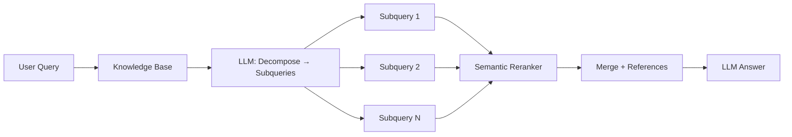

# Azure AI Search — Ingestion + Built-in Agentic Retrieval Guide

> **Status:** Architecture & Implementation Guide | **Last Updated:** 2026-07-02
> **Related:** [aca-deployment-spec.md](./aca-deployment-spec.md), [CONTEXT.md](../CONTEXT.md)

---

## 1. Executive Summary

Azure AI Search มี **built-in Agentic Retrieval** (GA: `2026-04-01` REST API) — ระบบจัดการ query decomposition, parallel subquery execution, semantic reranking, และ result synthesis ให้อัตโนมัติ ไม่ต้องเขียน agentic logic เอง



**สิ่งที่ต้องเพิ่มใน deployment:**
- Azure AI Search resource
- Ingestion pipeline (PDF → chunk → embed → index)
- **Agentic retrieval: ใช้ built-in — ไม่ต้องเขียนเอง ✅**

---

## 2. Built-in Agentic Retrieval คืออะไร?

แทนที่จะเขียน agentic logic เอง (LangChain Agent, tool-calling orchestration) — Azure AI Search มีของตัวเองแล้ว:

| ความสามารถ | Built-in Agentic Retrieval | Custom (ที่เราเคยคิดจะเขียน) |
|---|---|---|
| **Query Decomposition** | ✅ LLM ใน Knowledge Base ทำให้อัตโนมัติ | ❌ ต้องเขียนเอง |
| **Parallel Subqueries** | ✅ พร้อมกันทุก subquery | ❌ ต้องจัดการเอง |
| **Semantic Reranking** | ✅ L2 reranker ในตัว | ❌ ต้องใช้ API แยก |
| **Citation Tracking** | ✅ Auto references + source data | ❌ ต้อง track เอง |
| **Activity Log** | ✅ Token usage, elapsed time, query args | ❌ ต้อง log เอง |
| **MCP Endpoint** | ✅ `/knowledgebases/{name}/mcp` | ❌ ต้องสร้างเอง |
| **Foundry Agent Integration** | ✅ เชื่อมตรงผ่าน MCP | ❌ ต้อง implement เอง |
| **Multi-Source** | ✅ Index + Blob + Web + OneLake | ❌ ต้อง orchestrate เอง |

---

## 3. Architecture

```
┌─────────────────────────────────────────────────────────────────┐
│                    Azure AI Search                               │
│                                                                  │
│  ┌──────────────────────────────────────────────────────────┐   │
│  │              Knowledge Base (Orchestrator)                │   │
│  │                                                          │   │
│  │  Query → LLM Planning (low/medium) → Subqueries         │   │
│  │       → Parallel Execution → Semantic Rerank             │   │
│  │       → Merge Results + References + Activity Log        │   │
│  └──────────────────────────────────────────────────────────┘   │
│         │                                                        │
│         ▼                                                        │
│  ┌──────────────────┐  ┌──────────────────────────────────┐    │
│  │ Knowledge Source │  │ Search Index (haadthip-docs)      │    │
│  │ (searchIndex)    │  │ • content (text, Thai analyzer)  │    │
│  │                  │  │ • content_vector (1536 dims)      │    │
│  │                  │  │ • Semantic config                 │    │
│  └──────────────────┘  └──────────────────────────────────┘    │
│                                                                  │
│  MCP Endpoint: /knowledgebases/{name}/mcp                       │
└──────────────────────────────────────────────────────────────────┘
         │                              │
         ▼                              ▼
┌──────────────────┐          ┌──────────────────┐
│  Azure OpenAI    │          │  Your App / Agent │
│  (query planning │          │  (Open WebUI,     │
│   + answer gen)  │          │   Foundry)        │
└──────────────────┘          └──────────────────┘
```

---

## 4. Step-by-Step: สร้าง Agentic Retrieval Pipeline

### 4.1 Prerequisites

```bash
LOCATION="southeastasia"
RG="rg-enterprisechat-poc"

# 1. Create AI Search (Basic tier — semantic ranker required)
az search service create \
  --resource-group $RG \
  --name enterprisechat-search \
  --location $LOCATION \
  --sku basic \
  --semantic-search standard  # ← ต้องใช้ standard semantic (ไม่ใช่ free)

# 2. Store admin key
SEARCH_KEY=$(az search admin-key show -g $RG --name enterprisechat-search --query primaryKey -o tsv)
az keyvault secret set --vault-name enterprisechat-kv --name search-admin-key --value "$SEARCH_KEY"

# 3. Deploy embedding model on Azure OpenAI (required for integrated vectorization)
# text-embedding-3-small (1536 dims) หรือ text-embedding-3-large (3072 dims)

# 4. Environment variables
ENDPOINT="https://enterprisechat-search.search.windows.net"
API_VERSION="2026-05-01-preview"  # ใช้ preview สำหรับ full feature set
# หรือ "2026-04-01" สำหรับ GA features
```

> ⚠️ **Semantic Search**: Agentic retrieval ต้องการ semantic ranker → ต้องใช้ **standard** semantic search (ไม่ใช่ free)

---

### 4.2 Create Search Index

```python
from azure.search.documents.indexes import SearchIndexClient
from azure.search.documents.indexes.models import (
    AzureOpenAIVectorizer, AzureOpenAIVectorizerParameters,
    HnswAlgorithmConfiguration, SearchField, SearchIndex,
    SemanticConfiguration, SemanticField, SemanticPrioritizedFields,
    SemanticSearch, VectorSearch, VectorSearchProfile
)
from azure.identity import DefaultAzureCredential

ENDPOINT = "https://enterprisechat-search.search.windows.net"
credential = DefaultAzureCredential()

index_name = "haadthip-docs"
azure_openai_endpoint = "https://<your-azure-oi>.openai.azure.com"
embedding_deployment = "text-embedding-3-small"
embedding_model = "text-embedding-3-small"

index = SearchIndex(
    name=index_name,
    fields=[
        SearchField(name="id", type="Edm.String", key=True),
        SearchField(name="content", type="Edm.String", searchable=True, analyzer="th.microsoft"),
        SearchField(name="content_vector", type="Collection(Edm.Single)", stored=False,
                    vector_search_dimensions=1536, vector_search_profile_name="hnsw-profile"),
        SearchField(name="title", type="Edm.String", searchable=True, filterable=True, sortable=True),
        SearchField(name="category", type="Edm.String", filterable=True, facetable=True),
        SearchField(name="page_number", type="Edm.Int32", filterable=True, sortable=True),
        SearchField(name="chunk_index", type="Edm.Int32", filterable=True),
        SearchField(name="language", type="Edm.String", filterable=True, facetable=True),
        SearchField(name="last_updated", type="Edm.DateTimeOffset", filterable=True, sortable=True),
    ],
    vector_search=VectorSearch(
        profiles=[VectorSearchProfile(
            name="hnsw-profile",
            algorithm_configuration_name="hnsw-algo",
            vectorizer_name="azure-openai-embedding"
        )],
        algorithms=[HnswAlgorithmConfiguration(name="hnsw-algo")],
        vectorizers=[AzureOpenAIVectorizer(
            vectorizer_name="azure-openai-embedding",
            parameters=AzureOpenAIVectorizerParameters(
                resource_url=azure_openai_endpoint,
                deployment_name=embedding_deployment,
                model_name=embedding_model
            )
        )]
    ),
    semantic_search=SemanticSearch(
        default_configuration_name="semantic-default",
        configurations=[SemanticConfiguration(
            name="semantic-default",
            prioritized_fields=SemanticPrioritizedFields(
                title_field=SemanticField(field_name="title"),
                content_fields=[SemanticField(field_name="content")],
                keywords_fields=[SemanticField(field_name="category")]
            )
        )]
    )
)

index_client = SearchIndexClient(endpoint=ENDPOINT, credential=credential)
index_client.create_or_update_index(index)
print(f"✅ Index '{index_name}' created")
```

---

### 4.3 Ingest Documents (PDF → Chunk → Embed → Index)

ใช้ LangChain สำหรับ flexible chunking หรือจะใช้ built-in indexer ก็ได้ (§8)

```python
# === ดู full script ได้ที่ §8 ด้านล่าง ===
# Short version:

from langchain.text_splitter import RecursiveCharacterTextSplitter
from langchain_community.document_loaders import PyPDFLoader
from azure.search.documents import SearchIndexingBufferedSender

# 1. Load PDFs
documents = []
for pdf_path in Path("documents/haadthip-corporate").rglob("*.pdf"):
    loader = PyPDFLoader(str(pdf_path))
    pages = loader.load()
    # Add metadata...
    documents.extend(pages)

# 2. Chunk
text_splitter = RecursiveCharacterTextSplitter(
    chunk_size=1000, chunk_overlap=200,
    separators=["\n\n", "\n", ". ", "? ", "! ", " ", ""]
)
chunks = text_splitter.split_documents(documents)

# 3. Upload to Index
with SearchIndexingBufferedSender(endpoint=ENDPOINT, index_name=index_name,
                                    credential=credential) as sender:
    for i, chunk in enumerate(chunks):
        doc = {
            "id": f"{chunk.metadata['title']}_{i}",
            "content": chunk.page_content,
            "title": chunk.metadata["title"],
            "category": chunk.metadata["category"],
            "page_number": chunk.metadata.get("page_number", 0),
            "chunk_index": i,
            "language": chunk.metadata.get("language", "en"),
            "last_updated": datetime.utcnow().isoformat(),
        }
        sender.upload_documents([doc])

print(f"✅ {len(chunks)} chunks indexed")
```

---

### 4.4 Create Knowledge Source

Knowledge Source = pointer ไปยัง search index — บอกว่าใช้ semantic config อะไร, fields ไหนเป็น source data

```python
from azure.search.documents.indexes.models import (
    SearchIndexFieldReference, SearchIndexKnowledgeSource,
    SearchIndexKnowledgeSourceParameters
)

knowledge_source = SearchIndexKnowledgeSource(
    name="haadthip-knowledge-source",
    description="Haadthip internal documents — 18 PDFs across 5 categories",
    search_index_parameters=SearchIndexKnowledgeSourceParameters(
        search_index_name=index_name,
        semantic_configuration_name="semantic-default",
        source_data_fields=[
            SearchIndexFieldReference(name="id"),
            SearchIndexFieldReference(name="content"),
            SearchIndexFieldReference(name="title"),
            SearchIndexFieldReference(name="category"),
            SearchIndexFieldReference(name="page_number"),
        ]
    )
)

index_client.create_or_update_knowledge_source(knowledge_source=knowledge_source)
print(f"✅ Knowledge source created")
```

---

### 4.5 Create Knowledge Base ⭐ หัวใจของ Agentic Retrieval

```python
from azure.search.documents.indexes.models import KnowledgeBase, KnowledgeSourceReference
from azure.search.documents.knowledgebases.models import KnowledgeRetrievalMinimalReasoningEffort

knowledge_base = KnowledgeBase(
    name="haadthip-kb",
    knowledge_sources=[
        KnowledgeSourceReference(name="haadthip-knowledge-source")
    ],
    output_mode="extractiveData",  # Return raw content for agent to reason over
    retrieval_reasoning_effort=KnowledgeRetrievalMinimalReasoningEffort()
    # ↑ minimal = no LLM query planning (fastest, cheapest)
    # ↑ low = LLM decomposes query into subqueries (for complex questions)
    # ↑ medium = deeper search + follow-up iterations
)

index_client.create_or_update_knowledge_base(knowledge_base=knowledge_base)
print(f"✅ Knowledge base created")

# MCP endpoint สำหรับ Foundry Agent Service
mcp_endpoint = f"{ENDPOINT.rstrip('/')}/knowledgebases/haadthip-kb/mcp?api-version=2026-05-01-preview"
print(f"MCP Endpoint: {mcp_endpoint}")
```

---

### 4.6 Query the Knowledge Base — REST API

```bash
# Direct REST call — agentic retrieval ในบรรทัดเดียว!
curl -X POST \
  "https://enterprisechat-search.search.windows.net/knowledgebases('haadthip-kb')/retrieve?api-version=2026-05-01-preview" \
  -H "Content-Type: application/json" \
  -H "api-key: $SEARCH_KEY" \
  -d '{
    "maxRuntimeInSeconds": 60,
    "maxOutputSizeInTokens": 100000,
    "includeActivity": true,
    "knowledgeSourceParams": [{
      "kind": "searchIndex",
      "knowledgeSourceName": "haadthip-knowledge-source",
      "filterAddOn": "category eq '\''public_disclosure'\''",
      "includeReferences": true,
      "includeReferenceSourceData": true,
      "rerankerThreshold": 2.0
    }]
  }'
```

**Response:**
```json
{
  "response": [{
    "content": [{
      "type": "text",
      "text": "[merged content from all subqueries...]"
    }]
  }],
  "activity": [
    { "type": "modelQueryPlanning", "inputTokens": 150, "outputTokens": 80, "elapsedMs": 500 },
    { "type": "searchIndex", "knowledgeSourceName": "haadthip-knowledge-source",
      "searchIndexArguments": { "search": "หาดทิพย์ revenue 2024", "filter": "category eq 'public_disclosure'" },
      "count": 5, "elapsedMs": 200 },
    { "type": "searchIndex", "knowledgeSourceName": "haadthip-knowledge-source",
      "searchIndexArguments": { "search": "Haadthip annual report financial", "filter": "category eq 'public_disclosure'" },
      "count": 3, "elapsedMs": 180 },
    { "type": "agenticReasoning", "reasoningTokens": 45 }
  ],
  "references": [
    { "type": "searchIndex", "id": "abc123", "activitySource": 1,
      "sourceData": { "id": "htc-one-report-2024-en_15", "title": "htc-one-report-2024-en", "page_number": 15, "content": "...revenue..." },
      "rerankerScore": 3.8, "docKey": "htc-one-report-2024-en_15" }
  ]
}
```

**สิ่งที่เห็นใน activity log:**
- `modelQueryPlanning`: LLM ใช้ 150 input tokens + 80 output tokens → สร้าง subqueries ภาษาไทย+อังกฤษ
- `searchIndex` × 2: 2 subqueries รัน parallel → รวม 8 results ผ่าน reranker threshold
- `agenticReasoning`: 45 reasoning tokens สำหรับ result synthesis

---

## 5. Automated Ingestion — 3 วิธี (Push → Pull → Event-Driven)

ไม่อยากรัน ingestion script เองทุกครั้ง? Azure AI Search มี auto-ingest 3 ระดับ:

```
Manual (Python Script)         Schedule (Indexer)          Event-Driven (Event Grid)
       │                             │                             │
   รันเองทุกครั้ง              ทุก 5 นาที-24 ชม.            ใกล้ real-time (<1 นาที)
       │                             │                             │
       └─────────────┬───────────────┴───────────────┬─────────────┘
                     │                               │
                Change Detection             Change Detection
              (built-in: last modified)    (built-in: last modified)
                     │                               │
                     ▼                               ▼
              Index เฉพาะ blobs              Index เฉพาะ blobs
               ที่เปลี่ยนเท่านั้น              ที่เปลี่ยนเท่านั้น
```

### 5.1 วิธีที่ 1: Schedule Indexer (ง่ายสุด — Zero Code)

Indexer + schedule → เหมือน cron job ที่ Azure จัดการให้:

```json
// PUT /indexers/haadthip-blob-indexer?api-version=2026-04-01
{
  "name": "haadthip-blob-indexer",
  "dataSourceName": "haadthip-blob-datasource",
  "targetIndexName": "haadthip-docs",
  "schedule": { "interval": "PT1H" },
  "parameters": {
    "configuration": {
      "indexedFileNameExtensions": ".pdf",
      "dataToExtract": "contentAndMetadata",
      "parsingMode": "default"
    }
  }
}
```

| Schedule | เหมาะกับ |
|---|---|
| `PT5M` (ทุก 5 นาที) | Documents เปลี่ยนบ่อย, near-real-time |
| `PT1H` (ทุกชั่วโมง) | Daily updates — แนะนำสำหรับ POC |
| `PT12H` (ทุก 12 ชม.) | Weekly batch updates |
| `P1D` (ทุกวัน) | Monthly reports |

**Change Detection:** Azure Blob Storage มี built-in — indexer ใช้ `metadata_storage_last_modified` ตรวจว่า blob ไหนเปลี่ยน → index เฉพาะตัวที่เปลี่ยน ไม่ต้อง re-index ทั้ง container

**Deletion Detection:** เปิด soft delete บน blob → indexer auto-detect และลบ document ออกจาก index

### 5.2 วิธีที่ 2: Indexer + Skillset (Auto-Chunk + Auto-Embed)

นี่คือของจริง — **indexer + skillset** = text extraction → chunking → embedding → index **ทั้งหมดอัตโนมัติ ไม่ต้องเขียนโค้ดเลย**

```
Blob Storage                  Skillset (AI Pipeline)              Index
   │                              │                                │
   │  PDF uploaded                │                                │
   │         │                    │                                │
   │         ▼                    │                                │
   │  Indexer triggered ────────► │                                │
   │         │                    │                                │
   │         │              ┌─────┴──────┐                         │
   │         │              │ 1. OCR     │ (ถ้ามีรูป)              │
   │         │              │ 2. Split   │ (chunking)             │
   │         │              │ 3. Embed   │ (vectorization)        │
   │         │              └─────┬──────┘                         │
   │         │                    │                                │
   │         │                    └────────────►  Search Index     │
```

**สร้าง Skillset:**

```json
// PUT /skillsets/haadthip-skillset?api-version=2026-04-01
{
  "name": "haadthip-skillset",
  "skills": [
    {
      "@odata.type": "#Microsoft.Skills.Text.SplitSkill",
      "name": "text-split",
      "description": "Split documents into chunks",
      "context": "/document",
      "defaultLanguageCode": "en",
      "textSplitMode": "pages",
      "maximumPageLength": 2000,
      "pageOverlapLength": 200,
      "maximumPagesToTake": 0,
      "unit": "characters",
      "inputs": [
        { "name": "text", "source": "/document/content" }
      ],
      "outputs": [
        { "name": "textItems", "targetName": "chunks" }
      ]
    },
    {
      "@odata.type": "#Microsoft.Skills.Text.AzureOpenAIEmbeddingSkill",
      "name": "embed-chunks",
      "description": "Generate embeddings for each chunk",
      "context": "/document/chunks/*",
      "resourceUri": "https://<your-azure-oi>.openai.azure.com",
      "deploymentId": "text-embedding-3-small",
      "modelName": "text-embedding-3-small",
      "dimensions": 1536,
      "inputs": [
        { "name": "text", "source": "/document/chunks/*" }
      ],
      "outputs": [
        { "name": "embedding", "targetName": "vector" }
      ]
    }
  ],
  "indexProjections": {
    "selectors": [
      {
        "targetIndexName": "haadthip-docs",
        "parentKeyFieldName": "parent_id",
        "sourceContext": "/document/chunks/*",
        "mappings": [
          { "name": "chunk_id", "source": "/document/chunks/*/chunk_id" },
          { "name": "content", "source": "/document/chunks/*" },
          { "name": "content_vector", "source": "/document/chunks/*/vector" },
          { "name": "title", "source": "/document/metadata_storage_name" },
          { "name": "chunk_index", "source": "/document/chunks/*/chunk_index" }
        ]
      }
    ]
  }
}
```

> ⚠️ **Index Projections** vs **Output Field Mappings**:
> - Skillset ที่มี `indexProjections` → 1 blob → N search documents (one per chunk) → ต้องใช้ indexer ที่มี `parameters.configuration.parsingMode: "default"` (one-to-many)
> - Skillset ที่ไม่มี indexProjections → enrichment fields ถูกเพิ่มใน search document เดียวกับ blob → ใช้ output field mappings ปกติ

**อัปเดต Indexer ให้ใช้ Skillset:**

```json
// PUT /indexers/haadthip-blob-indexer?api-version=2026-04-01
{
  "name": "haadthip-blob-indexer",
  "dataSourceName": "haadthip-blob-datasource",
  "targetIndexName": "haadthip-docs",
  "skillsetName": "haadthip-skillset",
  "schedule": { "interval": "PT1H" },
  "parameters": {
    "configuration": {
      "indexedFileNameExtensions": ".pdf",
      "dataToExtract": "contentAndMetadata",
      "parsingMode": "default"
    }
  }
}
```

**ข้อดีของ Skillset Approach:**
- ✅ Zero code — Azure จัดการทุกอย่าง
- ✅ Schedule อัตโนมัติ
- ✅ Change detection — index เฉพาะ blob ที่เปลี่ยน
- ✅ Cost optimization — incremental enrichment cache (ลด token usage)
- ✅ Managed retry/error handling

**ข้อเสีย:**
- ⚠️ ควบคุม chunking strategy ได้น้อยกว่า Python
- ⚠️ SplitSkill ใช้ "pages" mode (ตัดตามจำนวนตัวอักษร) — ไม่ใช่ paragraph/sentence-aware
- ⚠️ Skillset มีค่าใช้จ่ายเพิ่ม (แต่ถูกมากเมื่อเทียบกับการเขียนเอง + maintain)

### 5.3 วิธีที่ 3: Event Grid Trigger (Near Real-Time)

สำหรับ use case ที่ต้องการ index **ทันที** เมื่อมีคนอัปโหลดไฟล์ (ไม่ต้องรอ schedule):

```
Blob Storage ──► Event Grid ──► Logic App / Function ──► Run Indexer
   │                                                        │
   │  PDF uploaded                                          │
   │  → BlobCreated event                                  │
   │  → Event Grid fires                                    │
   │  → Webhook to run indexer                              │
   │                                                        ▼
   └──────────────────────────────► Search Index updated in <1 min
```

**สร้าง Logic App (หรือ Azure Function) ที่รับ Event Grid event แล้วรัน indexer:**

```json
// Event Grid subscription → Logic App webhook
{
  "properties": {
    "destination": {
      "endpointType": "WebHook",
      "properties": { "endpointUrl": "https://prod-xxx.logic.azure.com/workflows/yyy" }
    },
    "filter": {
      "includedEventTypes": ["Microsoft.Storage.BlobCreated"],
      "subjectBeginsWith": "/blobServices/default/containers/documents",
      "subjectEndsWith": ".pdf"
    }
  }
}
```

Logic App action (รัน indexer):
```json
{
  "type": "Http",
  "inputs": {
    "method": "POST",
    "uri": "https://enterprisechat-search.search.windows.net/indexers/haadthip-blob-indexer/run?api-version=2026-04-01",
    "headers": { "api-key": "@parameters('searchAdminKey')", "Content-Type": "application/json" }
  }
}
```

> 💡 **Simpler alternative:** ถ้าไม่ต้องการ real-time → ใช้ schedule `PT5M` ก็พอ (index ภายใน 5 นาที)

### 5.4 Full CLI: สร้าง Auto-Ingestion Pipeline ตั้งแต่ต้นจนจบ

```bash
#!/bin/bash
# auto-ingest-setup.sh — Zero-code automated ingestion pipeline
# Prerequisites: Blob Storage container 'documents' already exists with PDFs

ENDPOINT="https://enterprisechat-search.search.windows.net"
API_VERSION="2026-04-01"
SEARCH_KEY=$(az keyvault secret show --vault-name enterprisechat-kv --name search-admin-key --query value -o tsv)
STORAGE_CONN_STR=$(az storage account show-connection-string -g rg-enterprisechat-poc -n enterprisechatstg --query connectionString -o tsv)
OPENAI_ENDPOINT="https://<your-azure-oi>.openai.azure.com"

# === 1. Create Data Source (Blob) ===
curl -X PUT "$ENDPOINT/datasources('haadthip-blob-datasource')?api-version=$API_VERSION" \
  -H "Content-Type: application/json" -H "api-key: $SEARCH_KEY" \
  -d '{
    "name": "haadthip-blob-datasource",
    "type": "azureblob",
    "credentials": { "connectionString": "'"$STORAGE_CONN_STR"'" },
    "container": { "name": "documents", "query": "haadthip" }
  }'

# === 2. Create Skillset (Split + Embed) ===
curl -X PUT "$ENDPOINT/skillsets('haadthip-skillset')?api-version=$API_VERSION" \
  -H "Content-Type: application/json" -H "api-key: $SEARCH_KEY" \
  -d '{
    "name": "haadthip-skillset",
    "skills": [
      {
        "@odata.type": "#Microsoft.Skills.Text.SplitSkill",
        "name": "text-split",
        "context": "/document",
        "textSplitMode": "pages",
        "maximumPageLength": 2000,
        "pageOverlapLength": 200,
        "inputs": [{"name": "text", "source": "/document/content"}],
        "outputs": [{"name": "textItems", "targetName": "chunks"}]
      },
      {
        "@odata.type": "#Microsoft.Skills.Text.AzureOpenAIEmbeddingSkill",
        "name": "embed-chunks",
        "context": "/document/chunks/*",
        "resourceUri": "'"$OPENAI_ENDPOINT"'",
        "deploymentId": "text-embedding-3-small",
        "modelName": "text-embedding-3-small",
        "dimensions": 1536,
        "inputs": [{"name": "text", "source": "/document/chunks/*"}],
        "outputs": [{"name": "embedding", "targetName": "vector"}]
      }
    ],
    "indexProjections": {
      "selectors": [{
        "targetIndexName": "haadthip-docs",
        "parentKeyFieldName": "parent_id",
        "sourceContext": "/document/chunks/*",
        "mappings": [
          {"name": "content", "source": "/document/chunks/*"},
          {"name": "content_vector", "source": "/document/chunks/*/vector"}
        ]
      }]
    }
  }'

# === 3. Create Index (with vector field) ===
curl -X PUT "$ENDPOINT/indexes('haadthip-docs')?api-version=$API_VERSION" \
  -H "Content-Type: application/json" -H "api-key: $SEARCH_KEY" \
  -d '{
    "name": "haadthip-docs",
    "fields": [
      {"name": "parent_id", "type": "Edm.String", "key": true},
      {"name": "content", "type": "Edm.String", "searchable": true},
      {"name": "content_vector", "type": "Collection(Edm.Single)", "dimensions": 1536, "vectorSearchProfile": "default"},
      {"name": "title", "type": "Edm.String", "filterable": true}
    ],
    "vectorSearch": {
      "algorithms": [{"name": "hnsw-algo", "kind": "hnsw"}],
      "profiles": [{"name": "default", "algorithm": "hnsw-algo"}]
    },
    "semantic": {
      "configurations": [{
        "name": "default",
        "prioritizedFields": {"contentFields": [{"fieldName": "content"}]}
      }]
    }
  }'

# === 4. Create Indexer (scheduled every hour) ===
curl -X PUT "$ENDPOINT/indexers('haadthip-blob-indexer')?api-version=$API_VERSION" \
  -H "Content-Type: application/json" -H "api-key: $SEARCH_KEY" \
  -d '{
    "name": "haadthip-blob-indexer",
    "dataSourceName": "haadthip-blob-datasource",
    "targetIndexName": "haadthip-docs",
    "skillsetName": "haadthip-skillset",
    "schedule": { "interval": "PT1H" },
    "parameters": {
      "configuration": {
        "indexedFileNameExtensions": ".pdf",
        "dataToExtract": "contentAndMetadata"
      }
    }
  }'

echo "✅ Automated ingestion pipeline created!"
echo "   Indexer runs every hour, processes only changed PDFs"
echo "   Check status: curl $ENDPOINT/indexers/haadthip-blob-indexer/status?api-version=$API_VERSION"
```

### 5.5 เปรียบเทียบ: Python Script vs Auto-Indexer

| | Python Script (Push) | Auto-Indexer (Pull) |
|---|---|---|
| **Code** | ~50 lines Python | 4 REST calls (data source, skillset, index, indexer) |
| **Chunking** | ✅ Full control (Recursive, Semantic) | ⚠️ Fixed "pages" mode |
| **Embedding** | ✅ Full control (model, dimensions) | ✅ AzureOpenAIEmbeddingSkill |
| **Schedule** | ❌ ต้อง cron / Container Apps Job เอง | ✅ Built-in `schedule.interval` |
| **Change Detection** | ❌ ต้อง implement เอง | ✅ `metadata_storage_last_modified` auto |
| **Deletion Detection** | ❌ ต้อง implement เอง | ✅ Soft delete auto-detect |
| **Retry/Error** | ❌ ต้องจัดการเอง | ✅ Built-in `maxFailedItems` |
| **Cost** | Container Apps Job execution | Skillset token cost + indexer run |
| **Monitor** | ❌ ต้อง log เอง | ✅ Built-in execution history + status API |
| **เหมาะกับ...** | POC, custom chunking needs, complex metadata | Production, "set and forget", regular updates |

> **แนะนำ:** POC → Python script (ควบคุม chunking ได้ดี, ไทย-specific tuning) | Production → Auto-indexer (zero maintenance, change detection)

---

## 6. Integration Patterns — 3 Ways to Consume

### 6.1 Pattern 1: Direct REST API (Simplest)

```python
import requests

def search_haadthip(query: str, category: str = None) -> dict:
    """Call AI Search built-in agentic retrieval"""
    body = {
        "maxRuntimeInSeconds": 30,
        "maxOutputSizeInTokens": 50000,
        "includeActivity": True,
        "knowledgeSourceParams": [{
            "kind": "searchIndex",
            "knowledgeSourceName": "haadthip-knowledge-source",
            "filterAddOn": f"category eq '{category}'" if category else None,
            "includeReferences": True,
            "includeReferenceSourceData": True,
            "rerankerThreshold": 2.0
        }]
    }
    # Remove None values
    body["knowledgeSourceParams"][0] = {k: v for k, v in body["knowledgeSourceParams"][0].items() if v is not None}

    resp = requests.post(
        f"{ENDPOINT}/knowledgebases('haadthip-kb')/retrieve?api-version=2026-05-01-preview",
        headers={"Content-Type": "application/json", "api-key": SEARCH_KEY},
        json=body
    )
    return resp.json()  # Contains response + references + activity
```

**เหมาะกับ:** Open WebUI custom pipeline, any HTTP-capable app

---

### 6.2 Pattern 2: MCP + Foundry Agent Service (Production ⭐)

สำหรับ production chatbot — เชื่อม AI Search กับ Foundry Agent Service ผ่าน MCP:

```python
from azure.ai.projects import AIProjectClient
from azure.ai.projects.models import PromptAgentDefinition, MCPTool

# 1. Project client
project_client = AIProjectClient(endpoint=project_endpoint, credential=credential)

# 2. Create project connection → MCP endpoint
mcp_endpoint = f"{ENDPOINT}/knowledgebases/haadthip-kb/mcp?api-version=2026-05-01-preview"

# 3. Agent with MCP tool
instructions = """
You are Haadthip IT assistant. Always use the knowledge base for answers.
Cite source documents and page numbers. Answer in Thai unless asked otherwise.
Never answer from your own knowledge — use the knowledge base tool.
"""

agent = project_client.agents.create_version(
    agent_name="haadthip-assistant",
    definition=PromptAgentDefinition(
        model="gpt-4o-mini",
        instructions=instructions,
        tools=[MCPTool(
            server_label="knowledge-base",
            server_url=mcp_endpoint,
            require_approval="never",
            allowed_tools=["knowledge_base_retrieve"],
            project_connection_id="haadthip-kb-connection"
        )]
    )
)

# 4. Chat
openai_client = project_client.get_openai_client()
conversation = openai_client.conversations.create()

response = openai_client.responses.create(
    conversation=conversation.id,
    tool_choice="required",
    input="หาดทิพย์มีรายได้ปี 2024 เท่าไหร่?",
    extra_body={"agent": {"name": agent.name, "type": "agent_reference"}},
)
print(response.output_text)
```

**เหมาะกับ:** Production chatbot, multi-turn conversations, Foundry ecosystem

---

### 6.3 Pattern 3: Open WebUI + AI Search Direct Integration

```python
# Open WebUI custom pipeline — direct integration
# Step 1: User asks question in Open WebUI
# Step 2: Open WebUI pipeline calls AI Search agentic retrieval API
# Step 3: Results returned with references → LLM generates final answer

# Open WebUI pipeline config (Python):
def search_pipeline(query: str) -> str:
    resp = requests.post(
        f"{ENDPOINT}/knowledgebases('haadthip-kb')/retrieve?api-version=2026-05-01-preview",
        headers={"Content-Type": "application/json", "api-key": SEARCH_KEY},
        json={
            "maxRuntimeInSeconds": 30,
            "includeActivity": True,
            "knowledgeSourceParams": [{
                "kind": "searchIndex",
                "knowledgeSourceName": "haadthip-knowledge-source",
                "includeReferences": True,
                "includeReferenceSourceData": True,
                "rerankerThreshold": 2.0
            }]
        }
    )
    return resp.json()  # Pass to LLM for answer generation
```

---

## 7. Reasoning Effort — เลือกยังไง?

| Effort | LLM ใช้? | Subqueries | Cost | Latency | เมื่อไหร่ควรใช้ |
|---|---|---|---|---|---|
| **minimal** | ❌ ไม่ใช้ | 1 (query ส่งตรง) | ถูกสุด | เร็วสุด | Simple questions, known-good query |
| **low** | ✅ ใช้ | LLM สร้าง auto | ปานกลาง | ~1-2s | คำถามซับซ้อน, มีหลายประเด็น |
| **medium** | ✅ ใช้ (มากกว่า) | LLM + iterative | แพงสุด | ~3-5s | Deep research, multi-hop reasoning |

**Recommendation สำหรับ POC:** เริ่มที่ `low` — ได้ query decomposition ช่วย handle คำถามภาษาไทยที่อาจสะกดผิดหรือถามหลายเรื่อง

---

## 8. Pricing — ถูกกว่า Custom มาก!

### Cost Estimation (per 2,000 queries, gpt-4o-mini)

| Component | Calculation | Cost |
|---|---|---|
| **Query Planning** (Azure OpenAI) | 2,000 input tokens × 2,000 queries → 4M tokens | ~$0.60 |
| **Query Planning Output** | 350 output tokens × 2,000 queries → 700K tokens | ~$0.42 |
| **Semantic Reranking** (AI Search) | 50 chunks × 3 subqueries × 2,000 queries × 500 tokens = 150M tokens | ~$3.30 |
| **Total** | — | **~$4.32 / 2,000 queries** |

> 💡 2,000 queries ≈ 91 queries/วัน (22 วันทำการ) → แทบจะฟรีในช่วง POC

### Monthly AI Search Cost

| SKU | Cost/mo | Semantic Reranker | Agentic | เหมาะกับ |
|---|---|---|---|---|
| **Free** | $0 | ❌ | ❌ | Dev/test — 50MB/3 indexes |
| **Basic** | ~$73/SU | ✅ Standard | ✅ | **POC / Small Prod** |
| **Standard S1** | ~$250/SU | ✅ Standard | ✅ | Production |
| **Standard S2** | ~$1,000/SU | ✅ Standard | ✅ | Enterprise |

> 💡 **Basic tier (~$73/mo) พอสำหรับ 18 docs + agentic retrieval** — ถูกกว่าที่ guide เดิมประเมินไว้ ($250) เพราะ Basic คิด $73/SU ไม่ใช่ $250
>
> ⚠️ **Budget:** รวมกับ Container Apps แล้ว ~$108/mo — เกินงบ $100 เล็กน้อย ถ้าต้องการอยู่ในงบ → ใช้ pgvector ($0) แทน

---

## 9. Full Ingestion Script (Python — Production Ready)

```python
#!/usr/bin/env python3
"""
ingest_haadthip.py — Bulk ingest Haadthip PDFs into Azure AI Search
Usage:
    export AZURE_SEARCH_KEY=$(az keyvault secret show --vault-name enterprisechat-kv --name search-admin-key --query value -o tsv)
    python ingest_haadthip.py
"""

import os, re
from pathlib import Path
from datetime import datetime, timezone
from langchain_community.document_loaders import PyPDFLoader
from langchain.text_splitter import RecursiveCharacterTextSplitter
from azure.identity import DefaultAzureCredential
from azure.search.documents import SearchIndexingBufferedSender

# === CONFIG ===
ENDPOINT = os.getenv("AZURE_SEARCH_ENDPOINT", "https://enterprisechat-search.search.windows.net")
INDEX_NAME = "haadthip-docs"
DOCUMENTS_DIR = Path("../documents/haadthip-corporate")

CATEGORY_MAP = {
    "01-security":           "security",
    "02-email":              "email",
    "03-meeting-room":       "meeting_room",
    "04-it-policy":          "it_policy",
    "05-public-disclosure":  "public_disclosure",
}

def detect_language(text: str) -> str:
    """Detect if text is Thai or English based on character range"""
    thai_chars = sum(1 for c in text[:500] if '\u0e00' <= c <= '\u0e7f')
    return "th" if thai_chars > 5 else "en"

def sanitize_id(raw: str) -> str:
    """Create a valid document ID for AI Search"""
    return re.sub(r'[^a-zA-Z0-9_-]', '_', raw)[:100]

# === TEXT SPLITTER ===
text_splitter = RecursiveCharacterTextSplitter(
    chunk_size=1000,
    chunk_overlap=200,
    separators=["\n\n", "\n", ". ", "? ", "! ", "：", "。", " ", ""],
    length_function=len,
)

# === CREDENTIAL ===
credential = DefaultAzureCredential()

# === INGEST ===
total_chunks = 0
batch = []

with SearchIndexingBufferedSender(
    endpoint=ENDPOINT, index_name=INDEX_NAME, credential=credential
) as sender:
    for category_dir, category_name in CATEGORY_MAP.items():
        pdf_dir = DOCUMENTS_DIR / category_dir
        if not pdf_dir.exists():
            continue

        for pdf_path in sorted(pdf_dir.glob("*.pdf")):
            title = pdf_path.stem
            print(f"📄 {title} ({category_name})")

            try:
                loader = PyPDFLoader(str(pdf_path))
                pages = loader.load()

                for i, page in enumerate(pages):
                    page.metadata.update({
                        "title": title,
                        "category": category_name,
                        "page_number": i + 1,
                        "language": detect_language(page.page_content),
                    })

                chunks = text_splitter.split_documents(pages)
                print(f"   → {len(chunks)} chunks")

                for j, chunk in enumerate(chunks):
                    doc_id = sanitize_id(f"{title}_{j}")
                    doc = {
                        "id": doc_id,
                        "content": chunk.page_content.strip(),
                        "title": chunk.metadata["title"],
                        "category": chunk.metadata["category"],
                        "page_number": chunk.metadata.get("page_number", 0),
                        "chunk_index": j,
                        "language": chunk.metadata.get("language", "en"),
                        "last_updated": datetime.now(timezone.utc).isoformat(),
                    }
                    sender.upload_documents([doc])
                    total_chunks += 1

            except Exception as e:
                print(f"   ⚠️  Error: {e}")

print(f"\n✅ Total: {total_chunks} chunks indexed to '{INDEX_NAME}'")
```

---

## 10. Cost-Optimized Alternative: pgvector

สำหรับ POC แบบ budget ~$100/mo — AI Search Basic (~$250) อาจแพงเกินไป:

| | Azure AI Search | pgvector on PostgreSQL |
|---|---|---|
| **Cost** | ~$250/mo | $0 (ใช้ DB เดิม) |
| **Agentic Retrieval** | ✅ Built-in | ❌ ต้องเขียนเอง |
| **Semantic Ranker** | ✅ L2 reranker | ❌ ต้อง implement เอง |
| **Hybrid Search** | ✅ BM25 + vector | ✅ tsvector + cosine (manual) |
| **Multi-language** | ✅ Microsoft tokenizer | ⚠️ config เอง |
| **MCP Endpoint** | ✅ | ❌ |

**แนะนำ:** POC ด้วย pgvector → validate use case → upgrade เป็น AI Search เมื่อ budget พร้อมและต้องการ agentic retrieval จริงๆ

```sql
-- pgvector setup (run on existing PostgreSQL)
CREATE EXTENSION IF NOT EXISTS vector;
CREATE EXTENSION IF NOT EXISTS pg_trgm;  -- for Thai text search

CREATE TABLE haadthip_docs (
    id TEXT PRIMARY KEY,
    content TEXT NOT NULL,
    content_vector vector(1536),
    title TEXT,
    category TEXT,
    page_number INTEGER,
    chunk_index INTEGER,
    language TEXT,
    last_updated TIMESTAMPTZ DEFAULT NOW()
);

CREATE INDEX ON haadthip_docs USING hnsw (content_vector vector_cosine_ops);
CREATE INDEX ON haadthip_docs USING gin (to_tsvector('english', content));
CREATE INDEX ON haadthip_docs (category);
```

---

## 11. Implementation Roadmap

```
Week 1–2: POC with pgvector
├── Day 1: Enable pgvector on existing PostgreSQL
├── Day 2: Run ingestion script → 18 PDFs
├── Day 3: Test hybrid search (BM25 + vector)
├── Day 4: Integrate with Open WebUI RAG
└── Day 5: Thai-language query testing

Week 3–4: Upgrade to AI Search + Agentic Retrieval
├── Day 1: Create AI Search + Standard semantic ranker
├── Day 2: Re-index documents with integrated vectorization
├── Day 3: Create Knowledge Source + Knowledge Base
├── Day 4: Test agentic retrieval via REST API
├── Day 5: Integrate with Foundry Agent Service (MCP)
└── Day 6: Production deployment + monitoring
```

---

## 12. Quick Reference: REST API Cheatsheet

```bash
# Create Knowledge Source
PUT /knowledgeSources('haadthip-knowledge-source')?api-version=2026-05-01-preview
{
  "name": "haadthip-knowledge-source",
  "searchIndexParameters": {
    "searchIndexName": "haadthip-docs",
    "semanticConfigurationName": "semantic-default",
    "sourceDataFields": [
      {"name": "id"}, {"name": "content"}, {"name": "title"}
    ]
  }
}

# Create Knowledge Base
PUT /knowledgeBases('haadthip-kb')?api-version=2026-05-01-preview
{
  "name": "haadthip-kb",
  "knowledgeSources": [{"name": "haadthip-knowledge-source"}],
  "outputMode": "extractiveData",
  "retrievalReasoningEffort": {"kind": "low"}
}

# Retrieve (Agentic)
POST /knowledgebases('haadthip-kb')/retrieve?api-version=2026-05-01-preview
{
  "maxRuntimeInSeconds": 60,
  "maxOutputSizeInTokens": 100000,
  "includeActivity": true,
  "knowledgeSourceParams": [{
    "kind": "searchIndex",
    "knowledgeSourceName": "haadthip-knowledge-source",
    "includeReferences": true,
    "includeReferenceSourceData": true,
    "rerankerThreshold": 2.0
  }]
}

# MCP Endpoint (for Foundry Agent Service)
GET/POST /knowledgebases/haadthip-kb/mcp?api-version=2026-05-01-preview
```

---

## 13. References

- [Agentic Retrieval Overview](https://learn.microsoft.com/en-us/azure/search/agentic-retrieval-overview)
- [Tutorial: Build End-to-End Agentic Retrieval](https://learn.microsoft.com/en-us/azure/search/agentic-retrieval-how-to-create-pipeline)
- [Knowledge Retrieval - Retrieve REST API](https://learn.microsoft.com/en-us/rest/api/searchservice/knowledge-retrieval/retrieve)
- [Create an Index for Agentic Retrieval](https://learn.microsoft.com/en-us/azure/search/agentic-retrieval-how-to-create-index)
- [Create a Knowledge Base](https://learn.microsoft.com/en-us/azure/search/agentic-retrieval-how-to-create-knowledge-base)
- [Query a Knowledge Base](https://learn.microsoft.com/en-us/azure/search/agentic-retrieval-how-to-retrieve)
- [GitHub: agentic-retrieval-pipeline-example (Python)](https://github.com/Azure-Samples/azure-search-python-samples/tree/main/agentic-retrieval-pipeline-example)
- [GitHub: Quickstart-Agentic-Retrieval (Python)](https://github.com/Azure-Samples/azure-search-python-samples/tree/main/Quickstart-Agentic-Retrieval)
- [GitHub: azure-search-openai-demo (updated with agentic retrieval)](https://github.com/Azure-Samples/azure-search-openai-demo)
