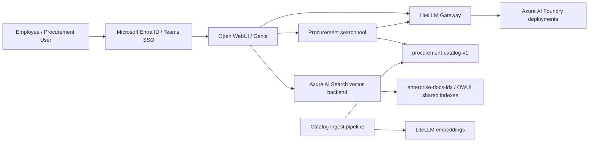
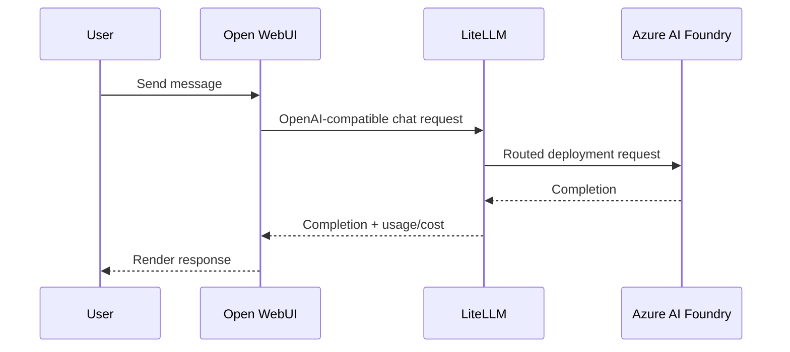
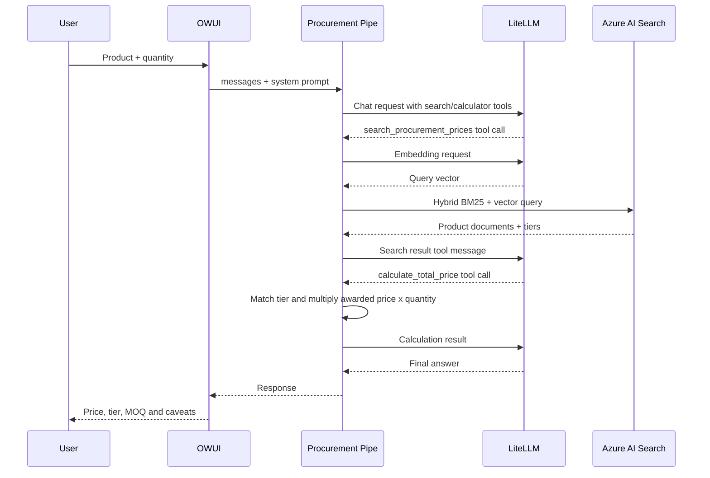

# EnterpriseChat / Genie — System Architecture

**สถานะ:** Current-state architecture
**วันที่ตรวจ:** 10 Sep 2026
**ขอบเขต:** Open WebUI customization, LiteLLM gateway, Azure AI Search, Procurement Price Assistant, local compose, QAS/POC deployment
**แหล่งข้อมูล:** source code, Docker files, CONTEXT.md, procurement tests and deployment scripts

## 1. System Context

EnterpriseChat (ชื่อผู้ใช้: Genie) เป็นระบบสนทนาองค์กรที่ให้ผู้ใช้เข้าใช้งานผ่าน Microsoft Entra ID และ Microsoft Teams, สนทนาผ่าน Open WebUI, เรียก LLM ผ่าน LiteLLM และค้นหาเอกสารผ่าน Azure AI Search

Procurement Price Assistant เป็น vertical slice ที่เพิ่มความสามารถค้นหาราคาสื่อการตลาดจาก `procurement-catalog-v1` พร้อม tier price, MOQ, lead time และ awarded vendor

## 2. Runtime Modules

| Module | Responsibility | Interface / seam | Main implementation |
|---|---|---|---|
| Genie UI module | Chat, model selection, tools, SSO entry | HTTP/browser | Upstream Open WebUI v0.11.0 plus patches |
| LLM gateway module | Model routing, virtual keys, cost tracking, cache | OpenAI-compatible `/v1` | LiteLLM v1.83.3 |
| Azure Search adapter | OWUI vector database operations | `VectorDBBase` | `app/patches/client.py` |
| Procurement retrieval module | Hybrid search, filters, fallback, result shaping | Open WebUI tool function | `app/tools/procurement-search.py` |
| Procurement orchestration module | Tool-calling loop and deterministic price calculation | Open WebUI Pipe | `app/functions/procurement_price_pipe.py` |
| Catalog ingestion module | Workbook conversion, enrichment, index creation and verification | CLI scripts | `requirements/procurement-price-chat/scripts/` and `scripts/ingest/` |
| Identity module | Entra OIDC and Teams popup flow | OAuth callbacks and static bridge | `app/auth/` |
| Runtime image module | Assemble upstream image and patches | Docker build | `docker/Dockerfile.owui`, `docker/Dockerfile.litellm` |

## 3. Deployment Topology

### QAS / POC runtime

- Open WebUI: Azure App Service container, custom image `entchat-owui`
- LiteLLM: Azure App Service container, image `litellm-entchat`
- PostgreSQL: separate `open_webui`, `litellm`, and application databases
- Azure AI Search: private/VNet-accessible search service
- Azure AI Foundry: LLM and embedding deployments
- ACR: image source; Azure App Service is AMD64/Linux
- VNet integration: outbound restrictions affect Entra OAuth and public TTS endpoints

### Local runtime

`docker/compose.yml` runs Open WebUI, LiteLLM and n8n against shared local infrastructure. Database URLs are deliberately separate because LiteLLM migrations must never receive the Open WebUI database URL.

## 4. Request Lifecycles

### Normal chat

### Procurement assistant

## 5. Data and Search Model

### Procurement catalog

- Index: `procurement-catalog-v1`
- One document represents one logical product
- Current QAS readiness: 179 documents, all year 2026
- Every document has product identity, category, pricing fields and at least one tier
- Tier fields include `quantity_min`, `quantity_max`, `awarded_price`, `quantity_label`, `lead_time`
- Categories: `POSM`, `Printing-MKT`, `Printing-Rate`, `Garment`, `Premium`
- Embedding dimension: 3072 (`text-embedding-3-large`)

### Search behavior

1. Create an embedding using the configured LiteLLM embedding model.
2. Search Azure AI Search with keyword + vector retrieval.
3. Apply explicit category/year/price/quantity filters.
4. Retry wildcard candidates when the first query is empty.
5. Drop category filter when it produces no result.
6. Drop quantity filter when MOQ removes all candidates and return a warning.
7. Shape results without inventing or interpolating price values.

## 6. Configuration Ownership

| Configuration | Source of truth | Fallback | Risk |
|---|---|---|---|
| OWUI vector backend | Azure App Settings | local env | Image and runtime config can diverge |
| Open WebUI tool valves | OWUI model/tool database | process env | Secret and endpoint settings are database-held |
| Pipe valves | OWUI function database | process env | Model/base URL may differ from tool valves |
| LiteLLM routing | `docker/litellm-config.yaml` + App Settings | local config | Deployed config is not automatically identical to repo |
| Procurement catalog | Excel Master + ingest scripts | existing Search index | Index can be newer than checked-in source |
| Entra/Teams SSO | Azure App Registration + app settings | local env | VNet egress is required |

## 7. Security and Reliability Invariants

- Secrets belong in Key Vault references or protected environment settings; never commit them to source, docs or generated artifacts.
- LiteLLM and Open WebUI must use separate database URLs.
- Azure App Service images must target Linux/AMD64; deploy the AMD64 digest, not an OCI index.
- Procurement prices must originate from Search results. The calculator may multiply an awarded tier by quantity but must not invent a unit price or extrapolate across tiers.
- A quantity below MOQ must be reported as below MOQ, not silently treated as a valid tier.
- VNet egress must explicitly allow Microsoft Entra endpoints for SSO.
- TTS is disabled in QAS while its Azure Speech egress is unavailable; this prevents a 10-second voices timeout on model editor pages.

## 8. Current Quality Gaps

### 8.1 Procurement logic is duplicated

`app/tools/procurement-search.py` and `app/functions/procurement_price_pipe.py` each contain tier matching, filter construction, Search client setup, fallback behavior and result shaping. The two implementations are already drifting: the Pipe has a synchronous tool loop and a different default model naming scheme, while the Tool has additional search methods and event reporting.

**Effect:** the interface is wide and behavior must be verified twice. A pricing bug can be fixed in one path and remain in the other.

### 8.2 Azure Search adapter is a deep implementation with a weak verification seam

`AzureAISearchClient` correctly hides much of the OWUI vector contract, but the implementation constructs SDK clients directly, performs schema repair and sleeps for propagation inside the same module. There is no adapter-level test suite for namespace resolution, schema mismatch, delete-by-filter or vector dimension changes.

**Effect:** high leverage exists, but locality is weak when Azure behavior changes. Tests need the real Azure SDK or an implicit patch seam.

### 8.3 Runtime composition is too broad

`Dockerfile.owui` installs search, spreadsheet, SQL, identity and web-server dependencies and mutates upstream retrieval code with `sed`. This is useful for delivery speed, but the image has a large implicit interface with upstream Open WebUI internals.

**Effect:** an upstream upgrade can break the build or behavior at several unrelated anchors; the seam is not represented as a versioned patch contract.

### 8.4 Configuration is split between repository and mutable OWUI state

Tool valves, Pipe valves, model prompts and audio settings are stored in the OWUI database while deployment scripts and docs also describe them. QAS can therefore run a configuration that is not reproducible from Git.

**Effect:** incident diagnosis requires database inspection and manual comparison; deployment has weak locality.

### 8.5 Test environment is incomplete

The price calculator tests exist and cover exact tier boundaries, MOQ and gaps, but the current environment cannot import them because the `azure` Python package is missing. Search behavior and tool-loop behavior are not covered by a hermetic fake adapter.

## 9. Operational Runbooks

### Deploy / verify

1. Build for `linux/amd64`.
2. Push canonical image repositories to the correct ACR.
3. Inspect the manifest and select the AMD64 digest.
4. Deploy the digest to the target App Service.
5. Verify health, SSO, LiteLLM model list, Azure Search index and procurement regression.
6. Check that tool/Pipe valves contain the intended endpoint, model and key reference.

### Procurement catalog refresh

1. Validate the Excel Master columns and tier rows.
2. Run the conversion script and inspect generated catalog output.
3. Run ingest in dry-run mode.
4. Create/update the index and ingest documents.
5. Verify document count, fields, tiers and representative Thai queries.
6. Run regression tests before opening the assistant to users.

### Cost-controlled trial

Use a LiteLLM virtual key scoped to the intended model set, with an explicit max budget and expiry. Never put the raw key in Confluence or Git. Verify both an allowed model request and a blocked model request after key creation.

## 10. Recommended Direction

Deepen the **Procurement domain module** first. Make one internal implementation own Search retrieval, fallback, tier validation, calculation and result shaping. Keep two thin adapters: Open WebUI Tool and Open WebUI Pipe. This gives one interface for pricing behavior, one place to test it, and leverage across both runtime paths without changing the user-facing model contract.

Do not start by splitting Docker Compose or rewriting the Azure adapter. Those are worthwhile later, but the procurement module has the clearest duplicate behavior and the highest immediate correctness risk for the QAS trial.
