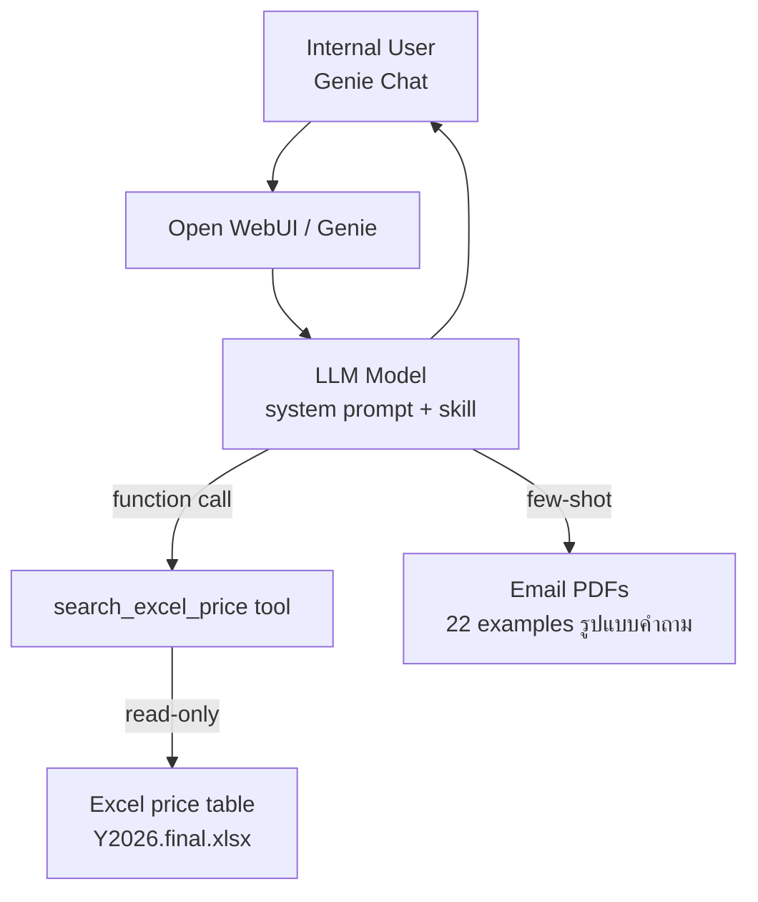

# Procurement Price Chatbot — Design Concept (v2)

> Refined after grilling + user decisions on 2026-07-31

## 🎯 โจทย์ปัญหา

Internal user ถามราคาสินค้า Trade Marketing Materials ผ่าน LLM chatbot บน Genie (Open WebUI):
- ค้นหาสินค้าจาก Excel price table ปัจจุบัน
- เลือก variant ที่ถูกต้อง (เช่น ร่มโค้กมี 8 แบบ)
- ดู winner price (ราคาต่ำสุดที่ผ่านการประมูล)
- คำนวณราคารวม × จำนวน
- **ถามกลับอย่างอิสระ** เมื่อข้อมูลไม่ครบ (variants หรือ optional add-on)

## 🔑 การตัดสินใจหลัก (จากการสนทนา)

| # | หัวข้อ | เลือก | เหตุผล |
|---|--------|------|--------|
| 1 | Source ของราคา | **อ่าน Excel ตรงๆ ผ่าน tool** | ปีละครั้ง maintain ง่าย ไม่ต้อง sync ไม่ต้อง build ingestion pipeline |
| 2 | Clarification อิงจาก | **LLM infer เองจากผล search** | ระบบ "อิสระ" ตามที่ user ต้องการ (ไม่มี pre-defined rules) |
| 3 | Email PDFs | **Few-shot examples ใน prompt** | reference รูปแบบคำถาม/คำตอบจริง ไม่ ingest เป็น knowledge |
| 4 | Deploy | **OWUI ที่มีอยู่ เป็น new model (prompt + skill + tool)** | ใช้ Genie ที่มีอยู่ เพิ่ม model + tools ผ่าน MCP/LiteLLM |

## 📐 Architecture



**จุดสำคัญ:** ไม่มี ingestion step, ไม่มี vector index, ไม่มี catalog.json
Excel file = source of truth ที่ tool อ่านสดๆ (ปีละครั้ง update แค่ที่ Excel)

## 🛠️ Tool Design (1 เครื่องมือหลัก)

```python
search_excel_price(query: str) -> list[dict]
```

**Input:** คำค้นหา (เช่น `"ร่มโค้ก 36 นิ้ว"`)

**Output:** list ของ matching items
```json
[
  {
    "item_id": "POSM-5.2",
    "category": "POSM",
    "full_name": "ร่มโค้ก 36 นิ้ว - โครงไฟเบอร์ สีตาย (ไม่เกิน 4 สี)",
    "specs": {"ขนาด":"36 นิ้ว", "โครง":"ไฟเบอร์", "สี":"สีตาย"},
    "vendor_prices": [
      {"vendor":"Vendor 1","price":565},
      {"vendor":"Vendor 9","price":523},
      {"vendor":"Vendor 11","price":1080}
    ],
    "winner_price": 523,
    "winner_vendor": "Vendor 9"
  }
]
```

**การทำงานภายใน:**
1. เปิด Excel ด้วย openpyxl (read-only)
2. loop ผ่าน 6 sheets (POSM, Printing, Garment, Premium, PrintRate ×2)
3. keyword match ชื่อสินค้า (เก็บ rows ที่มี keyword ตรง)
4. extract vendor prices จาก columns K-X
5. compute winner = min price
6. return matches (LLM filter/clarify ต่อ)

## 🤖 OWUI Model Configuration

### System Prompt (core)

```
You are a procurement price assistant for Haadthip (Genie).

WORKFLOW:
1. User asks about a product with quantity (e.g. "ร่มโค้ก 36 นิ้ว ... 2 อัน")
2. Call search_excel_price(query) to find matching items
3. Analyze results:
   - If 1 match → answer price × quantity directly
   - If multiple variants → OBSERVE their specs (ขนาด, โครง, สี, ผ้า, ...)
     - If user's query missing some variant → ASK BACK in Thai naturally
     - If user's query specifies enough → pick exact variant
   - If 0 match → ask user to clarify product name
4. Once item identified → answer: name + winner_price × qty = total
5. Always show winner vendor name as source

CLARIFICATION RULES (infer freely):
- Decide what to ask by looking at the returned variants' specs
- Ask in natural Thai conversational style (not a form/template)
- For product types that commonly have optional add-ons
  (e.g. some items have "ฐาน" option like stands/bases),
  you may ask "ต้องการ ... ด้วยไหม?" inferred from item type
- Do NOT guess prices. Price must come from the tool result.
- If Excel doesn't have the requested item/option → say so honestly

ANSWER LANGUAGE: Thai
MONEY: บาท (THB), 2 decimal places
```

### Few-shot Examples (จาก Email PDFs)

สกัดจาก 22 PDFs → ใส่เป็น examples ใน prompt:
- "ขอราคาผลิตสติกเกอร์ Minute Maid ขนาด 37x28 cm" → format คำถามจริง
- "ขอราคาป้ายราคา RGB พลาสวูด" → มี Google Drive link ไฟล์ AI
- "ขอราคาสื่อแคมเปญ Ocean Glass Y2026" → มี Allocate Plan Excel attached
- "ขอราคา ธงปีกนก" → ประเภทที่มักมี optional add-ons (ฐาน)

## 🔄 Scenario Flows

### 1. ข้อมูลครบ → ตอบเลย

```
User: "ร่มโค้ก 36 นิ้ว โครงไฟเบอร์ สีตาย 2 อัน"

[LLM: search_excel_price("ร่มโค้ก 36 นิ้ว โครงไฟเบอร์ สีตาย")] → tool
     → keyword match → 8 rows
     → filter by user's spec → POSM-5.2, winner 523 (Vendor 9)

LLM:
  "ร่มโค้ก 36 นิ้ว โครงไฟเบอร์ สีตาย (ไม่เกิน 4 สี)
   ราคาต่ออัน 523 บาท (Vendor 9)
   จำนวน 2 อัน = 1,046 บาท"
```

### 2. ข้อมูลไม่ครบ → ถามกลับ (variants)

```
User: "ร่มโค้ก 10 อัน"

[LLM] search → 8 variants, observes dimensions: ขนาด[36,40] × โครง[เหล็ก,ไฟเบอร์] × สี[สีตาย,ไล่ระดับ]
     user ไม่ระบุ → ASK BACK

LLM:
  "ร่มโค้กมีหลายแบบครับ ช่วยเลือกที:
   - ขนาด: 36 นิ้ว / 40 นิ้ว
   - โครง: เหล็ก / ไฟเบอร์
   - สี: สีตาย / ไล่ระดับสี"

User: "36 นิ้ว โครงเหล็ก สีตาย"

[LLM] pick variant → 523 × 10 = 5,230

LLM:
  "ร่มโค้ก 36 นิ้ว โครงเหล็ก สีตาย
   523 บาท × 10 = 5,230 บาท (Vendor 9)"
```

### 3. Optional add-on → infer & ถามกลับ

> กรณีจริงๆ ผู้ใช้ยกตัวอย่าง "ธงปีกนก → ฐาน" เป็น hypothetical
> แต่ใน real world มี item ประเภทนี้จริง (มี optional ที่ Excel ไม่ระบุ)

```
User: "ธงปีกนก 5 ชุด"

[LLM] search → "ธงปีกนก" found
     LLM infers: ธง/ป้าย ประเภทนี้มักมี option "ฐาน"
     ถามกลบ naturally (inferred, ไม่ใช่ hard-coded)

LLM:
  "ธงปีกนก 5 ชุด ราคา 320 บาท × 5 = 1,600 บาท
   ต้องการฐานด้วยไหมครับ? (ราคาฐานจะแยกคำนวณ)"

User: "มีฐานด้วย 5 ฐาน"

[LLM] search "ฐานธง..." → report "ไม่พบรายการฐานใน Excel" → be honest
```

## 📁 Project Structure (เมื่อ implement)

```
requirements/precurement-price-chat/
├── DESIGN.md                          # this file
├── Trade Marketing Materials price for Y2026.final.xlsx  (source)
├── emails-pdf/                       (22 few-shot references)
├── prompt/
│   ├── system-prompt.md              # OWUI model system prompt
│   └── few-shot-examples.md          # สกัดจาก PDFs
├── tool/
│   ├── search_excel_price.py         # MCP tool / OWUI function
│   └── requirements.txt             # openpyxl
└── tests/
    └── scenarios.md                  # test queries จาก PDFs
```

**ไม่มี scripts/extract_catalog.py, data/catalog.json, data/variants_metadata.json** (เลือกอ่าน Excel ตรงๆ แทน)

## ⚠️ Trade-offs ที่ต้องยอมรับ

| Aspect | Risk | Mitigation |
|--------|------|------------|
| Tool เปิด Excel ทุกครั้ง = ช้า (~1-2 วินาที) | ใช้ได้ถ้าไม่ใช่ high-traffic | cache sheet content ใน memory ถ้ากังวล |
| Keyword match อาจ miss typo/เสียงคล้าย | testcase คลุม | อนาคต: อาจเปลี่ยนเป็น vector search |
| LLM เดา add-on ผิดบางครั้ง | user experience | few-shot จาก PDFs ช่วยแนวนำ |
| ปีใหม่ Excel เปลี่ยน schema | re-update tool | ทำ script ทดสอบ sheet structure ปีละครั้ง |

## ✅ Success Metrics

- ตอบราคาถูกต้องสำหรับ 22 query จาก email PDFs
- Clarification flow ทำงานได้ สำหรับ multi-variant items (ร่มโค้ก, etc.)
- Response time < 3 วินาที (ส่วนใหญ่)
- ไม่มีราคาที่ LLM คิดขึ้นเอง — ทุกราคามาจาก tool

## 🚀 Next Steps (เมื่อ confirm design)

1. validate sheet inference script (ทดสอบ keyword match)
2. เขียน `search_excel_price` tool (Python + openpyxl)
3. สกัด few-shot examples จาก 22 PDFs → markdown
4. สร้าง OWUI model (prompt + skill + MCP tool)
5. ทดสอบใน Genie กับ query จริง