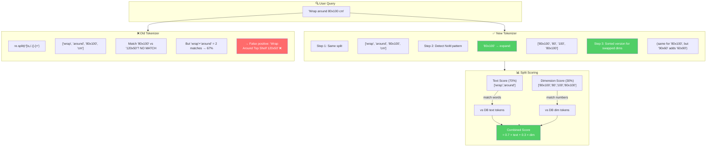
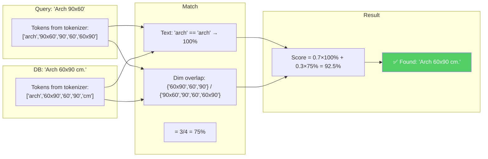
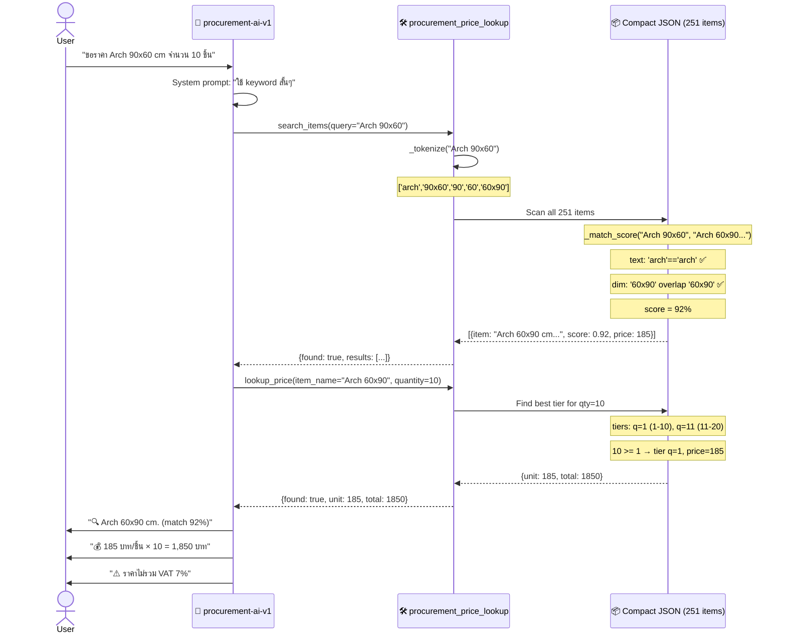
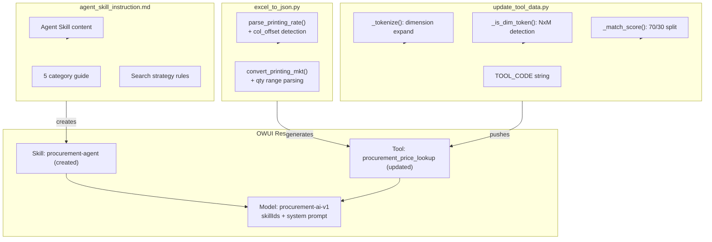

# Entity Matching Fix — Architecture Diagrams

## 1. Overall Data Flow

```mermaid
flowchart LR
    subgraph Input["📂 Data Sources"]
        EXCEL["Trade Marketing Materials<br/>price for Y2026.final.xlsx<br/>(7 sheets)"]
    end

    subgraph Parser["🐛 Parser (excel_to_json.py)"]
        direction TB
        PARSE["parse_printing_rate()"]
        BUG1["❌ Bug#1: col_offset=0<br/>item_name='1','2','3'...<br/>Arch data lost!"]
        FIX1["✅ Fix: auto-detect<br/>where 'ลำดับ' column is<br/>→ col_offset=0 or 1"]
        PARSE --> BUG1
        BUG1 -->|Fixed| FIX1
    end

    subgraph JSON["📄 JSON (5 sheets, 251 items)"]
        POSM["1.POSM(MKT) — 25 items"]
        PRINT["2.Printing(MKT) — 13 items"]
        GARM["3.Garment — 16 items"]
        PREM["4.สรุปPremium — 15 items"]
        RATE["5.Printing-Rate — 182 items<br/>(was 162, +20 from fix)"]
    end

    subgraph Converter["🔧 Data Converter (update_tool_data.py)"]
        COMPACT["convert to compact format<br/>{n, t, p, v}"]
        RANGE_FIX["Fix: parse qty ranges<br/>'1-10' → start=1<br/>'1,001-1,500' → start=1001"]
    end

    subgraph Tool["🛠️ OWUI Tool (procurement_price_lookup)"]
        direction TB
        TOKEN["🐛 Bug#2: Old _tokenize()<br/>split words only<br/>'80x100' = single token"]
        DIM_TOKEN["✅ New _tokenize()<br/>'80x100' → ['80x100','80','100','80x100']<br/>+ sorted version for swapped dims"]
        SCORE["New _match_score()<br/>70% text + 30% dimension"]
        SEARCH["search_items() + lookup_price()"]
        TOKEN -->|Fixed| DIM_TOKEN
        DIM_TOKEN --> SCORE
        SCORE --> SEARCH
    end

    subgraph Model["🤖 OWUI Model (procurement-ai-v1)"]
        SP["System Prompt"]
        SKILL["Agent Skill Instruction<br/>(procurement-agent)"]
    end

    EXCEL --> PARSE
    FIX1 --> JSON
    JSON --> Converter
    COMPACT --> Tool
    RANGE_FIX --> Tool
    SEARCH --> Model
    SP --> Model
    SKILL --> Model

    style BUG1 fill:#ff6b6b,color:#fff
    style BUG2 fill:#ff6b6b,color:#fff
    style FIX1 fill:#51cf66,color:#fff
    style DIM_TOKEN fill:#51cf66,color:#fff
    style SCORE fill:#51cf66,color:#fff
```

---

## 2. Bug #1: Parser Column Offset

```mermaid
flowchart TB
    subgraph "Sheet: 5.Printing-Rate1-43"
        direction LR
        R0["Row 2 (header)<br/>[nan] [ลำดับ] [รายการ] [QTY] [vendor...]"]
        R1["Row 3 (data)<br/>[nan] [1] [Arch 60x70 cm...] [1-10] [155...]"]
        R2["Row 4 (data)<br/>[nan] [nan] [nan] [11-20] [150...]"]
    end

    subgraph "❌ Old Parser (hardcode col 0,1,2)"
        OLD1["row[0]='nan' → item_no=''"]
        OLD2["row[1]='1' → item_name='1' ❌"]
        OLD3["row[2]='Arch 60x70...' → qty='Arch...' ❌"]
        OLD4["row[3]='1-10' → vendor_start=3 ❌"]
    end

    subgraph "✅ New Parser (auto-detect col_offset)"
        NEW1["Find column with 'ลำดับ' → col 1"]
        NEW2["col_offset=1"]
        NEW3["row[1]='1' → item_no='1' ✅"]
        NEW4["row[2]='Arch 60x70 cm...' → item_name ✅"]
        NEW5["row[3]='1-10' → qty='1-10' ✅"]
        NEW6["row[4] → vendor_start=4 ✅"]
    end

    R0 --> OLD1
    R1 --> OLD2
    R1 --> NEW3
    R1 --> NEW4
    R1 --> NEW5

    style OLD2 fill:#ff6b6b,color:#fff
    style OLD3 fill:#ff6b6b,color:#fff
    style OLD4 fill:#ff6b6b,color:#fff
    style NEW3 fill:#51cf66,color:#fff
    style NEW4 fill:#51cf66,color:#fff
    style NEW5 fill:#51cf66,color:#fff
```

---

## 3. Bug #2: Dimension-Aware Tokenizer

---

## 4. Swapped Dimension Resolution

---

## 5. Search Lifecycle (end-to-end)

---

## 6. Key Files Changed

---

## Summary: Before vs After

| Dimension | Before | After |
|---|---|---|
| **Parser** | col 0,1,2 hardcoded | auto-detect `col_offset` |
| **Item names** | `"1", "2", "3"` (Arch items) | `"Arch 60x70 cm..."` |
| **Token count** | 231 | **251** (+20 revealed) |
| **Tokenizer** | word split only | + dimension expansion (`NxM`→`N,M,sorted`) |
| **Scoring** | single text score | **70% text + 30% dimension** |
| **Swapped dims** | `60x90` ≠ `90x60` | `60x90` matches `90x60` ✅ |
| **Wrap around 80x100** | ❌ false match to 120x50 | ✅ correct match 100% |
| **Arch 90x60** | ❌ not found | ✅ 92% match to Arch 60x90 |
