# Haadthip Enterprise Chat System

> ระบบ AI Chatbot ภายในองค์กรหาดทิพย์ — สร้างบน Open WebUI + Azure AI Services
> URL: https://app-entchat-owui-poc-sand.azurewebsites.net
> สถานะ: Proof of Concept (PoC) บน Azure Sandbox
> Login ผ่าน: Microsoft Entra ID SSO (@haadthip.com / @gmail.com)

---

## 🏗️ Architecture Overview

- **Frontend**: Open WebUI (self-hosted บน Azure Container Apps)
- **LLM**: Azure OpenAI GPT-5.4 family (5 models)
- **Search**: Azure AI Search (Hybrid: BM25 + Vector + Semantic)
- **Database**: Azure PostgreSQL Flexible Server
- **Storage**: Azure Blob Storage
- **Auth**: Microsoft Entra ID OIDC SSO

---

## 🤖 AI Models (8 Models)

| Model | ประเภท | การใช้งาน |
|---|---|---|
| **Haadthip Enterprise Assistant (Pipe)** | Pipe (RAG) | ค้นหาเอกสารองค์กร + SAP + IR แบบ agentic retrieval |
| **Haadthip Enterprise Assistant** | Model | ผู้ช่วยค้นหาเอกสารภายในองค์กร (คล้าย Pipe แต่เป็น Model ตรง) |
| **SAP Specialist** | Model | ผู้เชี่ยวชาญด้าน SAP HIP — ค้นหาคู่มือการใช้งาน SAP สำหรับสาขา |
| deploy-gpt-5.4 | LLM | GPT-5.4 — ใช้ใน Pipe สำหรับตอบภาษาไทย + citations |
| deploy-gpt-5.4-mini | LLM | GPT-5.4-mini — general-purpose chat |
| deploy-gpt-5.4-nano | LLM | GPT-5.4-nano — KB agentic retrieval / query planning |
| deploy-gpt-5.2 | LLM | GPT-5.2 — fallback/legacy |
| deploy-embedding-3-large | Embedding | text-embedding-3-large — vector embeddings (3072d) |

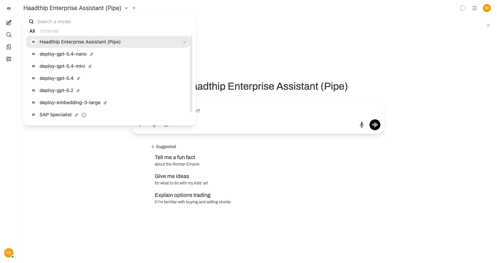

---

## 📚 Knowledge Sources (RAG Pipeline)

### 1. Haadthip Enterprise Knowledge (Pipe)
ค้นหาเอกสารภายในองค์กร ผ่าน Azure AI Search แบบ Hybrid:

| Knowledge Source | เนื้อหา | จำนวนไฟล์ |
|---|---|---|
| **haadthip-public** | นโยบาย IT (DLP), Security/MFA/VPN, Email, ห้องประชุม | 23 files |
| **sap-docs** | คู่มือ SAP HIP (Tcodes: mb52, /n/hip/fiar06, etc.) | 32 files |
| **haadthip-ir** (planned) | นักลงทุนสัมพันธ์: รายงานประจำปี, ข้อมูลการเงิน | 31 files |

### 2. E-Expense FAQ Search (Tool)
ค้นหาคำถามที่พบบ่อยเกี่ยวกับระบบ E-Expense:
- การขอเดินทาง, ใบเบิกเงินทดรอง, ค่าอาหาร (Level 1-8)
- การอนุมัติ, Cost Center, การแนบไฟล์, การแก้ไข/ยกเลิกเอกสาร
- 42 FAQ documents

### 3. MiHCM HR Documents
เอกสารจากระบบ HR ของหาดทิพย์ (https://haadthip.mihcm.com)

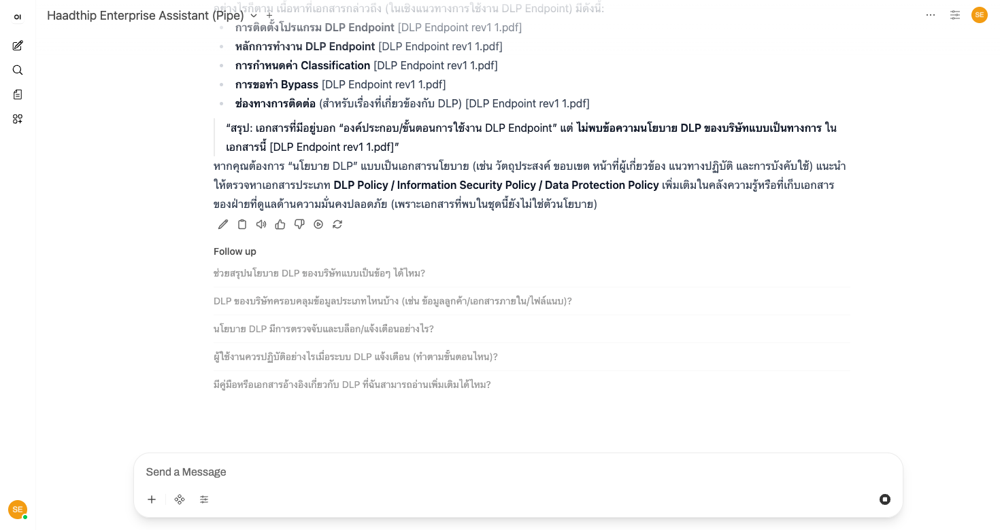

---

## 🛠️ Workspace Features

### Models (7 models)
บริหารจัดการ AI Models — import, export, สร้าง model ใหม่, เปิด/ปิด models
- SAP Specialist, Haadthip Enterprise Assistant, GPT-5.4 series, embedding

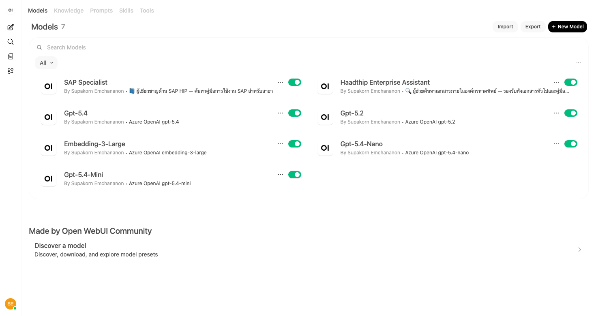

### Tools (2 tools)
Custom tools สำหรับเรียกใช้จากในแชท:
- **Haadthip Docs** — ค้นหาเอกสารภายในองค์กร
- **SAP Knowledge** — ค้นหาคู่มือ SAP

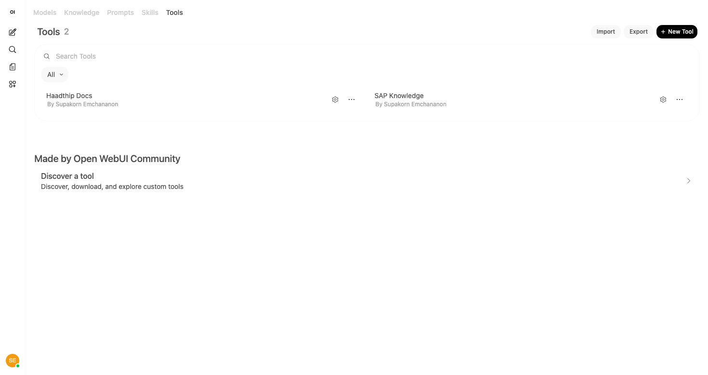

### Knowledge
จัดการ Knowledge Bases (ใช้ `#` ในแชทเพื่อโหลด knowledge)
- ปัจจุบันใช้ Azure AI Search ผ่าน Pipe (ไม่ใช่ Knowledge ใน Open WebUI โดยตรง)

### Prompts, Skills
พร้อมให้สร้างเพิ่ม — ปัจจุบันยังว่าง

---

## 👥 Admin Panel

### Users (3 users)
- **Supakorn Emchananon** (admin) — supakorn.emch@gmail.com
- **DIO Supakorn Emchannon** (admin) — supakorn.em@haadthip.com
- **Patipol Sumanus** (admin) — patipol.su@haadthip.com

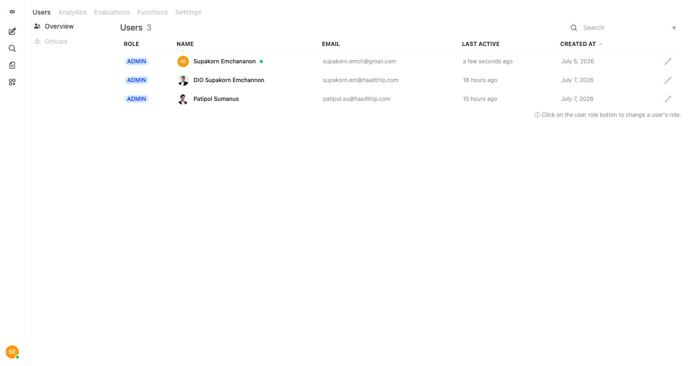

### Analytics
Dashboard สำหรับวิเคราะห์การใช้งานระบบ

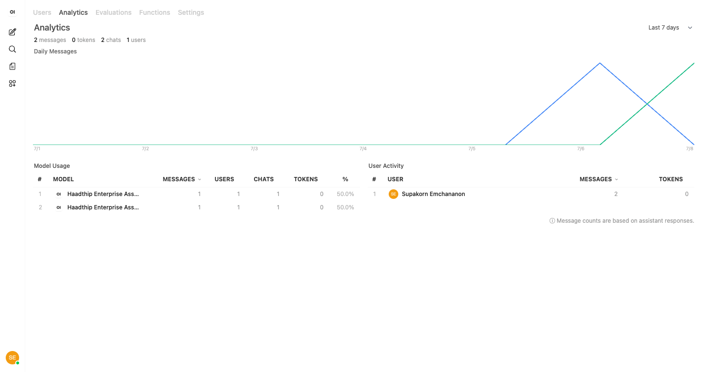

### Admin Settings
ตั้งค่าระบบ: General, SSO/OIDC, Models, Database, ฯลฯ

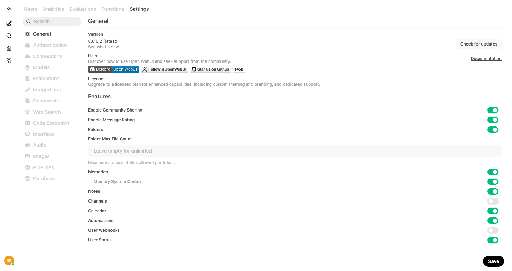

---

## 🧪 Developer Tools

### Playground
ทดสอบ models โดยตรง — มี 3 โหมด:
- **Chat** — ทดสอบแชทกับ models พร้อม System Instructions
- **Completions** — ทดสอบ text completions
- **Images** — ทดสอบ image generation

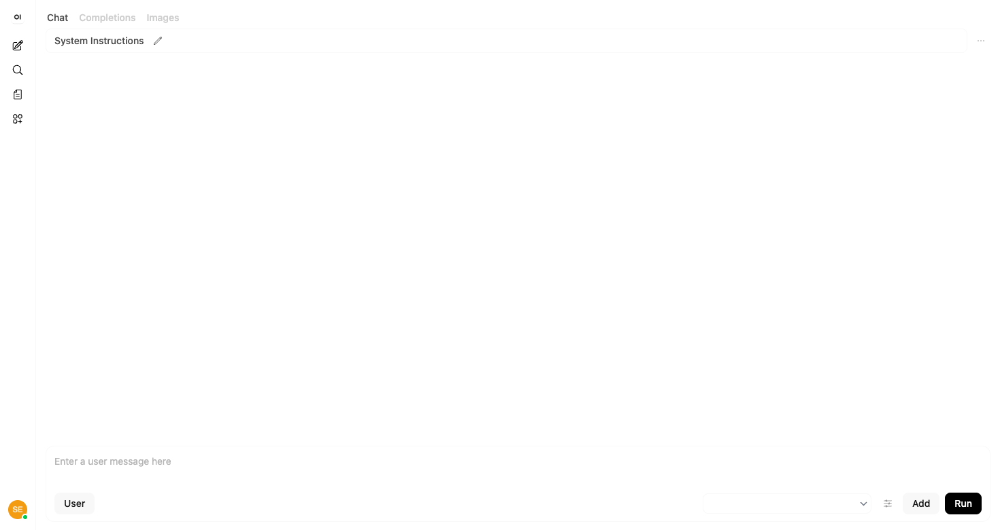

### Automations
สร้าง scheduled prompts ที่รันอัตโนมัติตามเวลา

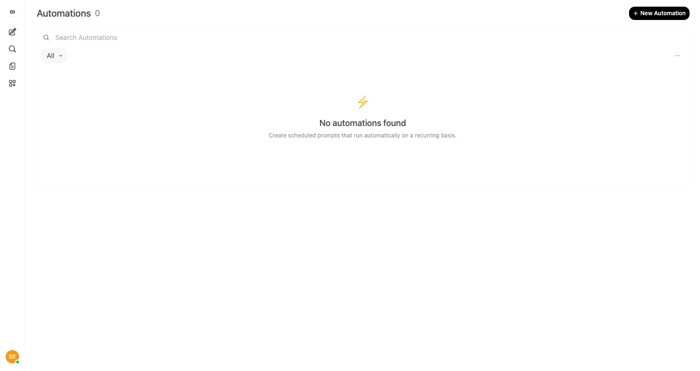

---

## 📝 Additional Features

### Notes
สร้างและจัดการโน้ตส่วนตัว — รองรับการค้นหา, กรองตามประเภท (All/Write), เลือกรูปแบบการแสดงผล (List)

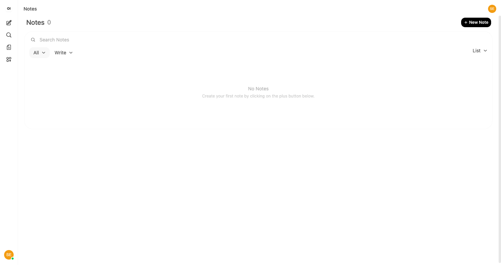

### Calendar
ปฏิทินสำหรับจัดการกำหนดการ

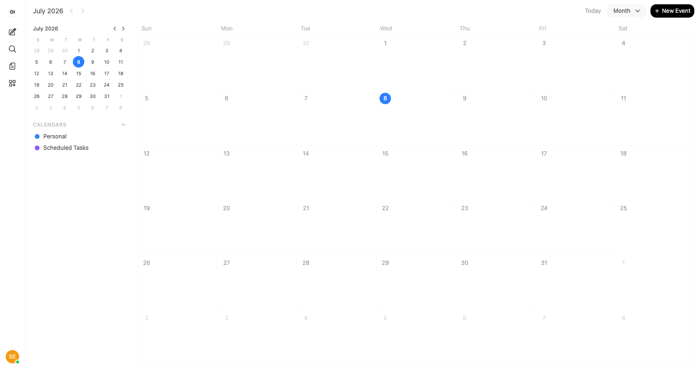

### Chat Features
- **Voice Input / Voice Mode** — พูดแทนพิมพ์
- **Integrations** — เชื่อมต่อกับเครื่องมือภายนอก
- **Follow-up Questions** — ระบบแนะนำคำถามต่อเนื่องจากคำตอบ
- **Citations** — แสดงแหล่งที่มาของข้อมูลจากเอกสารต้นทาง
- **Feedback** — 👍/👎 Good/Bad Response
- **Edit / Copy / Read Aloud / Regenerate** — จัดการข้อความตอบกลับ

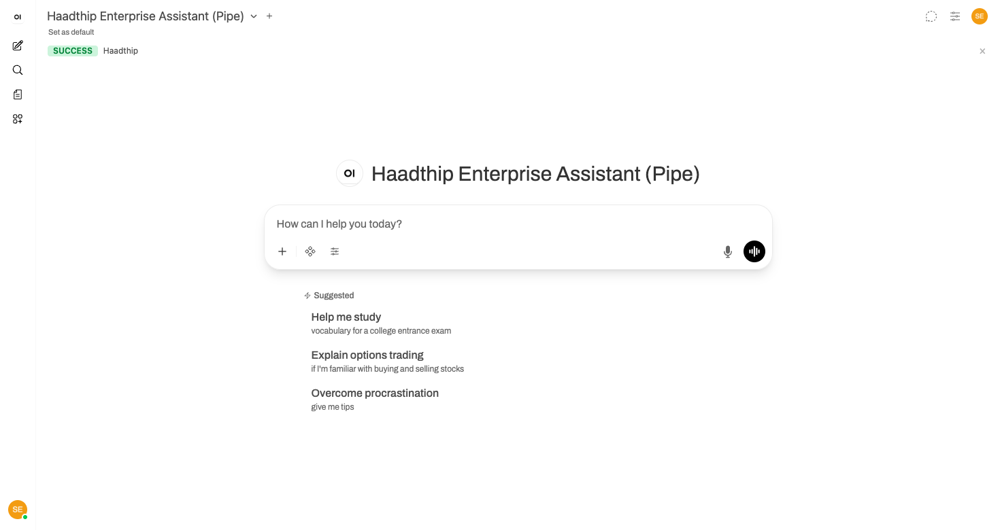
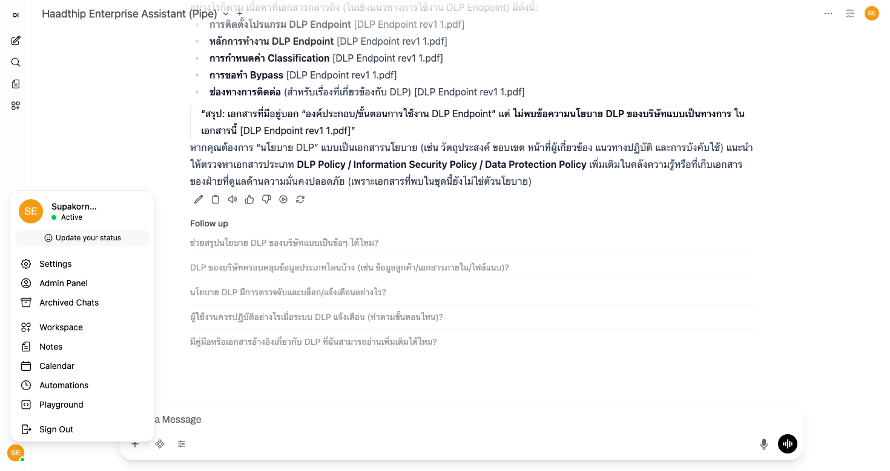

---

## 🔗 Related Links

- [[Azure AI Search Setup]]
- [[Open WebUI Configuration]]
- [[Enterprise Chat Context]]

---

## 📊 System Status (July 2026)

| Component | Status |
|---|---|
| Open WebUI (Frontend) | 🟢 Online |
| Azure AI Search | 🟢 Online |
| Azure OpenAI (GPT-5.4) | 🟢 Online |
| PostgreSQL DB | 🟢 Online |
| SSO (Entra ID) | 🟢 Online |
| RAG Pipeline (Pipe) | 🟢 Working |
| E-Expense FAQ | 🟡 Configured |
| IR Documents | 🟡 Planned |
